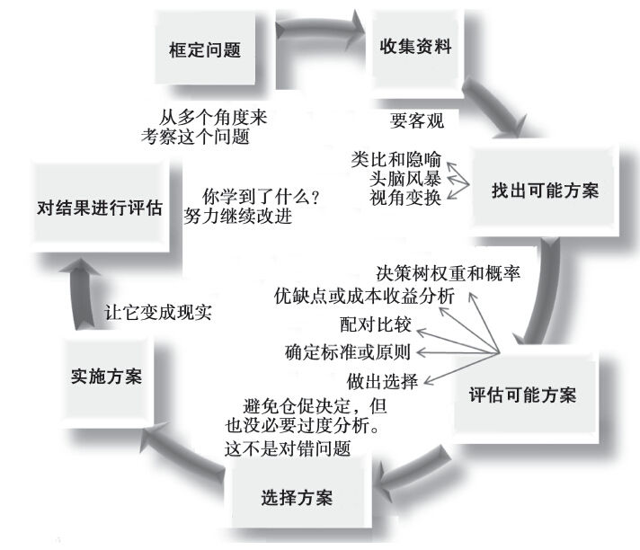
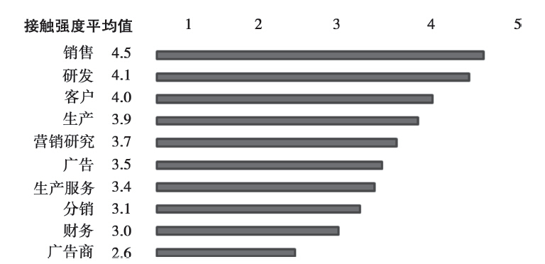
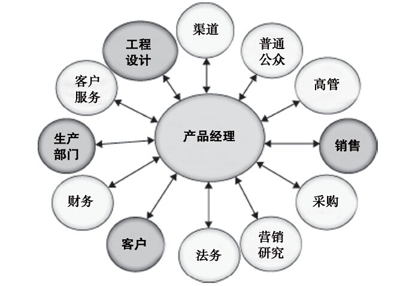

## 第2章 领导力与管理能力

请判断对错：领导是先天造就的，而不是后天培养的。

错。2006年，沃伦·本尼斯曾说过：“我们最危险的观点莫过于认为领导是天生的，是由基因决定的，认为有些人拥有与生俱来的领导品质。这简直是胡说八道。其实，领导不是天生的，而是后天培养的。”的确，有人比其他人具有更多的内在领导品质，但这些特质是可以深化培养的。那些比较欠缺内在领导品质的人，则可以通过掌握一些基本要素，提高自己的领导能力。但有趣的是，尽管领导能力是可以学会的，但却不是可以由别人教会的。诚然，技巧和能力可以由别人教会，但实际领导能力的发展则来自后天的经验积累和长期的实践，没有捷径可循。

作为领导者的产品经理

与我合作的许多公司坚定地认为，产品经理应该就是领导。可如果产品经理是领导的话，为什么我们不称他们为产品领导呢？事实上，有些公司的确是这么称呼的，有时候还把他们称为产品所有者或产品总经理。可是，领导和管理因具体情形不同而有所差异，产品经理需要同时运用两种技能，他们需要管理产品或产品线，需要带领同行和跨部门团队实现产品愿景。好的产品经理会同时实施战略并运用策略，同时实施领导与管理职能。（绝对没人认为这件工作很简单！）因此，我们先看看领导和管理的不同方面，请记住，没有谁天生就比别人更好。

约翰·科特（John Kotter）对两者的定义往往被过于简单地表述为：管理解决复杂问题，而领导则是应对变化。经理通过巧妙地利用各种资源来实现可预见的目标，从而获得价值。他们往往关注的是处理日常事务。而领导则往往是通过影响其他人，来指导某项行动，并将其引导到不断变化的未来之中。他们必须能激励并鼓舞他人，并且这通常是在富有挑战的环境中进行的。有时候，最重要的问题是作决策（领导层面），而其他时候则是实施所作决定（管理层面）。实际上，领导与管理之间的界限的确是模糊不清的。

有些专家把领导分为两种类型：变革型领导和交易型领导。照相机公司（如柯达公司）面对其主营业务模式，从传统照相产品向数字照相产品转变时，就需要变革型领导；相反，如果变动只需要对产品作适当的改进，变化强度不是很大，则更需要交易型领导。多数产品经理需要先“演练”交易型领导技能，然后才能做变革型领导。

公司聘请产品经理来充当“变革代理人”时，他们往往希望这些人是变革型领导，当然有些则希望要交易型领导，但多数时候公司只是希望产品经理能让公司发展壮大。

那么，产品经理怎样才能成为领导呢？人们看待领导，往往是看他们如何对直属下级提供指导。人们希望他们能为直属下级消除各种障碍并提供资源，但多数产品经理并没有（或只有很少几个）直属下级；相反，他们倒是必须不断进步，以实现产品的愿景。从产品管理的视角看，领导要求能够预见市场需求、分析情报、做出决策，并能通过他人执行计划。领导是通过信任、影响力以及逻辑说服能力，而不是正式权威来进行，这有点像即兴发挥。

决策建议

包括产品经理在内，多数人并未接受过制定决策方面的培训。因此，他们可能会通过各种“最佳实践”来替代制定决策。可不幸的是，“最佳实践”并不一定就能教会人们思考。事实上，这些最佳实践做法往往会让人们在可能有更好的选择时，却采用了勉强可行的方案。放弃这些显然可用的方案，转而探索其他的，则需要付出相当的努力。我建议产品经理在探讨产品的前景时，除了运用最佳实践外，还要多多寻求更好的实践做法。否则，往往会让人产生自满情绪，这样做有时足以致命（或者至少不会带来最佳结果）。

接下来，让我们对整个决策过程稍加分析。它通常包括（见图2-1）：（1）确定和框定需要决策的事项、目标或问题；（2）收集适当的资料；（3）找出各种可能的解决方案；（4）对可能方案进行评估；（5）选择一个可接受的方案；（6）实施所选择的方案；（7）对实施方案的结果进行评审。产品经理的决策方法对整个过程的其余步骤具有重大的影响。例如，假设某位产品经理正因为产品利润率低于预期而考虑提高价格。如果把决策问题框定为是不是需要涨价，所获得的信息很可能与把决策问题定位于怎样才能提高产品利润率时完全不一样。因此，就如何做出决策，需要认真思考。

图2-1 决策模型

明确了决策问题之后，就需要收集并分析各种信息。我们将在后面两章中讨论如何收集各种类型的情报并对其进行评估，这里先略过不谈。现在讨论如何运用信息来获得可能的解决方案。实施这一步骤时，我们一定要放开心态，不带任何偏见。不能把任务仅仅限定在提供一个方案假设（需要你尽力用数据来证明），而是要打开思路，考虑更多潜在的、新颖的解决方案。我们常常会在收集到充分数据之前，就给出问题的答案，其后才用各种数据来证明决策的正确无误。这样做有时可行，但不应成为解决问题的标准流程。

获得几个可能的方案后，我们必须对其进行评估。不同情况需要运用不同的评估方法。有时候，列出每个可能方案的优缺点，就能给我们提供足够的认识。在此过程中，我们要关注执行问题，留意可能不希望产生的结果。如果通过不同渠道进入一个新市场，会对与现有渠道伙伴之间的关系造成什么样的影响呢？评估可能方案的另一种方法就是，只列出优先选项，包括它们的权重以及成功的概率。此时，运用第5章要讨论的过程图和其他规划工具会比较有用。用这些“工具”并不会让我们在两个同样有吸引力的备选方案之间的选择变得更加容易，因为我们必须放弃其中之一。不过，认真评估这些问题，有助于提前做好准备，当我们最终把方案推销给他人时，便可应对可能遇到的问题。

不论你怎么评估可能的方案，都必须选择其中一个，你必须决定选择哪一个。记住，你是从几个方案中作选择，而不是判断孰“对”孰“错”。很多时候，执行一项决定要比做出一项“正确”的决定更加重要。这时候，掷骰子式决策和深入分析之后的决策可能同样合适。需要将决策速度与后果的“永久性”结合考虑，如果决定可以轻松改变，就可以快速决定，但如果决定是永久性的话，这样做的风险就大了。如果决定的结果会影响到他人，或需要他人来执行决定时，则要把他们邀请到决策过程中来，你需要他们的介入。这就意味着，你需要与不同的利益相关方建立相互尊重的关系，我们会在以后的章节中再作讨论。

最后，你不仅需要作决定，还必须执行决定。就像木工工具箱里的工具不会自己建造楼房一样，决策工具也不可能凭其自身就能带来最终结果，而必须由产品经理来采取行动。决定实施后，必须对它进行评估，弄明白今后如何改进。要记住，在所有决策过程中，情绪因素自始至终都会起作用（有时候会起重要作用）。产品经理应该努力了解自己与决策有关的情绪，当然也要了解其他利益相关方的情绪。

有效矩阵结构与跨部门团队

规划只是产品经理工作的开端，它要一直延续到执行阶段。对于产品经理来说，这意味着大部分工作需要由那些不直接向他报告工作的人来执行。

要成为变化代理人或跨部门领导，产品经理必须与很多利益相关方建立相互尊重的关系。从定义上看，产品经理是个通才，他必须依赖很多其他专家，完成把产品或服务呈现给客户的任务。这些专家可能是公司内部成员，也可能从公司外面聘请。有了内部支持团队（如广告和营销调研团队），产品经理也可以在这些方面不需要那么精通，转而更多关注产品的成功问题。不过，掌控外部人员要比掌控内部团队更费力，这是因为他们无法直接对外部人员发号施令。因此，最好一开始就列出需要打交道的职能部门。制作一个表格，列出需要从他们那儿获得的帮助，以及你认为他们要从你这儿获得的帮助。和同事分享你所列的这些期望，可以让这些期望事项得以有效实现。他们和你的想法是不是一致？理解并妥善处理这些期望，有助于建立彼此之间的信任关系。

利益相关方

我们现在来讨论组织内部的典型关系。图2-2是对产品经理所做的一项专门调查，让他们按五个等级评出自己与各种职能部门的接触强度，数字1表示根本没有接触，数字5表示接触非常频繁。结果，产品经理接触最为频繁的职能部门是销售、研发和客户部门。产品经理与每个职能部门接触强度的平均值列示在图2-2的中间一栏。

图2-2 产品经理与特定组织部门之间的接触强度

根据具体公司和情形的不同，产品经理开展的跨部门互动作用也不完全相同。对于现场销售部门，他们回答来自现场的问题，协助回复需要回答的销售问题，提供产品信息以简化销售流程，对新产品销售提出各种激励建议，或者制作资料和其他客户读本，帮助销售活动的开展。他们还可能和分销商或代理商合作，建议可供选择的渠道，或者加速发货。图2-3展现了产品经理经常联系的部门。深色框的部门表明互动频率最高，但这些部门的人员可能会认为产品经理“有求必应”，这就要求产品经理仔细分配自己的时间。下面的讨论可以帮助产品经理制定自己的“相互期望”表。

图2-3 产品管理：首要角色的影响

#### 销售

产品经理的角色至关重要，他们要帮助销售人员实现公司的销售目标（不用说销售人员个人的目标）。两者之间的关系根据组织文化和产品经理自身理念的差异而有所不同。有些产品经理被看做销售支持人员，有些则被看做与市场脱节的产品开发人员，还有一些会被认为是产品专家。不论如何看待他们，产品经理都应能抵制住诱惑，不依仗公司总部的权威来“强迫”销售部门与之配合，这种“强迫”对合作关系中所需要的相互信任与尊重极具破坏力。

销售预测通常是产品经理的工作职责，但如果没有来自销售部门的信息，这项工作往往是做不好的。所以，一定要请销售人员整体预测其职责范围内的销售情况（或其顾客数量或产品销量）。如果这些信息是按不同目录分类的，请他们尽量对实现销售目标的可能性一并进行预测。预测信息通常要提供给不同地区或国家的销售经理，经过他们的校对之后，再送至各营销部门。产品经理要与这些部门通力合作，针对某一产品线，预测出真实的销售情况。

与销售人员的沟通

产品经理每天都需要花大量时间与销售人员沟通，共同探讨销售前景。有时候沟通只是为了讨论是否需要调整价格，或者某些特殊交易是否需要产品管理部门的许可或授权，有时候则是为了讨论产品品质。产品手册（在第5章会讨论）中所列的条目越清晰，产品经理能够提供的答案也就越有效。即使销售人员先前已经收到过相关信息，但如果产品经理能够现场提供的话，沟通起来就会越方便，效率也就会越高。

当然，这并不意味着产品经理就没必要给销售人员提供书面信息了。销售人员应该比客户更早知晓任何关于产品或营销策略变化的信息，因为这些信息会影响他们与客户之间的关系和业务洽谈。

很多公司要求产品经理安排一定量的时间（如25%~30%的工作时间）会见客户，有些会面是通过销售人员的上门拜访实现的。销售拜访活动让产品经理有更多机会了解客户，有时能帮助实现销售任务。但在拜访客户之前，每个人都要清楚地知道，产品经理究竟应该发挥怎样的作用。

多数此类日常工作并不会出现在产品和营销计划上，尽管它们可能是年度业绩目标的一部分（如现场工作时间）。产品经理工作计划中的事项应包括差旅开支预算、各项激励方案（为了刺激尚未实现销售目标的产品的销售，或者为了推出新产品），或者销售区域重新划分或销售力量调整方面所实施的任何活动。

销售培训

销售培训包括多项内容：销售技巧、公司数据、产品知识以及市场与竞争对手情报。有效的培训是新产品发布成功的重要因素。尽管传授销售技巧本身并不是产品经理的典型职责，但任何产品培训的执行都应符合公司关于产品销售流程的整体框架。

首先要考虑清楚，销售人员计划拜访客户应准备哪些具体信息。他们需要知道谁最有可能购买产品。产品经理不应只对主要和次要目标市场进行描述，而应清楚了解最有可能的客户，如有可能或合适的话，直接推荐具体的客户。要把非客户培养成新客户，销售人员就应该清楚产品的用途、使用方法以及功能。例如，销售平板显示器的公司，就可以让销售人员直接对准对显视器图像清晰度要求极高的具体行业的工程师。

产品经理和销售人员都应该能够区分关键客户、目标客户以及维护客户（自然也包括“不值得费心的客户”）。关键客户是指那些贡献了约20%总利润的客户；目标客户指的是竞争对手的关键客户，或是新产品或服务的潜在用户；维护客户则包括现有小众客户，以及未来有可能具有战略意义的客户。

接下来，产品经理要明确销售人员需要从客户那里获取哪些信息，才能确定他们的真实需求。销售人员需要了解客户的真实要求，确定对其销售是否合适。客户的满意来自于产品的实际功用与消费者需求的完美匹配。如果销售人员“成功地”向错误的客户销售了产品，或卖出了错误的实用功能，那么所产生的收益都是临时的。因此，产品经理必须提供客户友好型问题，让销售人员能在交易达成之前评估交易是否合适。

产品经理需要清楚的问题还包括：预期客户会如何使用产品所提供的功能，他们对产品缺陷的容忍度怎样，他们当前以及未来希望实现的功用有哪些，等等。这些问题不是简单地触发预期客户的购买行为，而是明确预期客户是否真正需要这一产品（据此筛除不适合的客户）。例如，负责向大学老师出售大学教材的产品经理，就需要提出各种问题，了解教学理念、老师的严格程度，以及教职员工对于内容的偏好程度；销售平板显示器的产品经理可能需要确定这种显示器是在户外阳光下使用还是在办公室内灯光下使用，是主要用于显示文本还是图片，需要的是简单软件还是大型软件。

最后，产品经理得确定需要用什么样的支持和材料，来帮助销售人员取得更大成功。产品经理应与销售人员紧密合作，确保营销信息对于主要受众而言的确非常重要。

#### 运营与研发

无论是负责服务类产品还是制造类产品，产品经理都需要依赖运营才能做到在合适的时机提供合适的产品，并且在合适的时间将其送到消费者手中。不论“运营”是指承销、信贷管理、生产，还是物流，运营部门和产品管理部门的紧密合作对于新产品开发和战略决策都非常重要。

新产品开发

产品经理与运营部门最明显的互动也许发生在新产品的开发阶段。研发部门需要评估技术可行性，生产部门需要评估未来的生产效率和生产能力，采购部门则需要考虑是自己生产还是向外采购，所有这些都需要全局考虑。产品经理要代表客户声音，需平衡企业投资回报率、客户满意度和生产成本之间的关系，在品质和客户服务方面需要建立双方都能接受的标准，让生产和营销战略彼此互补而不是相互冲突。

战略互动

产品经理除了参加新产品项目讨论会之外，可能还需要参加运营部门的战略会议。在会议上，产品经理要对市场上发生的实际问题或者竞争对手的动态进行说明，这些东西可能激发大家对新产品的思考，并集中讨论未来的产能需求。此时，产品经理也就有机会得知哪些技术正在寻找市场，这会激励他们思考，探索如何才能以市场可以接受的方式，把新技术整合到现有产品或计划中的产品上去。福特汽车刚开发出前碟制动技术时，因为这项技术不可避免地会引起价格变动，曾对该项技术的应用犹豫不决。最后，福特公司决定将其作为高端配置应用于高端车型，等到可以批量生产，使价格降低之后，再应用到普通车型上。

产品经理必须始终保持与运营部门的合作，才能改进和提升产品线。这要求产品经理至少对工人因为失误而导致材料报废（在生产环节中）、建立生产线所需时间以及其他运营绩效测量方法等有个基本了解。在保险领域，产品经理可能需要了解基本的承销原则；在金融服务领域，产品经理则需要了解贷款的二级市场以及各种财务比率。

产品经理也要经常和运营部门共同参与成本降低项目。因为人们希望产品经理提供各种来自市场的观点，所以他们就必须关注各种能够降低成本而又不损害产品预期价值的办法。削减成本不可能一挥而就。也就是说，必须注意，节省成本不应是临时性的，不能让未来成本上升成为必然。

产品经理需要参与的其他运营活动包括：

·主持协作会议，确保所有部门朝同一个目标发力。

·鼓励大家对未来新产品开发可能影响的技术进步情况展开讨论。

·组建工作组，对现有产品开展价值分析。

·监督生产能力的提升。

·促进团队合作，不断提高生产能力。

#### 客户与产品支持服务

客户服务职责因公司的组织结构不同而有所不同，可能分别存在于营销、仓储、销售或其他部门。产品经理应就产品表现从客户服务代表（CSR）那里收集信息，同时向他们提供信息，增加客户对产品线的满意度。很多产品的增值部分就包括公司提供的服务。产品经理必须确保建立服务标准，并且让服务部门的员工充分理解并掌握这些标准。

为了达到服务标准，客户服务代表应该接受培训。产品经理可能需要得到公司人力资源部门的支持，让客户服务代表参与为销售人员开展的培训，或者为他们专门开发培训课程。作为产品竞争优势的服务部分越是重要，产品经理采取积极行动确保培训得以开展的重要性也就越高。

产品支持人员应该非常清楚如何处理质量保证问题。如果是30天的质量保证期，可是某个质量投诉却发生在第31天，那么产品支持人员在处理这个问题时，拥有多少操作空间？员工应具备的自由裁量权有多少？

#### 财务

产品经理必须和财务部门合作，以实现产品成本与预计市场价格之间的平衡。客户不会在意公司内部作为定价基准的成本分配机制，他们担心的只是相对于市场上可获得的同类竞争产品而言，该产品是否具有足够的价值。尽管公司必须支付所有费用以确保长期利润，但它应该让差益定价法与市场分区定价法或产品生命周期定价法协同作用。例如，药品公司就是运用差益定价法，来确定在一个新产品上市后，老产品还需继续销售多长时间：

通常，疗效更佳或副作用更少的新药上市后，老产品仍然可以销售，不过价格应该有所下降。当它们不再贡献利润时，公司就会停止销售。公司能够运用现有生产能力来生产利润贡献率更高的产品时，它们就会让老产品更早退出市场。[[1]](part0009.xhtml#ch1-back)

产品经理还必须依赖财务部门为预算、预计利润表或产品的资产负债表长期提供产品系列信息。协商好哪些信息对于决策更为重要之后，这两个部门方能更加高效地运作。具体成本的重要性因具体环境不同而变化，也依赖于所要做出的决定。能和财务部门合作、确定合适成本的产品经理更能做出正确的决策。

#### 营销沟通

无论是和公司内的广告部还是和外面的广告代理商打交道，产品经理都需要对各种推广方式有个总体了解，以便能有效地评估关于文案和媒介方面的各种提议。产品经理通常需要明确自己产品的定位，但对于这种定位的沟通需要由具体部门的专业人士来做。产品经理需要尽可能准确地向他们描绘意欲到达的目标市场，以便广告人员运用这些信息来选择合适的传播工具。

如果一个公司中有很多产品经理，他们就必须考虑，以公司的整体形象开展广告宣传，与将各种产品独立于公司之外进行定位相比，是不是更具优势。有些公司正在转向商标定位的统一方法，公司整体的名称、声誉和定位获得了与单个商标一样或更多的关注。产品经理和广告专家可以讨论每种选择的比较优势，并在大量投入促销活动之前达成一致意见。

如果产品经理要在内部广告部和外部广告代理商之间进行选择，他应该选择哪一个呢？很显然，这需要考虑很多问题。对于那些需要获得外部观点、面对内部资源约束难以在最终期限前完成工作，或者希望利用代理商来共担部分费用的产品经理，外部代理比较有吸引力。相反，对于需要利用来自于非常专业化市场的经验，自身拥有必要技能，并且希望更好地控制整个过程的产品经理来说，选择内部广告部门则更为合适。

1.除了广告，还需要开展什么类型的促销活动？很多公司尤其是B2B公司，都需要直邮、潜在客户开发项目、贸易展销报道、电子商务网站或专门的促销技巧。

2.广告代理商是否了解我们的目标市场，他们是不是能用恰当的语言传递广告信息？这并不是说，广告中的技术信息就必须由技术人员撰写。事实上，我们需要把客户而不是产品特性作为关注目标时，选用技术人员撰写就完全错了。不过，文案人员倒是需要了解该如何把这些特征适当地转化为带给顾客的福利。

3.公司应该聘请大型还是小型代理商？通常最为有效的安排是根据客户规模来确定代理商的规模。当然，客户规模不大却聘请大型代理商，要远远好于客户规模很大却只聘请了一个小型代理商。但是，也有例外情况，在涉及创新型的新产品时尤其如此。

4.我们是否应该指望代理商帮助常规营销、互联网营销、调研或战略规划工作？如果能这样的话，我们就可能缩小合适代理商的选择范围了。

#### 营销研究

尽管产品经理必须拥有市场以及竞争对手的充分信息，可他们通常在数据收集和分析方面并不一定在行，这就是为什么有些客户调查需要转交给内部调研部门或者外部调查机构进行。产品经理还可运用广告公司或者贸易协会所提供的营销调查成果。

#### 客户

几乎所有产品经理都应该与客户保持联系。消费品品牌经理往往通过典型群众、脸谱网和其他的技术手段来与客户沟通。B2B产品经理更可能通过拜访销售人员，并通过客户回访活动联系客户。与客户接触的重点，在于了解客户的长期需求，以及现有产品的不足。尽管做起来很困难，但是产品经理必须把创新的想法落到实处，以期能够预测并满足那些没能确定下来的、没能明确表述出来的客户需求。

影响利益相关方

在公司这个舞台上，产品经理既是演员也是导演，必须为市场，即最终客户，呈现一系列演出活动。如果舞台上什么都没发生，则一切都徒劳无功。因此，他们必须直接与所有之前讨论过的部门以及管理高层开展互动。至于互动所到达的程度，则因公司规模和产品经理的阅历不同而异。企业案例2-1给我们描绘了电子市场上产品经理的互动做法。

企业案例2-1

电子市场上产品经理的互动做法

电子产品领域的产品生命周期很短，市场分区都碎片化了。厂商面对着巨大的竞争和价格压力。面对这些挑战，产品经理必须能够与各类人员合作，并通过他们与其他更多人合作。

产品经理的职位因公司规模而异，正如比尔·梅泽夫（Bill Meserve）发表在《电子商务》上的文章“产品管理职责的变化”所描述的那样：

通用工具公司的一个零部件生产部门，产品经理的职能通常是协调负责产品开发的工程部门和营销部门之间以及营销部门与销售部门之间的工作。他们直接负责产品线的广告和促销预算，但对于产品开发项目，他们只是从营销角度提供意见，整个项目则由工程部门发起并管理。相反，惠普公司的产品经理通常是新产品开发的核心，他们制订开发计划，授权实施并监督其进展。

不管公司赋予产品经理什么样的职责，他们都必须培养管理技能，以便能在产品开发和产品营销过程中领导自己的团队。这需要具备几个条件。首先，产品经理不应害怕承认自己的无知。即使多数技术产品经理拥有本领域深厚的背景，他们都可能不具备团队中工程师所具备的技术或知识。其次，知道什么时候应采取干预措施很重要。尽管团队成员学会合作很重要，尤其是在新产品开发方面，但产品经理仍然要为产品线的成功负最终责任。

这些技术技能需要时间来积累。比尔·梅泽夫认为：

承担特定任务的产品经理新手需要了解公司产品和竞争对手产品方面的专门知识。随着工作阅历和责任的增加，技能积累的重心转变为诸如财务分析、促销、定价、新产品开发和战略销售等职能领域。并且，随着职业责任不断增加，管理技能就显得更为重要。产品经理要学习组建团队、达成共识，协商约定、考核表现，以及处理人际关系问题。诸如艾伦-布拉德利公司（Allen-Bradley）、3M公司和杜邦公司，都通过直接与客户互动、导师制和跨部门培训等方式来增强产品管理的技能。

资料来源：Adapted from Bill Meserve，“The Changing Role of Product Management，”Electronic Business，9（January 1989），pp.143-146.

#### 沟通产品愿景

产品经理认识到他们必须为自己的战略“收买人心”，可是他们往往不知道究竟该怎么做。尽管事实和各种统计数据很重要，但必须将它们融入具体的故事（或者情境）中去，才能使大家采取相应的行动。在关键信息被埋没在各种幻灯片和空洞夸张的陈述中时，人们只能对那些经过深入细致研究才得出的见解一笑了之，不加重视了。[[2]](part0009.xhtml#ch2-back)

“讲故事”是最具有启发性的一种可用工具，并且有史以来一直被广泛使用。一个擅长讲故事并能声情并茂地描绘出未来画面的产品经理，能转变同事的想法，并能激发出他所期望的行动。产品愿景就是人们能够为之奋斗的东西，而不仅仅是人们所追求的数字。

知名的3M公司把通过讲故事进行激励作为企业文化，塑造了众多的成功故事。众多赢得成功的创新故事，又不断激发员工想出更多的新点子。对销售代表进行相关培训，让他们用讲故事的方法向客户解释使用其产品的种种好处。最近，3M公司的领导人又开始运用故事法开展战略规划，他们发现，这种方法能够产生出更多振奋人心的想法和人们对他们的认同感。[[3]](part0009.xhtml#ch3-back)

#### 建立业绩记录

产品经理最初碰到的挑战是如何成功地建立并不断增加成功业绩的记录。尽管我们有必要保持谦卑，但产品经理不能想当然地认为组织中每一个人都能充分掌握自己所在专业的全部知识。有时候，简要概述自己所建议的方法如何在另一公司的前一职位中成功实施的故事，不仅会增加这个“想法”的可信度，还可增强自己“个人”的可信度。[[4]](part0009.xhtml#ch4-back)在这个时候，就要把自己定位成一个专家，但是千万不要自以为是，以为自己的经验放之四海而皆准。

你如果还只是停留在努力创建这么一个业绩记录上面，这项任务就显得更为困难。这时，你有必要和组织中可以支持你实现产品愿景的同事联合起来，在整个公司跨越性地实施该战略。一定要选择已经在公司内赢得大家尊重的人作为你的同盟。

#### 培养信任

信任需要在具有多个要素的环境中才能培养出来。首先，要诚实，即没有欺骗也不夸夸其谈。做事要尽己所能，并以公正客观的方式传递信息。其次，愿意公开分享信息。有些人会私藏信息，以期增加自身的实力，但这种做法从长期来看对自己是不利的。再次，要呈现出前后一致且可预见的行为模式。竞争战略中突然袭击能够起作用，可这却不能成为组织惯常行为的一部分。最后，作为产品经理，你必须接受并尊重人们的个体差异和各种不同观点。

#### 持续学习

过往的成功可能导致未来的失败，反之亦然。不断督促自己去了解市场并积极地观察潮流；和与你不同的人多开展互动；培养新的爱好；参加各种新潮团体；大量阅读；大方接受自己的过错并从错误中学习，而不因此消沉；认认真真、不打折扣地倾听不同人的观点；不管以前如何成功，一定要坚持学习。

本章思考

制订自我培养计划，提升领导力、决策能力和管理技能。明确与利益相关方建立信任所需要的步骤，建立业绩记录，提高决策能力。

斯科特·戴维斯访谈：产品经理可以是企业成长的领导者

斯科特·戴维斯（Scott Davis）

先知公司（www.prophet.com）首席成长官

电子邮箱：sdavis@prophet.com

（也可以通过推特scottdavisshift联系到他）

斯科特，请你描述一下你在先知公司任首席成长官的职责，并谈谈你写《大变动：从今天的营销者向明天的成长官的转变》（以下简称《大变动》）这本书的原因。

首先，我得说先知公司是一家专注于战略、分析、创新和执行的全球性咨询类综合型企业。过去几十年间，我们坚定地认为，很多公司根本没有对经济的下行做好充分的准备，有些甚至对成长驱动的经济复苏也没有做好准备。所以，我成了首席成长官，帮助客户以全新且富有戏剧性和新奇的方式推动企业的成长。

这就是我写《大变动》的原因。几年前，我重新翻阅了我于9年前写的一本名为《创建品牌驱动的企业》的书，想从中引用一句当年采访对象说的话。我发现，受访者中没有一个仍在我采访他时的公司工作。当我去凯洛格管理学院和宝洁公司聚会的时候，我也有类似的发现。人员变动大得出奇。通常，营销人员开始工作时，根本没有什么战略目标，结果第二年就离职了。这给了我非常重大的启示。

关于你所描述的成功转型的公司，你能举几个实际案例吗？

我写《大变动》时，肖恩·伯克（Sean Burke）是通用电气医疗集团（约有100亿美元的业务）的首席营销官。他极具战略性地带领团队完成了一个大规模的市场分区重组项目，找到了一个组织市场的不同方法，这导致了商业组织的结构重组。他想知道，钱在哪里，通用电气如何才能获胜（的确，他最后取得了巨大的成功）。这要求他同时做到好几件事情：以公司损益为导向，尽早安排合适的人员参与到整个流程和解决方案之中，以及实施客户引导、战略引导和数据引导的做法。

另一个例子是史蒂文·奎因（Steven Quinn），沃尔玛公司的第一位首席营销官。刚入职时，他主要负责营销沟通，晚上加班，周末也加班，最终创建了一套利润驱动的市场细分战略。他开始物色最为忠诚的顾客，并增加顾客份额的幅度。渐渐地，他开始吸引更多的新顾客。他的转变来自于以不同的方式来看待顾客和他们在店内的体验。

似乎每个公司都渴望成长，首席营销官也必须采取相应措施来实现这些目标，但是产品经理应该怎么做呢？产品经理应该采取什么行动才能不仅仅是营销人员，而是成为成长领袖呢？

有些伟大的首席执行官在职业生涯早期曾经用盈利-损失责任模型来管理产品线。有太多的营销人员根本不知道公司是怎么挣钱的，在哪个阶段创造价值，以及价值又是在哪个阶段丢失的。通用电气医疗集团的现任首席营销官康贝丝（Beth Comstock）曾经和我说过，营销人员应该成为首席财务官最要好的朋友。与单枪匹马地工作相比，他们的帮助能让你更有效地推销自己的想法。

因此，产品经理如果想让自己成为成长领袖的话，我有几点建议。首先，花点时间，实地处理客户问题和电话销售问题。你需要到一线去了解客户问题、疑问以及各种需要。其次，尽早认清谁是你的朋友，谁是你的敌人。找一两个你信任的销售人员，让他们假扮顾客提供反馈意见。并且，和我前面说的一样，成为首席财务官最要好的朋友。最后，更好地理解公司的运营和决策方式。如果没有尽早确定谁是内部有影响力的人，你就很难获得战略性的成长。

我真心相信，产品线和品牌经理，尤其是拥有我刚刚讨论过的那些技能的人，在未来都会成为首席营销官和首席执行官。

在创作《大变动》之前，你还写过《创建品牌驱动的企业》。在你看来，成长和品牌之间有什么关系？

这两者从来没有像现在这么重要过。仔细思考在多数公司的成长计划中都有些什么内容的时候，我发现它们通常涵盖了产品、客户、地域和品牌领域等方面的信息，它们会在成长计划中综合这四项内容。那些品牌界定明确（并因此有一系列指导原则支撑的价值定位）的公司，通常拥有很好的成长计划，公司的思维模式和对品牌的定义很重要。在竞争残酷的经济中，在几乎让人窒息的沟通环境下，品牌可以简化客户的决策过程，并因此帮助公司成长。

如果所讨论的条件都能满足，你对产品和品牌经理还有什么建议？

首席营销官和高级管理人员通常会大声呼吁，一定要有些不考虑预算金额的战略成长计划。麦当劳的成长计划有四五个成长项目，麦咖啡（McCafe）就是其中之一，它被用来帮助公司赢得市场。产品经理和品牌经理需要以同样的方法考虑问题。那么，要实现成长目标，你们公司需要解决的五个成长问题是什么？什么是撬动公司成长的杠杆，即驱动公司向前发展的动力？能够回答这些问题，你已在解决公司的成长问题方面处于领先地位了。

[[1]](part0009.xhtml#ch1) Robert W.Koehler，“Triple-Threat Strategy，”Management Accounting（October 1991），p.32.

[[2]](part0009.xhtml#ch2) Some executives are working with writers，directors，producers，and actors to gain better skills at storytelling.Screenwriting coachRobert McKee discusses this phenomenon in“Storytelling thatMoves People，”Harvard Business Review（June 2003），pp.51–55.

[[3]](part0009.xhtml#ch3) Camille H.James and William C.Minnis，“Organizational Storytelling：It Makes Sense，”Business Horizons（July–August 2004），p.29.

[[4]](part0009.xhtml#ch4) Social scientists refer to this as the principle of authority，a criticalcomponent of persuasion.For more detail refer to Robert B.Cialdini，“Harnessing the Science of Persuasion，”Harvard BusinessReview（October 2001），pp.72–79.
