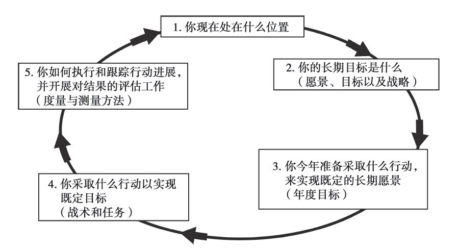
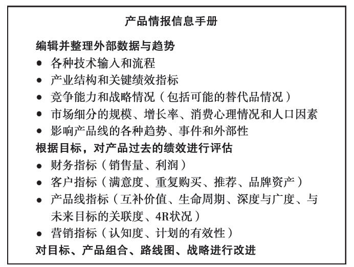
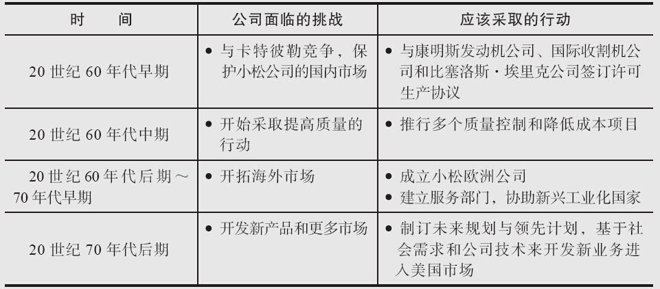
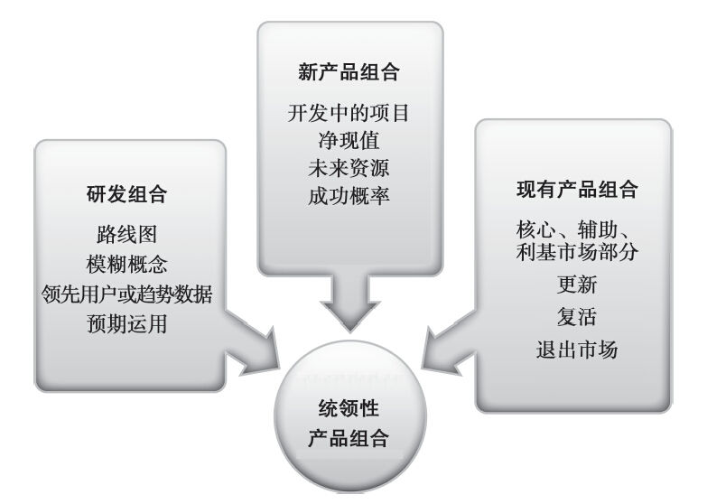
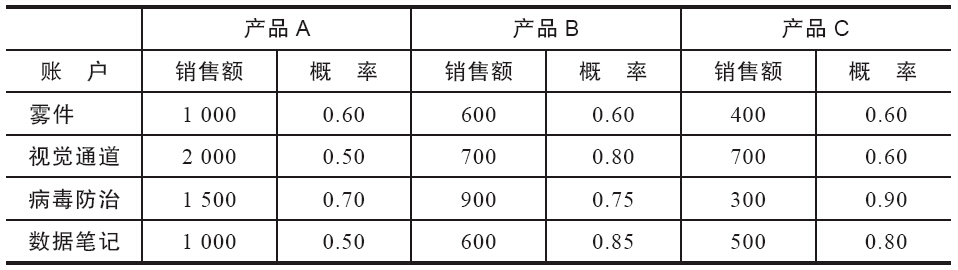
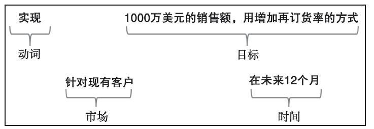
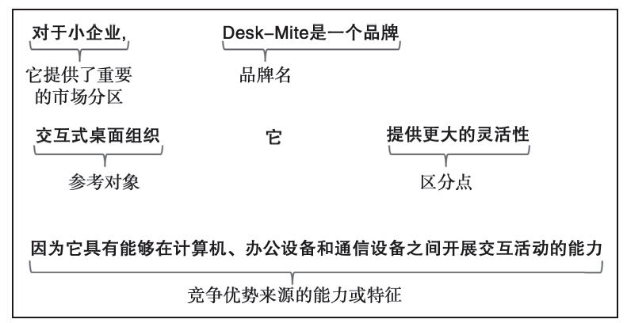
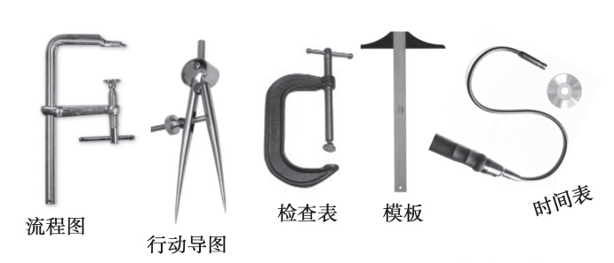
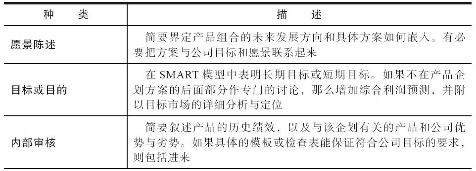
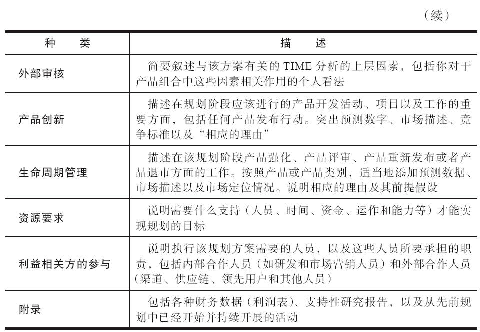

## 第5章 产品企划框架

请判断对错：填空式企划模板能提高产品经理企划成功的概率。

这种说法也对也不对。好的企划模板能突出企划过程中的重要问题，方便开展评审，并且，这样做可能降低产品经理在做企划时忽视某些重要事实的可能性。问题是，这样的模板自身可能会成为企划的终极目标，导致产品经理在企划时只是“走走过场”，并不会充分深入思考自己所提方案的前因后果。这样一来，企划也就成为一个周而复始的、经过简化后的工作流程而已，发挥不了其应有作用。对此，我们应格外小心。

从最根本上讲，企划就是缩小自己目前处境与想要达到的处境之间差距的行动。如果你是位高尔夫球手，技术平平，希望把球技提升几个层次，那么你可以通过系统的培训和练习，有计划地缩小这个差距。测体重时，如果发现自己当前体重与所期望体重之间存在一定差距，你也可以制定一个方案，有计划地缩短这两者之间的距离。商业企划方案的原理也是一样的。

在此，我没有使用“最佳实践”这个术语，因为在不同环境下，可能存在各种差异巨大的“最佳”企划方法。经理通常会寻找众多专家所用的最佳实践做法，作为取得卓越成就的捷径。可现实中通常并没有什么捷径可循，只能实实在在、脚踏实地地工作，全面认真了解所处决策环境，才能创造自己的最佳实践。本章将要讨论的是，产品经理在评估自己企划过程和企划框架时，应考虑的各种背景问题。

企划框架

考察企划方法和企划框架的视角多种多样。这是件好事，因为各公司产品经理都可以从其他同行制定战略时所遇到的各种不同“现实情形”中获得种种启示。B2B产品经理需要理解清楚，如何才能帮助销售人员和分销商把产品出售给商业客户。消费品产品经理不仅需要拥有“品牌经理”那种看待家庭购买者的清晰视角，他们还必须具备激励贸易伙伴的能力。全球化产品的经理也有不同的职责，因为他们中有些人是为外国买家设计产品，而有些则是从位于另一国家的总部接受已有产品，为本地客户进行“全球本地化”生产的。在所有这些情形中，存在众多一致的企划原则，但对这些原则的运用却各不相同。

上游企划框架和下游企划框架之间就差异明显。在战略层面，制订上游企划时，产品经理需要准备长期路线图、创新章程，以及诸如企划方案和产品发布方案之类的新产品开发支持文件。而在下游，企划的重点则转移到产品生命周期规划，强化核心产品、升级处于平台阶段的产品、复活先前就有的“超前”概念或品牌，以及让处于生命周期末端的产品退出市场等。这些企划工作的某些部分，需要整合到年度营销及经营计划中去。因此，产品经理需要负责的计划、文件、报告以及建议的类型多种多样，其中有些必须衔接上游与下游的企划工作。

年度产品经营计划是执行当年产品生命周期战略的具体策略，但该企划过程其实是个制约与平衡的过程。我们首先需要审查各种（过去和现在的）数据，并对未来数据进行预测，这样我们可以确保企划时有具体事实作为依据，而不只是为了追赶潮流。企划过程也不只是填填表格或捣鼓一下数字。企划方案中必须提供各种基本资料，这样产品经理才能够合理运用各种资源，实现管理和人员流动方面的协调性。各种财务数据是企划方案获得批准的重要因素。

企划过程通常需要解决五个根本问题，把长期思考与短期思考联系起来（见图5-1）。

1.你现在处在什么位置（背景分析及情报收集）？

2.你的长期目标是什么（战略性产品、产品组合的愿景和具体战略）？

3.你今年准备采取什么行动，来实现既定的长期愿景（目标）？

4.你采取什么行动以实现既定的目标（战术和行动计划）？

5.你如何执行和跟踪行动进展，并开展对结果的评估工作（度量与测量方法）？

整个过程不见得一定要按照上述先后顺序进行，有些公司可能要首先确定长期愿景（第2步），之后才开始收集数据（第1步）；或者根据新出现的信息或与高管协商的结果，循环实施各个步骤。但是，所有这些步骤通常会以某种形式融入整个企划过程之中。

图5-1 企划过程

你现在处在什么位置

在本书前面章节中，我们讨论过好几类与“你现在处在什么位置”这个问题有关的外部信息种类。我们可回顾总结一下TIME分析中所获得的重要数据：技术问题、产业条件、市场分区以及有关的外部性和其他重要事项。在此基础上，还需要加入企业内部相关产品绩效表现和营销活动的历史数据。

绩效历史所考察的是不同产品在过去一段时间里的市场表现，及其实现计划的程度。它关注的是用来表示绩效的市场份额、财务以及其他数据或统计指标。此外，类似下列有关产品组合问题提供了能突出规划中所需解决问题与所要应对机会方面的定性数据。

#### 产品信息

会计部门最有可能提供有关产品销量和利润率方面的各种常规数据，但对数据的分析，应超越纯粹的量化统计，并应对下列各个定性变量加以考虑。

·产品处于其生命周期的哪个阶段？哪些产品处于生命周期的早期，哪些处于成长期，哪些处于成熟期，以及哪些应该准备退出市场？这些问题的答案是否确认了你先前对于强化、升级产品和将其退市的各种观点？

·产品名称有什么隐含意义？它是不是可以用作商标？

·消费者能够区分的特征和产品有哪些？

·对于每一个特征，都要问一下“如果这样，那又该如何”这个问题，从客户的角度来看待其所带来的好处。

·产品是通过中间商（经销商）进行销售的吗？如果这样，就应该采取两个步骤分析其特征、好处和价值。

·用数字来表示产品质量等级（1表示最好，7表示最差），该产品的质量等级是多少？在所有客户细分中，是否都能获得同样等级的评价？是不是所有产品都能获得同样等级的评价？

·产品线中的每个产品所贡献的销量和利润是多少？其顾客满意度如何？是否有些产品已经可以退出市场了？

·与公司总体回报率相比，产品线的回报率如何？

·产品设计是否有助于提高生产过程的效率？

·产品开发、产品工程设计以及生产工程设计中的设计成本是多少？

·各产品要实现收支平衡应该达到的销量是多少？

·产品质量保证是否有竞争力？

·如果产品实现更加标准化会带来什么后果？如果更多地进行量身定制呢？

·公司对创建自有品牌持什么样的态度？

#### 销售队伍

即便产品经理通常没有权限调动销售人员，但对他们的工作效果进行检查，仍有助于发现产品经理在产品企划中需要解决的潜在问题。对此，产品经理应回答如下问题：

·当前销售队伍的结构对于实现产品目标是不是合适？

·是不是已经最有效果和最高效率地抵达目标客户？

·产品和销售培训的效果如何？

·是不是已经教会销售队伍如何帮助客户认识产品的各种好处了？

#### 产品定价

合适的价格中包括所有相关费用支出，并应根据产品竞争价值进行合理定位，同时还要考虑顾客对产品的各种感受。产品经理应对公司政策进行评估，看看它是否能促进实现这些目标，为此，他需要回答如下问题：

·是不是因为产品价格问题而导致公司流失大量业务？

·定价时有没有犯错误？

·购买产品或服务的感知成本是多少？

·公司是价格领先者还是价格追随者？

·什么是公司的定价政策？

·公司提供了什么样的折扣？与竞争对手相比，这些折扣的效果如何？

#### 促销活动

促销活动应该是整体营销沟通活动的一部分，是产品经理努力把统一的产品信息传递给客户的过程。产品经理应注意客户沟通方法的变化，其中包括产品定位、电子邮件营销、驱动力测试、“广告游戏”、社交网络、移动客户端、搜索引擎优化，以及其他技术。为此，他们应问自己如下问题：

·客户当前对产品的印象如何？这种印象与产品广告所表达的是否一致？

·先前的广告战略有没有起到作用？为什么？

·公司还尝试过什么样的非广告促销活动？效果如何？

·贸易展销会的效果如何？

·产品网页（登录页面）信息是否充分、更新及时，并适合搜索引擎的检索？

#### 分销战略

销售队伍和分销商是与客户面对面接触的最重要渠道。要有效接触客户不能单凭运气，而应该制订严格的计划。为此，产品经理应该问自己如下问题：

·我们有哪些销售渠道？各种类型的中间渠道所获得的产品销量分别占多少个百分点？

·公司与中间渠道（如分销商、代理商、零售商）的关系如何？

·分销成本占销售额百分之多少？

·与竞争对手相比，公司对分销商和零售商的政策如何？

·公司最近出现了哪些库存耗尽、替代品以及延期交货的情形？

#### 支持服务

为了构建完整的客户价值链条，产品营销计划中应该考虑安装与维修服务的问题。例如，维修服务的价值（因为成本增加、维修人员效率问题或其他原因）是否已经发生了变化？

#### 趋势与发展动态

回顾一下之前所总结的各种趋势。它们对产品线的成功有什么影响？为此，我们需要考虑如下问题：

·未来可能发生什么样的技术变革？这些变革在未来几年对产品销售可能带来什么影响？

·请描述以下几个方面变化后的产业发展趋势：

·产品变化；

·价格水平/政策；

·分销方面的变化；

·渠道方面力量的转移。

·与产品销量相对应的主要指标是什么？

·经济生活中的基本趋势与变化有哪些？

·是否存在影响产品销售的各种监管或政治力量？它们呈现什么样的发展趋势？

·上述趋势发生的概率如何？

·这些趋势对产品具有什么样的影响？

#### 产品信息手册

所有这些信息，以及据此制定的相关计划和测量方法，都应纳入产品信息手册（见图5-2）。该手册有助于产品经理在会议上回答各种有关产品的问题，也有助于他理清战略思路。这种手册可以有多种格式和规格，因此没必要寻求统一的编写方法。企业案例5-1“高露洁棕榄公司的产品信息集成手册”就运用了编辑这些信息的典型方法。

图5-2 产品信息手册

企业案例5-1

高露洁棕榄公司的产品信息集成手册

高露洁棕榄公司（Colgate-Palmolive）曾经用信息集成手册来创建其全球品牌。这是一种用三孔档案夹进行装订的册子，其内容为公司所知的全部有关产品或类别的信息。该集成手册被分发给高露洁各子公司，以便在各不同地区推出的品牌能够保持一致性和统一性。尽管数字化时代的到来改变了这种手册的形式，但其理念仍然保留了下来。

莎伦·金德尔（Sharen Kindel）的文章“按手册售货”指出，高露洁的集成手册全面描述了产品的发布方案：

集成手册包含如下信息：产品概览、营销机会界定、产品的独特性、产品愿景、产品家族、消费者调查情况精要、产品包装、图案和定价战略，以及广告方案、支持材料、专业的关系网络、广告诉求的充分性信息，甚至提供了具体的广告执行方案。该手册回答了所有诸如配方、添加物、香味、色彩以及稳定性之类的技术问题，并提供了重要联系方式列表，帮助核实信息或问答各种问题。约翰·斯蒂尔（John Steele，全球业务开发部部长）说：“我们把自己想要的那种广告发送给所有子公司。这些广告已经在一些市场上试验过，都是成功有效的。”具体的国别方案则提供了具体的产品发布计划，以及该品牌推出至今的市场表现信息。竞争品牌及其广告支持的信息也包括在内。

装订成册的信息集有150~200页那么厚，有时候还不止一本。1993年，高露洁公司推出高露洁全效牙膏时，在产品发布前做过长达18个月的调研工作，调研结果装订成厚厚的两本。其中一本是产品在6个国家进行试销的结果，这6个国家是他们精心挑选的能够代表不同营销机会和限制的国家。另一本为公共关系和广告诉求方面的详细信息。在产品的广告、包装、定价和市场定位方面，所有子公司都保持一致。通过运用产品集成手册，高露洁的子公司能在短短两年内向66个国家推出全效牙膏，是当时高露洁发展史上最快的一次新产品发布。

高露洁集成手册为产品规划及其行动方案细节提供了情报精要。尽管高露洁强调了手册在产品的全球发布中的作用，但其基本概念同样适用于年度规划和国内战略的制定。

内部评估应符合公司总体文化及其对规划所产生影响的要求。在高露洁这个案例中，产品手册与公司的核心营销理念保持一致。高露洁更喜欢给子公司以方向性的指引，而它的主要竞争对手之一—联合利华公司，则给了子公司在运用具体营销策略方面的自由。

市场分析专注于选择合适的客户，以便合理分配资源。对于高露洁，产品手册提供了统一的方法来观察市场，即使对微小的、被分割的市场，也同样如此。它们提供了有关最可能使用该产品的客户和心理情况分析的信息。这些信息有助于子公司发现新的、利润高的或者被竞争对手忽视的市场分区。

竞争战略根据高露洁在一个品类内的相对定位而不同。由于牙膏是高露洁的核心产品，全效牙膏的发布要求在全球范围内的速度保持一致，以帮助公司获得先发优势，在竞争对手推出竞争产品前发布产品并因此干扰其产品发布的效果。对于漂白类产品，则需要采取不同的方法。高露洁只是近期通过并购才涉足这一领域。因此，产品手册中这部分的竞争情况只提供必要新信息来培训员工。竞争部分内容主要用以了解竞争对手的总体战略、产品差异、未来发展和消费者对产品的认知情况。

历史绩效包括各种市场测试结果，因为高露洁的产品手册关注的都是新产品。高露洁在澳大利亚、哥伦比亚、希腊、菲律宾、葡萄牙和英国进行了全效牙膏的市场测试。抽样测试的信息、电视的运用以及其他手段都在产品手册中有介绍。把这些手册用于年度计划的制订则需要比较计划的数据和实际销售数据，并配合以相关的差异发生原因分析。

未来趋势分析在高露洁战略中也有重要作用。过去，只有少数几个全球品牌、有限的国际化技术，对于推广超级品牌的标准化方法的需求并不是很迫切。如今，互联网使得全球范围的即时通信变成现实，通过产品手册提供共同品牌战略也因此变得越来越有价值了。

资料来源：Adapted from Sharen Kindel，“Selling by the Book，”Sale&Marketing Management（October 1994），pp.101-107.

你的长期目标是什么

形成未来产品组合的“愿景”是什么样子很重要。首先，我们要确定整个公司的愿景与战略。愿景就是公司对自己未来的心理构想，将向市场推出什么产品以及将要为什么样的市场提供服务。公司和部门的战略是向着这个目标前进的总体方案。产品规划和营销策略应与公司的愿景和战略保持一致，并使公司的服务获得更高的顾客满意度。愿景与公司战略这两个概念虽然很宽泛，但主要围绕发展和提高核心能力两个方面。具体的产品战略及策略应专注于客户的具体需求。

愿景应突出公司已有或愿意发展的核心能力。例如，日本土方工程设备生产商小松公司（Komatsu），早在20世纪60年代就想打败美国的建筑和采矿设备制造商卡特彼勒公司（Caterpillar）。该公司在其战略中清楚地表明，为了实现这个愿景，自己需要掌握什么技能，并开发出什么产品（见企业案例5-2“小松公司的长期营销挑战”）。

企业案例5-2

小松公司的长期营销挑战

日本推土机制造商小松公司制定了成为全球土方工程设备的领军公司的宏伟战略愿景。这就要求公司在努力实现其远期目标时，推行一系列短期计划，解决公司马上要面对的问题并对各种机会做出必要的反应（见表5-1）。

在20世纪60年代，小松公司的规模只有卡特彼勒的1/3，只有一个产品线（小型推土机），并且在日本之外几乎不见其踪影。当卡特彼勒在日本对小松公司造成威胁时，小松公司的短期目标是保护其国内市场。实现该目标的战略就是要改进产品、降低成本，并通过授权协议开发各种新产品。70年代早期，小松公司面对的问题是如何开发出口市场。由于当时它的实力还不足以与卡特彼勒开展面对面的竞争，于是它选择了卡特彼勒比较弱的市场。到了70年代后期，小松公司已经准备充分，在美国市场与卡特彼勒展开了激烈的竞争。

表5-1 小松公司的长期愿景：打败卡特彼勒公司

请留意一下，该公司是怎么表达自己的长期愿景或方向的（成为比卡特彼勒更有实力的全球化企业）。然后，在更短的时期内，它关注的是当前影响其实现该愿景的问题和机会。公司的挑战就是在规划过程中要实现的短期目标。换句话说，公司要集中力量，实施各种能让其更加接近自己未来愿景所需要采取的各个步骤。最后，公司在应该采取的行动一栏中，列出了其解决公司当前困难的行动计划或策略的摘要。

资料来源：Adapted from Gary Hamel and C.K.Prahalad，“Strategic Intent，”Harvard Business Review（May-June 1989），pp.63-76.

#### 了解公司的战略方向

公司评估还要考虑整体的公司文化、核心能力优势、必须消除的劣势，以及产品线在实现公司战略中的作用。公司文化是指公司运营的方式：理念、管理风格，以及治理结构。产品经理不能在短期内改变公司文化，但必须了解并努力在该文化内开展工作。创新型反应迅速的组织或保守型规模巨大的组织就是两种具体的公司文化类型。管理风格有专制型管理和民主型管理两种，它们对产品经理的工作效果都会产生影响。

产品经理通常并不清楚，自己的产品如何才能服务于实现公司目标这一任务（除了收益之外）。这个问题的确不好问答，但却必须认真对待。把公司的定位从生产经济型产品提升到生产高质量产品，肯定会影响到产品经理所要实施的战略。例如，2004年，现代公司（Hyundai）宣布，它将在2008年之前，取代丰田公司成为行业内最高质量产品的生产商。尽管它至今都没有实现这个目标，但这一直是他们实现绩效的动力。在2004年J.D.动力及其合伙人公司（J.D.Power&Associates）的新车质量调查中（Initial Quality Survey），现代公司已与本田公司（Honda）持平，其排名从第10位跃升至第2位。[[1]](part0012.xhtml#ch1-back)从战略上看，产品经理必须认真考虑这彼此之间的关联性。

为了帮你认清管理层的优势与劣势、核心能力、企划过程，以及其他职能情况，我们还需要回答该评估中的其他一些问题。

管理层

1.谁是公司的真正推动者和有号召力的人物？哪些人应被吸纳进入新产品开发团队？

2.谁负责制定预算？

3.公司是不是拥有竞争对手所不具有的任何不寻常的业务实践模式？

独特能力

1.作为公司存在理由的核心能力是什么？

2.是不是各种不同的产品都有效地运用了这些核心能力？产品经理该如何运用公司的其他能力？

规划流程

1.战术和战略规划的基本方法是什么？

2.兼并、新市场渗入和增加市场份额，哪一个更能让公司获得成长？

3.企划时已确定目标的作用发挥到何种程度？

4.开发新产品时，重点应在哪儿（即产品线扩展、新应用、新产品投资）？

5.全球化或国际化成长的计划是什么？

6.开发中的重要新产品是什么？

其他职能领域

1.研发经理的背景是什么？

2.研究团队的实力如何？

3.什么是公司的技术定位？

4.公司是否拥有闲置厂房和过剩的生产能力？

5.什么是公司开展研发的主要推动因素？

6.研发团队是如何组建的？

#### 战略产品愿景

在前面小松公司的案例中，我们了解了公司远期目标的表述，并弄清楚了它是如何与短期和中期战略相联系的。产品经理应结合整个公司的愿景，说明自己类似的愿景（或目标）。三星公司的愿景，从消费电子行业的落后者转变成行业领先者，对公司的产品起了重要影响作用（见企业案例5-3“三星的愿景”）。你希望自己的产品在三五年后呈现什么样子？你预想将来会出现什么样的新产品、新服务或新技术？你是仍然服务同样的客户，还是会进入新的市场分区？你将来的产品规模会怎样（用市场份额、销量或产品种类来衡量）？

企业案例5-3

三星的愿景

韩国三星电子公司几年前开始重塑自己，要从一个模仿者转变成“炫酷产品”的发明者。三星的首席执行官尹钟龙（Yun Jong-Yong）有这么一个愿望，就是让三星“成为家用电子行业的奔驰”。为了实现这个目标，三星集中力量，设计出各种领先产品，同时做到不忽视任何一位用户。

设计师以小组形式开展工作，每3~5位组成一个小组，成员分别来自各个不同领域，这样做让它摆脱了以往自上而下的传统管理模式。很多新设计来自于公司之外，都是其认真奉行客户调查和测试承诺的结果。2004年，公司获得了5项工业设计卓越奖（IDEA），比任何美国和欧洲的竞争对手都多，它还在美国、欧洲和亚洲的顶级设计大赛中获得了总共33个奖项。这些设计增加了三星的品牌价值与市场份额。

尽管有些分析家质疑，三星公司是否拥有实现其愿景所需具备的广度和深度，但不容置疑的是，它正朝着这个目标前行。公司的未来取决于其继续预见客户需求的能力，以及保持其相比较于竞争对手的领先优势。

资料来源：David Rocks and Moon IhIman，“Samsung Design，”BusinessWeek（December 6，2004）pp.88-96.

像在自己职责领域内撰写未来（和假想的）年度报告一样思考问题会很有帮助。假如你负责新产品开发，就要具体想象出将来会进入自己产品组合的各种新产品。假如你不负责新产品开发（即你的职责在于支持销售服务的“下游”阶段），就要具体想象出自己的产品未来会处于什么样的竞争地位。把这些愿景记录下来并对其进行认真分析。当然，也许有时候必须做出一些变动和调整，不过这些调整和变动不应妨碍具有创新精神的产品经理的工作。

同时负责多个产品的产品经理所面对的共同问题，是如何平衡整个组合与个别产品，以及新产品与已有产品之间的各种需要。产品数量少，则要为每个产品设定一个目标。如果产品数量太多，无法分别设立目标，那么可以用来应对这个问题的方法至少还有三种。第一种方法是搞清楚关键产品（类似于在客户群中识别关键客户），或将它们分为需强化、升级、重新发布，以及退出市场的多个集合（在第10章中讨论）。然后为这些产品分别设定不同的目标，并为剩余产品制定较为宽泛笼统的目标。第二种方法是按客户细分和产品用途（如果必要）对产品进行分组，并以此为基础对每组产品分别制定目标。第三种方法是把产品和市场目标进行组合。

在任何情况下，我们都必须做好准备，一旦市场情况发生变化，就必须对工作重点做出必要的调整。例如，因为考虑到大家对肥胖症的担心，以及婴儿潮时期人口的老龄化问题，对销售会产生的影响，百事公司（PepsiCo）决定将其旗舰品牌换成无糖百事可乐，而不再是以往的百事可乐。但公司并没有立刻减少其主打产品的营销支出，而只是增加了无糖可乐的营销支出。[[2]](part0012.xhtml#ch2-back)

在制定目标与计划的过程中，产品经理有时候需要从产品组合和多个产品组合的角度来考虑问题。产品经理往往需要平衡三个不同组合，即研发概念、进展中新产品和现有产品（见图5-3）。第一个组合包括可能形成未来产品的各种创意。其中有一些只是数据库中的某个观点，而其他则可能正处于研发之中，但它们都还没有达到进入新产品开发的管道。这些创意事实上只是产品开发“模糊前沿”的工作。第二个组合由处于开发过程中的产品概念组成。产品经理把这些创意投入新的产品线中，并指引整个开发过程。第三个组合由为组织实现当前现金流的各种资产组成。作为多个组合的主管，产品经理要确定采取什么样的最佳方式，才能让生命周期管理有利可图。这三个组合中，前两个是上游管理活动的部分内容，而第三个则属于下游产品管理活动。

全部组合方案应明确新的和已有产品之间的比例。产品组合是多种投资的集合，这和股票投资组合相似。整个投资组合应该是通过平衡各种风险来实现利润率的长期增长。由于预测销售量和利润率很难做到非常精确，产品经理因此必须努力整合一定比例的低风险产品和一定比例的高风险产品（更高的预期回报率）。例如，杜邦公司发现自己的资源使用过于分散，有2/3的研发经费用于改进现有产品，而不是开发新产品。在2003年，这两者各占50%，但它的目标是要把65%的研发费用投入新产品开发之中。[[3]](part0012.xhtml#ch3-back)

图5-3 产品组合

资料来源：Linda Gorchels

回到组合这个概念，我们先来讨论一些基本定义，然后去探讨其中更多的细节问题。组合就是提供一定适宜水平的多样化，以实现最小化随机风险的一组产品（如现有资产或计划投资）。财务规划人员很看重分散化。由于各种期限、强度和市场变化的频率很难预测，因此，多种基金的组合有助于管理风险。这些建议同样适用于产品组合。

在《超级投资者的密码》（The Secret Code of the Superior Investor）中，詹姆斯·格拉斯曼（James Glassman）指出，卓越投资人：

·并不比别人更加聪明，而是更会平衡与分摊风险。

·所掌握的组合能体现美国经济10年以后将会呈现的模样。

·了解自己应该（或不应该）做的投资的种类。

·知道什么时候抛售，因此会经常开展平衡组合的各种操作。

上面每个理财原理都有相应的推论。成功的组合经理不会试图证明自己比市场更为高明。他们清楚，自己不可能收集到全部市场信息，即使他们尽最大努力选择最好的股票，他们也需要进行分散投资，这样的话，他们在一个地方的损失，就可以用其他地方的营利来弥补。已经过了初创阶段的公司，应认真考虑自己所拥有的不同风险/回报情况、能产生短期和长期现金收入的新产品组合，并有计划地避免让组合中的所有产品同时处于研发阶段。值得注意的是，先发优势往往是比较虚幻的东西，除非市场已经真正做好接受新产品的准备，否则第一个进入市场的产品反而可能以失败告终。

从事长期投资的组合经理的投资组合往往能体现未来的经济发展趋势。对于产品经理，研发组合或新产品组合中的产品必须适应未来市场，满足未来客户的需要，并且能与未来的竞争对手相抗衡，而不是只考虑当前的市场情况。产品经理应关注未来的情形，开展头脑风暴来解决问题，以确保产品发布后能为客户提供完整的解决方案。

金融投资组合经理不仅要考虑他们应该投资什么，而且要考虑什么投资不合适。产品经理应确定新产品和已有产品与企业的战略、品牌创建和外部因素相协调。

最后，组合经理要做好在必要时抛售的准备。他们建议，应经常性地在优先等级发生变化时，重新平衡自己的投资组合。对于产品经理，这个理论的推论是，他们必须随时准备曝光产品和项目，以“扼杀”各种标准，并在必要时坚持到底。通过评估，根据公司的总体要求，某些项目的重要程度需要做出调整，而有些则可能获得时间和资源上的优先权。这一最后的步骤可能影响销售漏斗管理，即整个门径式（新产品开发）流程中各新产品项目的时间间隔安排。

把目前所处的位置与长期想要达到的位置进行比较之后，产品经理就需要制定不同方案（或整个方案中不同部分），来满足不同产品或产品类别的各种不同的要求。他们所处位置与所要到达位置的差距可能需要一年以上的努力工作。因此，他们必须决定在这一年要做什么，以便能朝着自己所要到达的目标更近一步。

在本次规划周期内你准备实现什么目标

接下来的工作就是确定今年所要实现的目标。这一步由多个部分组成，其中包括目标确定、目标市场界定和市场定位。首先要明确的是本年度计划中需要解决的问题和可以利用的机会。然后预测销售量，确定营销目标，以便明确实现该销售量的市场分区，并确定产品在客户认知中的定位。

#### 问题与机会

对市场、竞争情况、以往绩效和重要趋势开展深入研究之后，我们需要对这些信息进行整理分析，发现问题或机会，并确定未来的目标。问题或机会是从各种背景分析中得出的结论。例如，该分析可能发现此前被忽视的新的市场定位，以及因市场分区扩大而被掩盖了的不断萎缩的市场份额或者不一致的产品形象。无论如何，规划中要集中力量纠正各种问题或充分利用各种机会。如果只作分析不作总结，数据收集过程只能是浪费时间，没有任何意义。

预测应结合分析所得出的问题/机会以及所确定的年度目标。通常情况下，产品经理需要完成指定的销售业绩，他们的职责是制定方案，实现这个目标。其他时候，产品经理必须利用理据充分的销售预测数据向管理层进行说明。通常，他们的职责会综合这两个方面的内容。

#### 销售预测

产品经理有责任预测产品的销售量，或者至少要能理解所获得的各种预测数据。我们有以下三种预测方法可以运用。

1.时间序列预测。这是根据产品销售的历史数据所进行的销量预测活动。这种方法对于预测短期销售数据比较合适。

2.编制预测。如其名称所示，这是通过对各种定性和定量研究的数据进行编辑整理，从而得出预测结果的过程。

3.因果预测。这是把销售与导致该销售发生的各种因素联系起来所进行的预测活动。

时间序列预测

预测未来销售的一个合乎逻辑的起点，就是查阅历史销售数据。时间序列分析考察过去各时段销量的变化情况。把产品以往的销量绘制到图上，向产品经理展示该产品销售趋势的全面图景。趋势配对或回归分析，是把以往各时点的销量投射到图上，并运用统计公式在这些数据点中画出一个曲线，然后根据该曲线的延伸趋势来预测未来情况。如果没有外在因素的影响，以及未来销售环境与过去相比没有发生重大变化的情况下，用这种预测方法进行短期预测还是比较准确的。

基于时间序列，有好几个平均数。移动平均数是用特定数量的过去时间段内的数据（如过去12个月的数据的平均值）来预测销售量。如果没有季度指数或没有加入其他权重的话，每个数据点都应拥有相同的权重。随着平均数平滑移动到未来的某个时点，最远的数据点在计算中的作用就逐渐淡化。指数平滑法是移动平均数方法的一种形式，它对最近的数据给予更高的权重。如果认为最新数据比旧数据在预测未来发展方面具有更高的价值，就可以运用这种方法。

如果销售环境不会发生变化，而且方案的有效性对销量也没有影响，运用时间序列技术就比较合适。但通常情况下，这两种情形都不存在。因此，我们就有必要增加其他预测方法。

编制预测

通过对二手和一手数据以及定性和定量数据的编辑，也可以获得预测数据。有些二手数据可以从产品信息手册中获得，如以往的平均市场份额。用该平均数乘以下一个年度该行业预期销售量，便可以获得基于行业预测的、准确的销售量预测数据。然后运用影响产品销量的趋势和其他因素的定性信息，对该预测数据进行一定的调整。

销售人员通常能根据主要客户或地域来预测销售数据，区域经理则可以通过分销商或各种渠道类型提供销售预测数据。表5-2是一个销售人员的客户分析表。表格中，销售人员就选定的产品来估计对每个主要客户的销售额，并预测下一个季度实现该销售额可能性最大的概率。这个表格还可以进行调整，把销售量而不是销售额，年度而不是季度预测，或者其他特定行业的变量囊括其中。这样一来，产品经理就能够把每个产品的预测销售量乘以相关的概率，计算出具体的预测数值。在这个例子中，对于该特定销售人员，产品A的预测销售额为3150美元（销售额乘以每个客户购买的概率）。还可以通过直接调查客户来评估他们对不同产品或整个产品线可能的购买行为。

表5-2 销售人员客户分析

定性预测技术也很有用，尤其是对于新产品。进行概念测试，并同时参考购买意愿调查，我们就可以得出一个大致的预测数据。其他工具还有德尔菲法（Delphi technique）。这种方法需要收集来自精心选择的多位专家独立做出的预测数据，让他们匿名交换意见，一直持续到该预测数据逐渐趋同为止。由于自己输入的数据“旁人无法看到”，因此这个过程消除了在专门委员会或小组预测中存在的同行压力情况。

因果预测或基于相关性的预测

因果技术是要发现销售和其他变量之间的关系。例如，轮胎的销量与汽车销量有关，很多家庭用品的销售与新房开工率相关。如果存在某个可以更好理解产品销售环境的主导指标（如汽车销量或新房开工率），这些指标就应该可以用到预测之中。销售量还可能受到广告支出、销售人员数量、价格变化或其他营销变量的影响。如果营销支出的变化与销售量的变化存在因果关系，这个信息就不仅能够用来作预测，而且能作为营销支出的理由。

用在营销计划中的销售量预测数据应根据多种输入信息做出。不能单纯依赖趋势预测数据，也不能全盘接受来自管理层的销售预测数据。要尽力使那些基于背景分析的销售量和销售额预测与预订营销方案/预算相协调。

#### 设定目标

设定目标需要回答这个问题：“你在今年准备做哪些工作，才能让你从目前所处的位置向意欲达到的位置更进一步？”它还需要回答下面这个问题：“你需要采取什么行动，才能实现预测的销售额？”假设你已经把产品分类为需要加强的、需要更新的、需要退出市场的三组（第10章中会介绍），每组分别有10个、3个和2个产品。如果你已经确定这10个维持产品不需要在营销方面有什么变化，那么，你只需要关注另外5个产品。你需要明确的是，到年终每个产品需要实现的结果（如目标），并用SMART方法对其进行描述。

·具体的（specific）；

·可衡量的（measurable）；

·可实现的（attainable）；

·结果导向的（results-oriented）；

·有时限的（time-bound）。

具体的目标需要量化，如市场份额增长的百分比、销售量的增长，或试销产品的具体数量。可测量是指跟踪结果的可能性。例如，让32%的科学家使用假肢这一目标的确具体，但很难衡量。可实现是个主观概念。目标从本质上讲是要求改变现状，但如果无法实现，那么只能是虚幻的空想。以结果为导向的标准也许是最重要的一点。如果一个目标明确指出了你要实现的结果（而不是活动），那么它就做到了两件事。它们为计划提供了方向，并且它们成了用来比较实际绩效的衡量指标。不过，什么时候应该把实际绩效与这个标尺进行比较，则又受到最后一个标准，即时间标准的制约。

目标可以用销售量或销售额（收入或利润）、市场份额、消费者满意水平等指标来描述。应该强调我们要关注的具体目标客户的重要性，还要强调客户获取与客户保持目标的重要性。

通常，制定明确的目标是以动词（增加、保持、加强等）开始，作用于具体的目标（重复购买、新尝试、销售量/收入等），并针对一定的市场（明确的市场分区或主要客户），还要在一个特定的期限内（往往是一年）完成。图5-4就是表述公司目标的一个范例。

图5-4 目标范例

#### 目标市场

什么类型的客户或客户群体最有可能购买你的产品？一定要尽量克制自己，不要试图说明每一种可能性。你要重点关注的是“理想”客户：对你的产品需求最为迫切的人、能看到你的产品价值的人，以及可能对你的营销活动做出反应的人。要运用各种人口与心理分析变量，对这种个人（公司）的原型进行描述。这种描述不仅要搞清楚在营销中想要影响的人是谁，同时还得说明白哪些人是不能争取的。目标客户的需求推动着产品设计的开展、定价策略的制定、渠道的确定以及营销沟通方式的运用（如果目标市场之外的人想要购买你的产品，当然很好，但这不能要求我们对前面所列出的要素进行调整）。没有哪个产品可以满足所有人的全部需求，费尽心机要实现这个目标只会导致产品或市场定位不明确。

有时候要有效实现预定目标，就必须把视野放到用户目标市场的用户之外，并分辨出那些需要额外营销沟通的有影响力的人。或者，我们有可能要运用稍微不同的营销方法，去开发次要目标市场。注意，这与市场上的突击销售法不同。相反，你必须关心的只有少数几个目标。通常是主要目标市场和次要目标市场。产品经理选定的需要针对的目标市场分区，决定了其营销战略的运用，以及产品定位与沟通方式的选择。多年以前，马文门窗公司（Marvin Windows）通过对不同细分市场的需求进行明确的分析归类，强调每一组客户的最重要的利益，从而把自己在行业内的排名从第八名提升到了第三名（见企业案例5-4“马文门窗公司的市场细分”）。

企业案例5-4

马文门窗公司的市场细分

马文公司是明尼苏达州沃罗德的门窗制造家族企业。为了更加有效地接近客户，公司发现了市场细分的价值。他们通过研究消费者的购买过程，把建筑商、经销商、模型重塑商以及建筑师视为影响群体，因此，他们专门制作并发布了针对具体市场的广告信息。例如，模型重塑商希望门窗能够适合墙上的已有空间，而不是要求墙壁必须为了符合安装标准尺寸的窗户进行“量身定制”。对于这个群体，马文公司把自己定位成订单式的门窗制造商。对于建筑材料经销商，马文公司关注低库存的要求，因此增加了经销商的利润率。对于建筑商和建筑师，马文公司强调了自己在同时满足美学要求和预算约束方面的能力。

资料来源：Adapted from Kate Bertrand，“Divide and Conquer，”Business Marketing 74（October 1989），pp.49-50.

确定目标市场还包括引导资源，尽可能影响营销投入，并实现其成为行业领军者之类的目标。在过去，行业领先意味着行业中的老大，并且品牌知名度最高。而如今，因为市场细分，领先可能只针对某个利基市场。把公司的资源集中到更小的市场分区，公司就更容易被关注，并且获得对其在该细分市场的领先地位的认可。

最重要的是要洞察整个理念能够在多大程度上发挥“成为小池子里的大鱼”这种“利基市场”或“集中”战略的优势。想象一下在500多家零售店销售一个品牌的冰激凌或啤酒的情形，如果全部分销点都在艾奥瓦州，而不是散布在中西部各州，其结果会大不相同；当然，如果他们只在艾奥瓦州的得梅因（Des Moines），情形则更加不同。B2B营销人员通过专注于一个行业，可以实现同样水平的可见度和“领先地位”。成为给肉类包装企业提供库存管理软件的领先供应商，这个目标不仅可行，同时还能实现行业内领先品牌的“雪球效应”所能带来的各种好处。[[4]](part0012.xhtml#ch4-back)

#### 市场定位

即便最严谨地定位目标客户，产品经理都不可能避免竞争，并且都需要深思熟虑、明确表述产品的市场定位。选择目标市场可以明确我们要寻找什么样的客户，而确定定位战略则能够弄清楚，与竞争对手产品相比，这些顾客对我们产品的印象。我们在“创建品牌”这一章节会讨论各种不同的市场定位方法。在这里，有必要把想法转变成陈述文字，让其成为各种后续营销活动的基础。有时候因为市场条件发生变化，需要对产品进行重新定位，例如，惠普公司在向市场引入喷墨打印机以替代点阵式打印机时，就曾经这么做过（见企业案例5-5“惠普公司：喷墨打印机的重新定位”）。

企业案例5-5

惠普公司：喷墨打印机的重新定位

1988年，惠普公司推出了喷墨打印机。该产品销售进展缓慢。到1989年，该产品根本没能实现其销售目标，尽管当时市场上并没有强大的竞争对手与之竞争。通过分析，他们发现喷墨打印机是从惠普自己的激光打印机那边抢走了部分市场份额，而不是从竞争对手那边，这导致了每笔销售的利润率更低。

找到问题之后，惠普决定对其喷墨打印机进行重新定位，把它作为点阵式打印机的竞争者，而不是激光打印机的低价替代品。为了实现这个目标，惠普公司开始对该行业的领军者爱普生公司进行全面的分析研究。公司开始跟踪爱普生的市场份额，对爱普生的营销实践进行了评估，对其高管进行了测评，并且对其客户展开了调查。惠普的工程师拆开了爱普生打印机，以便更好地了解其所用的技术。他们发现，爱普生的打印机都被摆放在商场的突出位置，因此顾客把爱普生打印机看做非常可靠的产品，而且该产品在设计时就考虑了生产的便利性。

有了这些信息，惠普公司制订了行动计划，重新对其喷墨打印机进行定位。首先，公司说服商场，把他们的喷墨打印机与爱普生的点阵式打印机陈列在一起，以强调其竞争定位；其次，惠普公司把产品的保修期延长到3年，从而说服购买者，这款喷墨打印机是可靠的；最后，他们综合考虑了喷墨打印机的生产工艺，对其进行了重新设计。

资料来源：Adapted from Stephen Kreider Yoder，“How HP Used Tactics of the Japanese to Beat Them at Their Game，”Wall Street Journal（September 8，1994），pp.1+.

定位是指与竞争对手产品相比，产品在客户心目中的印象。假如在与客户沟通时，对方问“我为什么要从你这里购买”，你会给出什么样的答案呢？是什么因素让你的产品比竞争对手的更好呢？在该分析中，我们要考虑客户参考范围（即各种他们会考虑的、竞争对手的产品）。不同客户会有不同的参考产品范围，而这些参考产品可能要求有不同的定位。因此，有关产品市场定位的陈述，应明确界定重要的细分市场、该细分市场的参考产品、产品的差异化，以及说明产品为什么要进行这样的差异化做法（即差异化能让人信服的内在力量与竞争优势）。图5-5就是产品市场定位陈述的例子。

图5-5 产品市场定位陈述范例

首先要了解顾客购买特定类别产品时所要寻求的特性，并了解每个特性的重要程度。送货上门是不是很重要？最低次品率感觉怎样？接下来就是让客户对该产品以及所有竞争产品的重要特性进行评分。尽量搞清楚客户认为其优于竞争对手且公司运用其核心能力、知识或其他优势，能够保持住的各种特性。如果无法确定这种特性，那么产品经理就有责任在其产品中融入某个这样的特性。

#### FACTS规划方法

为了更加有效地实施第三个步骤（你今年准备采取什么行动，以便更加接近你的长期愿景）和第四个步骤（采取什么样的行动能帮助你实现目标），我们需要介绍一下FACTS规划方法（见图5-6）。FACTS是几个最常见的通用规划与执行工具的首字母缩略词：流程图（flowcharts）、行动导图（action maps）、检查表（checklists）、模板（templates）和时间表（schedules）。

图5-6 FACTS规划工具

㎜inda Gorchels

·流程图 就是用图形来表示操作、活动以及决策过程，用不同符号来表示流程的各个不同阶段。门径式流程、活动网络［如关键路径和计划评审技术（PERT）］，以及其他阶段逐步测序方案都属于流程图（有些流程图其实是各种关系图，表示规划中各种有用的输入信息，因此我把它们看做输入信息，而不是规划与执行的一部分）。

·行动导图 是未来行动方向的视觉或文本表达。长期导图，如技术路线路、综合方案图以及组合战略图，可以提供也可以不提供各种活动和决定的细节。短期导图，如活动、策略以及财务问题的文本描述，提供了更加复杂的执行细节。

·检查表 只是非常简单地列出各种基本任务。因为很简洁，所以非常好用。产品发布前或门径审查会议前，要完成的重要标准任务的各种检查表，可以降低计划中关键信息缺失的概率。

·模板 通常是简洁的表格。与检查表相似，它可以把产品经理忽视计划中重要因素的可能性降到最低。但如前所述，它们不能替代在规划中对各种数据资料的充分审查。

·时间表 是FACTS工具箱中的最后一个工具，是简要标明具体在哪一天具体由哪些人员来完成所要求的活动。因此，这对于为了执行方案而确定任务和最后期限非常必要。所有这些工具在规划过程中的任何阶段都可以使用，流程图和行动导图在分析研究和整个过程中最为有用，而检查表、模板和时间表则是合规（针对内部要求）与执行的重要工具。

本书中有全部这些FACTS工具的使用范例。第4章中有流程图，第6章中有路线图，以及多个章节中列出了多种活动的检查表和模板，在新产品开发的讨论中有时间表。尽管所有这些工具都有某个目的，但如果不严格执行，它们就没有任何价值。

你如何实现自己的目标

本过程第四步详细描述了实现既定目标所需要实施的各种活动与战术。产品经理应记住这些目标和战术的重要性。目标代表了规划所希望得到的结果，因此它们要求更加“具体”，而战术则应更加灵活，并能根据环境变化及时做出调整。在多数情形中，战术要比目标更加灵活。目标要相对稳定，而战术要比较灵活，才能确保规划方案的动态稳定。

规划方案的目的是为高层管理人员提供目标与战略，以及为实现该目标的各种要求的摘要。因此，它需要提供充分的理由，让高管同意拨付必要的支出，但它没必要提供产品信息手册中需要列出的各种详细信息。规划方案要尽可能简洁明了，以6~10页为佳，过多的细节会使主要问题模糊不清。产品经理的工作并不是促使必然的事情发生，因此在规划方案中，没必要列入日常工作的内容。着重讨论能带来惊喜的东西，即你要改变的东西，因此要把平淡的事实放到附录中去（表5-3包括了产品规划方案中典型的内容）。

表5-3 典型产品规划方案的要素

另外，千万别把追求简洁作为没有收集到充分信息的借口。如果暂时没有支持某个建议所需要的信息，请在方案中做出说明（至少要在脚注中说明），表明你并没有忽视关键数据，而是你对其他信息有充分信心，足以支持这种冒险行为。把可能影响到方案有效性的其他假设也包括进来。

如果产品方案只是在会议上进行口头汇报的部分内容，那么在参加会议之前，一定要针对所有可能出现的问题做好充分准备。如果因为产品经理没能做到这一点，而导致会议改期或延长，这会让企业高管非常不满意。

为了实现既定的销售预测，在产品规划方案中，有必要准备多个目标。例如，所定的目标可以是三种主打产品的每一种都实现××美元的销售额。支持性战略则要说明在提高产品质量、组合销售或开发产品新用途方面，规划目标要作什么调整。其基本原理可以解释，根据既定的背景分析情况，为什么这个目标是可能实现的。

品牌与包装要不要作为方案的重要组成部分都可以，但至少要加以考虑。一定要确保客户的需求得到满足，并解释为什么某个具体的产品比竞争对手的产品更能满足该需求，还要指出其对产品线中其他产品的影响或对公司产品组合中的某个产品线的影响。如果某些维持性产品在该财务年度需要自我维持，指出这个事实，并将其常规活动作为附件添加到方案中去。

由于各产品通常要求不同的时间跨度，与年度方案的时间期限也不一致，你也许因此会想给新产品分别制定不同的规划方案。但因为它们会影响产品经理的财务状况，也许在此也需要作一个概述。新产品规格、市场定位、产品预算以及各事项的安排等内容都可以包括进来。

规划方案是对产品未来资产的一种投资，应对当年的销售产生积极影响。因此，利润表也应纳入其中，可以列入主体方案，也可以放在附录中。

追踪结果的衡量指标是什么

对规划方案最高水平的考核，就是看其有没有实现目标中所要明确实现的结果。但你也许不想等到年终（或任何一个规划周期结束时）再来评估其进展情况。因此，在方案中需要确定一个检查点，来确定方案是否如期执行，或者是否需要采取一些纠正措施。除了销售收入之外，衡量指标还可包括客户对销售拜访的反应、有百分之多少的分销商有备货、请求发送样品的情况、网络热议度或类似指标。策略调整或转变越快，实现目标的可能性也就越高。

本章思考

在确定策略和行动方案之前，要花足够时间来设定清晰、明确的目标，并确保这些目标一定会引导你获得最终的结果。然后实施一种动态稳定的做法，即通过必要的策略调整，始终朝着预定结果的方向前进。

布拉德·罗杰斯访谈：运用成长剧本的方法开展规划

布拉德·罗杰斯（Brad Rogers）

美国教师退休基金会企业整合和流程优化经理

电子邮箱：BradRogers@tiaa-cref.org（你也可在“领英网”找到他的相关资料）

布拉德，从美国教师退休基金会（TIAA-CREF）到美国银行，再到通用电气，你参与过很多公司的流程优化项目。你能不能简单地和我谈谈，你最近在美国教师退休基金会改进产品管理职能的做法？

当然可以。我们在美国教师退休基金会中把很多精力都放在改进产品管理部门的工作上，努力实现世界一流的生产能力。我首先要说的是，产品管理职能是成长生态系统中四个关键能力中的一个，其他的三个分别是产品开发、创新和公司治理。我们的目标是界定并培育卓越产品与创新的专业知识和公司文化，实现所有产品的成长并保住我们的市场。我是这个项目的负责人。

不管我们界定、创建、运行强化产品与产品组合管理职能要付出多大的精力，我们确定，组成我们全部能力需要有多个关键要素，每一个要素都必须经过多个周期才能最后培育完成。我介绍一下其中的几个要素。产品管理的要素之一是战略与执行，它强调年度产品规划过程要包括高水平并且明确、可以实现的目标。一项关键的输出内容是制定一份经过深思熟虑而产生的文件，称为产品方案，有时候称为“成长剧本”。它包括两个部分的内容：其一是产品管理过程中的“思想”部分（包括价值定位、客户需求、竞争信息和战略地图）；其二是“行动”部分（目标、三年计划、合作协议）。我感觉这是年复一年实现产品和产品组合成长与卓越表现的重要专业知识。

产品管理职能的第二个关键要素是人才，为此我们制定了培养世界级顶尖人才的跨年度路线图。首先我要说的是，虽然我们已经拥有了一流的人才，但我们仍然开发了一个培训课程，其内容包括战略灵活性、财务敏感性、谈判技能、上市流程、设计思维（创新）、VOC（客户声音）调查和其他内容。

请你给我们详细说说你前面所说的“成长剧本”。把这个作为流程的一部分，你们学到了什么以及取得了什么样的成功？

我在前面说过，产品管理过程是按照年度计划来开展工作的，首先是评估当前的形势，然后测量并分析差距以及根本原因，接着是识别干扰项并制定纠正性行动方案，最后才是执行。这个高层次的年度流程，实际上是按照持续改进方法论的最佳实践模板而制定实施的。重要输出内容就是整合后的产品企划文件中的严谨精确、基于事实且经过严格干扰审查之后的各种决定（我们称为成长剧本）。以下是一些重要的经验和成功的案例。

·战略规划。这类流程和文件与自上而下的公司战略决策过程以及年度预算编制过程要紧密协同，推动自下而上的思考与规划。我想说的是，这可以让公司不用每年都开展什么“项目头脑风暴”之类的活动。我们学到的经验是，每个人心目中对于产品计划应该是什么样的都有自己的看法，因此，制定一个合理平衡规定与灵活性的模板，让大家充分阐述自己的观点，这一点很重要。

·公司治理、资源配置和决策。理想地说，这是年度流程的一部分，文件化后的产品方案有助于管理整个产品组合以及产品之间的选择与权衡。产品方案帮助管理团队理解执行该方案的理由、可能性和收益。我见过的一个重要成功案例是，产品方案给每个参与制定和执行方案的重要合作者规定了具体的承诺、目标和资源预期。我学到的重要经验是，要让来自关键部门的代表，组成管理团队，促进针对整个组合的产能规划与流程设计的开展。另一条重要经验是，管理团队要有两个主要目标：（1）做出风险/回报决策；（2）分配资源。产品方案管理会议应避免成为设计或风险评估方面的论坛，他们必须是为制定决策而召集的。

·“谁说了算数”。在大型、矩阵型组织和大量预算/资源库中，制订跨部门的宏观计划很难，因为各种目标和优先安排项目会出现冲突。涉及多个重要参与者，如产品、营销、分销/销售以及IT方面的简单计划都会出现这样的问题，“这里，谁说话算数？”我经历的成功案例中，规划方案就是老大。我们齐心协力共同制定方案，各种表面问题将不再那么重要。我学到的重要经验是，这种思考和行动需要通过月复一月的常规管理实践才能得以强化。世界一流产品组织的技能让他们在制定规划时自然而然地成为领导者中的领导。

你说过你在美国银行的创新项目曾经获得过一个奖项。你能详细说说，当时你做了什么，以及你的这些努力获得了什么样的结果吗？

在美国银行工作时，我参加过一个团队的工作，该团队对创新型公司开展研究，以了解实现有机成长需要什么。我们的团队发现，持续创新需要的远不止是各种创意。事实上，有很多变量都与通过创新实现成长存在强大相关关系，其中包括“平均成功率”（batting average）文化、保护性资助、人才管理，以及获得来自上层的承诺之后的真实成长愿望和创新流程，这个流程不仅适用于产品创新，也适用于服务、客户体验、各种流程和业务模式等的创新。

这一点很有趣也很振奋人心，因为创新被看做领导力的特征，而不是要关注的对象。能够稳定地获得各种新创意、对客户的理解以及新思维是实现差异化和提高价值定位的吸引力所必需的。

为了表彰我们致力于创新，以及我们持续开发出成功新产品的能力，产品开发与产品管理协会给我们颁发了杰出公司创新奖，这在金融服务性公司中尚属首次。

祝贺你！我们往回看看，你说的“平均成功率”文化是什么意思？

“平均成功率”文化，是指必然有一定百分比的新创意/新产品组合是不会成功的。否则，大量本质上风险的尝试都能实现100%的成功率，很可能会导致压制创新文化、减少创新好处的反生产行为的发生。

你的职业路径是相当多样化的。请你概要性地和我们讲讲，你是如何从最初状态成长至今的？

事实上，我的职业之路相当复杂，但设计与创建世界一流的产能、业务或产品却是贯穿始终的主线。

20多年前，我在美国最大的纯设计公司柏诚（Parsons Brinkerhoff）工作。我当时与两位高管一起，是负责管理培训项目的空气动力/热动力工程师。工程设计是对我影响深远的一段经历，因为我认识到独一无二的重大项目如何从一开始就需要创新思考，并把各领域的知识高度融合到设计蓝图中去。有一次，我作为产品经理，负责解决隧道中失火的重大研究项目的全部工作，为波士顿“大隧道工程”制定设计标准。你可以想象一下，当时在西弗吉尼亚州山区的一个废弃汽车隧道内，设了90多个油罐车规模的起火点，这种场面实在是很壮观。

通过上夜校学习，取得MBA学位之后，我被一家大型管理咨询公司安达信（Arthur Andersen）聘用，在那里，我领导了为多家世界500强公司开展转型和重建项目的工作，其中有松下、美林（Merrill Lynch）、《纽约时报》和多家保险公司。我从一名工程师变身为重建工程师！一次，我和一位同事发明了一种新方法，更看重公司“收入增长”的需求，而不是他们降低成本的需求。我从此对成长着了迷。在咨询行业，我所获得的主要经验与影响包括：必须认清变化管理，即转型过程中“人”的重要性，以及在推销一个能改变买方组织架构的创意或解决问题方案时，推销技能和专业知识的重要性。

后来我受聘于通用电气，这是当时全世界最受尊敬的公司。在这里，因为沉浸到一种在领导力、专业知识、文化以及成果方面都“百折不挠、力求最好”的企业文化中，我的企业管理理念发生了彻底的改变。我接受了“六西格玛”（Six Sigma）管理培训，获得黑带大师的认证，并为一些非常有人格魅力的领袖服务。从工程师转变为咨询师，然后又转变为黑带大师，我开始运用这些工具、专业知识和六西格玛管理哲学来推动公司的成长。我把它们用到通用电气三个不同业务的前沿，对其中的两个作了彻底的重新设计（环比增长率25%，并在两年时间里获得了70%的核心增长），第三个是重要的新启动项目。我研究并走访了多家在同类产品开发中做得最好的公司，并制定了我们自己的新产品导入流程。我的领导职责从新产品导入，到确保销售力量的有效性、方案的执行和战略营销活动，都有涉及。我这个团队最后被通用电气整体出售，不过我接受了美国银行的邀请，加入了他们一个非常特殊的成长驱动的团队。

在美国银行，作为高级副总裁，即全球财富与投资管理部创新与产品卓越部门执行官，我领导团队开发出了成长流程与工作框架，其中包括新产品开发、产品管理，以及重复创新能力。我对产品经理开展培训，并在20个产品组合中推行了这种方法。那时，公司的目标是成为全球最受尊重的金融机构。看到追求以客户为中心的卓越服务的可信的愿景，以及联合并动员大批具有专业能力的人员的承诺，我也深受影响。我亲眼见证了这种文化的变化，真是震撼人心。

此后，我受聘于美国教师退休基金会，帮助他们推动基金会成长并保持卓越，其中有些职责我在第一个问题中已经做过陈述。

你对正在规划自己职业生涯的产品经理有什么重要建议？

在我看来，衡量产品经理工作有效性的一个关键标准是他们吸收、动员和激励各种资源，最大限度地优化自己产品的能力。这些能力具体包括：（1）设计和推销能够激发他人兴趣的企划方案的能力；（2）协商、合作和执行方案的能力；（3）展现领导力以获得追随者的能力。

承担职责，积累经验，就能培养各种强大的、互补的产品管理技能。我想补充的是，推销能力不是什么花里胡哨的东西，而是赢得信任的能力，只能通过协调各种优先活动、对客户和利益相关方的情形感同身受、获得有影响力的人士的支持并且传递你的信心才能建立。

[[1]](part0012.xhtml#ch1) “Hyundai Steers for the Top，”Wall Street Journal（April 27，2005），p.B3.

[[2]](part0012.xhtml#ch2) Chad Terhune，“In Switch，Pepsi Makes Diet Cola its New Flagship，”Wall Street Journal（March 16，2005），p.B1.

[[3]](part0012.xhtml#ch3) Amy Barrett，“DuPont Tries to Unclog a Pipeline，”BusinessWeek（January 23，2003），pp.103–104.

[[4]](part0012.xhtml#ch4) Betsy D.Gelb，“Why Rich Brands Get Richer，and What to DoAbout It，”Business Horizons（September–October 1992），p.46.
