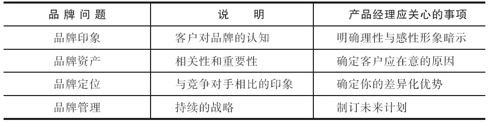
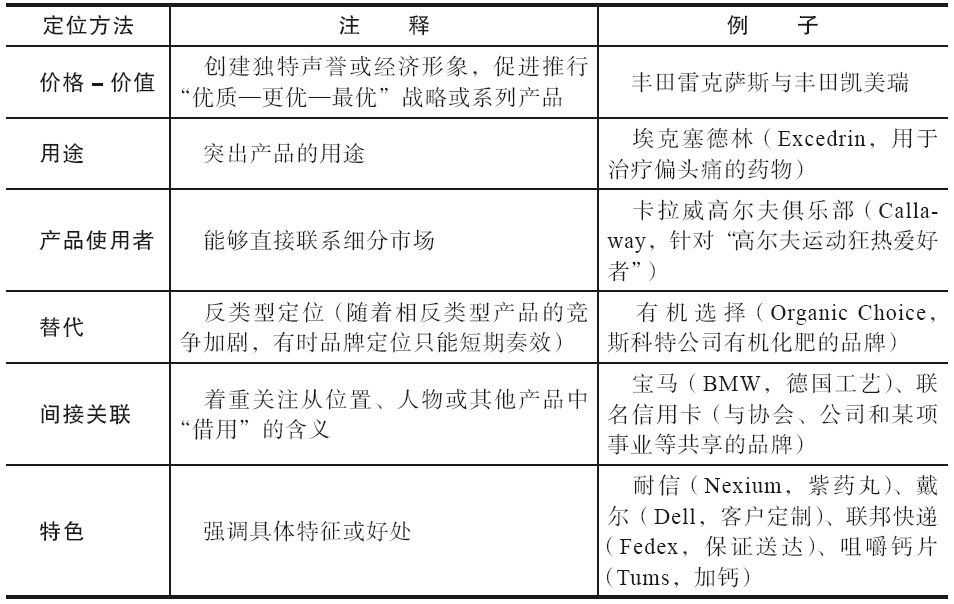
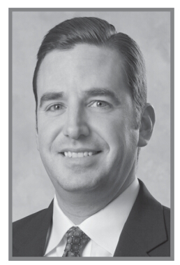

## 第11章 管理品牌资产

请判断对错：品牌就是个徽标。

错。我相信几乎每位阅读本书的人都知道这种说法是错的。虽然徽标是品牌感觉的视觉化表现，但品牌的实质却要深远得多。它是通过一次次与顾客接触才累积起来的。品牌是个承诺，代表一种固有印象，也是一种联系顾客的手段。

品牌要素、结构及战略

产品经理和品牌经理之间存在什么不同吗？有，但也可以说没有。从一个极端来说，品牌经理这个术语通常用在消费领域，是指负责管理某个具体的主品牌（如佳洁士或威斯克）下面的有关产品（如牙膏或清洁剂）的人员，其重点在于把品牌名称根植到终端用户（也可能是渠道）心中，借此构建一个始终如一的品牌身份。在另一个极端，即在B2B（企业对企业）领域，产品经理往往要积极参与产品构思与产品开发（常与工程设计部门紧密合作），有时也管理整条产品线，其产品品牌可能与公司名称相同，也可能独立于公司名称之外，但由这两个极端组成的连续统一体存在大量的重叠。本章重点讨论这两者重叠部分的品牌战略。

基本要领

“传统”消费品领域之外的产品经理会偶尔觉得，品牌与自己的行业没什么关系。这大概是因为人们普遍认为品牌只不过是营销的“噱头”（这个批评对某些品牌来说是没错的）。但品牌身份可以简化客户购买决策过程，这是因为品牌是一种识别身份的形式，它表明了一定水平的品质、价格/价值和产品支持。

很多专家和组织对品牌下了不同的定义。美国营销协会把品牌定义为：“一个名称、术语、设计、符号，或任何其他能够表明某个卖家的产品或服务与其他卖家不同的任何其他特征……品牌可用来表明该卖家的一个商品、一族商品或全部商品。”[[1]](part0018.xhtml#ch1-back)着名品牌大师凯文·莱恩·凯勒（Kevin Lane Keller）则认为：“品牌是增加了其他维度的产品以某种形式被设计出来，它使一种产品与满足相同需求的产品有所区别。这些差异可以是合理的，并且是有形的……或更具象征意义的、情感性的且是不可触摸的。”[[2]](part0018.xhtml#ch2-back)国际品牌公司（Interbrand）是一家专门从事品牌战略咨询的国际咨询公司，它把品牌定义为：“众多有形和无形属性的组合，体现在商标中，如果管理得当，能创造价值和影响力……从营销或消费者的角度看，（其价值）在于一种体验的承诺和履行……品牌给顾客提供了一个在集中市场上做出选择和能够进行识别的手段。”[[3]](part0018.xhtml#ch3-back)

上述定义清楚地表明，品牌是包含了一整套有形和无形属性的集合体，体现了客户对向其所做的承诺的认知情况。因此，品牌就是客户用来做出购买决策的一种行动纲要或者固有印象。像人们会对某些体育明星、政客、地理区域等形成（好的或坏的）固有印象一样，客户对产品、服务和公司也会形成这样的固有印象。产品经理应该努力了解并且管理自己品牌的固有印象。有四个基本问题你可以问问自己：（1）客户对你的品牌有什么印象？（2）这种印象对客户具有什么价值（品牌资产）？（3）与竞争对手相比，目标客户是怎么看待这种品牌印象的（品牌定位）？（4）客户对品牌的认知是你所期望的吗？它们是不是与我们的目标一致（品牌管理）？请见表11-1。

表11-1 基本品牌问题

#### 客户对你的品牌印象如何

针对上面第一个问题，品牌印象是客户对你的产品、服务和公司的认知。这种印象是通过客户对产品（或服务、或公司）的体验而逐步建立的，也是公司控制下的营销活动，并通过客户所有的与来自公司以外信息来源的互动而逐步建立的。想一想下列各公司品牌：苹果公司、哈雷-戴维森公司和三星公司。苹果公司被公认为是一家“定义高科技时尚产品的公司”；[[4]](part0018.xhtml#ch4-back)哈雷-戴维森公司则笼罩着具有自由精神、顽强个人主义的“疯狂”的光环；[[5]](part0018.xhtml#ch5-back)三星公司则已经转型为技术领先型炫酷产品的设计者。[[6]](part0018.xhtml#ch6-back)

现在请设想一下，客户会如何描述你的产业或类别下的产品。有些描述或许比较理性（如反应迅速或产品线完整），而其他的则可能更加感性（如友好或值得信赖）。同样，这些描述可能是正面的，也可能是负面的。请做出判断，客户会使用什么样的语言来描述你的产品？记住，客户和非客户的印象可能是不同的，甚至不同客户群体的印象也会有所不同。

#### 产品印象对客户具有什么价值（品牌资产）

第二个问题是评估客户对所描述出来的产品印象所赋予的价值。这些印象事关产品的相关性和重要性。客户可能对产品已经形成某种固有印象，却不一定能感受到产品与其自身需求之间有什么关系，或者在某种程度上说，产品对他没有任何价值，这就是以客户为本的品牌价值理念。要在变幻莫测的市场中保持相关性是一项十分艰巨的任务。我们回到哈雷-戴维森公司的例子。它的个人主义形象对婴儿潮中“追梦者”的市场分区有很高的相关性。但其买家的中值年龄正逐年增长，因此该公司就面临着挑战，如何以新的、有意义的方式让它的品牌和产品与女性客户和年轻男性买家联系起来。回顾一下在你阅读前段文字时在脑海中浮现出的自己产品的形象，这种形象对于你的客户来说有什么相关性和重要性？

#### 与竞争对手相比，目标客户是如何看待这种品牌形象的（品牌定位）

第三个问题涉及与竞争对手相比的品牌定位问题。你的品牌形象有什么样的独特性？苹果和哈雷是备受推崇的品牌，它们成功地与自己的竞争对手拉开了距离，并使客户确立了对其品牌的忠诚度。三星公司打造的其品牌形象的效果也不错，但要长期保持这个形象，就必须避免竞争对手迎头赶上。如果产品经理的某个主打品牌旗下只有一种产品，那么它的品牌定位和产品定位是相同的。但如果产品经理负责多种产品，其所有产品可能共享某个相同品牌形象的“核心要素”，个别产品可能有独立的定位，但这个定位会与总的品牌形象保持一致，或者某个具体的产品可能有明显不同的品牌身份。关于这一部分，我们会在后面“设计品牌战略”那部分中进行深入讨论。

#### 客户对品牌的认知是你所期望的吗（品牌管理）

最后一个问题是品牌管理，这一问题讨论的是产品经理建立和管理其差异化的品牌形象时，会持续运用的策略使这种品牌形象对某个重要市场来说必须具有价值而且联系密切。你需要做出决定，认真解决产品线扩展、协调品牌价值与集体客户和市场分区之间的关系以及确保产品如约发货等为问题。以苹果公司为例，在它推出诸如iPod、Mac Mini和iPad等产品时，就需要仔细分析公司品牌与单个产品品牌之间的关系。对于哈雷-戴维森公司来说，重要的是了解不同的细分市场看待品牌价值的关联性问题。最后，三星公司必须在产品设计方面进行后续投资，以保持公司相对于索尼、摩托罗拉以及其他不断涌现的竞争对手来说的领先品牌定位。

制定创造品牌的战略

在制定品牌战略时，产品经理必须清楚，企业形象与产品形象对于客户做出购买决策的相对重要性。是客户在选择某种产品时根本不了解公司，还是很大程度上是因为公司的原因？很多B2C产品会拥有不同于公司名称的品牌，但是很多B2B和服务类产品则会以某种方式包含公司的名称（当然也有例外情况）。公司名称的相对重要性应由客户的购买决策过程决定。请问问自己，在购买某个产品的决定中，有多少百分比是出于客户对公司（或者业务单元、部门）名称的了解，以及产品本身要实现的结果是什么。如果这些因素中的大多数会影响购买决策，产品经理可能就需要在多个不同的结构层次水平中建立（或借用）品牌资产。

公司的形象或声誉受多种因素影响，而这些因素却不是多数产品经理能够控制的，这往往导致公司品牌由传播部门来负责。在这个层面上，沟通的对象应包括所有利益相关方（客户、供应商、员工和股东）。产品形象和产品品牌的责任应由产品经理承担，此时的沟通目标是终端客户和产品渠道。

#### 品牌的层级关系

产品品牌一旦与公司联系起来，产品经理就必须评估它们之间的相互影响。尽管产品经理不一定改变或控制公司（或部门）的声誉，但理解其影响对于正确定位产品是很有必要的。对于专门针对具体行业推出的产品来说，如果主品牌被认为并不“适合”这个行业的话，那么这类产品在获得广泛的认可度方面可能会有困难。低价产品可能会与行业中的“宝马”级公司身份不符，反之亦然。花哨的产品也会损害公司的保守形象。相反，产品经理如果能够利用企业形象来促进产品的营销，就能从公司强大的市场定位中获益。

我们以一所大学为例来说明这种层级关系。美国威斯康星大学麦迪逊分校近来在努力改进“公司”（大学）品牌与“事业部”（学院、运动项目）品牌和“家族”（系部）品牌之间的联系。该校的土地由政府划拨，属十大盟校之一，是科研和前瞻性思想培养与筛选地，并致力于体育运动事业。其顶级品牌承诺指出：“威斯康星大学麦迪逊分校为大家提供全方位的教育环境，在此有才华、有激情的学生和学者能够共同合作，影响并改变我们的学校和我们的世界。”下一层次的品牌是学院一级的，如商学院。该学院也努力兑现影响学校和世界的形象和品牌承诺，但它通过“家族”品牌，如高管教育中心、小企业发展中心、家族企业中心和其他各种中心，来承担属于自己的这部分责任。这些家族品牌针对具体的客户类型（如家族企业所有人、小企业工作人员或公司经理和高管）推出具体的产品（如产品管理和小型企业基础等方面的研讨会）。大学、学院以及各中心各种具体的研讨会产品提供了品牌背书。这样一来，各产品经理在产品定位方面就十分依赖这些品牌背书，当然具体的产品特色和营销活动也会发挥一定作用。

再举一个例子，苹果公司也为其产品，如iPod家族品牌，提供了公司品牌背书。在这个产品家族中，iPod是全功能产品，而iPod Shuffle则是入门级侧翼品牌。因为苹果代表着高端产品的形象，所以，一方面，iPod Shuffle的营销更要小心翼翼，以免损害家族品牌或公司品牌；另一方面，苹果公司的高端形象给这款产品的发布增加了声誉和可信度。

当公司名称成为潜在障碍时，业务部门或家族品牌有时就成了产品品牌的背书者。例如，顶客坊（Cascadian Farm）是全食（Whole Foods）超市等谷物和其他天然食品零售商的供应商，在它被通用磨坊食品公司（General Mills）并购时，很明显通用磨坊的形象对目标客户而言并不能增加产品价值。对于追求有机食品的客户分区，顶客坊拥有比通用磨坊形象更高的品牌资产。因此，其谷类食品（如燕麦片和蜂蜜燕麦卷）的包装盒上就标明顶客坊为其赞助公司。[[7]](part0018.xhtml#ch7-back)

除了决定是否把公司品牌作为其子品牌产品的背书品牌之外，产品经理还要认真考虑其他诸多因素。（客户看来）该品牌或产品的核心定位是什么，以及你希望它的定位是什么？该品牌是不是能够或应该扩展到其他产品或种类中？为了确立一个新的定位或吸引新的市场分区，用不同的品牌是否合理，或者是否有必要？

#### 核心定位

在进行品牌定位时要充分利用客户看重的优势，同时保留与竞争品牌的差异。公司可以运用的方法多种多样，包括价格-价值定位、功能定位、产品使用者定位、替代定位、间接关联定位或者特色定位。品牌定位可以针对于一个品牌，也可以针对品牌和产品的组合（见表11-2）。

表11-2 品牌定位方法

价格-价值定位法从高端市场到大众市场都适用。高端定位通常被那些产品价格比竞争对手的更高（想必质量也更好）的市场领先者采用。如劳力士（Rolex）手表这种知名度较高的产品，以及像卡特彼勒这类能够引领市场的企业，都是采用高端品牌定位的例子。从另一极端来说，大众消费市场的品牌则更加倚重效率（如沃尔玛）和经济性（如丝华芙美容专卖）。如果产品经理准备在多个价格-价值定位上开展竞争，就应考虑双重品牌或侧翼品牌策略，用不同品牌体现不同的定位。

产品用途定位则与产品应用或使用方式直接相关。尽管并不完全出于战略考虑，苹果计算机曾一度被认为是用来做图形设计的计算机，而个人电脑则更关注IT技术；埃克塞德林定位为治疗偏头痛的专用止痛药；基因试剂可以定位成纯粹为研究，而不是应用研究领域的。

有时候，把产品定位针对相关用户，如某类个人（如自助人员、父母）、专家（如职业高尔夫球手、工程师）或产业（如水净化产业、医院），则可以明确（或隐含）一定的关联性。这类品牌可能与目标客户渴望成为的那类个人（或公司）联系起来。如耐克品牌吸引了一批热衷体育的人，哈雷摩托车则吸引着那些将自我形象定位为反叛者的人群（见企业案例11-1）。

企业案例11-1

哈雷-戴维森：美国伟大品牌的回归

《商业周刊》在每年8月都会发布国际品牌集团的年度全球最有价值品牌排名，哈雷-戴维森这个品牌总会入选，但最初的情况并非如此。1975年，杰弗里·布卢斯坦（Jeffrey Bluestein）加入公司，接任工程设计副总裁一职，当时该公司的产品因粗制滥造而声名狼藉。布卢斯坦（后来成为公司的首席执行官）和同事一起恢复了其高端品质，并推出了新款产品。到2005年，哈雷公司已连续19年保持其利润和销量双增长的势头。

哈雷作为狂热品牌的成功，主要是因为“哈雷骑士俱乐部”（HOG）坚定不移的忠诚和拥护。该俱乐部会员多达65万人，他们向彼此展示“反叛者”形象，其品牌形象代表了粗犷的个人主义、自由和反叛，并有“一点点坏”，这些都与美国的文化和价值观相关。该车刚开始生产时，是专供第一次世界大战和第二次世界大战中的美军及其盟军使用的。公司运用“360度整合营销”来强化了它的狂热品牌的形象，它试图通过哈雷骑士俱乐部举办的各种活动、参观工厂、赛车，以及摩托车拉力赛等方式来营造一种社群意识，从而形成一个由各类人群组成的大家庭。

不过，当它想要延续品牌的成功时，却碰到了困难。哈雷公司新用户的平均年龄从1997年的45岁以下上升到2003年的46岁，此后用户的平均年龄又有所上升。婴儿潮时期核心人群的需求已逐渐趋冷。现在，哈雷公司的品牌必须扩展到新的市场及新的产品中去。为了打入新市场，哈雷公司竭力使自己的品牌和产品以全新且有意义的方式与那些将来有可能购买哈雷摩托车的“追梦者”联系起来。零售买家中女性客户的比重从5%上升到10%，对“X一代”（Gen Xers）的销售比重也在增加。该公司开发了有品牌的驾驶员教育培训课程，这门课程被称为“刀锋骑士”（Rider’s Edge）。经销商还对课程进行了量身定制，让课程在当地市场更具吸引力。哈雷公司还通过品牌授权增加了收入，这些品牌从哈雷皮裤到哈雷主题芭比娃娃，应有尽有。哈雷公司现在拥有一个品牌营销人员组成的顾问委员会，从整个企业的视角来看待“品牌”。

资料来源：Adapted from Joseph Weber，“He Really Got Harley Roaring，”BusinessWeek（March 21，2005），p.70.Dale Buss，“Can Harley Ride the New Wave？”Brandweek（October 25，2004），p.20.Diane Brady et.al.，“Cult Brands，”BusinessWeek（August 2，2004），p.66.James Speros，“Why the Harley Brand’s So Hot，”Advertising Age（March 15，2004），p.26.

以“反”类型产品确立形象的品牌运用了替代品牌的定位方法。20世纪70年代，七喜汽水（7Up）就把自己的产品定位为“非可乐”，这是一种与可乐产品类型对立的软饮料。卫星电视信号服务商做广告，声称自己是有线电视的替代产品。值得注意的是，这种方式在产品生命周期之初可能获得成功，并且在新技术方面偶尔还能形成持续的先发优势，但在竞争对手加入这个“反”类型之后，这种方法的效果可能会减弱。

间接关联提供了另外一种潜在的定位基础。产品经理有时候会从地理位置、代言人，甚至从某个物品身上“借用”意义。瑞士作为瑞士手表的故乡，能让人想到“精确”的形象。德国则以汽车性能卓着而闻名。纳帕谷（Napa Valley）则让人联想到葡萄酒。产自这些地区的其他产品，有时候会因为与这些优势之间的联系而受益。在其他时候，其他产品希望确定与相关地理位置或其他因素之间的联系，用以建立这种二次联系的基础。运动员（如老虎·伍兹代言耐克高尔夫球鞋）、政治家（如鲍勃·多尔代言伟哥）和演员（威廉·沙特纳代言美国旅游服务网站Priceline），都可以用自身的特点来为产品代言。

属性定位是指在某个独特产品、服务特色或好处的基础上，确立一种差异化身份。如果你的产品是同类型产品中唯一具有钛金属框或蓝色镜片的，或具有其他特色，而竞争对手出于某些原因不会进行模仿，并且这个属性是显而易见并且与目标客户相关的，那么产品定位就可能以此为基础。基于某个好处的产品定位（如沃尔沃汽车的安全性）就是类似做法，只是这一属性不那么显而易见。

一方面，关于品牌定位有几个一定要做的事项和一定不能做的事项。一定要根据产品优势进行定位。否则你就没有能力保持与竞争对手的差异性。一定要通过全面的营销活动来强化你的定位，如果各种不同的客户接触点传达了相互矛盾的线索，产品形象就会被削弱，市场也会被弄混。品牌定位一定要前后一致，要从长期投资的角度来思考品牌定位问题。

另一方面，有些做法则要避免。千万不要试图在每件事情上迎合所有人。这需要专注和纪律，因为总会存在多方投资的诱惑。不幸的是，缺乏专注会让客户不知所措，甚至会把他们推到竞争对手那里。即使品牌定位可能不会让所有客户喜欢，但只要它适合一个足够大的细分市场，你就拥有了优势。千万不要针对同一目标市场使用不同的品牌定位。如果产品能吸引完全不同且相互独立的客户群体，就可能需要对服务做不同的定位。但如果存在明显的重叠，品牌形象就会变得复杂。千万不要根据价格进行定位，除非你真正具有成本优势。即使拥有成本优势，这种品牌定位策略也可能很危险，因为未来的新技术会让你的效率优势不复存在。千万不要用你无法兑现的承诺来定位，这一条与第一条一定要用优势来定位是一致的。一定要确保对客户所做的承诺是可以坚持到底的。

#### 品牌扩展

在产品经理给产品组合增加更多的产品时，他们可能需要同时评估产品的适合性和品牌的适合性。通常这些做法从客户的角度看应该符合逻辑。针对技术产品，品牌内涵往往超越传统的质量承诺，并涵盖产品线扩展的部分。客户想知道同家公司生产的复杂产品能否相互兼容得很好，在这里只强调质量本身是不够的。这就是为什么索尼、苹果、三星等公司都建有品牌展示厅，用以让客户体验整个产品线的产品。[[8]](part0018.xhtml#ch8-back)

一个品牌，想要让其形象对客户来说不至于被稀释，也不至于要承担其可能变得无关紧要的风险，那么它到底能延伸多远？品牌扩展有什么优点和缺点？品牌扩展战略应该如何实施？什么时候应采用侧翼品牌或双重品牌的战略？对产品经理来说这些都是难以解决的问题。尽管没有确切的答案，但产品经理至少应认真思考这些问题。

由于建立强大的品牌知名度需要投入巨大的资源，公司总会受到诱惑，把品牌扩展到同一产品线的多个产品变形（如不同风味、不同规格或不同色彩的产品），甚至扩展到不同的产品类别（如吉露将其品牌从速凝混合明胶扩展到冰冻布丁）。如果品牌的核心要素（如新鲜、及时发货和有趣）在一定程度上符合新产品的特征，这种品牌扩展就会成功。2001年，戴姆勒-克莱斯勒公司的吉普车系列推出了一款克拉夫特吉普切诺基全地形婴儿推车。这一品牌概念扩展得十分得当，产品销售火爆，甚至引来福特公司的路虎效仿入市。在一家纽约的品牌公司TippingSpring开展的“最佳品牌扩展”调查中，这款婴儿推车在2004年8月获得了第二名。苹果公司则以iTunes在线音乐商城这一品牌扩展位列第一。[[9]](part0018.xhtml#ch9-back)

当然，品牌扩展总是暗藏风险。新产品可能会被认为与原来产品差异巨大，在市场上导致了混淆。同样，如果新产品失败了，这种失败也会给原有产品带来负面影响。

因此，公司通常会尽力借知名品牌获得好处，但同时仍然保持单个产品一定的独立性。麦当劳对多数产品承诺快速和方便，并用Mc作为前缀，这种相同的命名方式（McMuffin、McNuggets等）把它们联系起来。同样，惠普公司用Jet作为产品名称的结尾（OfficeJet、DeskJet和LaserJet），扩展了打印机家族品牌。还有索尼公司，它用man作为后缀（Walkman、Discman），扩展了其便携音乐播放器的品牌。

如果产品固有的价值主张显着不同，就该考虑运用不同的品牌。提供“优质—更优—最优”多个产品线的产品经理可能会选择使用不同的品牌来代表每个产品线。或者如果两个相似的产品通过不同的价值渠道推广（如一个通过自动贩卖机，另一个通过增值转销商），或许就应该选用双重品牌战略。

品牌元素与品牌计划

层级和定位战略一旦被制定出来，就要通过选择并运用各种品牌元素来将其贯彻执行。这可能包括（但不限于）创建品牌名称、设计标识以及各种与品牌有关的元素，并要拟定沟通方案，以便实现品牌目标。如前文所述，客户对产品的印象来自于多个接触点，但产品经理并不能将其完全置于自己的掌控之中。不过，产品经理还是应该尽可能地控制好品牌的沟通活动。

品牌大师凯文·雷恩·凯勒曾经用五个标准来评估各种品牌要素：方便记忆、有意义、可转移、可调整以及便于保护。[[10]](part0018.xhtml#ch10-back)方便记忆是指能让人记住并在购买时容易回想起来；有意义是指能被描述出来并具有说服力，以及抓住并能提升品牌的无形特征；可转移是指品牌要素可被扩展到不同的产品、类别或区域市场的程度；可调整是指能够随时间的推移不断更新品牌要素，保持品牌与市场之间的联系，同时又不会损害已经建立起来长期品牌资产。最后一个标准是便于保护，即品牌要素可以通过法律或竞争的途径获得保护。这五个标准为产品经理提供了检查清单，在创建新品牌或评估现有品牌的调整时可供参考。

#### 品牌要素

品牌名称对产品的成功有什么影响？这个问题很难回答，因为这两者之间存在协同效应。在第一次购买一种新商品之前，产品名称还没有在客户心中确立起价值。但是购买之后，产品名称就变得重要起来，并且它实际上成了一个成功商品的形象。如特氟龙（Teflon）、航空液压油（Skydrol）、有机玻璃（Plexiglas）和农达除草剂（Roundup）等都是化工产品品牌，历史悠久，品牌非常成功，销量巨大。这些产品一旦被成功地购买和使用，未来的销量就会提高。如果没有名称，相关产品上市时就很难利用其优势，即使配方、设计或功能方面只做微小变动，都会引起竞争对手的进入。[[11]](part0018.xhtml#ch11-back)

品牌名称的来源多种多样。有些来自常用词汇，如People或Oracle；有些是词语的组合，如Hamburger Helper或Janitor-in-a-Drum。这些词汇都拼写简单、发音容易并且便于记忆，但它们不应是对产品所属类别的描述性词语，尤其是当该类型描述语已经使用了很长时间。混合词汇，如ThinkPad或AquaFresh等词汇则旨在对产品的优点做更多的描述，并借此克服常用词汇注册困难的问题。不过，随着混合词汇的注册数量不断上升，用这种方法命名的潜在品牌名称的选择性越来越少。像Tylenol、Pepsi和Google这类新造词语本身并没有什么意思，这类品牌名称比较独特，但需要更多的营销沟通才能在客户心中建立起意义。无论用什么方法来创造品牌名称，最常见的目标就是：找到一个名称，传达产品定位信息以及产品给客户带来的基本好处。在寻找新品牌名称时，对现有品牌名称进行全面梳理非常重要，以免侵犯其他公司的商标权。

除了品牌名称之外，还有很多可以用来注册商标的品牌要素，包括标志、象征符号、人物肖像、包装、标语和广告歌等。这些要素可被用来增加品牌意识，塑造出差异化且便于记忆的品牌标志或传达坚定的价值主张。在公司营销沟通部门强制要求商标的印刷、排版以及颜色保持一致时，很多产品经理对这种“标志警察”（logo cops）多有抱怨。产品经理对此不能有抵触，而应该按照规范行事，尽可能从公司品牌中为产品品牌带来好处。

人物肖像有时候可以被用来强化品牌的理性或感性属性。如美国家电集团品牌美泰克（Maytag），就利用维修人员的形象来传递“值得信赖”的信息。食品企业品牌奇宝小精灵（The Keebler elves），就塑造了一个魔幻有趣的品牌人物。佳洁士则用“没有蛀牙”这个和以前相同的主题，重塑了佳洁士小孩的人物形象（见企业案例11-2“人物形象必须与其品牌保持关联”）。标语口号（如通用电气的口号“梦想启动未来”）也是用来强化品牌形象或承诺的。产品经理应该考虑用最好的方式把这些因素融入到自己产品的营销方案中去。

企业案例11-2

人物形象必须与其品牌保持关联

每个公司都会努力保持其品牌形象的一致性，但这一点并不是总能做到，或总是很明智地被执行。有时候变化是必须的，这样才能让品牌与新的受众或期望联系起来。

2002年，戴尔公司开始逐步停止使用史蒂芬的形象（“哥们儿，你得弄台戴尔了”），当时戴尔觉得“量身定制”这个信息在营销沟通中没能体现得很明确，并且与企业的主要目标客户没有多大关联。虽然该形象代言人的知名度很高，但这种方法并没有像预期那样有效地巩固该品牌定位。同样，美国家庭人寿保险公司（Aflac）也发起过一次活动，“让它的鸭子代言人闭嘴，并寻求更好界定公司业务的办法。”客户倒是说他们记住了那只鸭子，并把它与某种类型的保险联系起来，但不能确定Aflac能为他们做什么。

宝洁公司在佳洁士牙膏广告中沿用了“妈妈，看，没有蛀牙”这个主题的精髓，但说这句话的人却从20世纪50年代诺曼·洛克威尔（Normal Rockwell，当时的美国着名插画家，画家本名是Norman，Normal是书中的误拼，它是指典型的洛克威尔式的插画形象）画的形象，换成了一个生于古巴名叫恩雅·马丁尼（Enya Martinez）的女孩。如今的佳洁士小孩是美籍西班牙裔人口暴增现象的体现。

很多其他品牌肖像都经过升级并且有了巨大的转变。杰迈玛大婶（Aunt Jemima）是一位制作薄煎饼和糖浆的女家长，她在1989年换了新的发型，衣服款式也变了。20世纪70年代，印在乔治亚-太平洋公司（Georgia-Pacific）纸巾上的格子衬衣肌肉男那种的健壮男子形象，到了2004年也彻底变样，换成了一位长着深色头发、更加年轻的“都市美男”。

资料来源：Brian Steinberg，“P&G Brushes Up Iconic Image of‘Crest Kid’in New Campaign，”Wall Street Journal（March 29，2005），p.B9.Suzanne Vranica，“Dell，Starting New Campaign，Plans for Life without Steven，”Wall Street Journal（October 16，2002），p.B3.Suzanne Vranica，“Aflac Partly Muzzles Iconic Duck，”Wall Street Journal（December 2，2004），p.B8.Claire Atkinson，“Brawny Man Now a Metrosexual，”Advertising Age（February 16，2004），p.8.

#### 营销方案

无论用什么具体的品牌要素来提升品牌形象，相关的营销方案都是更为重要的。完备的产品战略是营销方案成功的核心。产品组合必须步调一致地践行品牌的有形和无形承诺。客户对产品的价值感受部分依赖于正确的定价策略。将产品发送给客户的渠道必须拥有适合的标志，并能为其提供必要的支持。最后，营销沟通中必须做出的承诺，只能是针对那些可以长期坚持的内容。

可口可乐公司发现实施中的广告推广活动可能与它的品牌形象相冲突。该公司长期以来一直沿用感性的商业广告，如“我要教会整个世界歌唱”。在2000年，该公司想变得更加大胆一些，它决定找一家新的广告公司进行尝试，开展名为“锋锐”的广告宣传战役，试图改变原来那种“热情而好奇”的传统形象。在一则广告片中，一位坐在轮椅上的怪异老奶奶，因家庭聚会时没有可乐而暴跳如雷；在另外一则广告里，一群朋友也因高中同学聚会上没有可乐而大动干戈。客户和装瓶工纷纷写信抱怨，说广告内容过于狭隘。几个星期后，这些广告就停播了，7290万美元的广告投入打了水漂。[[12]](part0018.xhtml#ch12-back)

总之，营销方案应与想要实现的品牌形象和定位保持一致，但产品经理应不断挑战现状，并确定旧的规则是否依然适用。定期访问国际品牌公司的网站（<http://www.brandchannel.com>），阅读各类观点截然不同的特写文章和专栏文章，其中一定会有内容对你有所帮助。

本章思考

深入挖掘，发现超越产品特性的品牌价值，然后通过各客户接触点尽可能地体现其价值。

杰夫·米库拉访谈：与客户建立真正的品牌联系

杰夫·米库拉（Jeff Mikula）

美国屹龙（Hill-Rom）公司

全球品牌与营销沟通副总裁

杰夫，你从事品牌管理和规划工作已有十多年时间。你能和我们谈谈贵公司在创建和管理品牌价值方面的经验吗？

我真的非常幸运，我的工作能够影响众多企业和产品的品牌，这些企业从初创公司到《财富》500强企业都有，有作为代理参与的，也有在公司内部参与的。我做这一行已经超过17年，曾在很多不同的领域工作过，包括品牌整合、规划、品牌表现及形象开发、定位、架构开发、产品开发及商品化。伟大的品牌触及企业和客户体验的方方面面。我复杂的背景的确能帮助我把品牌工作提升到一个更高的层次。目前，我就在屹龙公司做品牌提升方面的工作，这家企业是一家在医疗技术方面全球领先的供应商，它也为卫生保健行业提供相关服务。该公司在世界各地的医院、后续医疗保健以及病人护理领域拥有众多卓越的品牌。我现在负责该公司的全球公司品牌与产品战略的制定工作，以便在新的和已有市场上巩固其领导地位，提高营收，并增加品牌资产。

“品牌”这个术语有很多不同的定义，你是怎么定义这个术语的呢？

品牌实际上就是公司或产品向其客户和其他利益相关方所做出的价值承诺。在医疗保健行业，我们的事业是建立在信任的基础之上的，而且这是一种强大的价值联系；我们的事业也是建立在承诺基础之上的，这是因为我们每天向病人和客户做出各种承诺。为了实现强大的品牌资产，尤其是在医疗保健行业之类的领域中实现的品牌资产，品牌必须向企业各方人员传播自己的承诺。这绝不仅仅是看一眼、感受一下，或是用一句时髦口号就能实现的。

公司品牌管理和产品品牌管理有哪些不同之处？B2B与B2C品牌管理又有什么不一样的地方？

不管怎样，创建品牌的目标总是相同的，即与客户和利益相关方建立一种深层次的联系，并始终如一地履行品牌承诺。品牌经理必须把工作重点放在品牌所代表的意义及其存在和成长的方式上。在传统的B2B环境中，购买决策受多方面的影响，也与多个品牌接触点有关，其工作重点应更加关注客户与企业的关系，而不仅仅限于产品本身，要更加明确地针对特定的受众。在B2C环境中，购买行为涉及更多的情感因素，而不像在B2B环境中那样以理性或智慧为基础。此时，品牌经理的工作重心应更多地落在客户与产品的联系上，而不是客户与企业的关系上，其受众范围也更为广泛。在这两种情形下，保持一致性都很重要，整合经营活动和营销组合有助于品牌的价值和影响力发挥其最佳作用。

在品牌管理中，从品牌原型到企业公民，再到社交媒体的各个方面，有好多“热门”话题。这些话题对你的品牌管理工作存在什么影响（如果有的话）？

在当今社会，要创建一个成功和可持续的品牌，真实和信任是至关重要的。客户选择品牌是希望该品牌能帮助他们澄清自己的价值观，并分清各种事情的轻重缓急。他们通过寻求各个公司和品牌来表示他们在一定程度上拥有共同的价值观。客户期待一种双向的对话，并且希望拥有参与的机会。组织通过建立信任并运用其声誉，力求以更加透明的方式来创建各种引人关注的品牌。无论它是品牌原型、企业公民还是社交媒体（或者全部都是），品牌经理会不断受到影响，增加各种可能，以使自己的品牌对于客户来说更加具有吸引力，更加真实可靠，更加透明。品牌经理绝对不能以一贯相同的方式来塑造品牌，因为客户与品牌的联系方式已经和以前大不一样。所有这些热门话题都在某种程度上影响了我的品牌工作，正因为这些，我们的品牌和客户都受益匪浅。

因为信息和新创意的产生与品牌话题有关，你有没有什么特别喜欢的来源？

这并不新鲜，产品经理最重要的工具之一可能就是经验映射图了，即了解客户与企业之间全部互动活动的过程。在围绕品牌或品牌承诺方面所做的创新中，最好的改进之处（或最失败的地方）不仅与满足客户的当前需求有关，而且还在于预测在市场变化不可避免的情况下，未来会发生什么。经验映射可以让品牌经理接近客户体验中的每个步骤，并以开放和积极的心态来对待每个影响品牌关系业务的接触点。由于品牌环境会不断变化，蓬勃发展的品牌必须紧跟时刻演进的数字、社交和传统媒介方面的潮流，或实现超前发展。我们必须准备好迎接各种改变与我们的品牌和整体市场之间重要关系的下一个重大创新或突破。

你能不能为产品经理提一些品牌管理方面的建议？

深入挖掘，发现品牌的独特含义，建立比普通产品特征更为重要的纽带。对于销量和盈利能力而言，差异化非常重要。要多看看周围的所有对品牌产生影响的人员，并思考他们之间的相互作用，因为这些人际互动可能与他们和你的品牌之间的互动同样重要。密切关注客户体验的每一个接触点，不要只把产品或品牌认知度作为赢得市场的唯一标准。品牌与客户之间的联系越紧密，在该环境中，客户影响与体验的角度也就越广阔。成功的品牌经理既要有微观的视野，也要有宏观的视野，只有这样，才能把优秀的品牌改造成真正伟大的品牌。

[[1]](part0018.xhtml#ch1) From the dictionary on the American Marketing Association Website，http://www.marketingpower.com/.

[[2]](part0018.xhtml#ch2) Kevin Lane Keller，Strategic Brand Management（Prentice-Hall，1998），p.4.

[[3]](part0018.xhtml#ch3) http://www.brandchannel.com/education_glossary.asp.

[[4]](part0018.xhtml#ch4) Beth Snyder Bulik，“Apple Hires HP Star to Bring StrongerMarketing Punch，”Advertising Age，vol.76，no.8（February 21，2005），p.4.

[[5]](part0018.xhtml#ch5) Joseph Weber，“He Really Got Harley Roaring，”BusinessWeek（March 21，2005），p.70.

[[6]](part0018.xhtml#ch6) David Rocks and Moon Ihlwan，“Samsung Design，”BusinessWeek（December 6，2004），pp.88–96.

[[7]](part0018.xhtml#ch7) Kevin Helliker，“In Natural Foods，a Big Name’s No Big Help，”Wall Street Journal（June 7，2002），pp.B1–B7.

[[8]](part0018.xhtml#ch8) “Leaders：Brand New，”Consumer Electronics，（January 15，2005），p.10.

[[9]](part0018.xhtml#ch9) Todd Wasserman，“Marketers Extend Kudos to Jeep，Apple，”Brandweek（October 11，2004），p.4.

[[10]](part0018.xhtml#ch10) Todd Wasserman，“Marketers Extend Kudos to Jeep，Apple，”Brandweek（October 11，2004），p.4.

[[11]](part0018.xhtml#ch11) Steve Butler，“Product Range Brands：A Frequently Overlooked Source of Value in the Chemical Industry，”Chemical Market Reporter（December 9，2002），p.26.

[[12]](part0018.xhtml#ch12) Betsy McKay and Suzanne Vranica，“How a Coke Ad Campaign Fell Flat with Viewers，”Wall Street Journal（March 19，2001），pp.B1–B4.
