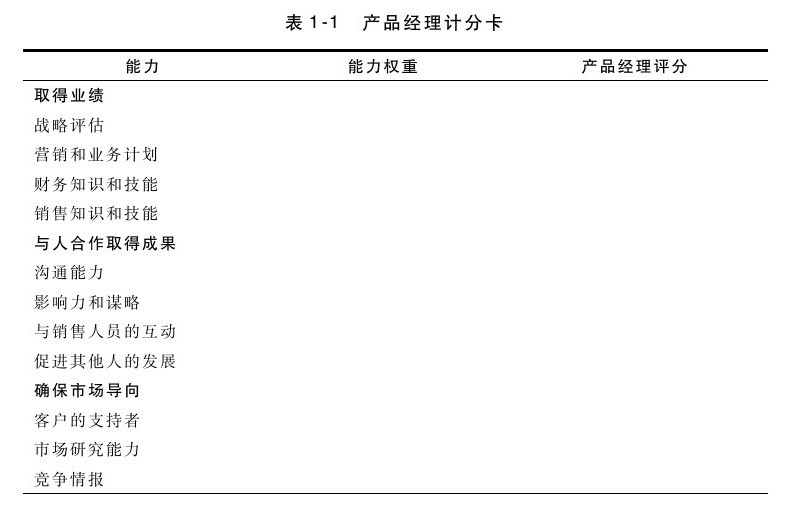
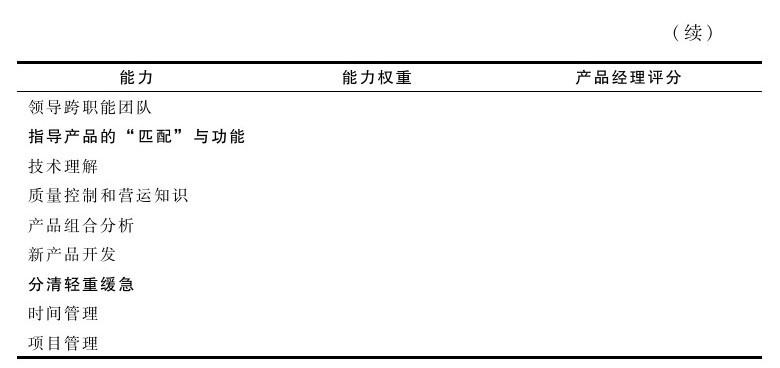

## 建立产品经理计分卡

前文提到的产品经理的几种能力所占的权重不尽相同。决定各种能力权重的影响因素如下。

·职位级别。副职产品经理只需基本掌握某项技能或知识，而高级产品经理则需熟练掌握。

·组织结构。有些企业设有技术产品经理、产品营销经理、上游或下游产品经理以及其他各类职位。根据工作需要，在不同职位中，不同能力所占的权重不同。

·行业。有些行业对技术、客户或其他专业知识有更高的要求，这在能力的权重分配上也会有所反映。

你可以运用适合于所在企业情形的权重，制订一份产品经理计分卡，根据能力权重和产品经理评分找出可提升的空间。如表1-1所示的是产品经理计分卡。

要填写产品经理计分卡，首先要确定某一产品经理职位需具备的各项能力的权重。即决定在这个职位上，理想的产品经理应该在特定能力上表现得基本胜任、熟练精通还是出类拔萃，然后将该结果填入“能力权重”一栏中。而某一特定产品经理的各项能力的评分则记录在最后一栏中。然后对这两栏中相应的数据进行比较，确定那些一旦改进就能使业绩大幅提升的项目。

关键要素

▶产品经理应该是虚拟企业的创业领导者。

▶确定清晰的产品愿景、策略和可衡量的计划（取得业绩）。

▶知道如何说服、鼓舞、激励和鼓励他人共同实现愿景（与人合作取得成果）。

▶掌握客观数据，确保为目标客户提供的产品价值高于竞争对手（确保市场导向）。

▶产品的技术要求应与市场需求一致，创建合理的产品组合（指导产品的“匹配”与功能）。

▶掌握时间和项目管理能力（分清轻重缓急）。
