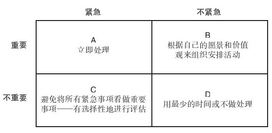

### 效果

时间管理的效率是指以较少的时间完成较多的任务，但你仍需确定这些任务是否重要，这就是效果需要解决的问题。如果时间紧迫，那么请扪心自问：“现在该如何最有效地利用时间？”为了回答这一问题，并确定重要事项（除了紧迫事项之外），你需要确定价值观及轻重缓急。个人的价值观及轻重缓急可能会与组织有所不同，但两者之间不可能完全背离。

史蒂芬·柯维在其著作《与时间有约》（First Things First）[[1]](part0040.xhtml#ch1-back)一书中，提出一种根据重要性及紧迫性来划分轻重缓急的系统。根据这两个参数，可将不同的事项归类到四个象限中，参见图2-3。既紧迫又重要的事项（象限A），可能会形成危机，应立即处理；处于象限B的事项，很重要但不紧迫，如果拖延则会引发危机，这就需要进行计划并分清轻重缓急；处于象限C的事项很紧迫但不重要，根据科维的描述，我们在处理此类事项时往往将它们看成是A的一部分。“紧急的假象容易让人误以为很重要，但事实上，这些活动即使真的重要，也只是对别人重要而已。”[[2]](part0040.xhtml#ch2-back)象限D中的事项则完全是浪费时间，所以应尽量避免，留下更多时间给其余几个象限中的事项。

图 2-3 活动轻重缓急的时间管理 

资料来源：Adapted from Stephen R.Covey,First Things First（New York：Simon＆Schuster，1994）p.37. 

就其本质来说，除了需要制定战略性产品计划之外，产品管理是一种需要没完没了地应对信息、销售支持和后续活动需求的职能。因此，产品经理必须时刻注意该如何有效地利用时间。与产品的品牌资产（brand equity）或财务业绩有关的活动是重要的，也可能是紧迫的。你需要决定这些活动是否可以划分轻重缓急，并制定进度计划（就如前文提到的），某些环节是否可以授权给其他人去做。千万不要因为没有安排好自己的时间而延误重要活动。

相关练习

评估你在时间管理方面的经验和知识，确定你的技能水平是哪一种：（1）有待提高；（2）基本胜任；（3）熟练精通；（4）出类拔萃。

效率 1 2 3 4

效果 1 2 3 4

关键要素

▶权衡取舍。

▶争取足够的资源。

▶物色和争取合适的项目人员。

▶激励团队成员。

▶克服困难。

▶确定组织和安排时间的效率原则。

▶经常扪心自问：“如何最有效地利用时间？”

[[1]](part0040.xhtml#ch1)史蒂芬·柯维在《与时间有约》附录中对时间管理的文献进行了综述，全书讲的也是时间管理。

[[2]](part0040.xhtml#ch2)参见柯维的《与时间有约》一书第38页。
