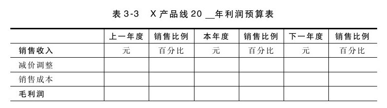
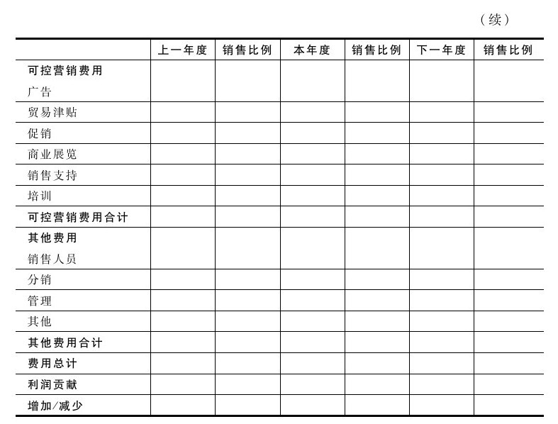
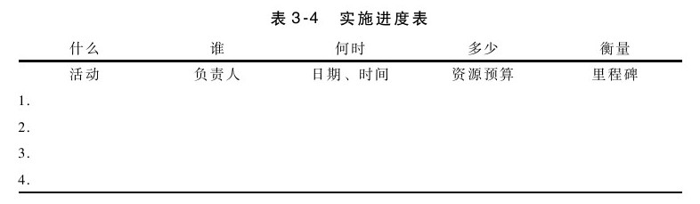

## 实施

计划的实施主要包括两个方面，即责任和沟通。战略应该与行动计划及用来衡量计划完成与否的方法相结合。有些衡量方法直接明了，如目标是增加销售额的情况即是如此。但如果目标是提高知名度或改变客户认知之类，那就只能通过调查来直接衡量（或通过销售额的改变来间接衡量）计划是否完成。

实施计划需要人力和资源。低估两者中的任何一个，计划都可能达不到预期目标。因此，计划应该包括财务预算（可能以收入或利润表的形式）和实施进度表。简单的实施计划包括名称、任务和日期。两者的示例如表3-3和表3-4所示。

对于内部员工及相关问题而言，实施进度表或许是适用的，但如果需要由销售人员负责实施，就可能没什么用处，因为这需要较强的人际交往能力和说服力，详见第1章和第9章中的相关内容。

产品经理在执行年度计划时面临一个特殊挑战，即帮助销售管理人员将营销计划转变为销售计划。这一转换需要将市场描述转换为客户概述，将总体销售目标转换为特定区域的目标，将预期的客户用途转换为销售人员据以判断“适合什么样的客户”的问题，并将营销沟通转换为销售沟通。

步骤四：实施计划

·是否已确定并获得计划中所需的资源（包括人力和财力资源），并取得相应的承诺？为了防止计划被束之高阁，必须积极推动计划的实施。

·是否与执行计划的相关人员进行了愿景沟通，并获得了认同？真正的认同要求相关人员不仅赞同愿景和战略，而且还乐于帮助实施。
