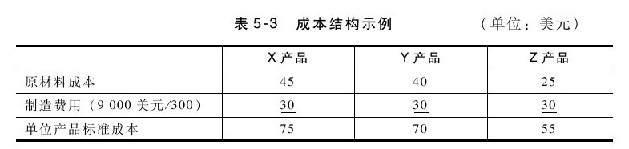
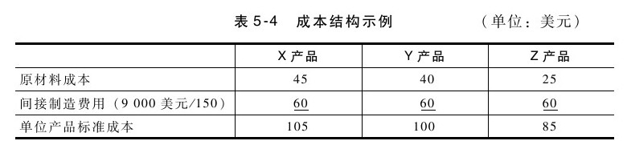
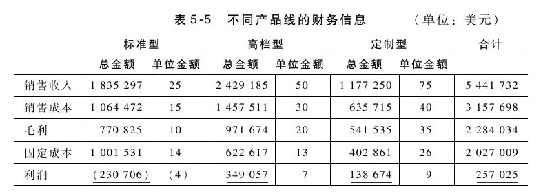
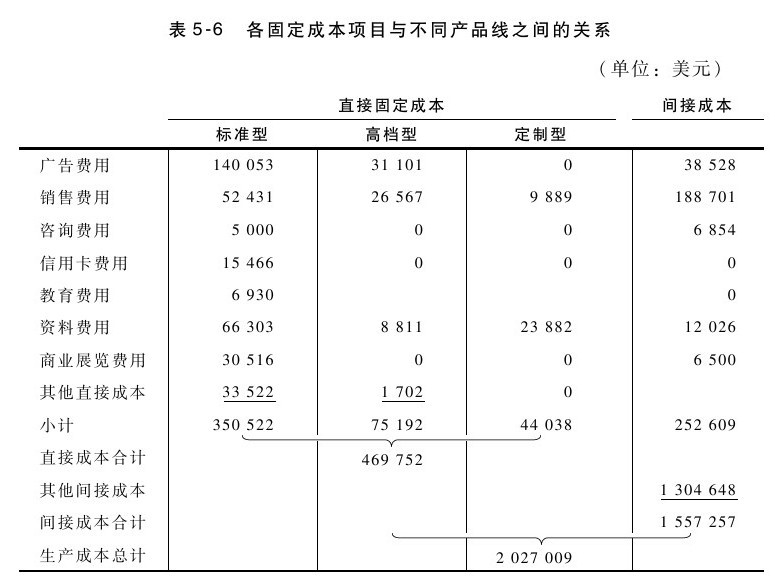
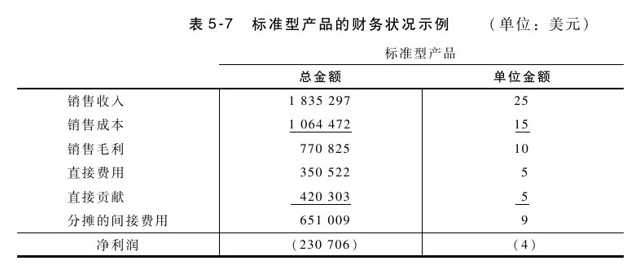
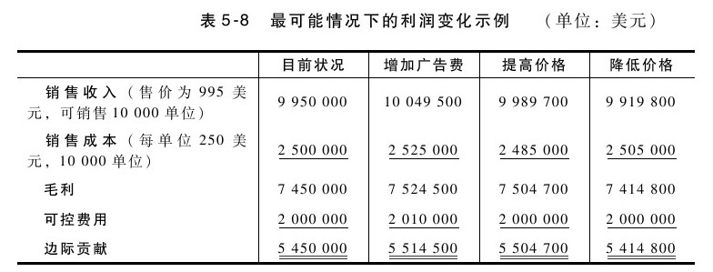

## 产品成本计算

在前面的例子中，实际平均产品成本和预算成本之间存在差异。但是，企业如何确定平均产品成本，并以此作为预算的标准成本？许多企业采用完全成本法（full costing）或吸收成本法（absorption costing），将制造费用全部分摊给产品，这符合财务报告的要求。传统的会计制度建立在完全成本法的基础上，主要用来满足投资者、信贷机构和税务部门的要求，但并不适合用来进行产品决策。这种传统方法假设：产品不仅需要承担其直接材料成本和人工成本，还需要承担与产品相关的间接制造费用。

采用完全成本法的企业有时无法明确产品、产品线或产品经理的真实贡献。随着自动化程度的不断提高和计算机的日益普及，许多企业的成本状况发生了很大的变化。随着原材料成本比重的逐步下降和固定成本比重的不断上升，不同生产水平的相对影响日趋严重。虽然产品经理需要分担企业的日常费用支出，以维持企业的正常运转，但完全成本法（不区分固定成本）影响了产品经理确定预算发生偏差的原因，从而无法采取有效的纠正措施。错误或无效的产品成本信息会影响产品决策。

产品经理需要与财务和会计部门合作，共同确定有效决策所需的产品成本信息方式。以X、Y、Z三种产品为例，每种产品的原材料单位成本分别为45美元、40美元和25美元。假设某一时段的间接制造费用为9 000美元，并根据各种产品的产量分摊这一成本。如果每种产品生产100件（共300件），那么其成本如表5-3所示。

企业存在闲置产能时，产品就要承担更多的固定成本。如果每种产品只生产50件，每件产品就要承担更多的间接制造费用，如表5-4所示。

请注意，这些产品的标准成本表明，产量较少的产品每单位多承担30美元的成本，但并没有表明可能是存在闲置产能所造成。闲置产能应视为某一时期的成本，而不是产品成本。如果单位成本随产量上下波动，就难以进行合理的定价和营销决策。有时候，此类信息还会导致所谓的“死亡漩涡”（death spiral）。为了改进利润状况，产品经理会设法提高价格，但提高价格会抑制市场需求，并引起销量和利润的进一步下滑。

为了更好地进行决策，需要区分出固定成本，可以采用直接成本法（direct costing）或作业成本法（activity-based costing,ABC）来进行分析。这些成本分配法旨在改进传统财务会计武断而随意的成本分配方式。两者都试图将成本分配给发生成本的实体（如产品、部门、事业单元等），但在不同的环境中使用，且使用了不同的方法。在理想的情况下，区分固定成本能稳定单位产品成本，并确定闲置产能。[[1]](part0065.xhtml#ch1-back)

直接的材料和人工成本显然与特定的产品生产过程直接相关。然而，还有其他与产品直接相关的成本。如果一位检验员花费一半的时间来检验某一产品，那么他一半的薪水就应纳入该产品的直接成本；如果安排一位技术支持人员专门负责某一产品，那么其所有的薪水都应纳入该产品的直接成本；又如果一家企业在某一商业展览会上均衡地推广10件产品，那么每件产品就要分担10%的总费用。

由于间接费用的提高，并由多个产品和产品经理共同承担，一些企业就会用作业成本法来补充直接成本法（完全成本法）。企业可以根据作业成本法来确定由不同的产品和产品经理引起的活动，并利用这些信息来分配这些活动的成本。例如，如果有一项重要的费用支出是营销沟通费用，而企业在推广某些产品上所花的努力明显要比其他产品多，那么如果再像前述商业展览的例子那样平均地分配所有成本，就会显得不太公平。在这种情况下，可以先计算出平均每小时所花费的营销沟通费用，然后根据各个产品实际使用的营销沟通的小时数来计算其所花的费用。（注意：如果在某一项费用支出上产品之间没有显著的差异，那么这样的分配可能是浪费时间，还不如按照直接成本法的百分比来分配成本。）

如果能够综合运用直接成本法和作业成本法，就能更好地理解产品线的成本及利润。我们也可用这一信息来评估客户和渠道成本及利润。

我们再来看一个例子，假设企业有三个产品线：标准产品线、高档产品线和定制产品线，其财务信息如表5-5所示。

请注意，如果采用完全成本分配法，标准型产品看起来是亏本的，有可能先被淘汰掉，或至少应考虑提高其价格。但在决策之前，我们显然需要对分配的制造费用进行更详细的分析。如表5-6所示的信息确定了与每种产品直接有关的固定成本项目。请注意，固定成本总额为2 027 009美元并没有改变，但采用了不同的分配方法。尽管仍需要分摊所有的成本，但这种分类方式有助于我们回答以下三个重要问题：（1）如果某类产品停止了生产，哪些成本需要消除？又有哪些成本需要转移？（2）短期定价的成本底线是多少？（3）这些成本的开支是否有助于完成既定目标，还是需要对产生这些成本的当前活动进行调整？

仔细分析表中与每一产品相关的直接成本，将为我们决定是否淘汰某一产品，还是降低产品价格以适应竞争的需要提供了更准确的数据。我们假设，如果不生产标准型产品可以消除与之相关的350 522美元直接成本，但不会减少在完全成本法下分摊到的1 001 531美元的间接成本。这两者之间的651 009美元的差额就需要重新分配给其余两种产品。如果将差额平均分配给这两种产品（各325 504美元），将导致定制型产品出现净亏损（138 674-325 504=-186 830美元），高档型产品的利润也很微薄。因此，在决定淘汰某一项产品之前，你必须明确产品承担的间接成本是完全消除了还是转移给其他产品（可能导致其盈利甚微甚至出现亏损）。尽管一开始我们以为淘汰标准型产品可以为企业节约230 706美元（在初始利润表中列示的净亏损），间接成本需要转摊给其他产品，可能导致另一产品线出现亏损。另一方面，更好地了解直接成本，有助于确定看起来盈利（基于财务会计上任意分摊成本的做法）但实际上赔本的产品。

如果保留标准型产品，就需要决定如何定价。假设竞争对手推出的竞争产品标价为23美元，那么你应降至23美元，或保持25美元，还是提高价格？这部分取决于市场对价格的敏感度，以及和竞争对手进行价格战的可能性。但无论如何，了解产品的直接成本对决策总会是有用的。表5-7列示了上述信息与单位金额。

根据表5-7的信息，标准型产品的平均直接单位成本包括销售成本（15美元）和直接费用（5美元），即每单位20美元。这就是短期内的成本底线，因此，只要单价高于20美元的，就有潜力分摊间接固定成本。如果将产品售价调至竞争对手的标价23美元，那么每一单位产品的销售就可用3美元来分摊固定成本。

前面所列三个问题中的最后一个是：“这些成本的开支是否有助于完成既定目标，还是需要对产生这些成本的当前活动进行调整？”我们来分析一下标准型产品的直接固定成本，广告费用为140 053美元。由于这是间接成本中的最大支出，因此需要分析一下，确定广告是否完成了既定目标。同样，我们也需要按照金额大小的顺序分析其他成本支出是否有效。确定哪些产品大量使用了特定的资源（如广告、机器加工时间或专业化劳动力），这是确定产品是否优化利用了资源的第一步。了解成本信息，虽然并不能替你作出决策，但在决定如何应对资源限制或竞争威胁时，能为你提供更准确有用的数据。

步骤四：确定哪些固定成本与特定产品或客户直接有关（作为产品成本计算方法的一部分）

在对产品或客户做出决策之前（尤其是合理化的改变），需要明确决策会消除哪些成本。这些特定产品或客户会带来哪些成本？[[2]](part0065.xhtml#ch2-back)

到现在为止，我们都在讨论过去的成本，但是产品决策应该关注未来。正如前面所提到的那样，即使成本是由特定产品引起的，产品经理真正需要解决的问题是这些成本是否与未来的决策有关。例如，过去决策引起的沉没成本无法改变（例如，产品重新包装的费用），而且与未来的决策通常也没有什么关系。教科书通常都会用问题和例子来解释相关成本和无关成本之间的区别。然而，在实践中，要明确相关成本信息其实是很困难的，这主要是因为我们运用了历史成本数据来预测未来成本。因此，预测一般都会存在偏差。

从成本或价格的变动来预测收入的变化，也是一种基于类似的历史数据的最佳猜测过程。假设我们为某一销售额下滑的产品制定应对计划，我们可以来比较一下三个彼此互斥的方案：（1）增加10 000美元的年度促销支出；（2）将产品价格提高10美元；（3）将产品价格调低5美元。虽然在每一种方案下我们都可以考虑最好、最坏及最可能情况下的结果，但在此我们只考虑最可能情况下的利润变化。根据经验，增加广告支出预计会提高100个单位的销售量，提高价格会减少60个单位的销售量，降低价格则会增加20个单位的销售量，相关的数据比较如表5-8所示。

在三个可供选择的方案中，与其他两个方案相比（第二方案的利润提高了54 700美元，而第三方案的利润则降低了35 200美元），相对目前情况，第一方案的利润增加得最多（64 500美元）。然而，你还需要解决其他问题。每一方案的风险如何？特别是第一方案，由于需要投资，因此需要进行深入分析：是否值得为预期的收益而进行10 000美元的投资？这些钱投资于其他项目会不会更好？我们在接下来的评估投资方案一节中将对这些问题进行探讨。

步骤五：在对产品成本分析中需要综合考虑概率和风险

在比较不同方案时，需要考虑每个方案在最好、最坏和最可能情况下的各种结果及各自发生的可能性（概率）。然后再选择未来收益最佳的方案。

[[1]](part0065.xhtml#ch1)作业成本法详见西德尼·巴克森代尔（Sidney Baxendale）的《小型企业作业成本法初探》（Activity-Based Costing for the Small Business：A Primer）一文，2001年1月发表于《企业地平线》（Business Horizons）期刊，第61~68页。

[[2]](part0065.xhtml#ch2)产品成本核算详见韦恩J.莫尔斯、詹姆斯R.戴维斯和阿尔L.哈特格雷夫斯的《管理会计：战略方法》（Management Accounting,A Strategic Approach）第2版（2000年出版）。
