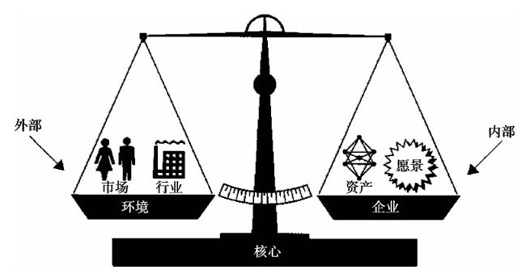

## 战略制定

制定战略的主要目的是通过对资源、资产和能力的开发与运用来获得竞争优势。制定战略需要考虑你现在在哪里（环境扫描）及你想要去哪里（战略愿景）。如果想要缩小现状和目标之间的差距，就需要有效利用资源、资产和能力，有时可能还需要调整愿景。换言之，你可能需要根据客户（市场）、竞争对手（行业）等外部现实状况，对战略愿景与内部能力进行权衡取舍。而这一内部与外部的平衡点就是企业的“核心业务”，如图7-3所示。

图 7-3 战略需要权衡与平衡 

可以通过很多方法来制定产品线战略。你可以通过扩展产品线或客户基础来优化核心业务，也可以通过各种方法来更充分地利用你所掌管的资产，还可以设法把握行业或市场的变化发展趋势。我们接下来逐一讨论这些战略制定方法。

### 优化核心业务

核心业务是指可以成为持续竞争优势来源的产品、客户和技术。请你思考下列问题：

·如果你不提供产品线，客户会受到什么损失？

·他们的需求是否容易从别处获得满足？

·对哪些客户的影响最大（即谁是你的核心客户）？

竞争优势的来源是什么？

·客户关系？

·成本？

·产品特色与性能？

·服务？

·品牌资产？

·生产过程？

竞争对手是否难以模仿你的优势？这些优势能否持久？客户能否找到替代品？

回答这些问题有助于确定核心业务。[[1]](part0076.xhtml#ch1-back)回答了这些问题之后，你还必须确定如何扩展核心业务来最好地把握新的机会。假设你是一名电动打字机的产品经理，你的核心业务是为企业用户提供沟通和信息能力，或是通过零售渠道为消费者提供机电产品。即使是同样的产品，从核心业务进行扩展的方式也不尽相同。IBM属于前者，凭借其在主机和销售渠道上的优势，成功地从打印机行业转向个人电脑行业；而雷明顿（Remington）则从打印机行业转向了电动剃须刀行业。两者都根据其核心业务的优势来进行业务扩展。请记住，采取各种战略来拓展核心业务，就是从现在所处的位置（现状）走向未来的目的地（即愿景），所选的战略应该集中于那个方向。

[[1]](part0076.xhtml#ch1)如何定义和扩展核心业务，详见克里斯·祖克（Chris Zook）的《回归核心》（Profit from the Core）一书，英文版由哈佛商学院出版社2001年出版。
