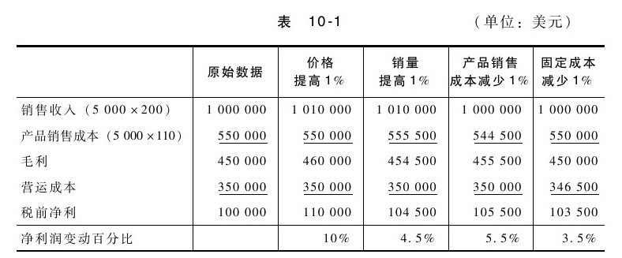

## 销售折扣

价格折扣会对利润产生重大影响。麦肯锡在一项研究中发现，位列标准普尔的1 000家企业，在其他情况不变的情况下，平均而言，1%的价格变动会引起近12%的利润变动。[[1]](part0105.xhtml#ch1-back)其实，一定百分比的价格变动对利润的影响，远大于同一百分比的销售量、变动成本或固定成本变动的影响。虽然价格变化对利润的影响百分比会因企业盈利状况的不同而异，但表10-1仍可以反映出与其他情况的相对差异：

为了促进销售，很多企业授予销售人员很大的价格折扣权限。一些企业向客户报价之前，会设定折扣范围或最低价格，如果超出这个范围则需要得到产品经理的同意。除了以上这些折扣政策，以下是一些减少折扣过度问题的策略：

·（采用类似表10-1所示的比较信息），让销售人员理解折扣造成的财务影响。

·根据销售价格或利润，为销售人员建立定额和激励机制。

·提供销售材料和相关培训，克服价格问题。

思考要点

销售折扣是否在可以接受的范围之内？

▶为了鼓励销售人员减少折扣，可以采取哪些变革措施？

▶可以提供哪些销售支持来帮助销售人员根据价值而非价格来推销产品？

[[1]](part0105.xhtml#ch1)莎拉·洛奇（Sarah Lorge）的《价格危机》（The Crisis with Prices）一文，发表于《销售和营销管理》（Sales and Marketing Management）杂志，1997年8月，第26页。
