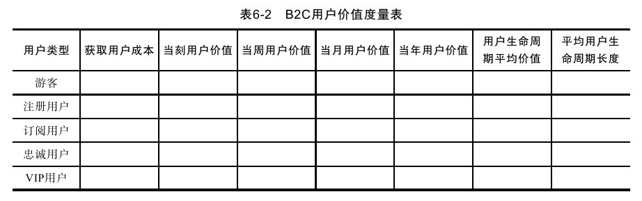
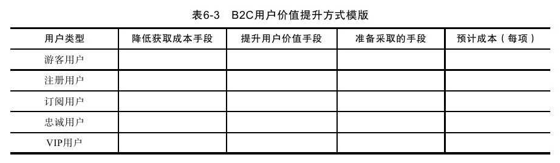

#### 6.2.2 数据挖掘与分析与运营方案设计

我身边有一些朋友喜欢高海拔攀登，他们常常和我说起攀登中发生的趣事和风险。他们之所以到现在身上依然“零件”完好不仅要感谢上天，还要归功于他们的功课做得比较充分。他们会在攀登前获得尽可能详细的天气预报，如果天气预报糟糕，那么再好的攀岩机会也必须放弃。他们也会定期检查自己的装备，包括氧气、登山设备等，如果装备有丝毫问题也需要放弃。还有就是攀登过程中他们会一直分析环境要素和自己的身体情况，如果存在问题也立即放弃。在这样的多重谨慎之下，他们才征服了一座又一座高山。

运营和高海拔攀登在某些层面上有相似之处，即使有丰富的运营经验也不能保证下一个运营项目是成功的，各种因素都可能导致运营方案失效，依靠不变的、单一技能形成的运营策略不可能持久。早些年靠大量投放廉价SEM获得成功的企业今天面对SEM的高价也只能望洋兴叹。没有能够一直有效的运营策略，只有一直有效的运营核心思想——从数据中发现机会和问题，以数据为中心建立运营方案。下面我们以电子商务运营方案为例来更深入地了解数据挖掘和数据分析与运营方案设计之间的关系。

1.运营目标设定

好的运营绩效通常是设定了合适的运营目标的结果。好的运营目标一方面要强调运营方案的系统效益，另一方面不能把运营的成功的期望建立在某一方面特别出色的基础上。好的运营目标总是综合效益的平衡展示。如果片面追求某一个数据而不注意系统的影响反而会导致相反的效果，同时如果将成功的期望建立在某一方面特别出色上则可能导致运营风险和难度同时增加。

在电子商务运营方案中，我们通常会听到几个数值指标：会员增量、各种流量指标、各种转化率指标、会员忠诚度指标、客单价指标、投放ROI指标等。当一个网站拥有较好的各种转化率时，进一步提升各种转化率的难度显然比增加商品数量、提升客单价和增加会员数等要困难得多，而且业绩效果也不见得比后者好。有的网站PV不太乐观，网站为了增加PV将商品页进行分页显示，虽然有效地增加了PV，但是可能造成转化率和成交量的下降。有的网站为了增加客户回访而大量进行EDM营销，虽然对回访率产生了一定效果，但也让部分用户产生了反感，损害了网站的整体体验。有的网站总销量不太乐观，则为了冲销量进行盲目赔本打折，最终损害了企业的利润，使整个ROI系统混乱，而企业综合业绩也停滞不前。有的网站虽然在小范围运营内成绩斐然，但是这不能说明在更大范围内也能取得同样的成绩。还有的网站虽然很多数据高于或者低于行业平均水平，但是不能认为其在这个方面的提升有很大潜力或者已经足够优秀，因为这取决于很多因素的共同影响。以上案例在很多公司依然大量存在，而且运营部门对这些不能提升整体价值的小伎俩乐此不疲，企业应该认真检讨自己的行为是否存在价值，是否在浪费时间。这也充分说明了一个观点：我们在设计运营方案时应该是一个系统性综合方案，而不应该片面关注某一数据的影响。

系统运营目标的设定应该是考虑综合效益，即从整体ROI入手。下面我们以B2C企业为例，来对建立系统ROI标准通常要考虑几个要素进行综合分析，如表6-2所示。

虽然以上用户价值模型表格对大多数电子商务公司来说相对简单，但是我们依然可以从以上表格中发现很多价值。首先我们一定要清楚一点，最大的问题可能在于你的用户正在快速流失而且你没有办法解决，可惜很多电子商务企业都不认为其为关键点，而且正在这上面吃大亏。价值公式中我们首先一定要非常清楚，顾客是有生命周期的。对于一个做皮衣的B2C网站来说，已经购买了一件皮衣的用户可能很长时间都不会再买皮衣了。其次是我们要非常清楚我们的运营核心并不在于其他因素，而是在于用户价值。在这样的基础上，我们需要知道我们通过各种手段获取用户的成本是不是远远小于这个用户整个生命周期给我们带来的价值，多长时间以后该用户带来的价值超过其获取成本。

2.运营方案设计

在以用户价值为前提的运营中，我们发现自己的思路变得非常清晰，我们可以清楚地了解到运营的核心在于两点：一方面是降低获取用户的成本；一方面是提升用户价值。接下来我们同样用一个简单的框架性表格模版说明各个关键要素（见表6-3），我们可以结合企业实际情况演绎出更多有价值的模版来。

我们发现用户在作为和不作为之间并非有巨大的鸿沟，而只需要增加必要的动力即可。在上表中，其核心思想为投放一定运营成本从而获得更大收益，具体的方式为采用各种运营手段和运营工具，重点在于ROI控制和管理。另外我们发现所有手段可以统一为一个“如果……，则……”方式的运营体系，毫无疑问这个体系将大大减小运营成本，同时更有效地提升运营效果，我们认为在这样的运营体系下提出的运营计划通常更为合理。

此外，运营并非所有方面都能考虑周全，运营的不确定性就好像是远洋航行，你能预见到一部分问题，但是你永远想不到会突然发生什么样的巨变，所以项目的稳定实施至关重要，这就取决于准备的充分程度和计划的预见性。因此，运营计划的提出至少应该包括时间性、阶段性、资源配置要素、成本、环境变化可能性、执行风险以及风险控制等，这些都应该作为整体方案的一部分提出，这样才能在不断变化的市场中依然能够有效地向前航行。
