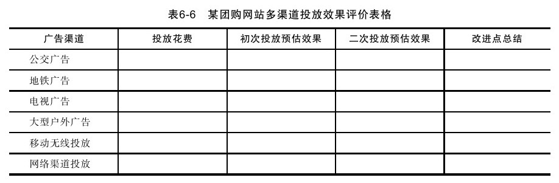

#### 6.3.3 基于数据的立体式跨渠道互动营销规划

最近一段时间跨渠道互动营销突然成为非常热门的话题，这和最近的渠道成本激烈变化不无关系，而且今后很长一段时间各个渠道成本的变化必定持续成为热门话题，开发新营销渠道或许会成为企业永恒的话题。我们专门用一节来描述立体式跨渠道互动营销，一方面是因为其确实有效，另外一方面也是因为不论是从效果测量还是从规划难度角度出发，跨渠道互动营销规划都比较困难。如何以一致的方式沟通，如何建立中央管理系统，如何以最有效的方式计划、定义、执行和分析，如何进行改进，这些都是在立体式跨渠道互动营销中需要我们重点关注的问题。

在立体式跨渠道互动营销中，我们建议中央视角以数据为基础，这就要求我们拥有一个数据中心的管理系统（如同之前章节提到的数据仓库/商业智能系统），并且能够充分理解每项数据及其变化的意义。在多种孤立渠道进行互动营销时，数据表象可能只是受到单一变量的影响，而真正实施多渠道互动营销时，数据表象则会存在交叉和叠加，因此很难将这些效果拆分，并达到对每个渠道进行独立评估的目的，而且通常跨渠道营销中很多渠道的营销效果统计非常困难（比如电视、地铁、户外广告等），这些问题将会使分析变得非常复杂，但关键是即使分析如此困难我们依然需要决策。

在跨渠道营销中，通常渠道包括电视媒体、纸媒体、网络媒体、户外媒体等，这些媒体的效果统计方式都不太一致，但从统一运营的角度来看我们依然建议采用统一的数据评估方式来管理。我们可以建立一个效果评估表，采用对照测试的思路来评价效果，表6-6所示为对照测试框架表格范例。

在以上表格中，效果投放度量可以采用对比参照系方法——在其他条件不发生改变时，将投放与不投放效果进行对比，差值即为预估效果。比如户外广告开始加入二维码的方式进行信息交互，很多公司的电视电台广告在不同时段播出时采用不同的优惠代码，不同地区的杂志单页投放夹入不同单页等，这些都是为了测量渠道效果并且将不同渠道的效果进行细分以发现营销投放价值。在采用多渠道数据测量后，我们非常容易获取营销投放的ROI数据，当然即使其中某一项已经明显超越其他项目，我们依然不建议停止关注其他渠道，因为渠道成本不断在变化，效果也在发生变化。我们不仅需要把握当前的机会，而且更重要的是把握市场下一个机会。

此外，由于不同渠道的客户沟通方式不同，多渠道营销还涉及多系统关联的问题。比如电视广告通常配合400电话，手机广告通常配合二维码和WAP地址，地铁公交电梯和大型户外广告通常配合某营销活动，LBS广告通常配合本地化营销等，这些都涉及了多系统交叉关联。面对复杂交叉的系统，我们又需要分析不同渠道用户当刻需求以提供更好的服务，比如当前在中国用户参与电梯广告时通常伴随信号问题，那么我们建议先通过短信方式与用户沟通，之后再进行电话沟通，但这些操作都需要通过CRM系统和BI系统甚至更高级的智能系统来响应，而我们在制定流程时就必须考虑到这些问题。在这些类似的、细致入微的问题上，期望通过员工主动性来解决问题通常是没有任何效果的，这就是综合系统存在的必要性之一。

总之，数据为中心的思想，是所有产品和运营之所以能够成功的关键要素。这里我们再次强调，好的产品是运营的结果，而运营必须基于数据。
