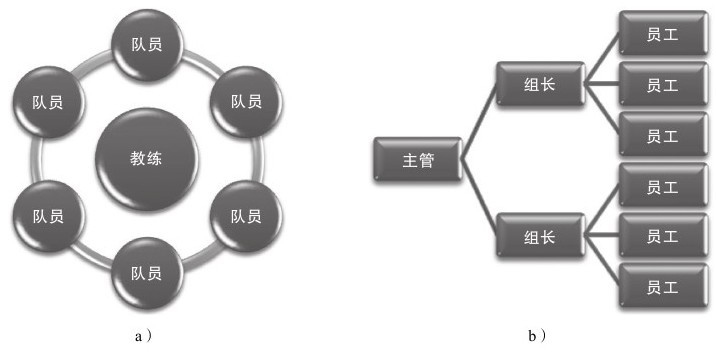

### 6.4 执行与检查

我们一直在强调数据为中心的运营体系规划是整个项目成败最重要的环节，但仅仅完成规划还不够，这离成功依然遥远，因为：一方面是系统规划本身存在复杂性；另一方面由于运营体系中涉及数据、执行、管理等多种综合性事务，既存在交叉，又跨多个领域，所以成功执行并非易事。从另一个角度来说，能否成功完成复杂项目总是团队是否专业化的标志，优秀团队总是ABC类型的——“Always be closing”。

有一个小故事，诺德和布鲁诺同时受雇于一家店铺，拿着同样的薪水。可是一段时间以后，阿诺德青云直上，而布鲁诺却仍在原地踏步。布鲁诺到老板那儿发牢骚。老板一边耐心地听着他的抱怨，一边在心里盘算着怎样向他解释清楚他和阿诺德之间的差别。

“布鲁诺，”老板说话了，“你去集市一趟，看看今天早上有什么卖的东西。”

布鲁诺从集市上回来向老板汇报说，今早集市上只有一个农民拉了一车土豆在卖。

“有多少？”老板问。

布鲁诺赶快又跑到集市上，然后回来告诉老板说一共有40袋土豆。

“价格是多少？”布鲁诺第三次跑到集市上问来了价格。

“好吧，”老板对他说，“现在请你坐在椅子上别说话，看看别人怎么说。”阿诺德很快就从集市上回来了，向老板汇报说，到现在为止，只有一个农民在卖土豆，一共40袋子，价格是多少，土豆质量很不错，他带回来一个让老板看看。这个农民一个钟头以后还会运来几箱西红柿，据他看价格非常公道。昨天他们铺子的西红柿卖得很快，库存已经不多了。他想这么便宜的西红柿老板肯定会进一些的，所以他不仅带回了一个西红柿做样品，而且把那个农民也带来了，他现在正在外面等回话呢。

此时，老板转向布鲁诺，说：“现在你知道为什么阿诺德的薪水比你高了吧？”

这则故事透视出一个简单的道理：理解是执行力的核心。很多类似运营这样需要决策和创意的工作并不适合自上而下的分配，事无巨细反而招致问题、扼杀创新。如果老板没有问布鲁诺，没有分配阿诺德跟进，那么麻烦就接踵而至了。如何把复杂的工作成功执行，即是本节的主题——执行力。

#### 6.4.1 如何提升运营的执行力

我接触过不少媒体称道的运营主管，涉及SNS、B2C、C2C、资讯网站、直复营销机构、医疗营销机构等等，他们无一不是继承了上届主管的光荣传统然后赶上比较好的时光而一不小心带领运营团队走向了成功。我一直在试图搞清楚为什么运营的成败要依靠市场突然形势大好而非在平稳市场中依然能够获得高增长？这是不是能够说明事实上运营工作并没有存在亮点？因此我终于明白为何大多数谈及运营执行的资料总是老生常谈、千篇一律，具体付诸实践则会出现诸多问题。在探索中反而一些创业即成功的企业CEO带给我非常多的灵感，这些企业甚至没有运营主管，CEO只是号召大家积极动手自主负责，比较有趣的是CEO们都提到了一点——成绩都是战友们做出来的，我什么都不懂。

问题确实出自于此，运营工作涉及非常多的内容，而平稳市场中高增长的出现需要保证多个方面存在亮点，但很少有人成为多面好手。这就需要依靠整个运营团队在每个方向上的足够专业化，从数据模型、产品杠杆、市场杠杆、财务杠杆等多个方面都有足够优秀的人才，好像一个球队一样，每个岗位都能够在一定范围内做到自由发挥，同时又能够打好小配合，而运营主管则应该更像一个教练而不是具体的执行者，团队组织形态应该类似图6-1a所示。

图 6-1 团队组织形态 

图6-1a中，教练站在团队中间，由成员负责具体事务承担部分绩效，在团队的工作仅仅是重点分工不同但需要时能够担当各种工作，比如控球后卫也需要投篮而不仅仅是控球。而图6-1b中则不仅是职责不同，而且工作中间不能越界，如果团队这样打球的话控球后卫永远没有投篮的机会即使得分近在咫尺。那么什么样的组织架构更适合呢？不言而喻，运营的目的不是为了把球打得有规有矩，而是为了得分。球员不仅要能够把自己的岗位职责做好，而且要发挥创意帮助队友获得机会，这样的比赛才足够精彩。运营团队中，教练承担策略和协调甚至组织进攻的责任，其他人围绕战术发力。此外，出色的配合要求每个人自己负责的工作部分能够发挥出色，而且熟悉其他人的工作，这样不仅仅能够很好地理解战术意图，而且在具体执行中也能够冲破牢笼，发挥创造力。

从管理的层面看，建议一切的运营工作担当都以绩效为主导。具体绩效的制定不应该以工作量为标准，而应该以工作成效为标准，这样的绩效能够激发员工的自主思考意识，这是环节成败的关键。通常执行一定伴随问题，而问题总会出现在具体的环节以及每个环节的连续上。具体的绩效担当者通常能够最快发现问题，也能够最快获得问题的解决方案，而运营主管则需要承担发现系统问题的责任。每个环节的成功以及每个环节能够很好地配合，是整个运营方案成功的关键。
