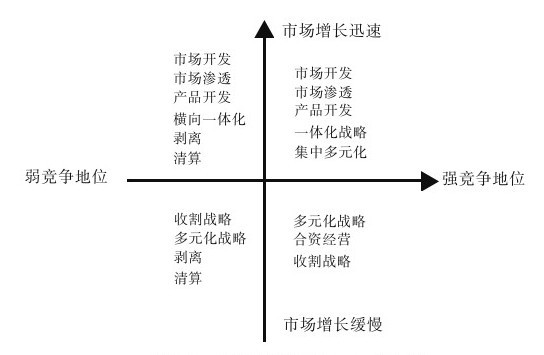

#### 8.3.3 大战略矩阵（GSM）研究方法

除SWOT矩阵、SPACE矩阵之外，为了保证战略方案设计的完整性，我们也通常用大战略矩阵（Grand Strategy Matrix, GSM）来制定备选方案。GSM矩阵模型（见图8-2）是由小汤普森与斯特里克兰根据波士顿矩阵修改而成的，它由市场增长率和企业竞争地位两个坐标组成，它通过分析市场增长率以及企业竞争地位来指导企业进行战略选择。任何一个企业都可以在GSM矩阵的四个象限中找到自己的位置。

图 8-2 《战略管理》GSM矩阵图 

位于大战略矩阵第一象限的公司处于极佳的战略地位。对于这类公司，继续集中经营于当前的市场（市场渗透和市场开发）和产品（产品开发）是适当的战略。由于业务已经建立的竞争优势，这些的公司如果大幅度偏离已建立的竞争优势是不明智的。当它们拥有过剩资源时，后向一体化、前向一体化和横向一体化可能是有效的战略。当它们过分偏重于某单一产品时，集中化多元经营战略可能会降低过于狭窄的产品线所带来的风险。同样的，因为它们有能力利用众多领域中的外部机会，必要时它们也可以冒险进取。

位于第二象限的公司需要认真地评价其当前的参与市场竞争的方法。尽管其所在产业正在增长，但它们不能有效地进行竞争。这类公司需要分析企业当前的竞争方法为何无效，企业又应如何变革而提高其竞争能力。由于它们处于高速增长产业，加强型战略（与一体化或多元化经营战略相反）通常是它们的首选战略。然而，如果企业缺乏独特的生产能力或竞争优势，横向一体化往往是理想的战略选择。为此，可考虑将战略次要地位的业务剥离或结业清算，剥离可为公司提供收购其他企业或买回股票所需要的资金。

位于第三象限的公司处于产业增长缓慢和相对竞争能力不足的双重劣势下。在确定产业正处于永久性衰退前沿的前提下，这类公司必须着手实施收割战略。首先应大幅度地减少成本或投入，另外可将资源从现有业务领域逐渐转向其他业务领域。最后便是以剥离或结业清算战略迅速撤离该产业。

位于第四象限的公司其产业增长缓慢，但却处于相对有利的竞争地位。这类公司有能力在有发展前景的领域中进行多元经营。这是因为它们具有较大的现金流量，并对资金的需求有限，有足够的能力和资源实施集中多元化或混合式多元化战略。同时，这类公司应在原产业中求得与竞争对手合作与妥协，横向合并或进行合资经营都是较好的选择。
