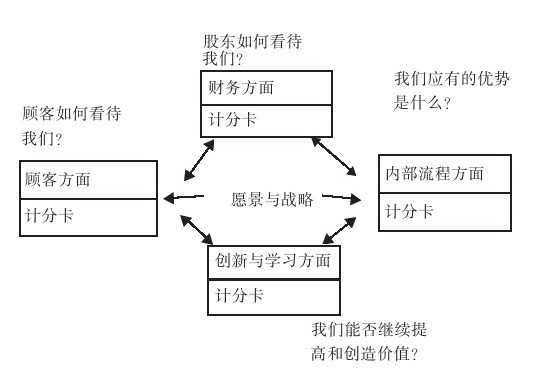

### 9.2 目标管理

目标启动未来。

“目标不是命令，目标是一种责任。目标不决定未来，目标是动员企业的资源和能量以创造未来的手段。”

——彼得·德鲁克

当我们完成了战略分析并做出初步决策以后，就可以开始制定特定的战略目标了。目标制定（goal formulation）是一个非常高频的词汇，我们经常可以从高级经理的口中听到它。菲利普·科特勒认为，大多数业务单位追求的目标都是一种组合，比如：利润率、市场份额、风险指数等，而这些目标的建立和组织又可以称为目标管理（Manages By Objectives, MBO）。

一般情况下，为了目标能够顺利进行，我们在管理战略目标时要考虑多个条件，比如层次性、精准性、客观性、协调性等等。具体来看，比如：

·层次性。将各个小目标按照需求的优先等级进行排序，突出其层次感，这是目标管理的重要任务之一。

·精确性。目标应该尽可能用数量表示，使用数字可以增加你的方案的正确性的广泛性。

·客观性。目标定位应该现实。

·协调性。各个目标之间应该相互保持一致，这样可以保证目标的方向是合理而统一的。

亚瑟·D·利特尔认为：“对管理者的物质和精神建立，很大程度上必须坚持以长期目标和战略为基础。”目标的清晰化不仅仅为企业战略设计指明方向，更重要的是还帮助目标相关负责人了解他们各自在企业中的责任，明确了企业中工作的优先顺序，并衍生出一系列绩效考核标准，以激励员工努力工作。

通常，战略目标并不等同于计划，战略目标管理为战略制定指明方向，是产品规划的一个非常重要的环节。一般情况下，战略目标管理内容包括：资产增长、销售增长、赢利性、市场份额、多元化经营的程度和性质、纵向一体化的程度和性质等。

战略目标在这个方面又非常类同于财务目标，比如：收入的增长、利润的增长、较高的股息、较大的利润率、较大的投资回报、较高的每股收益、改善现金流转等，这直接决定了商业竞争地位和商业生态链位置。

弗雷德·R·大卫认为：“维持竞争优势的最好办法是紧紧握住比对手更具优势的战略目标。如果首先将注意力集中在提升公司竞争能力和市场优势上面，以达到战略目标，那么财务目标就能很容易实现。”

1993年，为了进行战略评估和控制，哈佛商学院教授罗伯特·卡普兰和戴维·诺顿最早提出了平衡计分卡。直到今天，平衡计分卡仍然在不断改进，越来越多的公司开始使用它来解决实际问题。

平衡计分卡是进行战略性评估、控制和管理的最好的工具之一。有效的平衡计分卡管理系统包含使用于公司自身的财务目标和战略目标的谨慎组合，它的整体目标是平衡股东、顾客和业务之间的目标，它是不断提高管理水平和整体质量的管理方式。

弗雷德·R·大卫认为，平衡计分卡主要为下面几个问题寻找答案，并利用这些信息进行充分而有效的战略评价。

·在改革、技术领导、产品质量、运营过程等方面，企业不断改善并创造价值的成效如何？

·公司保持和改善其核心竞争力和竞争优势的成效如何？

·企业和用户的满意度如何？

·顾客

·管理者、职员

·运营、程序

·团体、社会责任

·商业道德、自然环境

·财务状况

如图9-1所示，企业在评价时主要考察6个关键问题：使用平衡计分卡进行战略评价的目的在于平衡长期问题与短期问题、财务问题和非财务问题以及内部问题与外部问题。根据不同公司的特质，一般需要编制不同的计分卡来评估公司在定性和定量基础上的战略。

图 9-1 平衡计分卡图 
