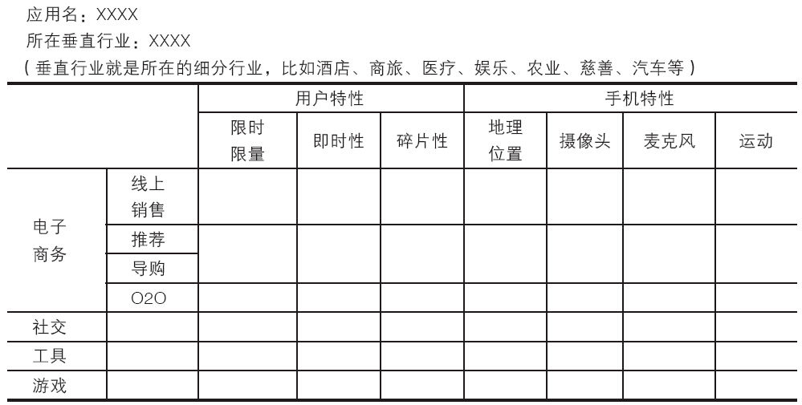

### 2.2.2 互联网的现在——移动互联网时代

随着技术的革新、互联网商业的不断进步、用户思维的不断进化，毫无疑问，我们已来到了移动互联网时代。互联网用户早已不再受家庭、办公室、传统媒体及零售的限制，现在使用手机或移动设备，他们只要动动手指即可随时随地满足自己的需求。他们用手机接收新闻、看电视、阅读、听音乐、搜索商品或服务，总之，他们希望自己的需求随时随地、此时此刻被满足。

中国移动互联网生态系统包含的角色分别是：通讯运营商、设备制造商、以IOS或Android为主导的移动操作系统厂商、PC互联网及移动互联网企业。对于互联网产品经理来说，预测移动互联网的发展走向和行业格局，现在断言还为时尚早，不过，我们可以对当前移动互联网的产业环境做个简单分析，再结合移动端产品的几个特点，来简单分析下移动互联网产品可能要面对的机会和挑战，为互联网经理们提供一个参考和借鉴。

1.移动互联网产业环境

我们知道，移动互联网正逐渐渗透到我们生活、工作、学习中的各个领域，丰富的移动互联网应用迅猛发展，正深刻改变信息时代的社会生活。手机已经成为中国网民第一大上网终端。在移动互联网被普遍看好的今天，大量创业者、互联网从业者甚至是传统领域的公司都在积极进入。因此，互联网的移动化特点已经非常明显，体现在用户的移动化、终端的移动化、应用的移动化、流量的移动化、收入的移动化、互联网企业战略的移动化等方面。

随着中国PC互联网用户即将完成向移动互联网的迁移，中国智能手机终端市场规模的不断扩大，移动互联网收入规模的持续扩大。目前的移动互联网产业环境是：娱乐应用占据主导地位，商务应用处于萌芽期。这里的商务应用包含两部分：一是直接面向消费者的应用或服务，包括移动支付、二维码、本地生活信息服务、移动电子商务等；二是面向政府或企业的移动应用。目前中国移动互联网正处于娱乐应用和商务应用并行阶段。过去几年，中国移动互联网处于萌芽阶段，受制于网速、网络资费及移动终端等因素，加之电信运营商主导的封闭产业链，应用/服务提供商主要作为SP为用户提供彩铃、壁纸等基础性应用。但是随着产业链的不断开放，移动终端、网络、资费、应用等不断改善与丰富，用户的移动应用或服务的需求不断得到满足。

娱乐至上依然是当前中国互联网及移动互联网的主要特征，为此，娱乐和社交应用成为主导移动互联网市场的主要力量之一。游戏、视频及即时通讯是主要的娱乐应用，社交应用也逐渐呈现娱乐化趋势。移动互联网的中国娱乐应用已经成为一种沟通方式，工具型应用也呈现出娱乐化发展。

不过，随着用户对手机依赖程度的不断提高，移动互联网的应用产品正在从即时通讯、手机安全、网页浏览等基础型应用向贴近用户生活服务的方向转变，如大众点评、丁丁生活等与生活紧密相关的实用型移动互联网产品。

2.移动端产品典型特征

对于产品经理来说，深入了解移动互联网产品的特点有助于我们更好地设计移动端产品，笔者对此总结了以下一些典型特征。

（1）用户绑定

移动终端不同于PC，某一台移动终端是和某个人强关联的，一台移动设备就代表了一个人。这一特征可以极大简化互联网应用中用户身份的识别过程。这一方面，直接催生了众多基于用户信息的信息识别类应用和信息交互类应用；另一方面，也为几乎所有的移动互联网应用提供了识别用户、精确营销的可靠基石。

所以面向移动互联网用户的精准营销、数据分析等互联网工具具有极大的可操作性空间。当然正因为这种近乎实名制的特点，使得移动互联网用户对其隐私的顾虑，相对于PC也会大大提高。

（2）基于LBS的定位功能

移动网络可以随时随地获取终端位置信息，而位置信息几乎可以和互联网的任何领域结合，从而为移动互联网带来丰富多彩的创新型应用。随着当前位置服务应用的不断普及以及定位技术、地图服务接口的进一步开放和完善，位置服务正逐渐成为移动互联网应用的“标配”。我们可以看到，“位置”已不是“位置服务”的唯一服务内容，而更多的是将位置信息作为生成服务的输入性关键因素；这些位置服务应用大都超越了单纯位置导航的应用范畴，围绕大众信息服务的需求，涉及大众生活的方方面面。比如本地生活类服务电商、今夜酒店特价等App就是结合了移动终端的定位而推出的具有典型移动特色的互联网产品。

（3）时间碎片化

我们知道，移动便捷性及随时随地的使用性，是移动互联网较之于传统互联网的最大优势。与PC用户成段时间上网不同，移动端的用户随时随地、插空即用的需求已经使移动游戏、移动阅读、天气预报、移动支付等移动互联网产品得到了大面积的推广。碎片化时间的特点，对于移动互联网来说将是一个新的商业机遇。

（4）便捷收费

互联网从诞生开始，所有应用和内容提供者的商业模式都将面临着一个需要突破的“瓶颈”，即找到一个方便、快捷、安全的货币支付平台（当年的8848很大程度上倒在了这个“关卡”）。在电子银行已经普及的今天，由于移动终端随时随地的便捷性以及高普及率，移动支付已成为解决微支付的最佳选择，从而在一个全新的互联网维度上拓展现有的金融服务。而便捷收费特性也为移动互联网带来了更多的商业机遇（想一想现在能变现的移动端产品还有几个没有提供移动支付功能）。

（5）有限的展示空间

即使是大屏幕手机，移动端所能展现出来的信息也远远少于PC端，信息下载速度也远不及PC端。在这样的背景下，移动互联网产品需要注意减少移动用户对信息和服务的获取成本、缩短用户的操作路径等。这是产品经理在设计移动端产品时要特别注意的一点。

（6）流量入口和App

PC端主要是由几大互联网巨头把持流量，大多数互联网产品的网络推广费用都集中在流量购买方面。移动端目前并没有显示出像百度在PC端那样的垄断式流量入口。用户在苹果商店、安卓市场下载需要的App，是一次性的行为，日后自行点击，不再需要依赖导航功能。不过，这里的另一个挑战是，移动端的用户在每个细分领域只愿意保留少数几个（通常不超过3个）同类产品的App，让移动用户选择你的App是互联网产品经理在做移动App时所要重点思考的问题之一。

当然，周翔先生所著《决战移动电商》一书中对移动互联网产品特性的分析值得借鉴，我们在此引用过来为大家做下介绍。

分析移动互联网我们要从整个移动互联网来看。我发现了不同垂直行业的不同应用类型和不同移动特征（见表2-1），通过这三个维度我们可以建立一个移动互联网模式的模型，这不仅可以帮助我们清楚描述每一个移动互联网应用的模式，更可以帮助我们发现潜在的新移动互联网模式，以及现有模式可以突破创新的地方。

表2-1 移动互联网应用模型

对上表中各个特性解释如下：

1）限时限量：限时限量是一种营销方法，在移动上特别有效，因为限时限量了，用户不能始终在电脑前等着抢购，对用户来说是最方便的、首选的方式，是通过手机参加的活动。限时限量特征最典型的就是唯品会上的闪购模式，还有今夜酒店特价的剩余房间销售模式。纯线上销售的电商在移动电商上几乎是完全围绕这个核心展开的。

2）即时性：即时性是指用户的需求是突发的，并且希望可以立刻得到满足。比如车抛锚了要找拖车，吃饭喝酒了要找代驾，出门要打车，肚子饿了要找地方吃饭，突然想到一组号码想买彩票。

3）碎片性：碎片性是指让用户可以在非常零散的、很短的时间内完成交互或使用，满足用户打发这些碎片时间的需求。典型的碎片时间是等车、等上菜、等人、上厕所这样的很短又很无聊的时间。

4）地理位置：借助手机可以通过手机信息定位用户当前所在的地理位置，甚至通过Wi-Fi信号定位用户所在室内位置，帮助用户在物理世界中定位。

5）摄像头：借助手机的摄像头，可以知道用户当前摄像头对准的物体是什么，通过光学识别，识别出这个物体的信息，从而得知手机用户当前的意图和需求。

6）麦克风：借助手机麦克风，可以听到物理世界里的声音，有些技术甚至使用音频与其他设备传递数据。

7）运动：借助手机可以感应运动加速度，可以知道用户当前是否在运动，是否在摇动手机，甚至于精确到手势、运动距离等。

3.移动端产品发展趋势

美国著名风投专家约翰·杜尔在2011年第一次提出了“SoLoMo”的概念，即将Social（社交化）、Local（本地化）、Mobile（移动化）整合到一起。此后SoLoMo被业内人士一致认为是移动互联网未来发展的趋势。

其实具备SoLoMo特性的移动端产品只是我们所熟知的各互联网产品的“加强版”，即集众多产品的特性优势于一身。我们如果把社交化、本地化、移动化这三个特性分别拆开来看，“源头”产品都是我们再熟悉不过的了：So是以新浪微博、人人网为代表的社交化应用；Lo是以大众点评、切客为代表的基于位置的各种服务（LBS）；Mo是基于手机移动特性所衍生出来的各种移动互联网应用。

当然，与其说SoLoMo开启了移动互联网新时代，不如说这一概念绝佳地归纳了试图从不同领域抢占本地化移动互联网社区的三大主力。不过目前，大多数移动互联网应用只是满足了其中的两个特性，具有SoLoMo特性的产品还很少，这对我们的产品经理来说是存在着的巨大挑战与机遇的。
