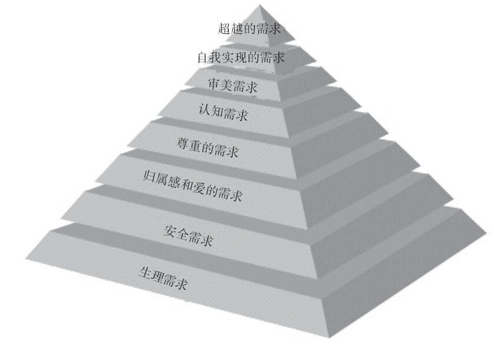

### 4.1.2 延伸到马斯洛需求

我们都知道互联网产品的市场就是由一个又一个用户及他们的一个又一个需求所组成的，产品要获得成功必须要精准地满足人的需求。“洞察人性”是每个产品经理的必修课。因此产品经理分析需求时，应把大部分的时间和精力都投入到对“人”的了解上。我们需要敏锐地察觉到用户最真实的期望、冲动、急躁、焦虑，理解他们为什么是那么的不可理喻、满腔怒火、焦虑苦恼。我们尤其需要搞清楚：用户的目的到底是什么？他们到底需要什么？又讨厌什么？

幸运的是，美国心理学家马斯洛提出的人类的层次需求理论为我们提供了充分了解人性的依据，最初他把人的需求分为5个层次，后来在此基础上又补充了3个层次，如图4-1所示。

由上图可知，需求层次理论由低到高依次是：

第1层，生理需求：人类需求中最重要的需求，是对食物、水分、空气、睡眠、性的需求。那么，用户也就有吃、喝及性方面的基本需求。

第2层，安全需求：对稳定、安全、秩序的需求，是人们渴望摆脱恐惧和焦虑的期望表现。那么，每个用户也就都需要安全感。

图4-1 扩展后的马斯洛层次需求理论

第3层，归属感和爱的需求：人们不愿被孤立，希望与他人建立情感，有爱与被爱的愿望。那么，用户都有主动去爱、去照顾、去宠爱他人或者动物的需求。

第4层，尊重的需求：人们需要拥有自信，希望获得他人的认同和尊重，希望自身的价值得到肯定。那么，每个用户都希望自己与众不同，用户有不断地得到自己是有用的、有价值的、比别人都好的认可的需求。

第5层，认知需求：人们对满足知识和好奇心的需求。那么，用户都有“猎奇”的心理。

第6层，审美需求：人们对美感和艺术的需求。用户希望产品能够取悦心灵，这就使得我们的产品最好做到界面美观、独特、有意思，要符合用户“审美的需求”。

第7层，自我实现的需求：人们需要实现自己的目标，并不断完善自我，让生命更具有价值和意义。那么，用户都有顺着社会阶梯往上爬的欲望。

第8层，超越的需求：人们对探索世界和宇宙的精神需求。比如，网络游戏中的一些高级用户很喜欢游戏的“探索性”玩法。

马斯洛层次需求理论可以帮助产品经理更深入地了解人性。比如，对于一个处在温饱边缘的已婚女人来说，她更希望看到自己的老公去菜市场给她买棵小青菜，这是她最基本的生理需求——对食物的需求。至于对上街买漂亮衣服、买个高档化妆品的需求远远没有那么强烈，因为这是她的更高级需求。也就是说，人只有在满足了衣食住行基本生理需求后，才会去考虑更高层的需求，也就说先满足客观的需求再满足主观的需求。这有些类似于我们中学时代学到的一条规律：“经济基础决定上层建筑”。古语“仓廪实而知礼节，衣食足而知荣辱”，也是对马斯洛层次需求理论最恰当的描述。

通过马斯洛层次需求理论我们知道，用户除了希望吃饱穿暖外，还在孜孜不断地寻找安全感，千方百计地寻求别人的关爱（不了解这点，产品经理就不会意识到用户在写一条微博、发一条微信状态时，其心理需求就是为了得到别人的关注），渴望得到他人的尊重（有些互联网产品提供徽章、荣誉等功能，就是为了满足这个需求），让自己不断靠近完美（产品经理可以为用户提供一些增值服务以此来帮助用户完善自身的形象），希望自我价值得到认可（产品经理可以为用户设计一些能更好地帮助用户的功能）。因此我们说，分析互联网产品需求时，一定要分析马斯洛需求。可以肯定地说，所有的互联网产品需求都可以延伸至对应的马斯洛需求。

让我们来看一个做产品的例子。同样是卖服装，国内品牌美特斯邦威与国际知名品牌Prada的服装价格相差几十倍甚至几百倍，为什么？因为美特斯邦威只提供了用户温暖与舒适的需求（马斯洛层次需求理论最下面一层），而Prada除了满足这一需求外，还满足了用户尊贵的身份（尊重的需要）、迷人的外表（审美需要，第六层）、个性的释放（自我实现的需要，第七层）。看！同样是服装这个产品，你只满足了用户一个层级的需要，人家却满足了用户四五个层级的需要，难怪人家的定价是你的上百倍。所以说，用户要买的不是你的产品，而是解决方案。就像用户需要的是洞，而非锤子，但用户需要通过购买锤子这个产品（即解决方案）来实现需求（即敲出来洞）。其实，产品经理做出来的产品价值完全不取决于你提供了哪些功能，而取决于你满足了用户的马斯洛层次需求理论中的哪些需求，满足得越多，你的产品越值钱！

再比如，用户有与他人建立情感、感受爱与被爱的需求，也就是想要实现马斯洛第三层的需求“归属感和爱的需求”，那么怎么实现呢？用户可通过“我想告诉你件事儿”这个需求来实现。当然，需求要依据某个产品（即解决方案）才能解决，用户有的会用固定电话、有的用手机短信、有的用手机电话、有的写封信、有的用QQ、有的用微信。这说明同样是马斯洛需求，同样是“我想告诉你件事儿”这个用户需求，用户使用的解决方案是不一样的。但是我们在设计产品、提供解决方案时，一定要认识清楚产品需求与用户需求、马斯洛需求的差别，要做到追根溯源。
