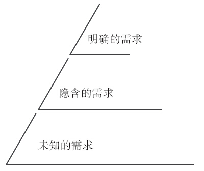
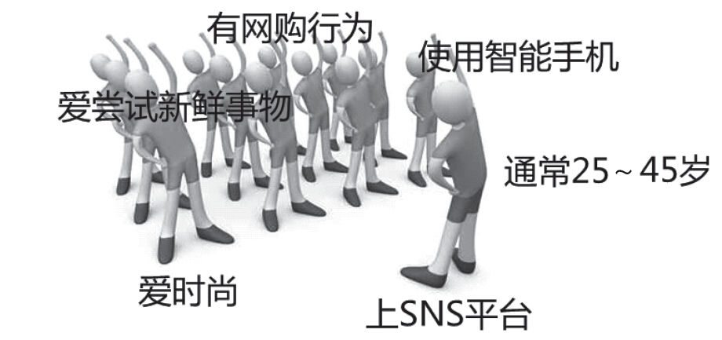

## 4.2 准确找到需求

### 4.2.1 获取需求

对于产品经理来说，获取需求分析的素材是做产品必不可少的一步。日常工作中，获取需求素材的方法主要有用户访谈、问卷调研、网络上逛论坛收集信息、收集用户的使用日记、数据分析、在实际场景观察用户（拜访现有用户和潜在用户是产品经理最重要的工作内容之一）、产品经理把自己当成用户等，关于搜集需求素材方面本书不做重点探讨。不过，为了让产品经理切实提高“准确找到需求”的能力，笔者想从“需求的冰山模型”、“用户调研的注意点”、“充分考虑应用场景”、“从用户痛点入手”这四个方面介绍一些需求分析的方法及技巧。

1.用户的需求像座冰山

作为产品经理，需要去认真倾听用户的声音，但是我们也知道，真正了解用户的需求并不是一件容易的事情。由于知识领域的差距，用户能告诉你的东西很有限，甚至有的时候，用户不会说出自己真实的欲望和动机。比如，用户不会告诉你“我买宝马的原因是想让邻居们羡慕、嫉妒、恨”。而在一些情况下，尤其是涉及比较专业的技术领域时，用户自己也不知道他们需要的究竟是什么，或者无法用语言清晰地表达出来。此外，用户对解决方案的期许也是不断变化的，可能用户在与你交谈时，你若立即拿出A产品他会很满意，但是1年后用户对新推出的A产品并不满意，他满意的解决方案变成了B产品。这就是为什么优秀的产品经理在与用户对话之外，还会通过大量的观察来得出自己的结论，尤其会着重注意到用户所说的话与他们的实际行为之间存在的差异。

接下来我们为读者介绍“需求的冰山”这一概念。我们都知道，冰山浮出水面的部分只是整个冰山很小的一部分。所谓“需求的冰山”就是说用户的需求像一座冰山，这座“需求冰山”共有3层（见图4-2）：

1）明确的需求，指用户能清晰、具体地表达出的目标、期望和愿望。明确的需求是冰山浮出水面的一角，也是我们在了解用户需求中最容易看到的部分。

图4-2 需求的冰山（简图）

2）隐含的需求，指用户只是知道目前存在的问题、困难或对现有产品的不满，但并不明确自己的需求到底是什么。

3）未知的需求，这是冰山最深处，指用户没有意识到问题、困难或对现有产品也没什么不满，即不了解需要什么。

“需求的冰山”模型对于产品经理来说意义是：如果产品仅停留在用户明确的需求层面，就会导致产品同质化，最后陷入价格战，因为用户明确的需求也很容易被竞争对手掌握。

因此，谁最先识别出用户的隐含需求，并把此需求转化成产品，谁就最有可能最大限度地让用户满意，并收获到用户的忠诚。可以说，用户的隐含需求是产品差异化的源头。

对于用户未知的需求则需要企业及产品经理去教育、引导和激发用户。一些创新型企业非常重视对用户需求的教育和激发。比如，全球最大的半导体公司英特尔前总裁格鲁夫说过：“用户不一定知道他们真正的需求，我们得影响他们、教育他们、引领需求”。乔布斯更有句经典名言：“平庸的公司满足需求，伟大的公司引领需求！”这里需要特别指出的是，即使是引领需求，也属于满足用户的需求（而非创造）。

2.“问其话、察其言，观其行”

用户调研是产品经理在日常工作中的重点内容之一。很多时候，产品经理需要通过“问其话、察其言、观其行”这种“多管齐下”的方式来帮助分析需求。所谓“问其话”就是通过各种提问来了解用户的需求。很多时候，用户对产品的期望是多方面的，甚至是变化的，这就需要产品经理通过增加与用户的沟通互动来引导整个调研过程，尤其是对用户反馈出来的原因及背景多问几个为什么。

“察其言”是通过倾听用户的谈话来了解用户的需求。我们前面介绍了“需求的冰山”，需求可以分为明确的需求、隐含的需求和未知的需求。对于明确的需求，这个很好识别和把握。对于隐含的需求，我们把注意点着重放在用户反馈的问题、困难或痛点上就可以了，而不需要特别在意用户给出的解决方案或用户认为应该提供什么功能。对于未知的需求，这个很难通过调研来得出，但却可以在与用户沟通的过程中得出一些产品需求的灵感。不过，未知的需求更多的是需要产品经理根据对行业的理解，去洞察行业及市场趋势，从而给出超出用户预期的功能或解决方案。

“观其行”是通过观察用户的非言语行为了解他的需求，最好是身临其境地了解用户的工作及生活状态。也就是说，更多地看他怎么做，而不是仅听他怎么说。一个很经典的例子是，索尼为了推出新型的随身听产品特意将用户找来做沟通调研，调研人员问用户“喜欢黄色的外观还是黑色的外观”，结果大多数用户都说“黄色的很酷”。但在临近结束时调研人员让用户随便选择一款产品作为礼物，几乎所有的用户都选择了偏于保守的黑色产品。从这个例子我们可以看出，很多时候用户都是“说一套、做一套”，太多时候连产品经理都不知道用户到底需要什么喜欢什么，用户自己也是。

此外，为了更有效地“贴近”用户，我们在用户调研时一定要告诉自己：用户永远是对的。许多用户提出的需求，在经过产品经理的人为过滤后，往往立刻会被打上“不可能”、“难实现”、“用户错了”等标签，这种做法是非常不可取的。我们要意识到，不要轻易否定用户的需求、不要在调研的现场告诉或暗示用户“他的想法是错误的”，这会大大挫伤用户反馈的积极性。当然，我们也知道，产品经理永远无法满足所有用户的需求，如果在调研过程中遇到两个截然相反的用户需求，我们该如何处理呢？

对此，我们要重点调研用户遇到的问题，而不是用户解决问题的方法（用户提供的解决问题的方法只作参考用）。在我们做调研时，用户往往会把他认为正确的解决问题的方法告诉你，而很少把他遇到的问题告诉你。相似的问题，可能甲用户告诉你是A方法，乙用户则告诉你是B方法。对于产品经理来说，这些都不重要，重要的是要找出背后隐藏的、用户共同遇到的问题。一般来说，用户的问题都是千篇一律的，共性的问题居多。当我们无法满足所有用户时，我们就分析问题的原因，满足大多数用户的需求即可。要注意：个性化的需求不是产品需求，尤其是在产品的前期或中期！

3.在“他”身边，为“他”设计

用户是产品的衣食父母，也是产品经理的衣食父母，在需求处理过程中，我们一定不要把“产品经理的需求”作为“用户的需求”，这是非常危险和不可取的。产品经理如果不关注用户需求，只热衷于自己的想法，不管你提供的产品多么前卫、酷炫，也都必然会失败。如何才能够准确获取用户需求呢？这里我们推荐一个思路：在“他”身边，为“他”设计。

具体解释就是：产品经理一定要深入到用户的真实生活与工作中去，在与用户沟通调研的过程中加入很多“接触点”，以便与用户建立共同的生活及工作方式，把自己当成是用户生活和工作关系中的一分子，而不仅仅是碰一两次头做完调查问卷就完事了。这样做的回报是巨大的，我们以诺基亚1100手机为例来加以说明。诺基亚1100这款手机允许存储多套通讯录，允许用户为某次通话设置话费限制，内置手电、收音机、闹钟，屏幕可显示80多种语言，还可以帮助不识字的用户辨识图形标志，这一系列功能切实地满足了亚洲、美洲、非洲等落后地区（尤其是农村）多个用户共用一部手机及用户识字程度不高等现实场景。凭借着对用户应用场景的细致分析，诺基亚1100成为诺基亚历史上最畅销的机型。这一成功的事实告诉我们，获取及分析需求时，应充分结合用户使用产品时的应用场景。

所以我们在日常工作中对用户应用场景的揣摩能力就显得非常重要。明白产品怎么解决用户的问题，哪怕是一个细节的改变，也可能会带来完全不同的结果。我们以诞生之初的QQ击败它的“爸爸”ICQ为例，来说明基于应用场景的细节来挖掘产品需求的重要性。ICQ当初是将用户资料、好友关系等数据都保存在客户端本地即电脑上，但在2000年前后的中国，想要有台个人电脑是件很奢侈的事情，大多数互联网用户上网都是选择网吧，一旦换台电脑，所有的好友都会消失，这样用户聊天就没有连续性，社交关系难以很好地维系。而QQ基于中国互联网用户的上网环境特点，使得用户所有的好友资料都保存到服务器上，这样与每个好友的交流都具有连续性，从而为QQ用户在QQ上与好友建立长期关系提供了基础保障。

关于如何站在用户的角度来分析需求，还有一个强有力的分析工具——创建可信并且有用的人物角色。人物角色对产品需求分析工作是非常有帮助的：人物角色可以帮助筛选重要的产品功能，比如我们的目标用户是张三，性别男，那么针对李四（性别女）的功能就要被剔除；人物角色可以提醒产品经理，不是为自己分析需求而是为眼前的这个“他”；有了人物角色可以方便地向产品团队其他人描述我们的目标用户是谁，他们有什么特点，怎么样使用产品，他们关心产品的哪些方面等等；有了人物角色，还可以为解决后续需求实现中遇到的困难提供有效的依据。

几乎每个互联网产品经理都知道创建人物角色这一分析工具，但现实工作中限于时间紧迫等原因，很多时候产品经理并不这样做。笔者结合工作中的体会认为如果时间紧迫，创建人物角色时只要重点关注使用者（即用户）特征、动机及他的现实需要就可以了。下面是笔者曾经设计的导购屏项目的简化版人物角色，为读者提供参考。

使用者和用户原型（简化的人物角色）

（1）用户类型

用户类型A动机：逛街、上实体零售门店真实体验、挑选及购买商品的目标顾客。

用户类型B动机：追求时尚潮流、乐于接触新鲜事物、乐于分享信息的潜在顾客。

用户类型C动机：在网上（SNS平台）获取购物信息的潜在顾客。

（2）原型特征

典型的用户特征如图4-3所示。

（3）现实需要

对用户而言：

1）用户需要基于本地化商家便捷和优惠购物的服务资讯。

2）用户需要触手可及且充满惊喜和趣味的时尚购物生活。

图4-3 典型用户特征示意图

4.因为痛，所以需求

获取需求还可以从用户的“痛点”入手。所谓“痛点”，就是用户痛苦的点，也就是用户为了满足某个需求所付出的巨大成本。它比一般的需求点更甚，它难以被一般产品满足，或者难以被一般的产品很好地满足。但用户的痛点一直都在，不论这个痛是可见的“痛”，还是说不出来或难以言说的痛。痛点分两种：一种是可见的痛点，也就是用户的抱怨；二是用户说不出来的痛点。

而解决用户的痛点就是产品的价值所在，很多成功的互联网产品都是解决了某个或多个用户的“痛点”。比如，2013年开始兴起的360随身Wi-Fi就是这样的一款产品。在这款产品出现之前，苹果系统、iPhone手机、Android手机都是可以比较随便地设置成为无线热点。也就是说，只要这些设备能上网，它就能变成一个无线热点，能发射无线信号，让别的设备连到这个无线热点上，共享上网。但在Windows系统中，这其实是一个技术活，技术人员可以安装一个Connectify的软件来做这件事，但对普通用户来说，他们没有那么专业，即使有，也不愿意那么麻烦地去做，这个应用场景就是一件很痛苦的事情。于是360随身Wi-Fi就将这个做得像插U盘一样简单。比如在宾馆出差，笔记本插上有线网络，再插入360随身Wi-Fi，这台电脑就可以为其他的设备如智能手机、平板电脑提供无线上网服务，大大简化了操作步骤，轻松解决了用户的痛点。

关于如何准确找到用户的“痛点”，常用的方法有两种：一种是依托数据分析，产品经理可以设置一些产品的运营指标，再依据运营结果对产品进行分析，得出用户的“痛点”，进而解决用户的问题。另外一种则是通过分析用户的应用场景来寻找用户的痛点。此外，在用户说不出来的痛点中，有的属于“不怎么痛的”，针对这样的痛点，产品经理还是应该从自身对行业的理解去洞察一些需求，并给出相应的解决方案。当然，针对这类“不怎么痛的”痛点的需求分析方法，其技术含量比较高，限于篇幅，我们在此不做详细探讨。
