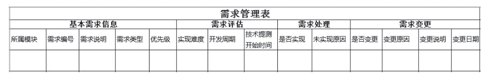

### 4.3.2 列出需求矩阵表

在对需求的优先级进行划分后，在需求正式投入开发前，产品经理通常会面临这样的问题：假设现在手里有100个需求，在这100个需求里，哪个适合现在做？哪个适合将来做？现在实现的需求里，哪个可以先做？哪个可以后做？哪个可行？哪个不可行？哪个风险高？哪个风险低？哪个开发量大？哪个开发量小？这时候我们就需要使用需求矩阵表对需求进行管理、进行综合评定。

关于需求管理的表格市面上的非常多，有的表格元素非常多，常常一条需求对应三四十项内容。但在笔者看来，表格工具是为人服务的，是为了更好地管理需求而服务的，最适合的需求管理表才是最好的。不过有一个原则却是通用的，那就是：用最少的工作量反应尽可能多的需求管理信息。因此，这里帮大家精选了需求管理表（见图4-5），一共14项，其中有些还是可选项，笔者认为这个表格还是挺实用的，基本能够满足日常的需求管理工作，当然产品经理也可以结合自己在工作中的实际情况对表格进行调整。

需求管理表由四个模块组成，分别是：

1）基本需求信息：分为所属模块、需求编号、需求说明（对需求进行简要描述）、需求类型（改善功能、改善性能、优化用户体验、新增功能、BUG修复）、优先级（高、中、低）。

图4-5 需求管理表

2）需求评估：这个由研发同事给出，产品经理主要关注三项即可，分别是实现难度（高、中、低）、开发周期（单位是人·日）、技术提测开始时间。

3）需求处理：这个需要定期更新，是否实现（是/否）、未实现原因。

4）需求变更：这个是可选项，只有当需求变更时才需要填写，没有变更的需求不需要填写。需求变更关注四项即可，分别为是否变更（是/否）、变更原因、变更说明（对需求变更进行简要描述）、变更日期。

这里需要补充说明的是，需求的管理不是阶段性、项目性的工作，而是一个长期持续的工作，产品开发全过程我们都需要对需求进行跟踪和管理。因为产品的需求是随时随地都在产生的，需求的管理工作是贯穿在整个产品发展过程中的，因此需要：时时刻刻管理需求。
