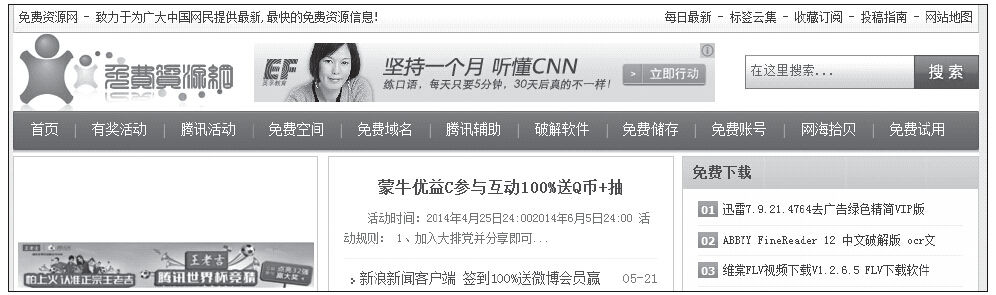
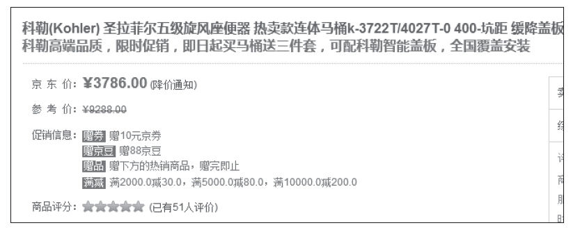

### 5.4.2 互惠

互惠原则的出发点是让用户产生负债感，从而做出让步并为你的产品买单。对于用户来说不需要经过理性思考，就会产生一种“来而不往非礼也”的状态，这种状态可以让用户购买更多的增值服务（当然前提是：产品已经为用户提供了很多的免费服务）、跟帖（有很多的用户为其他用户提供了很多有价值的帖子）、添加商品评论（其他人已经为用户提供了很多的商品评论信息，帮助用户做出购买决策）等等。

对于我们产品设计来说，出发点可以是：提供免费信息（见图5-4）、提供补贴、提供赠品（见图5-5）等。

图5-4 提供免费信息

图5-5 提供各种赠品
