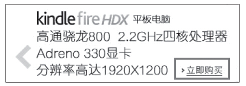
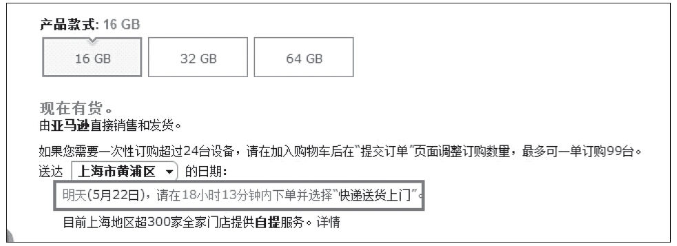
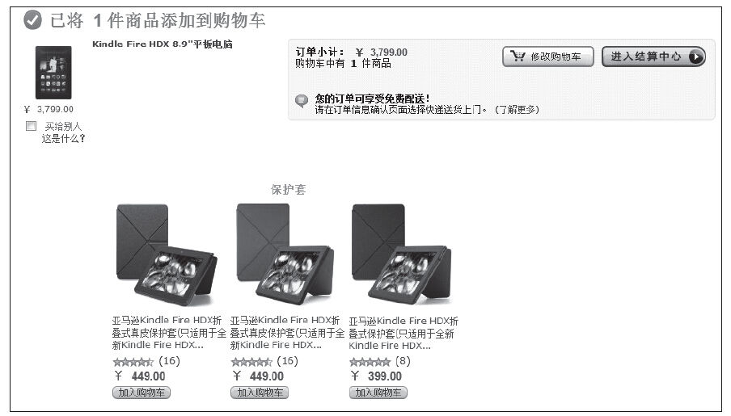

### 5.4.6 谨慎选择

下面我们来思考一个问题：作为产品经理，为了打动用户，让他购买你的产品或服务，你如何做会提高购买率？也许很多读者会认为为用户提供更多的产品或服务、增加更多的选择，因为用户自己说他要更多的选择。但事实上，太多选择并不像我们想象的那么好。这是用户错误理解自己需求（大脑有意识部分）的经典案例，太多选择只会让用户陷入“幸福的烦恼”，然后不知所措，最后什么都不买。这就是“谨慎选择”原则：过多的选择会让用户惧怕、甚至不做任何选择。

那么，如何解释“谨慎选择”原则呢？如果选择很少，那么用户就会无意识（中脑、旧脑）地快速选择购买某件产品或服务，而用户的满意度也会比较高；但如果选择过多，用户就会动用新脑进行理性分析，这时候反而会随着时间的推移降低用户满意度，于是索性就不购买了。所以，为了激发用户尽快决定，很多互联网产品会加入一些元素来吸引中脑或旧脑的注意。比如，如果我们觉得可以马上得到自己想要的东西，中脑就会得到信号并鼓励我们行动（点击“购买”）。如图5-9所示，亚马逊就是用“立即购买”这个词来抓住用户中脑的注意力。

图5-9 亚马逊商品信息旁的“立即购买”按钮

对中脑来说，即时性是很重要的。比如图5-10中用户在下单后，亚马逊的页面会即时告诉用户商品在什么时候到达（“明天”），以及用户应该在什么时候订购（“18小时13分钟内”）。

图5-10 亚马逊商品信息显示到货时间

很多追加销售的例子常常是与用户的旧脑在交流，当选择涉及对比时，旧脑就会参与。旧脑在意的是基本要素，如大的对比小的、贵的对比便宜的等等。旧脑基于直观的数字对比就会快速做出决定！

所以，一般来说，为了让用户易于接受，只有在用户购买比较贵的商品时，附加商品才会出现，如图5-11所示，亚马逊通常在用户购买了一款较贵的商品时为用户推荐相对便宜的配套商品。想想你已经花了3000多块钱买了部手机，再多花几十块钱买个手机套又算得了什么呢？

图5-11 亚马逊适时推荐的配套商品
