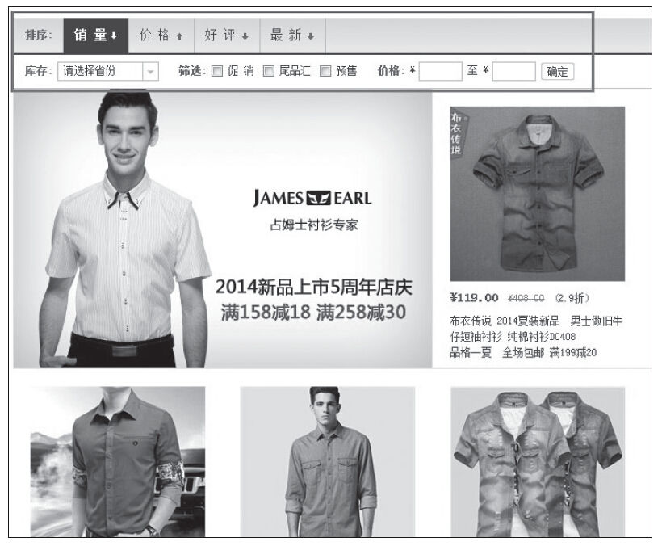
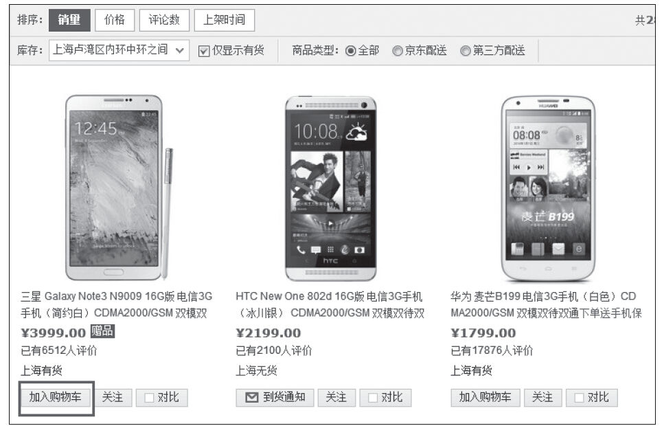

### 6.5.3 分类页

介绍完主页，现在我们随着用户的操作步骤，从主页进来之后，介绍接下来用户最可能看到的页面——分类页。

分类页本质上就是个“过滤器”，用户通过点击分类页，可以筛选掉大量不需要的产品或服务，而能更好地关注更精确的详细资料，因此分类页可以通过以下一些精心设计来满足这一点。

首先，提供显示、排序和过滤用的选项。分类页要允许用户以多种方式对比产品或服务的条目。因此，从多个维度对分类的信息进行筛选、过滤就显得非常重要，如图6-32所示。

图6-32 当当网的分类页

其次，考虑“加入购物车”。涉及用户添加物品到购物车时，很多电商网站都会遵循这样的思路“只放在明细页上”，就连当当网都是这样设计的。但是笔者认为，对于一些易于区分或只需要简单说明的条目，其实可以考虑增加“加入购物车”这一功能，让用户少一次点击，何乐而不为？图6-33所示为京东商城分类页，他们就是这样做的。

图6-33 京东商城的分类页

此外，需要特别值得产品经理注意的一点是：杜绝来回跳！在分类页和详情页或子分类页间来回点击后退或前进的访客可能是找不到足够的信息来做决定。这种行为引起的效果很不好。所以，在主页面进入分类页或在分类页进入详情页时，系统默认的实现方式为“打开新页面”。
