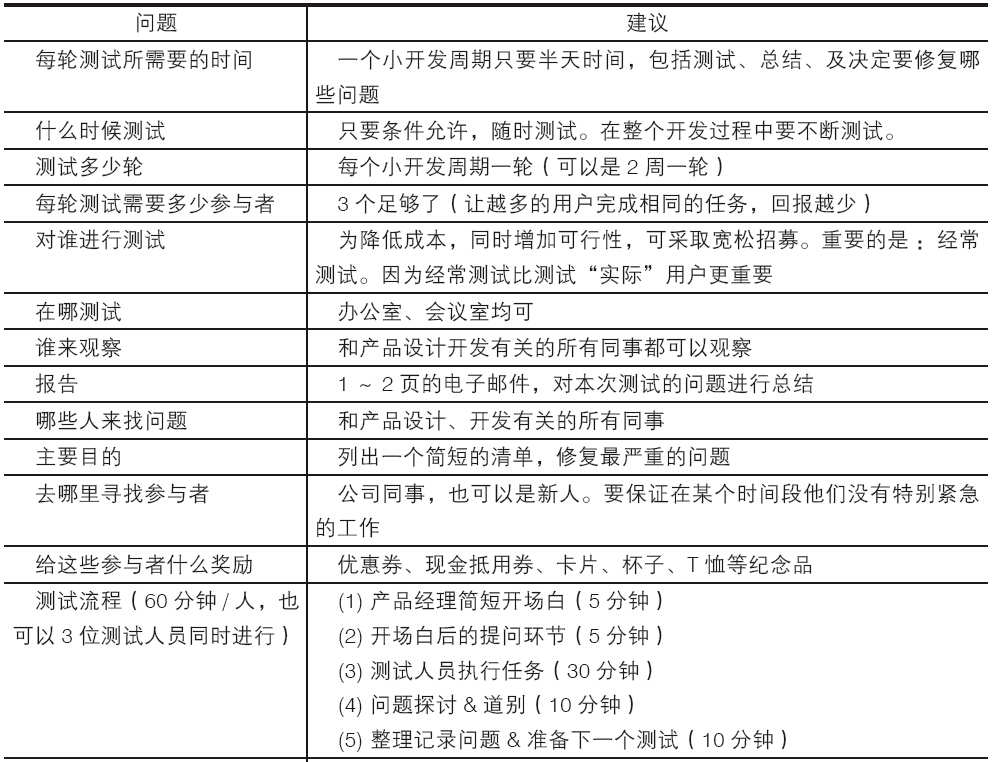
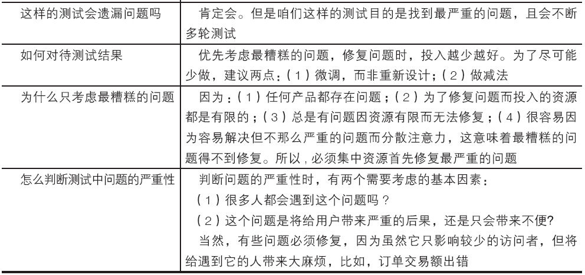

### 7.3.1 特约用户

作为产品经理，我们需要深入了解目标用户，明确产品需要解决的问题，定义出满足用户需求的产品，所以有时候我们需要深入地与用户合作，这样研发出来的产品才更能切实满足用户的需求。但有时限于行业经验、市场变化、用户调研的局限性等因素，我们产品的市场反馈未必能够达到既定目标，为了有效地解决这个问题，笔者推荐使用“特约用户”的方法来降低产品风险。尤其是每次针对C用户非常重要的产品版本，更应该采取特约用户的测试方法。

那么，我们为什么要找用户测试呢？其实，最好的用户研究方法就是把产品做出来，给用户用、看用户用，不放过任何一个和用户接触的机会，站在用户的角度去精雕细刻我们的产品，这样做出来的产品才真的具有商业价值，从而得到市场的认可。当然，大多数互联网产品经理从公司所争取的资源都是有局限性的，笔者特意整理了如下实施简单、操作性强的建议。具体方案如表7-3所示。

表7-3 “特约用户”测试方案

当然，在特约用户测试过程中，对于发现的问题，我们建议在此开发周期内最好微调，而非重新设计。如果问题没有修复，则可以尝试使用另一种方式的微调，直到问题修复。至于微调优于重新设计的原因有很多，为此我们仅列出如下一些主要的：

1）微调费用低、工作量少；

2）细微修改能更快完成；

3）细微修改真正得以实现的可能性更大；

4）如果大刀阔斧修改，很可能破坏其他原本运转正常的东西；

5）大多数研发或测试都不喜欢变化，所以重新设计可能会让他们感到不舒服，甚至拒绝；

6）重新设计意味着同时做大量的修改，这会增加复杂度和风险；

7）重新设计意味着涉及大量的人，需要开很多会，需要大量的成本，从而可能导致较低的投入产出比（ROI）。
