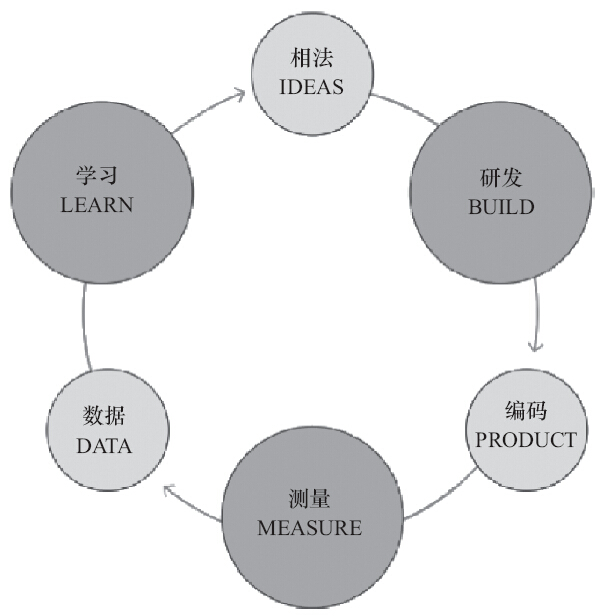
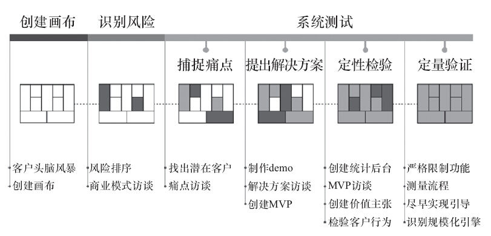
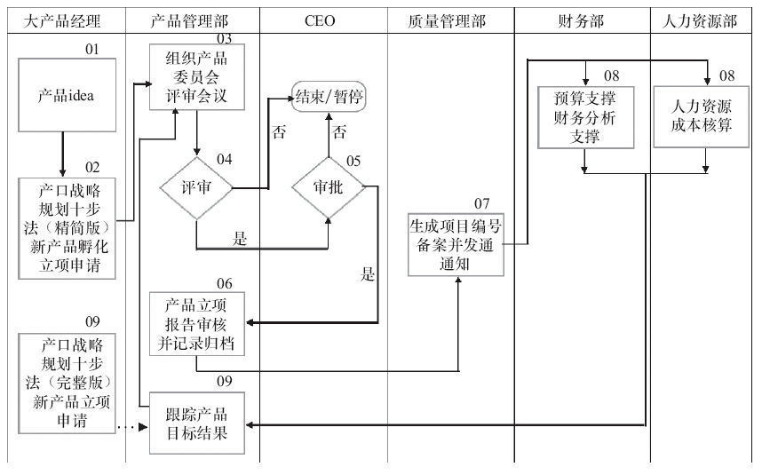
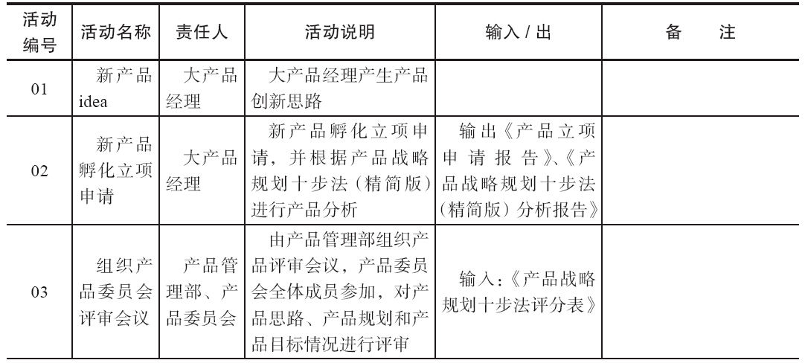
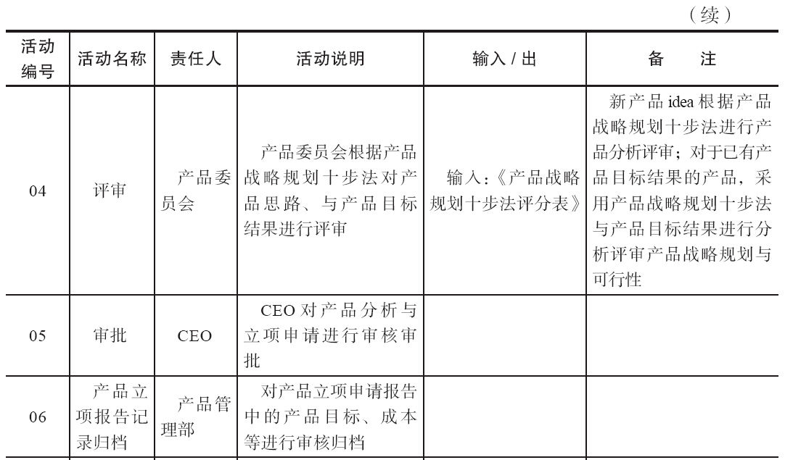
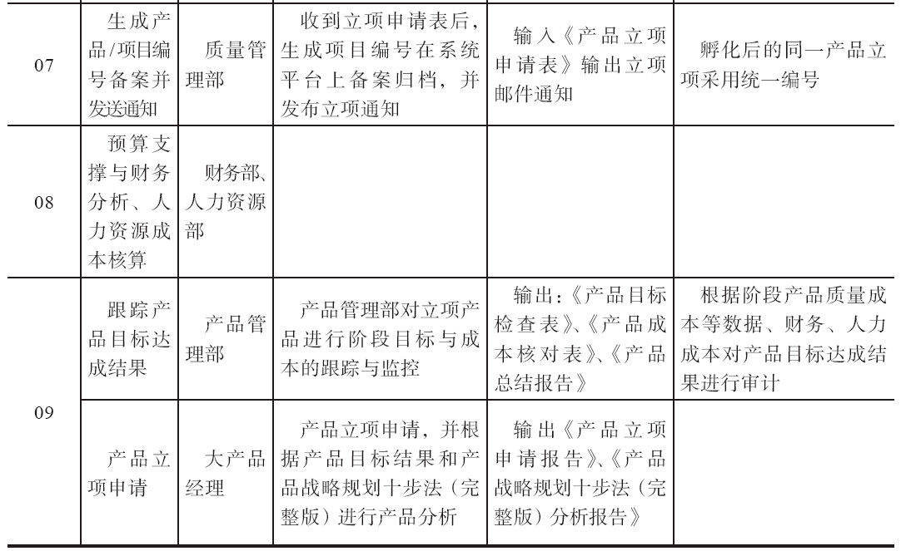

### 第24件事 精益创业要知道的3个方面

小O周末参加了一个以精益创业为主题的线下产品经理聚会活动，茶歇之间，小O跟几个同行攀谈，发现他们聊起精益创业，滔滔不绝，见解颇深，自是参加会议之前就已经对精益创业非常熟悉，甚至真正实践过精益创业。小O顿时感觉自己有点跟不上他们的话题了，一下子拉开了距离。虽然之前听老K大概说起过精益创业，但是对什么是精益创业及其特征也不甚明了。感觉自己不懂点儿精益创业，出去参加活动就有可能被同行鄙视。

小O向老K汇报了自己参加活动的感受，老K想想也是时候给小O讲讲什么是精益创业了。小O之前对瀑布式开发模式和敏捷开发模式有了一定程度的了解，但是对精益开发模式还没有什么了解，因为这种模式也是最近产品圈里慢慢火热起来的一种开发模式。其中不乏以微信为代表的产品就已经开始实践这种模式，不出意外。将来一段时间，精益创业将是国内各互联网公司采用的主流模式。

到底什么是精益创业？精益创业的基本原则、特征和目标分别是什么？是否像敏捷开发一样也会存在认识误区？精益创业的认识误区有哪些？采用精益创业这种模式在公司内部如何立项？立项流程大概是什么样的？一旦采用精益创业这种模式，那么精益创业的整体流程是什么？

1.精益创业简介

在介绍精益创业之前，需要了解三种典型的产品开发模式。从需求到设计到实施到验证到维护，这是典型的瀑布式开发模式，这种模式适用于问题已知，解决方案也已知的情境。

轻量级、灵巧，每个方法和思想做到极限、做到最好，基于测试驱动开发，提倡最简单的设计方式，现在或最近都根本不需要的就不设计，需要重构（灵活性和可扩展性），代码集体所有权，结对编程，持续集成，验收测试，小型发布，不断迭代。这是典型的敏捷开发模式，这种模式适用于问题已知，但是解决方案未知的情境。

提倡企业进行“验证性学习”，先向市场推出极简的原型产品，然后在不断地试验和学习中，以最小的成本和有效的方式验证产品是否符合用户需求，并迭代优化产品，灵活调整方向。这是典型的精益开发模式，适用于问题未知，解决方案也未知的情境。

精益创业的基本原则：

·减少浪费，低成本（无收入不扩增）

·一种开发、测量、学习的文化

·快速假设，快速学习，失败后快速调整

·敏捷技术开发

·精益创业的特征：

·非资本推动型，主动自发，关注用户价值，拒绝华而不实

·持续的用户互动

·从第一天开始，以收入为目标

·如果没有收入，就一定限制规模编制

·假设用户和未来都是未知的

·资源的低燃烧率，降低风险

精益创业的目标示意如图4-1所示。

图4-1 精益创业的目标

精益创业的认识误区：

·精益意味着便宜（正确认识是精益不是贪图便宜，而是注重效率）。

·一定能成功（正确认识是精益创业只是一个帮助提高成功概率的框架，不能保证一定成功）。

·精益创业等于试错（正确认识是：试错可以，但不能盲目试错，试错也有成本）。

2.精益创业整体流程

精益创业的整体流程主要包括创建画布、识别风险和系统测试三大阶段，其中系统测试包括捕捉用户需求痛点、提出解决方案、定性检验和定量验证四个阶段。

1）创建画布：由于用户需求和解决方案未知，所以需要跟目标用户进行头脑风暴提出假设，主要包括目标用户群是谁？他们有什么痛点？针对痛点的解决方案是什么？给用户带来什么价值？如何将这些价值传递给用户（市场渠道是什么）？如何获取商业价值（收入模式是什么）？获取商业价值的同时需要付出多少成本（有哪些成本）？如何判断产品做得好还是不好（关键数据指标有哪些）？要想持续做好，需要拥有或构建什么样的竞争壁垒？这些内容都可以在九格画布上填写，但是并不是每一个内容都必须填写，不能确定的内容可以先不填。

2）识别风险：精益创业的风险是比较微观的风险，主要包括用户风险、产品风险和市场风险。用户风险指的是在捕捉用户需求痛点时因不准确而导致的风险。产品风险指的是提出的解决方案并不是用户想要的而导致的风险。市场风险指的是不能持续扩大市场规模导致的风险。精益创业强调学习文化，旨在通过学习不断降低或消除上述三种风险。

3）系统测试：针对画布上的所有假设进行小心求证。找到目标用户群，进行需求痛点访谈，挖掘出需求痛点，并不断更新画布上关于需求痛点的内容。针对需求痛处，提出解决方案假设，制作产品原型，招募目标用户群进行访谈和求证，并不断更新画布上关于解决方案的内容。接下来是研发出最简单可用的1.0版本的产品，并招募目标用户群进行访谈和求证，看用户对产品传递的价值主张是否能接受和认可，并不断更新价值方面的内容，这是定性检验阶段。通过数据统计后台，分析用户使用行为，不断学习和调优。如果数据情况不客观，需要重新调整方向，直到研发的产品是用户想要的为止。如果数据情况非常乐观，那就进入到最后一个阶段，定量验证阶段，识别出产品增长动力引擎，获取更多的市场份额。

精益创业整体流程如图4-2所示。

图4-2 精益创业整体流程（详细）

3.精益创业立项流程

产品立项阶段分为新产品孵化立项与产品立项。新产品孵化立项阶段需采用公司产品战略规划十步法（精简版，其实精益创业画布就是精简版的十步法），经过产品委员会的初步评审与CEO审批方可通过；产品立项指已通过产品孵化阶段的产品，做下一阶段的规划、开发与运营，该阶段需采用公司产品战略规划十步法（完整版，第3章已经详细阐述），通过产品委员会评审与CEO审批完成立项过程。精益创业立项流程如图4-3所示。

图4-3 精益创业立项流程

精益创业立项流程说明，如表4-1所示。

表4-1 精益创业立项流程详细说明

这下小O对精益创业终于有了一个比较全面的认识和理解，仔细一想，诸如微信、微博等产品早已成为精益开发模式的先行者和忠实实践者。腾讯提出的灰度发布机制与精益创业模式也有异曲同工之妙。Facebook的代码发布是灰度发布，所以做了一个方便设计灰度发布的工具。在这个工具中，工程师和产品经理（也可以授权给其他非研发人员）可以设计新产品发布的目标人群特点（比如年龄、性别、地域、教育等方面做出限制）及发布的人群比例（在0~100%之间自由调整），所有的改变不需要代码的改变，只需要在工具页面上点击鼠标即可，让灰度发布变得很轻松。

精益创业模式虽然强调快速假设，快速学习，快速调整，但不等于可以盲目试错。精益开发模式不能确保产品或项目孵化一定成功，只是一个帮助提高成功概率的框架。精益创业强调走出办公室多与用户访谈和互动，关键在于研发出来的产品是不是用户想要的，用户愿不愿意为之付费。
