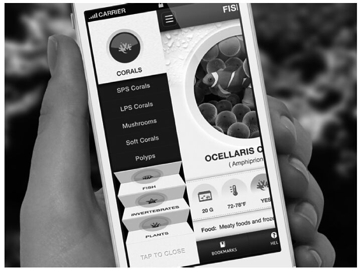
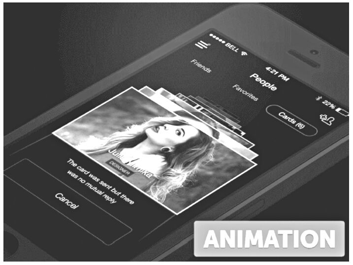
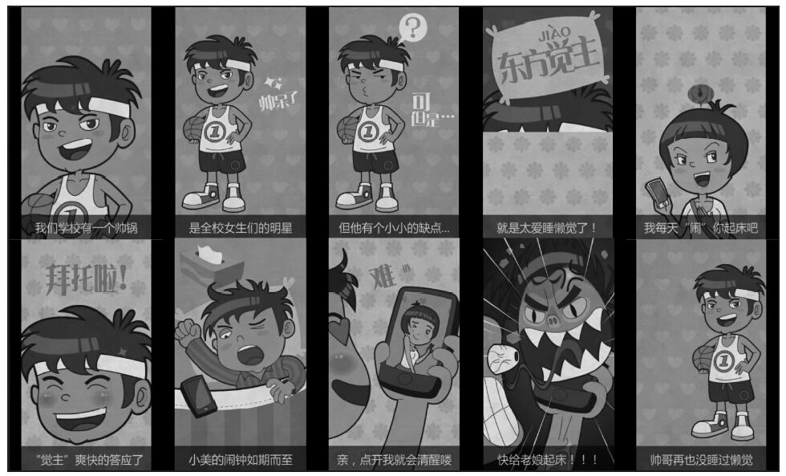
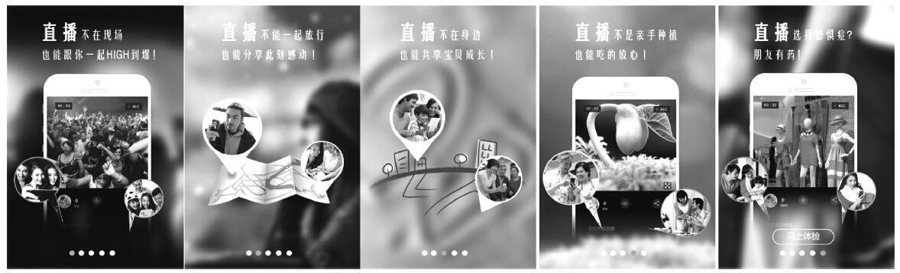
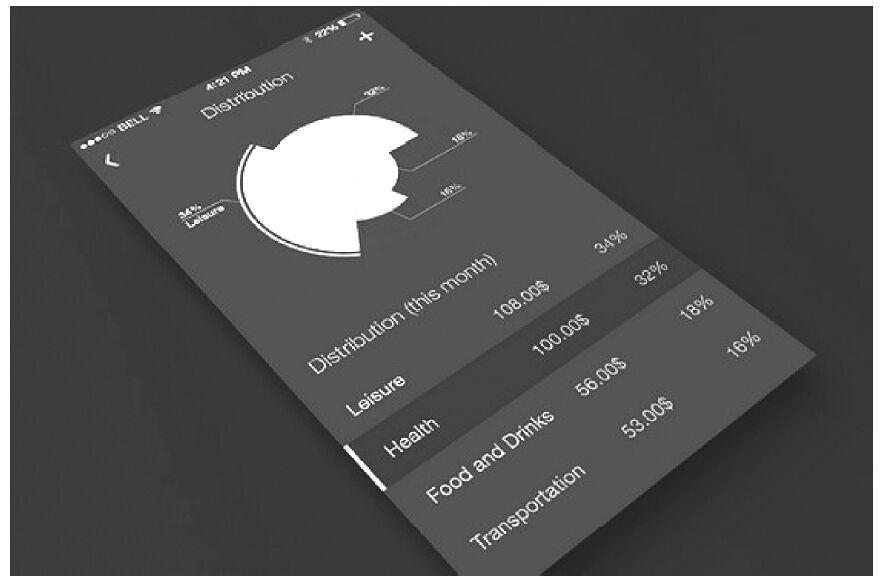
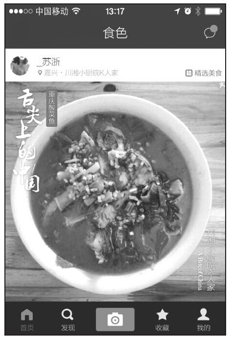

### 第37件事 创新设计的4种方法

小O自从听了老K师傅所讲的实用设计思想之后，看到生活中比较有意思的现象都尝试着抽象和提炼一下，还真别说，颇有一些心得和感悟。比如说户外的平面广告牌，有的广告牌一直保持静态，而有的广告牌则是利用平滑的动态转换效果切换到下一张广告牌，小O心想这种动态效果抽象虚拟化之后可不可以用于卡片式设计呢？

小O的想法得到了老K师傅的极大肯定，或许学东西要学精髓，说的就是这个吧。小O根据老K师傅讲过的课程，很容易就猜出老K师傅将要阐述禅宗思想的最后一项：继承传统，不断创新。这次讲课的内容估计跟创新有关，果不其然，老K师傅将阐述创新设计，而这节课的难度也是很高的。

创新设计指的是微创新（局部创新）或者颠覆式创新（整体创新），一般会采取逆向思维法，反其道而设计。说创新设计，其实说的是设计趋势或潮流。之前所阐述过的极简设计、人性设计、实用设计都可以理解为设计趋势或潮流，这里我们再重点阐述几种创新设计方式，让大家设计的移动应用更具时尚感，比较性感。

1.平滑动态转场效果

在实用设计中，我们介绍过抽屉式设计和卡片式设计的案例，但是这两个案例在页面与页面之间切换时不是很流畅，没有什么转场特效。如果还没有为你的App提供动态转场效果，现在使用的还是向左滑动、向右滑动等传统的转场特效，就表示你的App不够性感。我们先来看比较性感的抽屉式动态转场的案例，如图6-16所示。

图6-16 带折叠效果的抽屉式设计

这种带折叠效果的抽屉式设计比直接向左滑动的抽屉式设计显得性感得多。

我们再来看看比较性感的卡片式动态转场的案例，如图6-17所示。

图6-17 带动效的卡片式设计

这种动态翻页式的卡片式设计更加平滑，平滑无缝的切换和体验，使得App很性感。

2.故事情感化

通过生动的故事、吸引眼球的动态效果、手绘式风格、场景化的故事图片、多媒体内容（语音或视频）展现等方式拉近用户与产品的情感距离。产品不是机器，要把产品当做一个活生生的人，跟人对话，而不是跟机器对话。真正的设计是要打动人的，勾起用户的回忆，激发用户的情感，有了情感，用户才会深深爱上产品，如图6-18所示。

图6-18 为ta闹钟的情感化设计

图6-18中讲了一个非常生动的故事，动画制作精良有趣，非常容易激发用户使用App的欲望。

热门App美拍是一款最潮的10秒短视频社区，第一次启动应用之后，美拍提供一个非常精美的视频来介绍这款产品的特色和亮点，用户看完之后，无不跃跃欲试。

我们再来看一款直播视频社交App——晒晒吧，为了让用户在短时间之内了解这款App是干什么的，采用的解决方案是场景式表达，如图6-19所示。

图6-19 场景式表达

这款产品适用的场景主要有：婚礼视频直播，让你成为大明星，让全世界的亲友共同见证你的祝福；大学新生入学，直播同寝室的男才女貌，让家里的父母放心加欢心；老同学聚会，用上晒晒吧，和其他异地的同学一起回忆校园美好时光；初为人父，有了晒晒吧，让远在老家的爷爷奶奶、叔叔婶婶们看看可爱的宝宝；出国旅游，通过晒晒吧，和好友一起分享异国风情；新房装修，让家人和好友实时看看装修现场，听听他们的建议；发现身边好玩的事情，马上直播，第一时间和好友分享；工作出差在外地，碰到问题，通过晒晒吧，让公司同事一起帮忙解决。

3.数据可视化

最近几年，可穿戴式设备得到迅速发展，跟可穿戴式设备配套的App经常会采用信息图示化的方式来表达内容。这样的数据可视化，比较直观、形象，用户也比较易于理解，很大程度上降低了用户的认知成本，如图6-20所示。

图6-20 数据可视化

通过传统的表格和视觉友好型多彩饼图对数据做了一个整体的概览，同样在暗色背景上通过一系列鲜亮的色彩很好地展示了数据。

4.大背景图片

以大图片作为背景，视觉冲击力较强，能给用户留下深刻的印象，我们以食色这款App为例，如图6-21所示。

图6-21 食色的大背景图片

在使用大背景图片时，阅读型文字与背景图要使用明显的反色或对比色，可将文字放置在半透明的浮层上，这样使得文字内容具有可读性。这样的App也会更加性感。

小O听完老K师傅的课，正如之前所预料的那样，创新设计是禅宗思想中最难领悟的一项，不管是微创新还是设计的颠覆式创新，对于现在的小O来说，都有较高的难度。小O也思考了很久，借鉴一款App的设计很容易，但是要真正理解设计背后的深层次的原因，确实很难，更别说自己整出的设计能够引导时尚潮流了。看来也只有更勤奋地修炼内功，才能有机会有朝一日自己的App设计被别人疯狂抄袭和借鉴。

创新设计一般反其道而行之，代表着一种设计时尚、潮流和趋势，可以通过极简设计、人性设计、实用设计以及平滑动态转场效果、故事情感化、数据可视化和大图片背景等创新设计方法，使得移动应用具有较强的时尚感，看起来很性感，给用户留下深刻印象，给用户带来新鲜有趣的使用体验，最终激发用户的情感，促使用户疯狂爱上产品。
