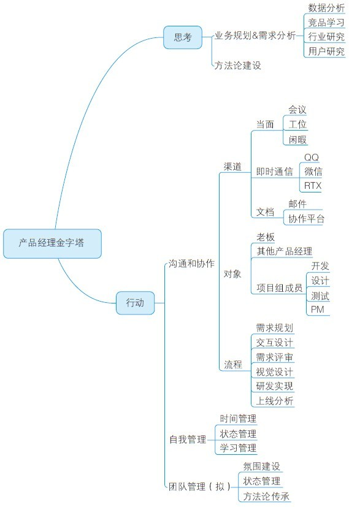

# 01 构建你自己的产品经理金字塔

王昆

腾讯公司应用宝产品经理，2011年腾讯开放平台成立之始加入团队，历任QQ空间应用中心产品经理、开放平台和应用宝智能推荐产品经理、应用宝搜索产品经理。

擅长社交化、个性化的应用中心设计，以及以产品经理的角色提升推荐和搜索能力对应用市场的价值。对GTD等自我管理有所涉猎，希望能早日达到随心所欲不逾矩的状态。业余游戏爱好者，计算机专业背景，梦想30岁之前能独立完成一款有趣的游戏。

精彩观点

“读者会将读到的思想进行归类分组和总结概括，以便记住。

如果作者已经对传达给读者的思想进行了归类和概括，并且按自上而下的顺序呈现，读者就能更容易理解作者表达的思想。以上说明，条理清晰的文章应当具有金字塔结构，并且不断‘自上而下’地向读者传递信息（虽然在开始写作时作者的思路是‘自下而上’的）。”

——芭芭拉·名托《金字塔原理——思考、表达和解决问题的逻辑》Page20

从狭义上讲，金字塔原理便于沟通和表达：因为金字塔原理的特点是，结论先行、层层深入，所以即使受众只看到结论，也能够知道表达者想要说的最核心观点，沟通中的受众可以分配合适的时间和精力来理解。若详细了解了核心观点是如何而来的，便可以逐级深入，了解表达者的推导思路和决策支撑点。

从广义上讲，金字塔原理也可以作为产品经理工作方法论的搭建框架：金字塔原理从一个核心点衍生到无数层、无数个具体内容。产品经理需要有一个明确的目标作为工作的核心，围绕实现这个核心目标，拆分不同维度完成一个金字塔的构建。产品经理可以围绕构建这个金字塔框架来不断自我提升。

下面抛砖引玉，将我个人建立的产品经理金字塔分享给大家。需要注意的是，产品经理金字塔并无标准答案，不同的产品经理，在不同时间段，处于不同团队，负责不同产品，怀揣不同的梦想时，构建的金字塔结构可能不尽相同。大家只要把握核心即可：任何思想和行动结构，都是为了帮助和指导自己更好地实现目标。

关于笔者所建的产品经理金字塔有两点说明：因为工作时限，对团队管理这部分尚未有较多涉猎，这里为了保证金字塔的完整性，简单地列出了相关关键点；在框架中进一步展开了“沟通和协作”这部分内容，旨在示范大框架建好后该如何进一步细分和完善金字塔。

金字塔原理最简单的应用就是沟通，比如邮件的撰写。通过沟通逐渐熟悉金字塔原理之后，在不断思考之下，更可以使用金字塔原理构建产品经理的核心竞争力。

实践案例

1.从零开始构建金字塔

在刚开始工作时，相信有不少产品经理都像我一样，对于工作一头雾水：想方案、出需求、跟设计、跟开发、看数据、写邮件……各种各样的事情让自己手忙脚乱。最开始这个阶段叫作“小马过河”，有的只是初出校园时身上用不完的干劲和抬脚迈步时的不踏实，总感觉身上有劲使不出。

向前辈请教，这个阶段是水磨功夫，需要慢慢地熬。于是经常思考，并且在印象笔记上记录工作中遇到的问题和处理办法，比如和设计师沟通时冷场怎么办，需求评审时被挑战怎么办，需求变更时该怎么办，思考需求时被开发找过来怎么办……争取不让同一个问题纠结自己两次，不让自己掉进同一个坑两次。这样渐渐形成了一个树状的知识网，让自己从一个没有经验的人变为一个有经验的人。这个知识网是以产品经理的工作内容为主干，以工作的步骤、要点、风险等为枝叶。后来这个知识网会逐渐成长为我的产品经理金字塔，这是我最初没有想到的。

2.金字塔结构助力职场沟通

接下来经常逼我工作到凌晨2、3点的是写邮件。刚开始的邮件，得到导师和同事最多的评价是不知道我想要表达什么内容。

于是在朋友介绍下买了《金字塔原理》来学习，没想到竟收获不少启发。

写一封邮件，只需要做3件事，交代清楚背景、表达核心结论、有充分论据支撑核心结论（这也就是前面说的知识网）。邮件的目的是表达，表达的目的是让受众了解自己的想法。

邮件最重要的，就是选择一个核心的结论，而背景和论据都是为核心结论服务的，背景是为了说明结论的价值，论据则是为了说明结论的正确性。作为一种呈现自己工作内容的载体，邮件的立场更多要站在读者的角度上，其所要表达的核心结论应该是受众最想要了解的结论。

如何了解受众需要在产品工作中不断积累。比如竞品观察邮件，当竞争对手发布了新的版本时，大家想知道的是，竞品新版本做了什么，为什么做，咱们应该怎么做；项目进度邮件，大家最想知道的是项目能否按期保质完成；数据分析邮件，大家最想知道的就是数据产生了什么变化，是因为什么原因导致的，接下来该怎样让数据提升到更好。

如前所述，以邮件作为表达的示例，运用金字塔原理就是：合理地拆分邮件的架构，以结论作为邮件核心，掌握不同类型邮件的核心结论区别，能够通过日常工作（如竞品分析、数据分析、用户调研）掌握足够充分的论据，就能够写出清楚明了的邮件，从而使自己和团队的工作价值被了解。

3.紧抓金字塔核心高效管理时间

经常会突发一些事情，如领导指派新任务、需求进度出现风险、线上特性出了纰漏，让自己原本就不够用的时间更加捉襟见肘。一面这些打断会使自己乱了阵脚，首尾不得兼顾，工作的效率愈加低下，工作的质量也难以保证。

不曾想，解决这个问题的答案也在《金字塔原理》中。当你围绕一个核心目标来思考和行动时，所有的事情都是为了达成这个目标衍生出来的枝干。有的枝干更粗壮，对目标的影响更大；有的枝干更上层，对目标的影响更快；有的枝干……根据这个框架，当发生一件新的事情时，就可以据此判断，这件事在整体中的影响，并根据这个影响评估合适的应对方法，是放下手头的事情立即做，是拜托给别人做，还是未来某时去做，又或者需要拆分任务来做，甚至根本不值得做。

总结分析

从广义上来说，金字塔原理代表了一种逻辑框架，所有产品经理都应构建一套自己的产品经理金字塔，即互联网产品经理核心能力。“要做什么事，为什么要做，怎么来做”，不同产品经理的差异就在于这个框架的核心关注点和完整性上。

腾讯是以“P+数字”来标识产品经理的职级，数字越大说明越资深。对应到产品经理的金字塔中，P1重点积累的是完成各种任务的经验，要做什么都已经由上级指派好，只需要保证能正确完成即可。于是在此职级产品经理金字塔关于执行的分支上，我会按照需求研发的流程标注出各个不同的环节，然后理清各个环节点需要产品经理驱动和注意的内容。这样一来，就能顺着流程，与相关的设计、开发、测试等人员配合，把交给自己的事情完满地做好。

能顺利晋级到P2，对于怎么做（也就是所谓的执行力）的积累已经及格。此时，会有更大的任务给到你，同时也会有更大的空间来让你施展。比如本人曾经负责过的QQ空间应用中心，当时的任务就是提升它的应用安装量。围绕这个目标，就需要产品经理自己挖掘要做什么，于是要更多地思考用户场景，更深入地研究竞品，更细致地分析数据，经过拆分和推导，得到提升自己负责的产品的核心手段和实现路径。这样一来，心里对什么时间点要做什么事情成竹在胸，上面说的问题也就迎刃而解了，你在心中已经构建了一个思考和行事的准则，所有新的事情，都能在围绕目标的大框架下找到自身合适的位置。

往后走，随着能力的不断提升，你负责的产品可能越来越大或越来越多，即不光能够给梳理出合适自己的产品经理金字塔体系，也能够利用自己已经掌握的经验和方法论，带领更多的产品经理完成更多的事情。这就是P3的意义所在了。此时，你的产品金字塔，也就是团队的产品金字塔：每一个人每一时刻，站在里面什么位置，做什么事情，会对塔顶的结果产生什么影响，你都要了解得如明镜一般。

愿天下所有产品经理都能从无到有，由此及彼，构建属于自己的完美产品经理金字塔。
