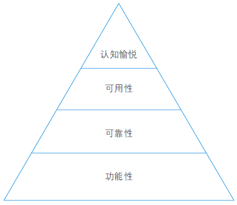
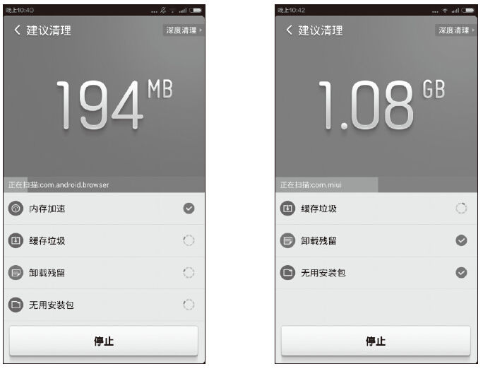
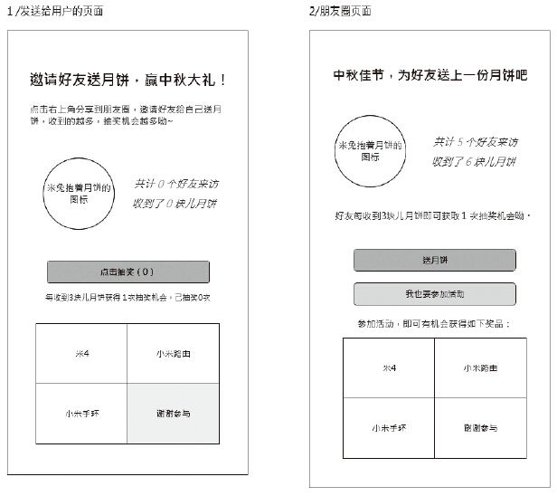
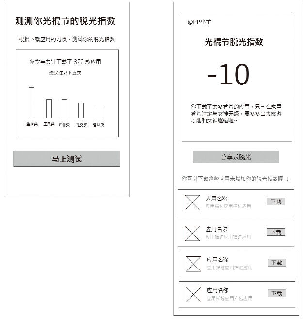
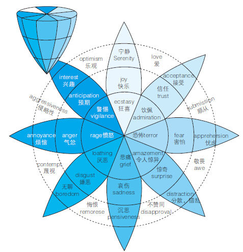

# 10 在产品设计中如何把握用户的情感需求

彭洋洋

互联网从业4年，2年开发经验，2年产品和运营经验。现就职于小米，从事小米应用商店运营工作。

对微信公众号第三方开发和公众号运营有深入了解，曾在金山网络（现猎豹移动）从事微信公众号后台产品和公众号运营工作，主张把微信公众号当作一个轻应用来看待，结合自己的产品特性为用户带来真正的价值。

目前从事小米应用商店的运营工作，工作中产品和运营都有涉及，关于我的更多内容可以访问我的博客，内容均是工作中关于产品和运营的总结，欢迎关注！

博客网址：<http://www.pengyangyang.com/>。

精彩观点

人是有感情的动物。即便是像工作表这样直观的应用，他们都想找到一个使用它的理由。

理解感情需求能够帮你把握设计重点。

……

通过讨论更深层次的、感情上的需求，Things开发人员理解了人们需要他们软件的真实原因，因而也促使他们把设计中心放在了满足隐形需求上面。[[1]](part0484.xhtml#ch1_back)

产品设计和交互设计能否满足用户情感需求，是产品是否能够真正满足用户需求至关重要的一部分。

“情感化设计（Emotional Design）”一词由Donald Norman在其同名著作当中提出。而在《Designing for Emotion》一书中，作者Aarron Walter将情感化设计与马斯洛的人类需求层次理论联系了起来。正如人类的生理、安全、爱与归属、自尊和自我实现这5个层次的需求，产品特质也可以划分为功能性、可依赖性、可用性和愉悦性这4个从低到高的层面，而情感化设计则处于其中最上层的“愉悦性”层面当中。

情感化设计的核心在于引发用户认知愉悦，从而为用户带来积极的情绪体验，因此需要重点把握这几项愉悦元素：可控感、参与感、情感共鸣、信任感、从众心理等。

柏拉图曾说“人的行为就好比一辆有两匹马拉着的马车，一匹代表理智，另一匹就是情感。”现在业界大力提倡“用户体验”，但我们的“用户体验”更偏重于产品的功能性需求，而对用户的情感性需求熟视无睹。这好比柏拉图的“马车”，如果我们不重视“情感”这匹马，终究我们会迷失在路途中，找不到产品的出口。

例如金山网络（现在的猎豹移动）的猎豹清理大师中清理垃圾时的背景颜色变化效果就是一个非常好的情感设计。

1）用户点击首页进入清理垃圾功能页面，清理垃圾页面的背景颜色会随着清理出的垃圾越来越多，逐渐从冷色调变为暖色调，给人一种色彩上的情感感知。

2）当用户点击清理垃圾按钮，清理出的垃圾数据会逐渐变小，告知用户这些垃圾正在被清理，另外背景颜色也会逐渐由令人紧张的暖色调变为冷色调。

3）这种颜色上的变化潜在地激发了用户的“认知愉悦”，背景颜色的变化为产品赋予了一种情感，同时与用户的使用情感产生了共鸣，从而让用户更加喜欢和信赖这款应用。所以我认为这是一个非常好的情感设计。

实践案例

1.小米应用商店微信公众号中秋节营销活动

微信公众号中秋节营销活动设计的主线是通过微信朋友圈送月饼的活动，让用户和朋友们互动，达到传播自己的品牌和增粉的效果。

其中应用了以下情感化设计：

（1）可控感

用户可以了解自己被访问了多少次，收到了几块儿月饼是一种“可控性”的情感设计，让用户感觉到他能够随时“hold”住朋友对他的行为数据。如果没有这个数据，则会给用户一种因为不了解自己的朋友对自己的关注度而带来的沮丧心情。

（2）攀比心

当用户看到自己的朋友收到了××块月饼时，一定比例的用户会产生“攀比”或“好奇”的心理，促使其除了能够参与抽奖之外，也想试试自己能收到多少月饼。这同样也是活动中一个很好的产品设计。

2.小米应用商店客户端“测测你光棍节的脱光指数”活动

产品要具有情感，需要和人们的生活情感紧密相关，例如Google首页节日时的变化、QQ登录框随着季节和节日做出的变化等。这些都是能够引起用户“共鸣”的一种情感设计。

光棍节小米应用商店客户端做了一个“测测你光棍节的脱光指数”活动，具体到活动策划和产品设计中，有如下几点情感化产品设计：

（1）引起共鸣

光棍节电商网站均以各种打折促销活动为主，我们则另辟蹊径做了一个“测测你的脱光指数”活动，与节日气氛相结合。另外其实每个光棍都不太想过这个节日，因为这个活动与用户想脱光的情绪相关，所以能引起用户共鸣。

（2）好奇心

活动主页中列出了用户2014年下载应用的数量和最关注的5类应用，此时用户会会心地“哇”一下（原来自己下载应用的习惯是这样的，超出预期的情感设计），同时引导测试脱光指数（好奇心），然后给出一段轻松娱乐、适合分享的测试结果和文案，引导用户分享。

（3）直白的文案

分享按钮的文案由“分享给好友”改为“分享求脱光”，直接表达出用户心声，大大提高分享的转化率。

总结分析

人类情感基本上分为很多种，最早期心理以二分法将情绪分为正向情绪与负向情绪，其中最著名的就是心理学家Robert Plutchik的情感轮盘（Plutchlt），这个理论的主要内容是情绪表现在不同的强度，甚至情绪可以与他人情绪之间互相影响产生不同的情感，建立新的情绪状态。Robert Plutchik的情感心理进化论是最具影响力的普通情感反应分类法之一。他认为有8种最基本的情感元素：愤怒、害怕、悲伤、嫌恶、惊奇、好奇、接纳和欢愉。

人的情感复杂多变，产品的情感化设计也没有边界，在功能性的产品越来越容易满足用户的现在，情感化设计至关重要。

[[1]](part0484.xhtml#ch1) 《简约至上：交互式设计四策略》，［英］Giles Colborne著。
