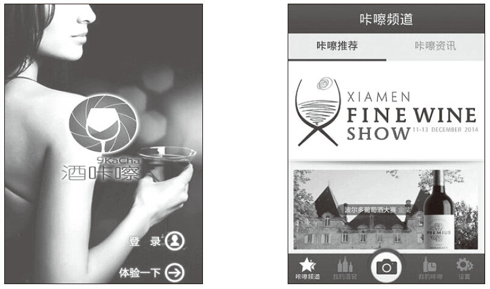

# 21 简化产品的3个原则

曾倩容

客如归运营，主要负责产品的推广、客栈微信公众号对接、客栈活动营销，同时是面包旅行广州俱乐部负责人（面包旅行线下推广运营，平均每两周举办一场线下聚会），曾在YY游戏直播负责产品策划。个人喜欢美术、红酒、旅行、小小的有故事的咖啡馆，十足的文艺女青年。

个人微信号：qiarong0208。

个人公众号：zengqianrong。

精彩观点[[1]](part0495.xhtml#ch1_back)

简单，就是拥有极少，把空间留给必需和精华。

做产品也一样，产品简单易用，所提供的功能恰到好处，操作步骤简化，最快抵达用户想要的功能。产品源自于生活，好产品的一个主要特征之一就是用户把它用成生活的一部分，用户愿意赋予感情的产品已经成功了一半。一个操作简单、恰到好处的产品，它的产品经理必然也是一个喜欢简单，琢磨简单的人。

面对纷繁的产品，用户会选择哪些产品？追求简单易用是人类的本性，无论是互联网产品，还是移动应用，简单易用始终都是赢得用户的关键。同时，简单易用的程度也在一定程度上决定产品的寿命。

那么简化产品，可以从以下3个原则入手：

1）合理删除，少就是多。

2）巧妙转移，减少跳转页面，形成闭环。

3）分层组织，简化管理，制定合理的自动化机制。

实践案例

2013年7月本科毕业至今，接触过3个项目，一个是YY游戏直播，一个是酒咔嚓（红酒酒标图像识别的应用），目前所在的项目组是客如归。所幸每个项目都能让自己有所锻炼，这对一个产品新手而言，有机会接触成熟的产品（YY游戏直播）和未成熟产品（客如归、酒咔嚓），是一件很幸运的事。作为互联网从业人员，尤其是作为PM，要想方设法使产品更简洁，产品逻辑更合理，以及如何从用户的真实需求和期望出发，简化设计，提升易用性，创造出良好的用户体验。

1.合理删除，少就是多

刚接触酒咔嚓（拍酒标、识别红酒信息的应用）这个项目时，从数据方面看出用户平均使用时长不是很理想。仔细分析主要原因：登录系统太复杂，用户进到产品的时间太长，要经历闪屏、广告、登录才能看到产品，网络不好时，等待时长更长。对于新用户，这是一个多么糟糕的体验，于是决定把产品逻辑改掉，流程简化：删除中间的广告和登录页面，闪屏直接进入产品，这样做的理由是用户能迅速进入产品的核心功能，每一个环节都存在流失用户的可能。

简化过后，用户可以直接体验搜索酒标，到酒窖管理需要涉及用户ID时再提示注册。从后来的数据看出，这样的改动对平均使用时长有一定的改善，使用市场在0~3s区间的用户比例减少，用户在进入产品这一环节的流失率减少。虽然这样改动会减少捆绑账号的用户，但是好的产品不怕用户不买单。注册比例没有降低反而升高了。好东西也怕巷子深，合理地删除，反而更能赢得用户。

简化前有登录页面和产品页面。

简化后直接进入产品页面，去掉登录页面。

2.巧妙转移，减少跳转页面，形成闭环

感受最深的是做客如归微信项目的优化、之前深入了解过airbnb的做法，房型的展示、老板介绍、设施、地址、评论、预定时间等信息都放在同一页里，展示不了的信息通过弹窗的方式展示，这样做的好处是让用户尽可能在一个页面里完成查看绝大部分信息的操作。客如归的产品优化也参照这样的展示形式，用户在一个页面里完成查看房间信息、客栈老板简介、设施、地理位置，完成预定时间选择等操作，这样并不会显得冗余，反而一目了然。减少不必要的页面跳转真的很重要，我是一个极度怕麻烦的人，花最少的时间完成想要的操作对懒人用户而言是极其重要的，这也是一种简化的方式，把本来几个页面完成的功能尽量合理地放到同一个页面中，往往有意想不到的效果。

3.分层组织，简化管理，制定合理的自动化机制

刚毕业时，跟着导师做YY游戏直播的优化，这是一个相对完善的产品，只是其中的运营规则比较混乱。举个例子：豌豆信用值的简化管理，原来的规则是由运营直接管理主播的豌豆信用值，这给工作人员和用户都带来了很大的麻烦，用户要找到官方，官方人员需要进行后台操作，当用户多的时候，这是件多烦人的事。

经过和导师、运营人员的讨论，最后决定制定一套简单的操作流程，用户根据等级自行购买相应级别的信用值，官方人员只需要在特定的时候审核即可，这大大解决了用户信用值不足烦琐修改的问题。

总结分析

在生活中应该简化自己，做产品也一样，简化产品的操作，让逻辑更加合理，核心功能更容易凸显，尽可能地做到没有教育引导，用户也能顺利完成核心操作。生活中很多人没法做到摒弃，没办法很好地割舍那些不必要的东西，被各种各样事物缠身，身心疲惫，没办法清理生活中的垃圾，于是无缘于简单、身心舒展的生活。简单，就是拥有极少，依赖更少，更畅快自由和放松地生活。生活需要的只是极少的东西。同样地，一个好的产品并不需要累赘的辅助功能，而是应该把核心功能做到极致，产品逻辑梳理到最易用。

·合理删除，少就是多：最大的一个用户群体是主流用户，他们不会因你的技术而试用你的产品，使用你产品的目的是完成某项任务。他们会掌握某项重要功能的使用方法，而不会想去了解所有的功能。所以，做产品必须让用户最简单地使用你的产品，尽量减少干扰，摒弃不必要的辅助功能，摒弃累赘的操作。功能多对于没有机会试用的消费者有吸引力，但在消费者使用产品之后，他们的偏好就改变了，一下子从重视功能，变为重视可用性。产品的价值不是以功能的多寡来决定的。

·巧妙转移，减少跳转页面，形成闭环：在产品逻辑清晰的前提下，能减少不必要的跳转尽量减少，不重要的东西都删除，但不能乱删，确保最后交付的是那些真正有价值的功能和内容，要问的绝非“为什么去掉它”，而是“为什么要保留它”。

·分层组织，简化管理，制定合理的自动化机制：在正确的位置提供正确的内容。产品运营不分家，一个好的产品也需要有好的运营机制配合，好的运营机制除了惯用的活动刺激外，还需要减少不必要的人工操作，运营上形成一定的机制也是很有必要的，能帮助产品更好地发展。

最后借柏拉图的一句话：“最重要的不是活着，而是好好地活着。”活在当下，精简自己的物质生活、精神思维。在精神中找到幸福和最终的善，获得自由，保持独立，去拥有足够的自我体会吧，节制谦卑地生活，发现属于你的简单艺术。产品经理的工作和所做的产品也应该遵循着这样的规则。追求简约生活的同时，设计简约的产品。

[[1]](part0495.xhtml#ch1) 参考图书《技术元素》（凯文凯利著，电子工业出版社，2012年5月）。
