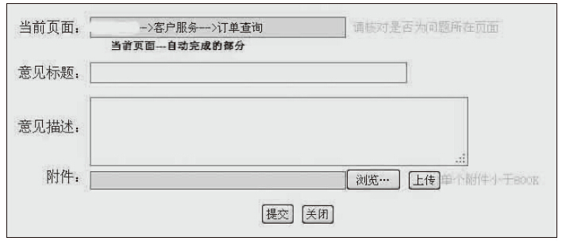
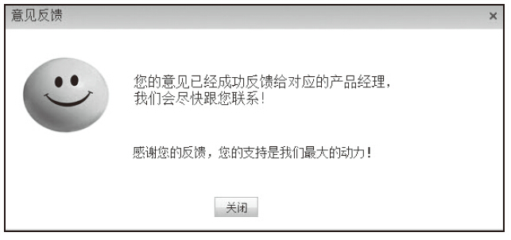

# 22 简约设计的两个原则和4个策略

朱军华

现任阿里巴巴资深产品经理，负责跨境电商交易线产品，历任1号店、盛大网络高级产品经理，目前专注于在线教育和电子商务系统产品方向，从事产品经理工作六年多，熟悉电子商务中的B2C和O2O两种模式，擅长电商的交易系统和商家管理系统的产品设计，对自营和平台电商的经营方式都很了解。对AxureRP快速原型设计颇有研究，致力于AxureRP原型设计的推广，通过IT民工网站分享自己对原型设计和产品设计的经验和心得。

精彩观点[[1]](part0496.xhtml#ch1_back)

简单并不意味着最少化，朴素的设计仍然具有自身的特征和个性。

换句话说，抛开极简主义，也能够成就简单。简单的特征和个性应该源自使用的方法、所要表现的产品，以及用户执行的任务。无论是设计整个Web站点，还是设计一个下拉菜单，都需要认识什么是简单的体验，这将成为判断自己是否保持简单的一个标准。

遵循下面的两个原则可以帮助你认识简单的体验。

1）简单而迅速的方式是用一句话把它写出来，包括要设计什么、要遵循哪几条设计规则，尽量使用最简单的术语。

2）用更好的并且耗费时间更长的方式，来描述你希望用户拥有什么体验，具体一点就是描述用户的使用情景，以及设计怎么满足用户该情景下的需求。

总的来说，就是先理解用户，再思考合适的设计。描述用户体验时，可以简单地用讲故事的方式来描述。故事的内容包括可信的环境（时间和地点）、可信的角色（谁和为什么）、流畅的情节（什么和怎么样）。简约设计的4个策略如下：

1）删除：去掉所有不必要的功能，直至减到不能再减。

2）组织：按照合适的标准将功能分类。

3）隐藏：把不重要的功能放在最后，避免分散用户注意力。

4）转移：只保留最基本的功能，将其他功能转移到其他地方。

日常工作过程当中最常遇到的是需求的组织。在做产品时，经常会收到一大堆需求，需求与需求之间看似相互独立，实际都需要产品经理分类组织，从而使需求之间产生关联，捏合成一个成型的产品。而着手组织前，一定要先理解目标用户的操作行为：他们想做什么，先做什么、后做什么，然后才是对产品的功能和内容进行组织。

其次是功能的隐藏，或者说是分清主次功能。主要功能肯定会占据产品的关键展示位置，而次要功能则会通过访问路径的设计，隐藏在较深的地方。不过，无论隐藏什么功能，都意味着在用户和功能之间设置了一道障碍，这道障碍对产品的影响，需要从设计上整体把控。但隐藏部分功能是一种低成本的实现方案，可以选择那些不常用但必须有的、可以自定义定制的、使用或帮助提示等功能，做到虽隐藏，但又容易找到。

再就是删除，也就是我们常说的“做需求的减法”。很多时候，我们都是在一味地接受需求，而没有考虑去掉某个需求给产品瘦身。而实际工作当中，删除需求也是对产品经理的一大挑战。首先要分析是否可以删除，删除后的影响会有哪些，为什么可以删除；其次要说服需求提出方，不在产品当中实现这个需求。删除不必要的功能，这样可以专注于把有限的重要问题解决好。而删除已实现但效果不够理想的功能也很重要，虽然会造成已经付出的时间和努力白费，但这些功能也会导致一定的维护开支，有些成本是不可能收回来的。需求是要控制的，控制不是目的，是为了发现核心需求。

最后的转移策略是最难的，不是简单地从这边移到那边，而是要综合分析两边的情况，在删除A产品的功能时，要组织和隐藏好B产品的功能。因此要做到转移，并不十分容易，要综合运用上述3种策略才行，但原则就是产品要给用户一种操作简单的感觉。

实践案例

意见反馈的功能，相信大家都已经熟悉得不能再熟悉了，却往往在设计产品时忽视这个功能的设计，使产品在上线之后没有渠道供用户反馈，造成初始产品信息收集出现障碍，或者是这个功能设计得太过随意，用户在使用时非常不顺畅，用户体验很差，这样就造成用户反馈问题的积极性下降，也降低了用户的参与度。这虽然是个小功能，但对产品来说很重要。

用一句话描述意见反馈的主要功能，那就是在产品中提供一个入口让用户来填写所要反馈的信息。既然是要让用户主动填写，考虑到用户参与度的问题，就要求这个入口的呈现是自然的、使用是无阻碍的、交互是友好的，结合用户的使用场景，需要在如下3个方面提升用户体验：

1）显眼，能让用户一下子就找到。

2）易操作，用户通过简单的打开—输入—提交即可完成。

3）接收后要有反馈，即友好的交互，可以有反馈和答复，让用户看到我们的用心，给用户愉悦的感受，激发他们反馈意见的热情。

这样依据简约设计的两个原则来说明意见反馈功能，可以清晰地认识到该功能的整体脉络和设计思路，可以指导实际设计过程，确保用简单的设计实现功能。

1.组织：设计显而易见的入口

意见反馈功能属于不常用但必须有的重要功能，因此先分析这个功能的潜在用户的操作行为。

用户会提供意见反馈，本身需要一定的主观能动性，可以说明用户对你的产品有一定的喜好，否则不会愿意花这个时间成本去反馈；而用户操作使用的场景一定是发现了产品的问题或者在使用过程当中产生一些改进的想法，第一时间需要找到意见反馈的入口，否则可能会打击用户反馈的积极性。这样看来这个功能应该显而易见。

Web类产品最常见的是将该功能放在页首或者页尾，现在也还有很多站点采用这种方式。而最便捷也是最流行的方式是侧边栏悬浮，可以跟着用户浏览页面一直呈现，随着滚动条的上下滚动而上下移动。这样的设计可以让用户随时想反馈时一眼就看到入口。

App类移动端产品受限于界面布局，大多都隐藏在三四级菜单中，但都是较为固定的访问路径设计，一般都在产品设置菜单的“使用帮助”或“关于”菜单下，这使用户切换App产品使用时，不必付出新的学习成本。

2.隐藏：为产品核心功能让路

对于任何产品来说，意见反馈这个功能肯定都不是产品的核心功能，这就需要为产品的核心功能让路，从而只能占用一小块版面或访问路径隐藏得更深。

从逻辑上来讲，在用户看到入口时可以直接操作是最简洁的，但这需要把意见反馈的填写表单外露出来，而表单所需占用的位置无路如何都会比“意见反馈”这4个字所占用的版面大得多，这样就会影响产品核心功能的呈现，这时就得在设计过程中权衡，宁可让用户多点击一次入口打开填写表单，从而节省空间。App端产品也是如此，高层级的访问菜单需要留给更为关键的功能，而意见反馈则一般放置在第四层级左右，甚至更低。

3.删除：确保操作方便快捷

当产品的程序出现错误需要反馈时，最好的方式是产品内部后台自动打包所有的错误信息，提醒用户点击是否发送就可以了，这个是比较极致的设计，把打开、输入这两个环节都删除了，只留下提交。

这里为什么要提醒而不是直接在程序后台发送，与是否尊重用户有关系。莫名的抓取用户的使用信息会让用户反感，而主动权交还给用户，用户欣然接受的可能性是很大的。

用户选择入口后，一定要保证入口的准确，不要挂羊头卖狗肉，明明是“意见反馈”，点进去变成了用户满意度调查或者是帮助中心，这样用户体验比较差。进入之后的填写操作一定要简洁方便，能帮用户完成的部分尽量自动完成，减少用户的填写量。提示引导信息也要尽量准确，不要造成误解。首次设计的反馈界面原型如下图。

这里放置的“意见标题”一开始是为了便于反馈过来的意见以列表展示，可以方便客户服务人员进行查询、搜索、回复，但后来考虑到用户实际使用的场景后发现，让用户临时归纳一个标题出来是很难的，而且发现这个需求可以转化，列表展示可以缩略，搜索可以全量，因此最终决定把“意见标题”一项删除，直接让用户填写反馈内容。

4.转移：友好的交互是产品的延续

很多时候做到上面3个部分就基本完成了意见反馈功能的使命，但任何操作都要给出有效的反馈，这是交互的一项原则。所以要在用户提交之后，给出友好的提示信息，这样做有3个方面的作用：一是告知用户已经成功接收所提交的信息；二是感谢用户的参与，鼓励其后续继续关注产品；三是告知用户后续的跟进处理方式，提升用户的满足感和成就感。

在设计功能时，产品本身应该只接收反馈内容，并不承载后续的答复和回馈功能，一般都将这一功能转移到CRM系统上，通过CRM系统来管理所有的意见反馈，以及联系用户进行后续的沟通和安抚，而这正是转移策略的一种体现。

对于需要收集产品上线后用户实际使用感受的，意见反馈绝对是一个很好用的功能。开发成本很低，却能获得比较显著的效果。但这个小功能在设计时却大有学问，把简约交互设计的两个原则和4个策略都应用到了，真可谓是小功能大设计。

总结分析

产品经理在给产品添加每一个功能之前，都应该思考如何应用这两个原则和4个策略去设计产品，以达到简化产品并把功能做到极致的目的。

两个原则可以帮助认清产品功能的设计思路和设计要求，在设计伊始就明确产品的定位，以及产品后续用户体验的要求，基于用户使用功能的实际场景，给出对应的解决方案。

4个策略可以指导产品的设计过程，以追求极简设计的产品，确保产品可以突出核心功能，没有冗余的功能，以最合理的方式呈现给用户，用最简单的方式实现最大化的功能。

从简单的角度去描述产品设计有一定的参考价值，可以部分应用到互联网产品的设计当中。简约的设计并不代表着简单，而简单的用户体验是初学者、新手的体验，或者是主流用户的体验。从用户的感情需求角度来看，简单设计就是让用户感到自己能够掌控一切；从产品功能规划角度来看，简单设计就是突出产品的核心功能，让产品功能达到极简。

[[1]](part0496.xhtml#ch1) 参考图书《简约至上：交互式设计四策略》（作者：Giles Colborne[ 英]，译者：李松峰，秦绪文，人民邮电出版社，2011年出版）。
