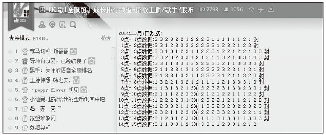
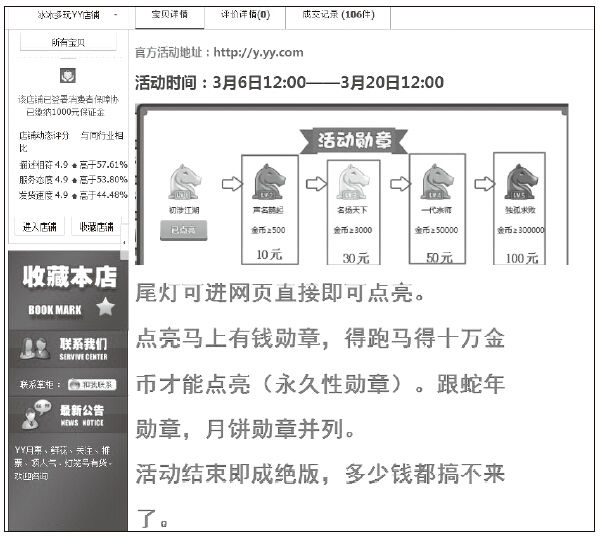
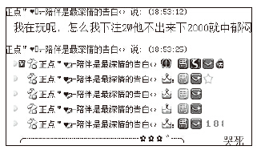
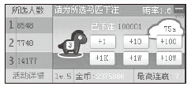
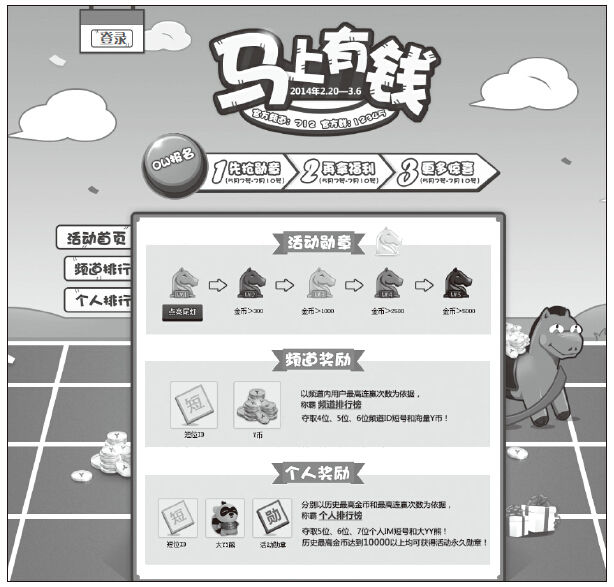
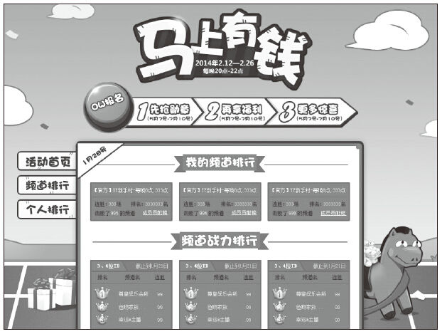

# 40 产品活动运营的6个有效原则

崔凯

YY语音基础产品部产品经理。2013年毕业于电子科技大学，获工学硕士学位。工作聚焦在以YY客户端为载体的平台产品设计和项目管理，热衷钻研交互设计、智能硬件和web页面设计。对客户端、web端的产品策划和活动运营有较为丰富的经验，完整策划并运营过百万级UV规模Web页面和运营活动多项。

所学专业为雷达信号处理，在校期间亦做过学生辅导员，毕业后转行进入互联网。个人涉猎广泛，喜好尝试新鲜事物。

个人微信号：cuikaibb。

精彩观点

如何挖掘社交红利？让信息在关系链中流动。

要通过社交红利来“引爆”运营活动，需要充分利用用户的好玩与好奇心理、获利冲动，也要充分利用关系链的传递，让活动的信息在社交网络中流动。以下6个关键法则就是在社交平台上成功举办活动的提炼。

（1）免费

免费既包括费用，也包括额外的要求和条件。参与活动的门槛越低，覆盖的人群就越大，从中能够发现与获得的目标用户就越多。

（2）简单

在轻量原则下，活动的规则也需要尽可能设置得简单。越多越复杂的规则，用户越不耐烦。

（3）透明

如何获得活动设置的奖励，是否获得了奖励，谁最终凭借什么条件获得了奖励？整个流程的公开透明，可查可证，不仅是和参与用户最好的沟通，也会极大降低后续的无谓投诉。

（4）有趣

社交网络的各种玩法本来就像游戏一样，在不断推陈出新。有趣能够吸引更多用户参与，也能够激发用户新的自娱创造，从而推动信息扩散再度拉升效果。

（5）可累积

利益的累积能够充分调动参与用户的积极性，不过这一规则也不能无上限，而是在一定的限制条件之下。

（6）可兑现

获利的兑现就像在社交网络中的互动激励一样，要细微并及时地下发，即只要用户达到了兑奖条件，就可以获得奖品。

尽管SNS对消息传播、网络营销的价值已经得到普遍认可。但是社会化营销的运营者往往“套用”这条路而不得法。运营活动最大的难题就在于，活动难以传播，缺乏用户关注和参与。主要困境通常来源于活动的规则和核心玩法设置不合适，活动“RUN”不起来。

怎么让活动能够自发地在社交网络中传播，让传播的发起者参与并乐于分享，让信息的接收者也能融入活动。拿这6个标准来衡量，小米在微博上的运营活动就能很好地符合：通过近乎零成本的操作，让种子用户将活动信息在微博上层层传递，转发一个简单动作就能抽取奖励。利用用户获利冲动，将微博、微信、论坛和电商渠道的用户相互流转，极大地发酵了活动效果，也沉淀了更多的用户。

实践案例

YY语音的活跃用户量在国内互联网企业中一直位居前列，从游戏语音工具出发扩展到富集互动表演、游戏运营、直播和工具、社交的自生产内容的平台型社区。从用户的属性看，消费能力、互联网接受程度，甚至于文化水平的跨度也是非常巨大的。面对复杂、海量的用户群体，YY在用户活跃方面有两种打法：一是由各个细分业务有针对性地给对应属性的用户展开活动，如娱乐的主播挑战、游戏直播的电竞联赛等；另一个则是由平台方利用客户端统一资源位调动全网用户展开活动，这类平台活动的频次约为一季度一次。

作为负责YY平台业务一方，在2014马年伊始，我们成功策划了一场调动数百万用户和数十万频道（YY独特的生态型产品，可实现音视频互动的兴趣“社区”）参与的运营活动“马上有钱”（结合频道的赛马游戏：用户通过投注获取虚拟币和积分用以抽奖和升级，频道通过频道内用户获胜的数据进行比拼），得以明显提高用户和频道的在线时长，同时拉动新用户和盘活老用户。

活动策划开始前，我有幸已经阅读过《社交红利》一书，对于“免费、简单、透明、有趣、可累积、可兑换”6个原则有一些思考和归纳。在设计活动核心玩法和设置社交关系链“爆破点”的过程中，正是这套原则应用和验证的过程。

1.免费：门槛降低到零，覆盖所有人群

参与用户/目标用户的占比是衡量活动效果的重要指标，在活动确定之初必须选定目标用户。从传播的角度，凸显鲸鱼用户和推动快速传播是不违背的两件事。只有把尽可能多的人纳入活动的“网络”内，快速建立起活动的公信力和价值，在社区内一呼百应的“国王”才会参加到活动中，反过来推动活动进一步扩散和建立价值。

所以我们在设计之初就选择不对用户设置任何门槛，并通过游戏玩法尽量将用户间的“地位”差距拉低，创造“屌丝”亦能逆袭的环境。对于频道，我们则依照频道规模将大、中、小频道区分开比赛，意图也是驱动弱势的广大人群能够积极地参与到活动中。

2.简单：做傻瓜也能操作的游戏

在游戏的交互上，作为用户，参与游戏只需要一次“下注”操作；作为OW（频道拥有者）只需要报名活动，就可以坐享其成。

在虚拟炫耀的勋章点亮方式上，亦不需要用户做复杂的激活、兑换操作，只要参加游戏就自动获得初级的勋章，并自动随等级增加而增加。

在活动规则设计上，全服务器同步数据下进行三匹马赛跑游戏，赔率一致、概率一致，用户全凭主观判断或社交影响做出决策。结果一目了然，下多少注获得多少收益也非常清晰。

在活动奖励上，考虑了多种维度的榜单设计后，还是回归到比对连胜场次和虚拟币的数值上，通过排行榜同步更新。用户多少名次对应多少奖励形成清晰的梯度。

3.透明：活动的一切都拿出来晒

由于活动奖励包括了短位频道号和IM号、全网排行榜等平台具有货币属性的资源，外挂、黑客、骗奖、投诉的风险需要提前预估和解决。所以活动规则在确保活动赏罚分明、有序进行方面有重要作用。对于作弊刷数据的“刷奖党”，不仅在榜单发布前就将其清除，还第一时间在官网和论坛明确发布公告。对于活动发奖中领奖以后又装作没有领奖的用户，以奖品去向溯源和聊天记录查证的方式，揪出破坏活动生态的害群之马。

4.有趣：做有卖点、有观点、有槽点的三有产品

活动名称采用流行语“马上有钱”，活动页面和游戏UI选取接受度较高的萌系卡通风格，活动榜单设计得威武大气——打造核心卖点：“有意思的游戏”。

“马年有大礼，马年最好玩”，这是我们希望通过活动带给YY用户的新年礼物。我们的出发点和力图给用户展现的元素，都围绕着马年好玩的概念来包装。

用户的吐槽是用户是否买账的侧面反应：活动中用户自发地在频道内发言评论结果，出现了专业解说“赛马”的主持人和解读选马经的“伯乐”，还出现了辅助下注的各种第三方软件，甚至视频教程。有的时候尽管是烦恼，但是这是甜蜜的烦恼。我们在活动过程也注意了正面的引导。

5.可积累：让强者更强的游戏

因为活动的目的是调动用户的在线时长，所以用户仅仅参加一次游戏对于我们是不够的。我们采用了网络游戏的成就方式来反复持续地调动用户。

等级和勋章：通过玩法设计，用户的等级和勋章从概率上看和游戏次数正相关。

游戏币发放：避免用户因为输掉资本而流失，通过在线时长奖励和每日登录奖励的方式来增加游戏整体的货币供应量，让弱者不至于放弃。

万能的榜单：在YY这样的土豪、大主播占据绝对曝光和关注的社区内，有一个百万UV的排行榜来展示游戏中的高级玩家而非有钱人，吸引排行榜前列的个人和频道不断投入。

6.可兑现：用数值和炫耀将成就量化

奖励的设计，一定要注意普适性和差异化。普适性是指要让所有参与活动链条的用户都能从中得到好处，差异化是指给予活动中的强者巨大的利益，以刺激更多的人追求地位和膜拜。

我们在活动中设计了两条积分体系：一条是货币路线，通过游戏胜负来获取金币，用户凭借金币来兑换抽奖的机会；一条是积分路线，为了认知简单与货币数值挂钩，与货币路线不同的是，积分不会有消耗的情况，只由货币的最大值决定，通过积分来兑换炫耀位。借此，我们很好地解决了用户行为的激励（发奖）和炫耀（勋章）的统一配合。

赛马活动用户自发记录和分析比赛结果

淘宝代练赛马活动的业务

用户在频道内炫耀游戏勋章

“马上有钱”活动游戏界面

“马上有钱”活动官网

“马上有钱”活动排行榜

总结分析

（1）游戏化产品在关系链中，可能是很好的传播载体

产品设计中很重要的一环是给予用户行为的反馈：正向奖励、负向惩罚。游戏化思路设计能通过用户行为的量化，以积分、勋章、等级、战绩等方式对用户进行炫耀和激励。这种炫耀的冲动在社交网络中传播，能够更好地刺激到关系链上的更多人。

（2）传播方式的选择：找对人、找对地

网络世界中信息总是过载的，粗放式的运营也很难平衡投放成本。找对目标用户，找对投放渠道，做精细化运营，已然是摆在所有运营者面前的必由之路。找到能提供大量持续，画像匹配的目标用户群，具有形式丰富、触达迅疾的有效渠道的产品，这很关键。

（3）想清楚这一点很重要：你能给用户什么

用户给了你社交红利，你能给用户什么？在设计社交活动中，要学会把用户当傻瓜；但在给予用户反馈时，千万不要把用户当傻瓜。你给的东西、获取门槛，能否留存都极大程度地影响返回红利的多少。不能指望别人给你免费打工，正如你不会为别人免费打工一样。
