# 五、综合提升

昨天谈到了通过原型去验证需求的重要性、常见的思维上的缺陷。今天来通过七个例子来与大家分享原型设计中的可以提升的地方。这七个例子主要都是针对控制面板型的WEB应用来说的。当然，值得借鉴的仍然是观点。最后会对所有的观点进行一个简单的总结。

第一个例子，对用户登录的设计。大部分我们见到的面板型的WEB应用，都是登录成功以后直接跳转到新页面。但也有少部分加了一个中间状态。比如gmail，会出现一个进度条。

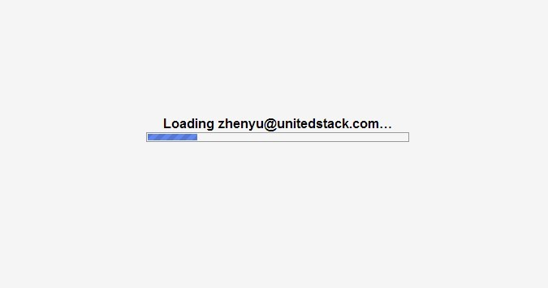

虽然看似这是一个可有可无的设计，但是到了网速慢的情况下，特别是国内目前的情况，它相比于没有进度条带给用户的体验差别就很大了。从用户角度来说，只要进度条满了成功打开gmail，就不会有任何问题。否则的话用户会明确怀疑是否又是网络出问题了。特别是当看到进度条不动的时候，用户肯定会主动去尝试刷新。想象一下，如果只是单纯的跳转，用户一直在白屏阶段等待，他很可能就会纠结到底是自己网速慢呢，还是又被墙干扰了？要不要刷新？如果碰到只刷出一半的情况，或者部分脚本加载失败，有些功能用不了，那给用户的第一印象就变成了产品可能有问题，特别是对于还没有在用户心中建立信任的新产品来说。所以这个进度条的设计实际上是主动向用户汇报了状态，以及可能失败的原因，降低了被责怪的风险。其实除了进度条以外，我们还常见另一种同样原理的设计，就是先渲染出页面整体框架，再在有提示的情况下再加载数据。这样的好处在于整体框架涉及的都是静态资源文件，可以通过缓存等各种方式加速，几乎不会出问题。而动态数据即使加载不出来也可以友好地在界面上提示用户网络有问题。这里青云的设计还有一个非常有意思的点。即他没有用非常明确的效果，比如gif图，去表示自己仍在加载，而只是用斜体淡灰中文写了正在加载四个字。

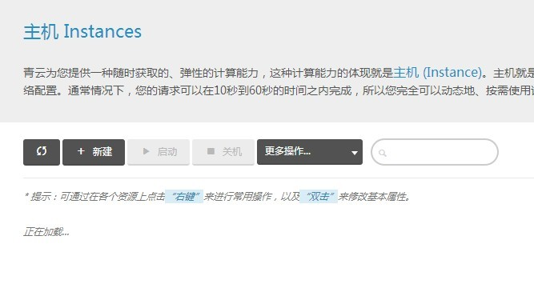

这样在网速快的时候你几乎注意不到，不会出现gif图一闪而过的情况。在网速稍慢的情况下，当你看完到它的整体框架并有意识的看到这四个字的时候，它也该加载完了。再慢就是真出问题了。进行分析的时候还是不去揣测设计者的意图，我们只看效果。人眼能识别出变化的最小时间单位是0.1秒。进入有意识阅读的状态是0.4秒。无论在理论还是实际中，青云目前给人的感觉都非常优雅。这个例子要表达的观点非常重要，就是除了流程以外，任何体验也都是连续的。这一点在只有图的时候很容易被忽视。

第二个例子，布局与配色对用户的视觉引导。最近看到一篇文章讲到阅读型的互联网产品对用户最好的都是采用“F”型布局，并且通过穿戴设备采集了用户浏览时的注意力焦点，予以佐证。

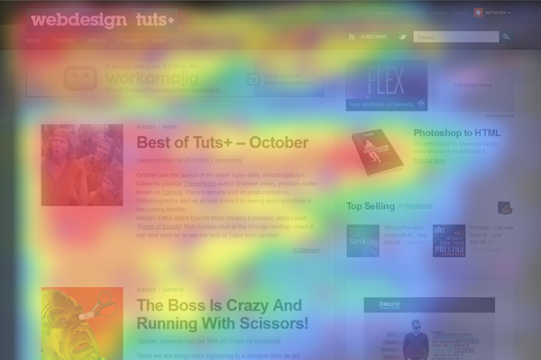

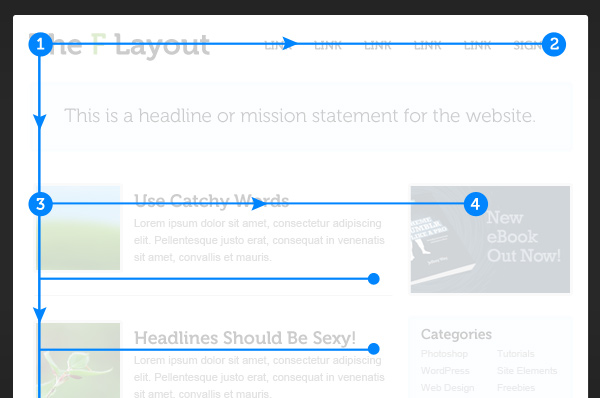

中小团队大多没有这样的研究实力，那直接用别人的成果也不错。要明白的是，布局和配色不只是一种效果、一种风格这么简单。它们在第一时间共同承担了表达信息架构的重任。在第一时间告诉了用户什么是重要的，什么是花边，什么是完全不同的另一种内容。并且要注意的是，配色对信息表达的影响要大于布局。认知心理学里提到，人眼在不同的颜色的文本或者不同背景色的文本间切换的时候，会重新建立识别模式。也就是让人下意识感觉到进入了与刚才不同的阅读环境。所以在同一内容的区域使用差别很大的颜色时要非常注意，看是否给用户造成了阅读上的干扰，颜色远不只是好看这么简单。曾经见过一个正好应用了反差较大的颜色来表达出信息层次感的例子。一个新闻类的站点，新闻从上至下工整排列，标题统一使用加粗加大的粉色字体，而正文用浅灰色。这种设计在视觉上把信息分成了两层，即标题层和内容层。好处在于用户读完标题觉得不感兴趣就可以直接跳到下一个标题了。

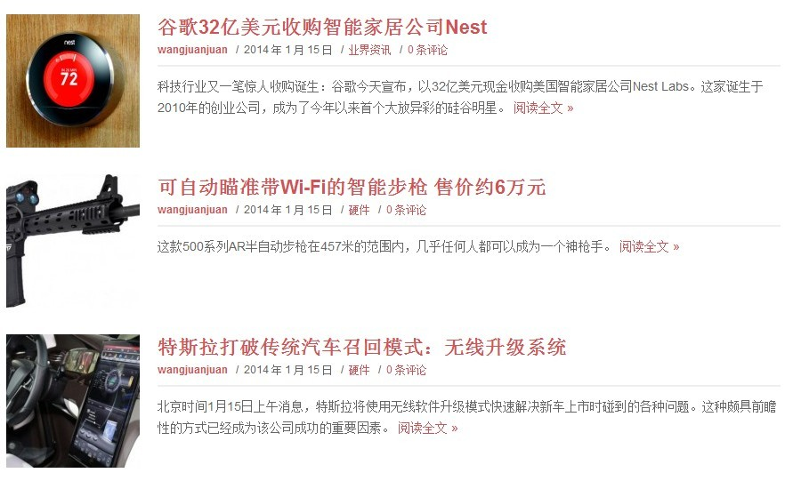

第三个例子，为中间用户设计。做设计的时候非常讨厌听到一种声音就是，“用户刚开始用的时候什么都不知道，我们要做到让一个小白用户都能很好地用起来”。特别是对于控制面板型的应用，本质上就是一种工具。工具的用途是让用户做某件事情变得更有效率，它必然会带来一些规则。设计的目的在于去衡量这个规则是否是用户可接受的，换来的效率的提高是否值得。而不是努力把用户当成“傻子”。想想你去餐厅吃饭服务员跟你说“我们这里是先点菜，然后上菜，然后您吃，最后买单”，你会不会隐隐感觉被侮辱了？即使是对新手来说，需要的也是引导，而不是迁就。有很多附加信息你可以写周边帮助里面，或者直接写在鼠标悬浮在相应元素才出现的tooltip里。如：

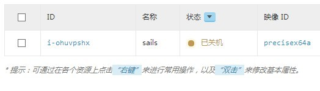

普通人在不明的情况下，至少会把鼠标放上去，或者尝试点击。所以大部分时候根本就不用担心用户用不明白的情况。让任何一个用户都能获得最佳体验的方式是，在学习成本尽量低地情况下达到最大的效率。《交互设计精髓》里面有一个很好的建议，就是永远把用户想象成聪明但是很忙的人。这样你就能很好地去评估你产品的学习成本、效率之间的关系了。用户同样也会感觉到你对他的态度。这里难以让我不去表达更进一步的观点，即“越是为每一个人单独做的设计越好”。这很好理解，就像衣服最合身的当然是量身订做。但实际的产品设计中，至少目前看来很难做到，所以才会有“为中间用户设计”这样的妥协，才有通过引导来主动将新手变成中间用户，才有进一步配合营销等策略来教育用户，获得理解和认同。即使我们的设计并不符合部分人的习惯，但目前我们也只能想办法改变他们。

为什么“通过教育用户的方法”而不是“提供尽量多的选择给用户的方法”其实通常是出于商业上的考虑。如果我们提供给用户的选择不会造成学习和使用的负担，同时也不会消耗太大的成本，那么提供选择让用户自定义明显是一种更好的提高用户体验的方法。或者更好的是，能有类似于OPEN ID之类技术实现，能让我们获取通用的用户喜好，来在第一次呈现给用户的时候就是为其量身定制的。不过目前为止，推荐的匹配程度仍是个技术问题。

第四个例子，消息反馈系统的设计。任何一次交互，都像对话一样。用户期待的是马上响应，即使不能有结果，但你至少得告诉我你正在处理。否则就会让人感觉像见了公务员。目前我们常见到消息反馈的设计分为三种：第一种，直接在交互元素上进行反馈。例如点击按钮以后按钮文字变成正在处理。或者在该操作的“象征物”上进行标示。象征物可以是小图标，例如操作系统的应用程序图表，表格某一行或者是菜单栏的某一项。相应的反馈就会像是这样：

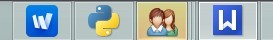

或是这样：

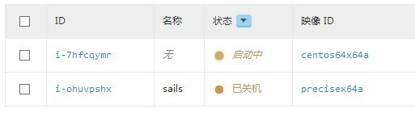

这种方式最主要的使用场景是，对用户刚刚的操作进行简单的提示。例如上图中用户刚刚开机。消息就是直接通过表格来反馈。其实大部分情况下，只要语境正确，没有文字，用户也是可以理解的。这样的消息反馈，目的只是为了告诉用户上一步操作的结果，具体的信息还是交给用户自己决定要不要去查看。

第二种，统一的悬浮层显示消息，例如gmail顶部显示的小黄条。

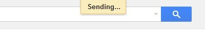

这种方式主要适合于没有象征物，消息又不严重的情况。注意，这里说的是不严重，不是简单。不严重指的是刚刚的操作不会对用户的业务造成不可逆转的后果。这里非常值得一提的是，我们在对重要操作的设计中（例如删除），常常使用弹窗询问用户“确定吗？”的方式来防止误操作。虽然在一定程度上确实防止了误操作，但本质上这是一种偷懒的滥用。因为使用弹窗来询问其实最适合的是，用户在确定之前进行了一系列的操作，最后很可能需要核对一遍，才适合用弹窗。并且弹窗中应该包含所有需要核对的信息。而为了防止误操作，应该在可行的情况下尽量使用“允许用户撤销”的方式。例如：在gmail中删除邮件时，gmail会提示

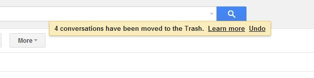

特别是对于工具类的产品来说，在体验上用户最喜欢的一定是高效率，所以我们始终应该围绕着如何在尽量不打断用户的情况下，把所有功能做稳定。

第三种，在一个统一消息管理的区域进行显示，例如Azure的下方。这里的设计并没有好与不好之分，采用什么方式其实完全取决于当前交互的重要程度。如果是重要的交互中出现了错误，还可以使用弹窗等形式来强迫用户做进一步处理。

第五个例子，任务管理的设计。任务管理与消息反馈其实是相辅相成的。任务管理指的是让用户知道当前的操作已经进行到了什么程度，例如文件上传进度。通常我们见到也就只有进度条或者转动的指针而已。这里首先值得注意的是，什么时候要进行专门的任务管理设计，什么时候不要。这是需要进行仔细辨别的。严格来说，只有时间长并且用户明确需要进行其他操作的时候，才应该去做一个专门的任务管理。对于普通的操作，5秒内的等待是可以允许的。同时要考虑到用户是否会在反馈失败后再次尝试。如果大部分都会，你就应该直接提供一个再次尝试的按钮，并且支持直接使用刚才用户提交的数据。其次值得注意的是，使用什么样的形式做任务管理。我常见到的一种糟糕设计是，重复告诉用户他刚才干什么。如果你只能反馈成功还是没成功，为什么不直接展示在相应的元素上呢？另外，任务的中间状态对用户真的是有用的吗？如果不是，就应该尽量考虑轻量的设计。

第六个例子，图表的设计。说得好听点就是数据可视化。都可以写好几本书了。但本质上其实一句话可以概括，就是“图形化能够利用人视觉上的特定识别能力来传达更多的信息”。关键在于要利用哪些识别能力，是“自动归类”？还是“快速选择”等等。这里需要一些认知心理学等相关的知识才能深究，我想表达的只是外围通用的东西。首先是图表的最大化。最大化如果仅仅是图标按比例的放大，那几乎没有意义。必须增加更多可表达的信息。但是这些放大后才能表达的信息用户刚开始是看不见的，所以还需要有明确提示说明放大后能查看到什么。其次是要关注用户产看图标中的特殊需求，监控工具New Relic有一个很好设计就是图标联动。即用户鼠标放在一个图表上时，同页面上的其他图标会显示出相应坐标的数据。

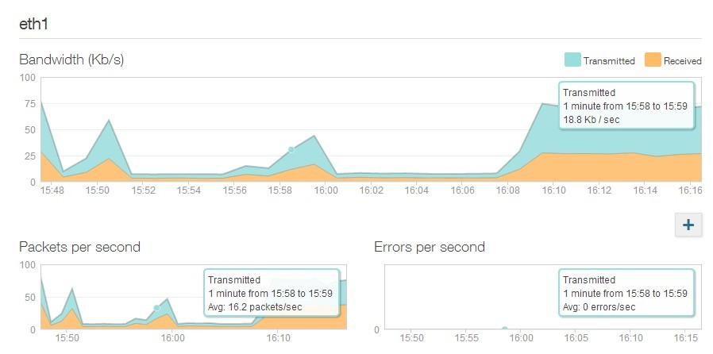

显然这样参考具体的逻辑。但无疑是值得挖掘的。

第七个例子，减少等待。终于又重新回到了前面提到过的对产品的观点。我始终把我做的东西当做自己的一个分身，它要代表我去和用户对话，我始终希望用户对我最后评价是：“很有帮助，很聪明，很优雅”。因此这也是为什么要尽量去优化用户的使用流程，减少等待的原因。特别是有耗时长而需要进行多步操作的时候，虽然流程中出现失败的可能性很多，但成功通常只有一条路径。为什么不让用户把他需要做的先一次性做完，然后再一起等待？出错的问题应该尽量通过提高服务稳定性去解决，而不是通过占用用户时间。

这七个例子几乎完整地描述了一个产品原型需要注意的各个方面，最后我们来交流一下综合前面的文章我所表述的主要观点。希望在读到这里时你已经收获了自己的观点。

第一，产品设计的基础是有章可循的，通过阅读经典的书籍，学习成功团队的方法足以。更多的是无论产品经理还是设计师都要有艺术创造的能力和态度。要提高认知、接纳事物本质的能力。只有这样才能正确地、全面地做出好产品。

第二，产品的起始仍在于需求，无论是来源于自己还是外在世界。但是人在任何情况下都不可能做出绝对理性的判断，我们由于自己情绪的影响、思维的不严谨等等原因可能会错误地认知自己的需求。这个时候只能回头不断检验自己的目标，将自己的逻辑分解成一个一个几乎无需再证明的点。才能逐渐帮助我们认清楚真正的需求。特别是对于团队决策来说，起始决策的失误都将被无数倍地放大。而团队人数一旦多了，又更可能出现信息沟通不畅、决策职责不明确等等问题进一步降低决策的正确性，因此一定要更加重视与严谨地对需求进行验证。验证的具体方法根据实力、场景千差万别，但直接有效的仍是直接通过产品原型进行验证。原型的表达方式根据产品的主要功能而定，对原型的设计其实同时也是创造者对用户体验进行摸索而提出的假设。验证的过程需要创造者精心设计与控制，遵循常规或者照搬书本反而是一种浪费。在控制得不够客观的情况下得出的结论反而会有副作用。

第三，在设计的过程中，有几个特别值得关注的观点这里再回顾一次。首先是“连续的用户体验”，之前已提到过多次。因为我们在研究与思考的过程中不得不把整体拆分成部分进行更仔细地思考，所以常常容易忽略前因后果带来的影响。特别是当原型不够完善的时候，更应该足够重视。同时我们在思考流程的时候，“连续的用户体验”这个观点还能带给我们新的视野。例如著名的“上传镜像之后增加直接创建虚拟机的功能是不是sugar”的问题。还有本篇中第七个例子中的减少等待，都是在尝试将用户操作的出口入口、时间等因素综合起来思考得出的实战改进。其次是对于“为用户量身打造”的观点。这其中设计到商业成本、实现技术、表达方式等等细节，但毋庸置疑这是个非常值得关注的方向。

第四，不管是原型还是真正实现。设计的功效其实都是远远大于设计本身这件事的。它跟用户直接相关，所以它也应该和商业模式相关。它是具体实现的方向，所以它要通晓技术实现能够达到的程度。特别是对于想要在设计上取胜的产品，没有得到足够重视几乎是不可能实现的。

又长篇累牍讲了这么多务虚的东西，恰巧今天看到一位著名产品经理所说，“求干货，只能说明你仍是个外行”。我倒没有这么绝对，我认为交流最好的方式仍然是借干货为入口，表达观点，表达自己本身。毕竟设计上的方法论相对技术来说，发展要慢地多，大部分都是需要设计者本身去灵活运用的。需要设计者为每一个个案量身打造一套属于自己方法。所以我们必须关注在人身上，关注在认知、思维方式上才能真正有意义。
