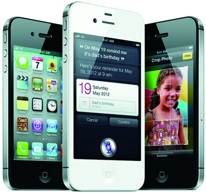
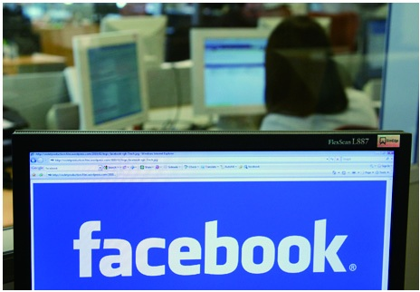
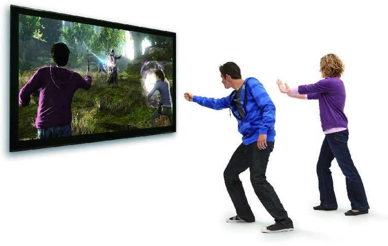
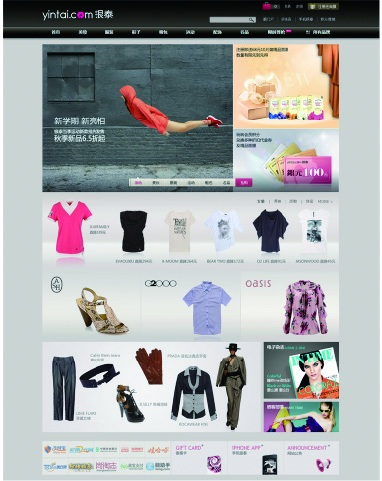
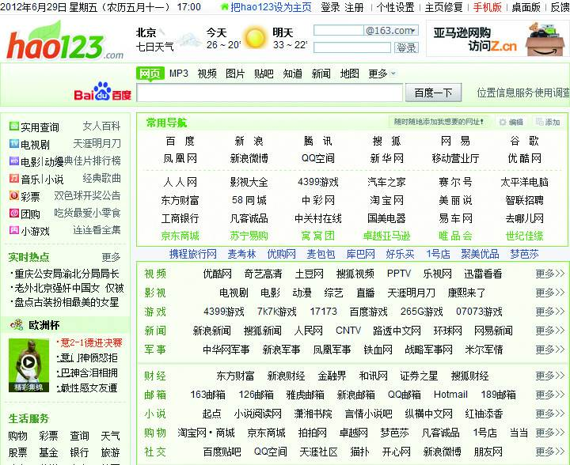
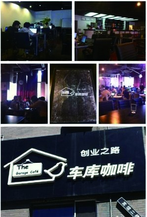
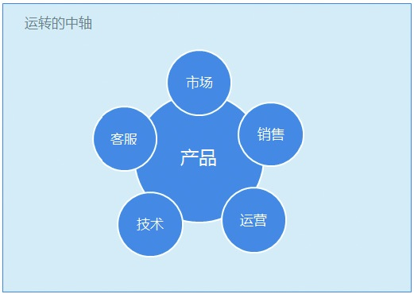

# 第1章 从热闹到门道，解读产品经理

1.1 为什么很多人选择做产品经理

1.2 产品经理的金字塔分布

1.3 走出产品经理的几个误区

1.4 产品经理应该具备的能力

1.5 企业青睐什么样的产品经理

在历史的长河中，出现过很多优秀的产品。如：中国古代的四大发明（造纸术、指南针、火药、活字印刷术）；工业革命时期的蒸汽机、发电机、内燃机等。或许现在人们已经忘记了这些产品背后发明者的名字，但正是这些人的付出，使得科学技术得到突飞猛进的发展，他们的发明也被迅速应用于工业生产中，大大促进了社会的进步。

在科技快速发展的当今社会，咖啡机、飞机、通信卫星、搜索引擎、网购平台、智能手机等各种优秀的产品给我们的生活带来了便利。不过，你知道在这些产品的背后有“产品经理”这样一群人吗？可能你从未想过产品经理在产品的研发和生产过程中起着什么样的作用，这个职位又起源于何时，不过，这些都不重要，重要的是在我们的世界里一直有那么一群人在不断探索、不断求实创新，他们就是——产品经理。

谈到产品经理，可以说，乔布斯先生是所有产品经理的偶像，虽然他已离我们远去。但他创造的iPhone手机颠覆了传统手机的概念，他让手机成为一款兼具通信功能的娱乐设备，并且风靡全球。

再来看看大洋彼岸的Facebook，它于2012年5月18号晚在纳斯达克上市。开盘价42美元，市值达到1151亿美元，这也成为历史上规模最大的一宗科技公司IPO，这家以提供SNS（Social Networking Services）产品服务的公司的老板，80后美国男孩马克·扎克伯格也一跃成为超级富豪，并且富可敌国。

接着将目光转向国内，2009年8月以前，门户网站新浪一直由于没有新的亮点产品推出而表现平平。但随着其微博产品的推出，公司股价一度飙升至138美金/股，可见微博的发展势头有多么强劲，事实上，新浪微博上线不到24个月，注册用户数就达到了2亿。

任何一个产品做好了都有可能影响整个社会，所以很多人说产品经理是伟大的。乔布斯、扎克伯格、比尔盖茨、马化腾、雷军是幸运儿，或许同为产品经理从业者的我们，也有朝一日可以成为新宠。

来看看微软的体感游戏产品KinNect。体感游戏（Motion Sensing Game），顾名思义是用身体去感受的电子游戏。体感游戏突破了以往单纯以手柄按键输入来进行操作的方式，是一种通过肢体动作变化来进行（操作）的新型电子游戏。

看过钱钟书所写的《围城》的朋友，想必对这句话会记忆犹新——“每个站在墙外的人看里面都觉着好，想进去。真正到了里面看到这个那个的问题又觉得不怎么样。”对于产品经理这个职业来说，这句话似乎同样适用，很多人千方百计成为产品经理，但真正跨入这个行业，却又觉得产品经理其实就是炮灰，又苦又累，那么，真的是这样么？

在我看来，产品经理这个行业有点像出国留学：入学容易，毕业难。也就是说，做产品经理容易，要想成为一个优秀的产品经理却是难上加难，画Axure原型的和负责几百上千万用户的都叫产品经理。很多产品经理认为自己是又累又操心，得到与付出却不成正比。那产品经理到底是精英还是草莽，或是草根？从热闹到门道，下面就来为您揭开产品经理那层神秘的面纱。

## 1.1 为什么很多人选择做产品经理

女怕嫁错郎，男怕入错行。我周围有很多开发工程师、交互设计师、品牌经理、做销售的朋友对产品经理这一职位都非常感兴趣。但是否每个人都适合做产品经理呢？接下来，我将结合自身对互联网产品经理这个行业的认识进行分析，希望能给大家一点帮助和启发。

### 1.1.1 有强烈的市场需求

从市场需求量来讲，互联网产品经理的需求远远没有饱和。大量的传统企业（比如国内著名的银泰百货等）开始意识到互联网市场中的商机，于是纷纷加入互联网。而且互联网产业中的公司本身也在大规模借助传统资源，努力去改变更多的传统行业。

伴随着这一大潮的到来，无论是老牌互联网巨头，还是那些有传统商业智慧且刚刚投入互联网世界的公司，都迫切需要大量有一线执行力、能很好把握用户需求的产品经理。

1.商业势力重视产品

1999年，很多人对hao123.com不以为然，因为它看上去就是一个页面放了一些网站的分类和入口。2004年，hao123.com被百度用5000万人民币高价收购。2012年，hao123.com的一条文字链可以卖到每月几十万元，比很多看似光耀的电子商务的企业活得都舒服。

不过，很显然，站长时代已经过去，hao123.com的神话很难在今天重现，过去那种开垦蛮荒之地的方式不再适用了。如今互联网产品竞争激烈，很多企业的老板意识到要让产品具备优势必须有所创新，而且从构思的第一天开始就得融合用户需求、技术和商业模式。同时，他们也很清楚地认识到，每一个产品的背后都离不开将三者融合于一体的产品经理。

另外，互联网也经历着从重模式到轻产品的转变。早期在投资模式下，产品只是商业模式的一部分。随着车库咖啡等创业机构[[1]](part0544.xhtml#ch1-back)的兴起，只要产品可以满足需求、有价值且有发展的空间，那么VC（Venture Capita，风险投资）可以先不看商业模式就很快进行融资，而过去需要经历商业模式等多个环节。

2.产品经理扮演了重要角色

1）在产品驱动的企业中，产品经理是运转的中轴：在产品的规划、设计、开发、运营等各个环节中都会有他们的身影，他们要全程监控和参与。因为不管是技术环节还是运营环节出了问题，对产品的整体结果都有影响。产品经理需要更好地将产品的功能、特点、价值传递给各个岗位的同事，同时协调好负责技术的同事，对产品进行不断的完善，保证其品质。

2）产品经理是资源的有效利用者：产品经理要对机会有敏锐的嗅觉，同时还要有洞悉市场变化的能力，他们通常重视用户、数据和事物的细节，这是企业非常看重的价值。大多数企业会把运营、市场、技术、销售、客服等资源围绕产品进行配置。也就是说产品经理对产品规划或设计的好坏，直接决定了这些资源是否被有效地利用。如果产品经理规划设计不好，将会给企业带来严重的损失。

3）产品经理是结果的推进剂：说白一点就是，产品经理要具备强大的执行能力。俗话说，七成靠执行，好的战略都是执行出来的。优秀的产品经理会很好地领会意图、分解目标、制定策略、协调资源，他们有把想法变成结果的能力。

[[1]](part0544.xhtml#ch1)一家以创业和投资为主题的咖啡厅，创业者只需每人每天点一杯咖啡就可以在这里享用一天的免费开放式办公环境。可以说，车库咖啡不仅是创业者的低成本办公场所，也是投资人的项目库。
