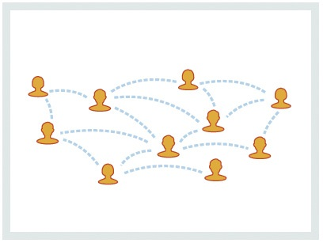
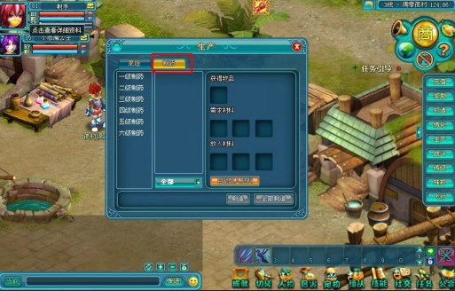

### 2.4.3 不把产品形态当本质

事物在发展、变化中所表现的外部形态是不一样的，有可能今天这样，明天又成那样了。但不管现象如何变化，本质的东西其实是不变的。我们在思考问题时也要通过现象看本质，要学会抓住变化中相对不变的那些内容。

从某种意义上讲，百度贴吧、开心网、微博、知乎都算是SNS（Social Networking Services）网站。在2008年之前，很多产品经理在提到做社区时自然想到的是做成论坛形式，可在2008年以后到现在，提到做社区可能又会想做成Facebook形式的，如今提到做社区很多产品经理会想到做成微博形式的。

可是，如果产品经理简单地把SNS网站等同于论坛、Facebook、微博等产品形态那就彻底错了。因为外延的形态是很容易复制或照搬的，但如果不理解社会性网络服务的内涵，很难运作起来。所以，产品经理需要在本质上对社区的特征和优势、对关系链的建立和扩散、核心价值的提供有深入的思考。

“常在江湖走哪能不挨刀”，相信很多产品经理都经历过各种各样的改版。好的版面内容、风格更容易打动用户，所以改版也是有一定效果的。比如，优化导航、改善信息布局、把颜色视觉效果设计得更符合用户口味，这些举动往往会在前期换来用户的称赞。但如果产品经理简单地把改版等价于优化体验设计那就错了。从严格意义上来讲，改版更像是版本的升级迭代，不仅是在体验层面上有所提升，还在产品的价值层面上满足了某些需求。

举个例子：

2008年至2010年间很多公司推出的网页游戏产品中，玩家没玩多久就会弹出提示：“请买通关道具”。现在很多游戏都采用的是“温水煮青蛙模式”，甚至是先送金钱给玩家玩，觉得差不多了，再慢慢让玩家购买道具付费，达到盈利的目的。所以原来的游戏要改版，其实改的不仅仅是视觉、画面，而是对任务的设计、收费的机制、货币体系进行升级，以符合现阶段游戏的生命力表现。

