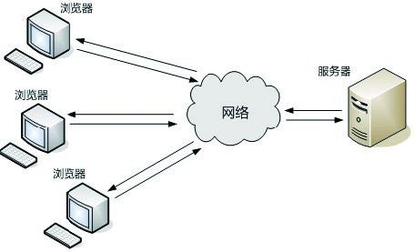

### 3.2.3 B/S结构

B/S（Browser/Server）结构即浏览器/服务器结构。它是随着Internet技术的兴起，对C/S结构的一种改变或改进。在这种结构下，用户的工作界面是通过WWW浏览器来实现的，极少部分事务逻辑是在浏览器端（Browser）实现的，主要的事务逻辑均在服务器端（Server）实现。

我们经常访问的Facebook.com、Youtube.com、Taobao.com、Webgame都是以这种结构实现的。这种结构的优势在于产品的迭代更新很容易，用户只要刷新网页就可以了。它的劣势在于网页端没有封装太多的业务逻辑，导致和服务器的通信开销比较大。

不管是C/S结构还是B/S结构，其原理是差不太多的。实际进行产品设计的时候，往往会根据业务的复杂程度、交互体验性、应用场景等需求来选择具体的运用方式。
