## 3.3 产品设计的三大能力

很多产品经理刚开始不会设计产品，于是便从一个产品着手学习。过段时间后发现，熟悉的产品会设计了，不熟悉的产品还是不会设计。也有某些产品经理把产品设计直接理解成产品形态的表现，通过产品工具的使用把符合期望值的线框原型勾勒出来，可时间长了会发现自己永远停留在表面。那到底是什么阻碍了大家产品设计的能力呢？

“不以规矩，不成方圆”强调的是做任何事都要有一定的规则和工序，产品设计也是一样。接下来从设计的三方面能力（概念设计、功能流程设计和交互设计）着手进行讲解，希望能给大家一点启发。

### 3.3.1 概念设计

概念设计是产品设计的第一步。概念设计就是忽略事物的具体形态，抓住事物的共同特征或本质特征进行设计。它是由模糊到清晰、由具体到抽象的不断进化的过程。

1.认识概念

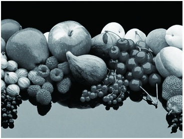

日常生活中有很多好吃的，例如苹果、香蕉、草莓、生梨、葡萄、桃子等，它们共同的特性是水果。

当然，我们也经常吃各种菜，比如青菜、包心菜、菠菜、芹菜、萝卜……它们共同的特性是蔬菜。

貌似菜里面少了猪肉、牛肉、羊肉、狗肉、驴肉、兔肉……会有些乏味，它们共同的特性就是肉。

把事物的共同本质特征抽象出来，加以概括，就成了概念。上面的苹果、香蕉、草莓、芹菜、萝卜、猪肉、牛肉是一个个的实体，通过抽象和概括就成了水果、蔬菜、肉类，这便是概念。如果进行进一步的抽象和概括，又可把水果、蔬菜、肉类看成是一种饮食结构，饮食结构即为一个更大的概念。

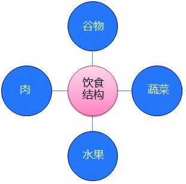

有了对概念的理解，我们就可以很好地把握产品的设计了。例如，从基本的网站服务出发，可以得出我们本质上给用户提供了浏览和操作两大服务，其中在操作服务里面，又涉及数据的增加、删除、修改三项功能。

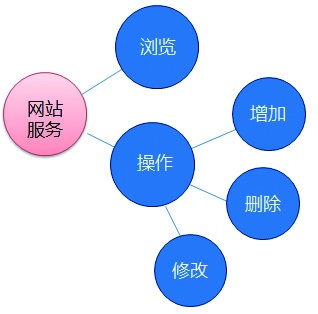

当然，抽象概念的维度不一样，得到的结论也不一样。例如，从网站的载体角度进行分析，发现产品的载体分为Web端和客户端，其中客户端又分为PC客户端和移动客户端。

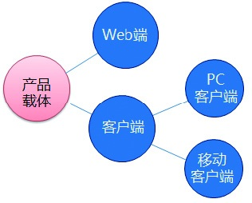

前面曾提到，每个网站都会生成成千上万个页面，只有通过共同本质特征找到规律才便于我们进行产品设计，而共同本质特征即为抽象出来的概念。比如，引入“网站模板页面”这个概念就能很好地协助我们找寻规律。

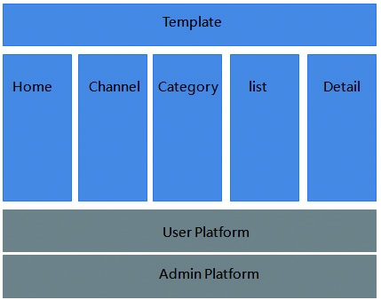

通过对概念的认知和运用，我们可以更好地把握事物的本质，而不是停留在错综复杂的表象上去看待问题。

2.概念图

形象思维通常借助于图形、图像、图式和形象性的符号进行表达，方便人们的感官来感知。它具有生动性、直观性和整体性等优点。而概念图就是运用了形象思维的这一特性。

概念图是通过虚拟映射来表现现实的一种方式，简单地说，就是对信息世界进行建模。在数据结构设计中，通常会采用E-R（实体-联系）模型进行设计。E-R模型不受任何数据库管理系统的约束，是很好的面向用户的表达方法。

在互联网产品设计中，通过E-R模型对信息进行表达虽然是一种方法，但很多时候，我们其实不用严格区分实体、关系和属性，只要能表达清楚意图，任何图形、图像、图式、符号的组合都是可以的。

上面这个图描述了：用户访问网站并到商品详情页进行下单的过程。从图中可以很直观地看出，用户通常是通过搜索、类目、广告3大途径到达商品详情页的。广告的路径最短，所以其价值也更明显。

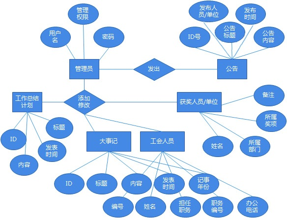

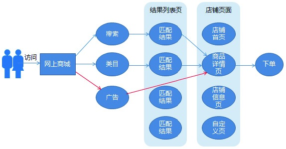

如果觉得概念图不够生动，那么可以加入一些图形元素。比如，上面这个概念图给出了云计算产品的大致原理。不管用户、终端、云端使用的是台式机、智能手机，还是平板电脑，因为最后的数据都会存储在云端，这样就不用担心手机丢失、电脑被格式化等造成的数据丢失，而且可实现外出旅游用手机上传照片、家里电脑同步更新的精彩功能。

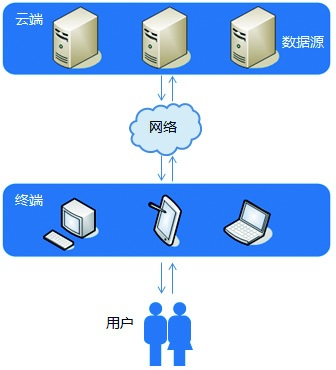

概念图的表达，要选择好表达的主线。如果要表达用户使用产品的概念，应该以用户为主线；如果要表达产品的实现过程，则应该以产品实现的任务流为主线。

3.产品架构图

产品架构图是直观反映产品各个模块关系的图表，它是产品设计阶段的产物，为整体设计产品提供了指导。要想正确、合理地绘制产品架构图，产品设计者需要全面理解用户需求以及业务流程。但同时它也为产品设计者进行更高的抽象提供了可能。

来看几个互联网产品架构图。

某网站的产品架构图如下所示。

金蝶SOA产品架构图如下所示。

大家会发现，上面的两个图都是通过框架的手法来表现产品各个模块之间的关系的。那具体掌握产品架构的方法又是怎样的呢？

一般来说，切入产品架构的方法有两个维度：

1）从下到上。具体来说就是，进行架构的时候，从底层（支撑层）开始思考，确定哪些是最基础的，然后再去考虑业务规则的策略，最后是表现层的商业应用。

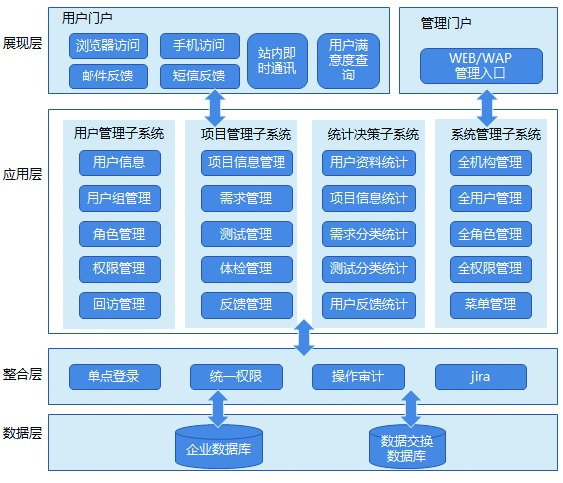

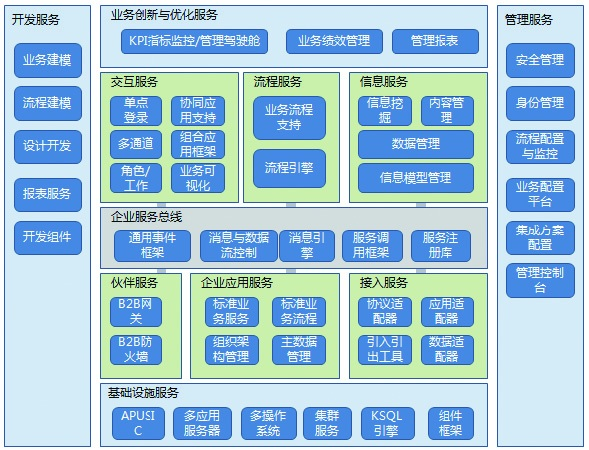

2）从内到外。具体来说就是，进行架构的时候，从内部管理控制层的逻辑着手，看内部系统需要设计哪些模块，最后一直延展到对外用户的使用层面上。

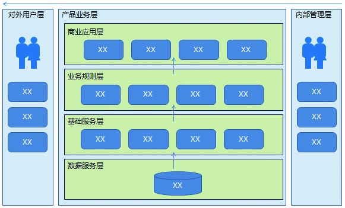

不同的产品，因为其需求和业务流程不一样，所以具体的产品架构图也不太一样。大家可以对不同的产品进行相应的抽象概括。
