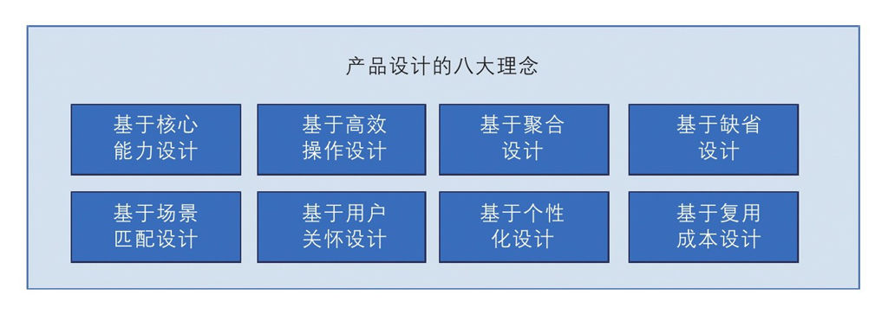
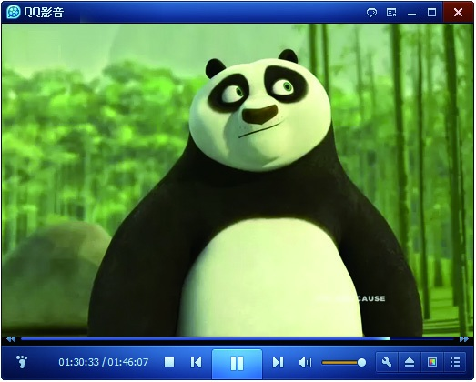

## 3.4 产品设计的八大理念

作为产品经理，我们都知道要为用户提供更好的价值和服务，要打造精益求精的产品。但具体要如何做呢？并不是零零星星想到几个好点子就可以了。笔者总结了互联网产品设计的八大设计理念，下面和大家一一分享。

### 3.4.1 基于核心能力设计

按照二八原则，每个产品真正构成其核心能力的仅占整体的20%，所以把产品的核心能力做到极致是最最关键的。接下来我们认识一下某些产品的核心能力。

1.地图产品的核心能力

使用过地图产品的人可能会有这样的感觉，有时候想要找某信息却怎么也找不到；有时候一些公交线路有调整，或者一些商家信息有变更，没有对地图及时更新，反而误导了使用者。

对于地图产品来说，其核心应用除了数据检索以外，线路的导航能力也尤为重要。好的地图产品，可以分析出哪里会有铁路穿过，哪里会有交叉路口等，人性化地引导用户走正确的路线。

所以地图产品的核心能力为信息全、更新快、路线运算能力强。

2.播放软件的核心能力

很多人有用电脑看电影的习惯，一般情况下，只要下载一个软件就可以播放电影。但普通用户一般不知道视频文件有这么多格式：MP4、3GP、AVI、MKV、WMV、MPG、VOB、FLV、SWF、MOV、MP3、WMA、FLAC、AAC、MMF、AMR、M4A、M4R、OGG、MP2、WAV、RA、RAM……很多播放器因为所支持的格式不全，解码能力不够而被用户放弃了。

另外，高清片源对客户电脑的性能要求非常高，如果电脑配置不够就会影响观看效果。从视听角度出发，如果播放器除了支持绝大多数的视频文件外，还可以帮助用户进行高清加速，那肯定会受用户欢迎，这一点尤为关键。当用户感觉电脑很流畅时，如果能让声音更大一点也是不错的功能满足点。

所以播放软件的核心能力是围绕视听需求出发的，主要包括解码格式要多，具有高清加速能力，声音可以被扩大。

3.视频网站的核心能力

视频网站的内容丰富度绝对是第一需求。用户在网上看视频时，肯定会希望内容越多越好，比如新的电视剧，如果别的视频网站有，而自己的网站没有，那么用户肯定就会到其他网站上看了。当然，网站内容的建设和视频的版权也会让视频网站付出很大的代价。

如果拥有了同样的丰富度，接下来就是速度的比较了，因为国内的带宽不高，用户会优先选择速度快的视频网站。视频网站都是基于流媒体架构的，各地会建立CDN分发策略，这样做的好处在于用户点播视频时，可以从最近的网络上进行下载，这样用户在线观看起来会感觉画面非常流畅。这也是优酷当初胜出的主要原因。

视频网站的核心能力是：内容要丰富，更新要及时，下载播放速度要快。

4.搜索产品的核心能力

通用的搜索引擎是围绕Query（查询）进行工作的。它的工作原理在于分词、匹配索引。根据大量的数据检索结果进行分析，中国网民每天会产生大量的知识类检索、词条检索、长尾词检索。百度的文库、百科、知道等产品的出现（通过网页排序算法实现优先显示），大大提升了结果的满意度。

但围绕Query进行匹配慢慢满足不了专业性的需求了。就拿搜索新款短裙来说，通过普通的搜索，网民可能会发现很难找到符合自己意图的匹配结果。淘宝等垂直搜索引擎的出现，从专业的角度上把产品的品牌、裙摆、材质、图案、风格、尺码、裙长、面料、细节、颜色、价位都检索出来了，大大提升了结果的满意度。

搜索引擎的核心能力是对用户搜索意图进行识别，精耕细作，为用户提供更精准的匹配结果。
