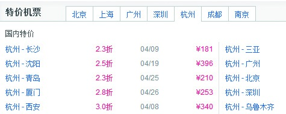
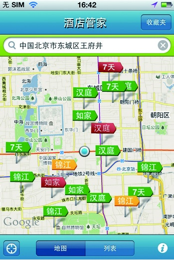

### 3.4.4 基于缺省设计

将简单带给用户，把复杂留给自己。缺省设计就是找到一个最合适的缺省维度，为客户带来便利，事实证明这种设计思路是符合用户诉求的。

1.缺省告诉你：最

在外出旅行时，我们通常会选择最便捷也最划算的方式，比如是坐飞机还是坐火车，如果有价格合适的特价机票，相信一定会吸引很多人选乘飞机，所以，提供特价机票信息成为了很多旅行网站推出的一项服务。作为消费者来说，便宜和实惠是第一诉求，所以默认最便宜的绝对会吸引眼球。以此类推，今夜特价房、惊爆促销其实也是缺省应用的维度。

2.缺省告诉你：有

出差在外，人生地不熟，找酒店是常事。特别是当你到具体的某个位置，想看看周围有哪些酒店可以入住时，如果能有一款产品直观地提供相关信息就再好不过了。酒店管家的产品设计思路就在于此，它不仅会告诉你具体地点周围的酒店情况，还会告诉你它的时价是多少，极大地方便了用户。
