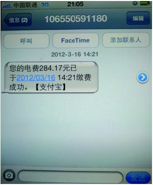

### 3.4.6 基于用户关怀设计

在这个快节奏的社会中，人人都是忙碌的，用户不可能时时记着所有的事情，他们需要提醒，于是用户关怀设计就派上了用场，它可以让用户知道某些事情的变化，起到提醒和关怀的作用。比如，信用卡出账单了，通知用户本次的还款金额和截止时间以免因错还或忘还而影响信用记录；手机余额不足的提醒则可以避免影响用户后面的正常使用。

用户关怀设计大多是以站内信、手机短信、邮件等途径进行提醒的，通常包括状态改变通知、未处理任务提醒等。

1.状态改变通知

用户做了某个动作，这个动作导致某个对象的当前状态发生了改变，则需要发出通知。比如，ATM取钱、还款、下单支付、申请活动等，这些动作或涉及资金，或导致当前状态改变，都需要进行通知。

还有一些情况，某状态即将发生改变，而这些改变会对用户的利益有所影响，那也需要发出通知。比如，信用卡账单要到期了、当前使用的服务马上面临到期等。

2.未处理任务提醒

有些时候，未处理的任务会关系到用户的社交以及对一些重要事情的了解，这时有必要进行提醒。通常所见的有未处理的请求确认、申请确认、任务等，这些提醒的价值在于促进用户完成流程。

