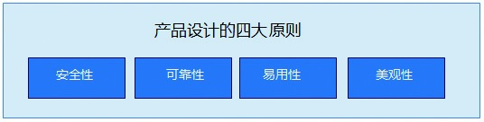

## 3.5 产品设计的四大原则

大多数用户在使用产品的时候，从表入里，先是看产品的外观，然后尝试着去理解和使用，在操作的过程中会对安全隐隐担忧，进而分析产品是不是可靠。这四点恰巧也正是产品经理在产品设计的时候必须要注意的。但产品经理在进行设计的时候，则是从里到表，先设计内在，再设计外表。

### 3.5.1 安全性

2011年12月，CSDN的安全系统遭到黑客攻击，600万用户的登录名、密码及邮箱被泄露出去。随后，天涯等网站相继被曝用户数据泄露。不要等到安全问题暴露出来才意识到要去防范，作为产品设计工作者，我们可以事前做一些努力。

从安全的技术策略层面去努力，比如，很多网站都采用HTTPS（Hypertext Transfer Protocol Secure，超文本传输安全协议），也有一些网站提供数字证书的服务，以确保用户账户和资金的安全。

从产品设计的策略层面去努力，比如，可以对手机验证、E-mail验证、密保答案进行充分设计，也可对密码进行策略设计（比如设置查询密码和支付密码的关系、登录密码和重要操作管理密码的关系），以及对异常登录、登录保护进行周到设计（限定登录IP的白名单或黑名单）。

