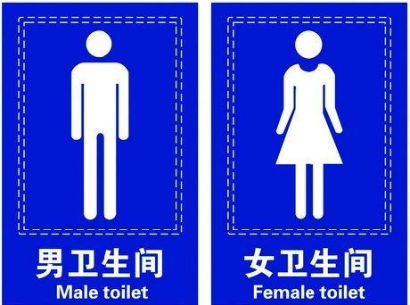
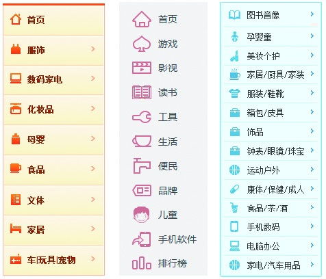
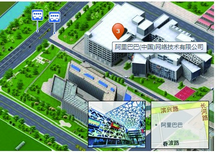
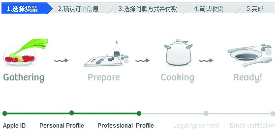
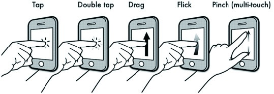
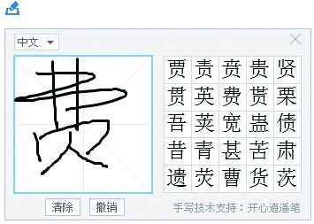

### 3.5.3 易用性

简单地说，易用性的表现就是形象直观、理解容易、用起来简单方便。对于一个不太会操作电脑的用户，当她第一眼看到你的产品时就大概知道是什么，然后自己会摸索着用，那就说明该产品的易用性做得很不错。

1.看起来很直观

如果产品足够直观，用户单凭观察就会了解它。来看看下面的图片，够直观吧？

互联网产品是以网络为媒介的，所以在进行设计的时候，可采用映射的方法（通过增加可以辨认的图形元素）达到直观的目的。以下是几个网站的频道导航，看起来还是比较直观的。

从抽象到形象，地图产品也不断地进行直观升级。原来的地图是用二维的线标出道路和坐标，现在的三维地图可以很形象地给出建筑物的形状、周边的环境，这种街景图，真实地还原了客观信息。

另外，在很多任务场景下，让用户直观地知道要完成的任务有个几步骤，当前在哪步，还剩下几步，也可以极大地方便用户。所以在进行步骤条的设计时，给用户一个直观的认知视图会是不错的选择。

2.学起来容易

任何新产品一经推出，必将接受用户学习成本的考验。如何让用户学起来容易，甚至不用教就可以摸索着学会，还是很考验产品设计者的。要做到这一点，进行产品设计的时候，要从以下两个维度来进行思考。

（1）按照通用性进行产品设计。

在面对新事物时，人们往往倾向于用已有的经验对其进行辨认。用户在使用一个新产品时也是一样，他首先会看该产品是不是和过去使用的哪个产品功能或操作一样。所以我们在进行产品设计的时候，首先应该考虑通用性的原则，即根据很多用户普遍达成的共识以及养成的使用习惯来进行设计，这样用户的学习成本就比较低了。

（2）不要约束用户，让用户按照其天性去使用。

很多时候，产品经理会假想很多场景、预设很多任务，并认为用户会按照这些场景进行操作。但事实上，用户的行为是千奇百怪的，他们是不可能按照我们的预设进行操作的。所以我们在进行产品设计的时候，应尽量采用满足用户天性的操作方式。

比如，用户面对电脑时，会进行简单的单击；用户在遇到触屏手机时，手指会下意识地拖曳等。好的产品设计，在用户下意识去尝试的时候，也是可以满足用户操作需求的。这样，用户在慢慢摸索了几次以后，就能学会操作。

对于很多不会使用键盘打字的网民，最好的方法是向他们提供手写功能。写字和敲键盘比起来，写字更像是每个人都会的本能。

3.使用起来简单

大多数用户都不是电脑高手，他们不知道怎么修改注册表，怎么进入安全模式。对于杀毒，用户觉得一款软件轻松搞定就可以了。360安全卫士，只要单击“立即体验”按钮就可以帮助用户完成扫描，然后单击“一键修复”按钮整个杀毒清理工作便完成了。也正是因为具有方便、简单、傻瓜等特点，360安全卫士占据了很大的市场份额。

仔细想想，用户其实“很懒”，但凡一键可以完成的事情，他们都比较喜欢。比如，一键ghost、一键刷机、一键启动、一键还原、一键备份、一键把网站换成移动版本的工具都非常受欢迎。这也就是为什么产品设计者经常会说：将简单的操作留给用户，把复杂的产品留给自己。
