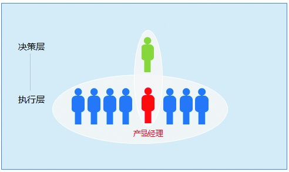
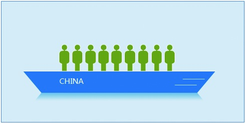

### 4.1.3 团队的目标要一致

如果一件事情只需要一个人就可以搞定，它的执行复杂度就相对简单。如果这件事情的完成需要多人配合，那就相对复杂了。比如，一个产品的上市，面临着从公司层面提出目标，到规划、设计、开发、测试、上线、运营、市场推广、服务支持等多个环节，要多人配合才能完成，它的执行复杂度也就可想而知。

面对同一件事情，如果大家对目标的理解不一样，那么在执行过程中就会有内部消耗。举个例子，你和技术人员对某项功能的理解不同，他觉得这项功能好像没有太多的价值，那么他不仅不会帮你实现需求，甚至会反过来挑战你，问你为什么要设计这个功能。这种情况屡见不鲜，比如，有时候前端工程师会因为视觉设计得不好实现而停工。

在这些现象背后，反映的是不同岗位和专业看问题的角度不同，不代表他们做事的心态不对或不积极。他们提出疑问，也是希望事情朝更好的方向进行。作为产品经理，要让大家从整体目标上进行思考，这样才可能促使大家朝一个方向使力。

1.理念

绝大多数公司在制定目标的时候，不会让所有的人一起参与。所以在执行层面上，大家得到更多的是结论。这一部分人可能会因为没有参与决策，而没有共同理念。

比如，某公司要做基于瀑布流模式的图片网站。当目标传达下来的时候，很多基层的人不理解，然后便出现了各种各样的声音，甲说：“我不看好，这不是我们擅长的。我觉得把现在的业务做大就好了。”乙说：“老板真是有病，看到国外流行什么就跟风，一点辨别能力都没有。”

发生这样的现象，其实是对产品不利的。如果产品经理也觉得做这个产品没啥意思，那么大家肯定会执行不好。理由很简单，凡是大家内心不太认可的事情，是不可能用心做好的。

在上传下达的过程中，产品经理扮演着很重要的角色。一方面，产品经理可以接触到上层的想法，对于下层不明白的地方也可以作为执行团队的代表向上进行沟通，从而了解公司为什么想做这个产品，初衷是什么；另一方面，产品经理也可以发挥团队的智慧，让大家提出更多建设性的建议。如果大家对业务有疑问，又想不出更好的方案，而公司确实要继续尝试，那么就努力和大家达成一致，把当前的方案当成是最佳方案去执行。

在和大家沟通的过程中，产品经理得到一定程度的理解和信任，是有利于整个团队协同工作的。因为在很多情况下，可能谁也不清楚探索的方向是对还是错，在这个时候，产品经理让整个执行团队的理念达成一致，显得非常关键。不过遗憾的是，部分企业的老板这方面的意识不强，只取得了员工表面上的认同，因此注定执行起来问题多多。

2.机制

机制也是配合目标存在的，产品经理要理解这一层含义。在很多时候，执行出现问题不是个人的能力有问题，而是机制存在问题。只有理解了这一层含义，产品经理才能更清楚地知道是哪里出了问题，如何更好地解决。通常机制带来的问题分为资源保障机制的问题和沟通决策机制的问题。

资源保障机制的问题体现在缺人、缺资金、缺支持等方面，只有少数几个人从早忙到晚，想加人没预算，想推广又没有推广的资金。沟通决策机制的问题体现在：各部门推进起来很困难，大家的分工边界不明确，决策的制约因素多、跨度长，这些问题导致了效率低下。

作为产品经理，在遇到这些问题时，要学会变通，不同的问题要找不同的关键人物。比如资源配置问题，就得找可以影响资源配置的人，从而争取资源的调整；沟通决策问题则应该找最终对决策负责的关键人，促进其快速决策，这些都是有助于解决机制问题的办法。

3.利益

利益是一个本质且永恒的话题。有些人在做事情的时候忽略了他人的利益，只懂得索要，不懂得付出和共享，对方得不到什么利益，自然没有动力和你紧密协作了。所以有了一定的机制保障以后，一定要让大家有一致的利益。

公司出现执行问题，很可能是技术人员的利益和产品人员的利益脱节造成的。比如，技术的考核标准是代码行、代码的质量、稳定性等，因此，技术人员关注的更多是技术层面。从本质上看技术是为产品和业务服务的，在这种导向下，技术人员很难和产品人员站到一起。有效的方法是，在设置考评和奖励的目标项中，增加关键的一项，即产品完成结果的好坏。这样大家的利益就绑定到了一起，大家站到了同一条船上，一荣俱荣、一辱俱辱。

在跨事业部协同工作的时候，由于不同事业部的业绩指标不一样，很难通过行政手段达到干预的目的，因此执行起来就会显得非常难。这时，产品经理就要从对双方都有利益的角度切入，通过一个支点撑起大家的利益，从而达到1+1＞2的效应。也有产品经理在这种情况下采取索要、借某某老大旗号强压等方式，很多时候这种方式并不奏效。如果对方没有看到利益，他很可能会拖、会缓，或者找出各种借口。
