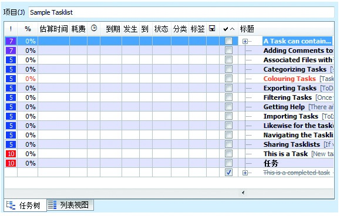

## 4.4 管理好时间和任务

对于完成任务目标而言，时间是最为宝贵的。我们必须提高对时间的利用率，并且把要做的事情做好。接下来，我们进一步介绍如何管理好时间和任务。

### 4.4.1 Todolist

人的记忆是有限的，一旦事情多起来，常常会想起了这件事情忘记了那件事情。Todolist（待办事项清单）的价值在于给自己提供了待处理事项的完整视图，所以养成填写Todolist的习惯还是很有必要的。

在代办事项清单上，可通过标注任务标题、注释、开始、到期时间、完成的状态等，让自己直观地了解手头上的事情有哪些是已经完成不需要跟进的，还有哪些事情是没有完成需要继续处理的。
