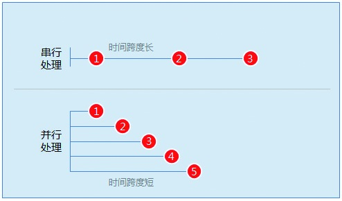

### 4.4.3 串行和并行

虽然我们划分了事物的优先级，但很多时候事情还是需要我们具备同时处理几件事情的能力，这就涉及串行和并行处理事情的方法了。

学过物理的我们都知道，串联的灯泡，彼此之间线路的耦合性比较强，随便灭掉哪一盏，其他的灯泡就都会灭掉。而并联的灯泡，彼此之间的线路是松耦合的，即使灭掉其中一盏，其他的也不会灭。串行和并行处理事情也是这个道理。

有些人一天可能只能处理两三件事，而有些人一天可以处理5~8件事。通过调查发现，只能完成两三件事的人习惯等前面的事情全部做完了以后，再去做下一件事。中间大段的时间在等待中浪费了，没有得到合理的利用。而能处理5~8件事的人则采用并行方法，有效利用中间等待的时间做其他事情。
