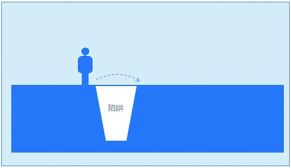

## 4.5 实用执行心得与方法

在项目执行的过程，很可能会有各种突发事件。有些让你来不及反应，有些让你非常纠结，不知道如何应付。接下来结合笔者个人的体会，进一步介绍执行的心得与方法。

### 4.5.1 巧识语言陷阱

在我们的工作中，语言陷阱其实是很多的，比如，“这个需求是用户A提的，我们的工作就是要满足用户需求，所以我们得做这个需求。”这句话看似非常合理，作为产品经理，感觉如果自己不处理这个需求，就有点对不起用户。但仔细品味你会发现，虽然我们的工作是要满足用户需求，但不是任何用户提出的需求都要去满足，主要还是看需求反映的普遍程度。

又如，“我们的产品用户越来越多，UGC（User Generated Content）产生的内容越来越好。”乍听到这句话下意识会觉得这个产品非常好，但经过分析你会发现，这里只是突出了正面数字。“用户越来越多”，是以怎样的一个斜率增长的呢？“UGC产生的内容越来越好”，有多少比例的用户贡献内容？含糊、片面的言语往往掩盖了数据增长放慢、发展势头疲软、用户参与比例低等负面情况。

再比如，“这个我们会考虑的，放心好了，我们一定会优先支持的。”初听这句话真的是很放心，感觉对方非常支持，合作形势一片光明。可是一经分析你会发现，只是表态，没有落实到实质性的计划。“会考虑的”，那什么时候考虑呢？时间点又是怎样的？“会优先支持的”，支持仅仅是主观态度，那么会不会以没有客观的资源而隐藏爱莫能助的借口呢？

语言是一门艺术，有时候你听别人说话很舒服，但时不时也会被他骗。很多人冷不丁给你来个偷换概念，实在是防不胜防。对此，有一个好的防范办法，即站在客观角度把一件事情描述清楚，这样你就知道应该以什么样的维度来衡量一句话、一件事情了；另外，要从逻辑的角度学会思辨，提升逻辑整体思维的严谨性，这样你就可以从容地应对沟通和谈判了。
