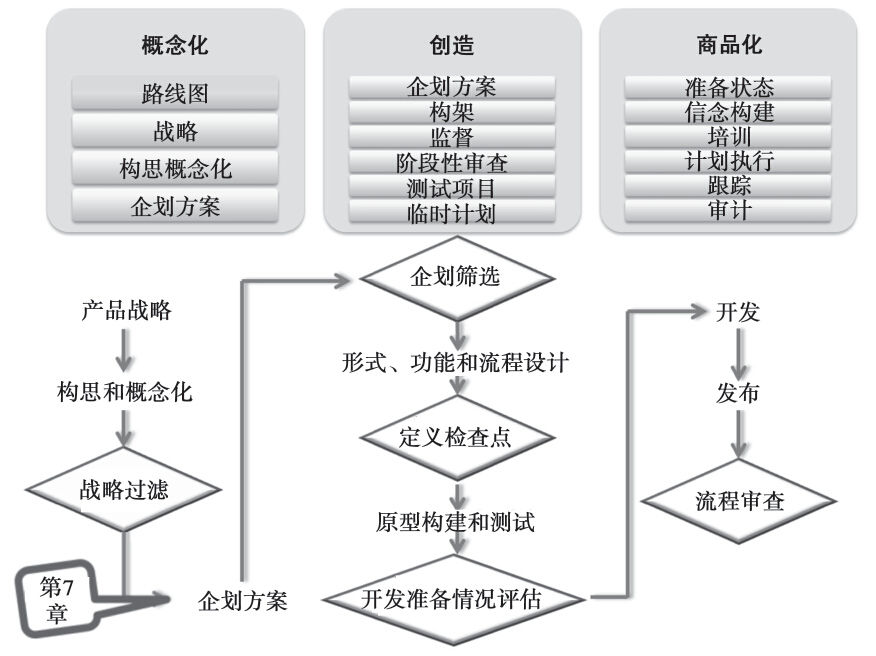
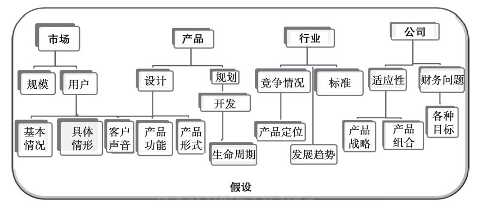
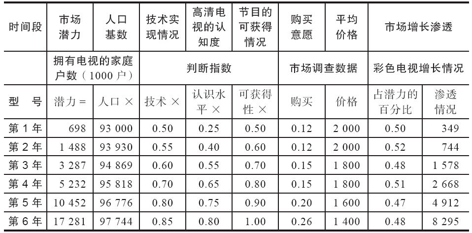
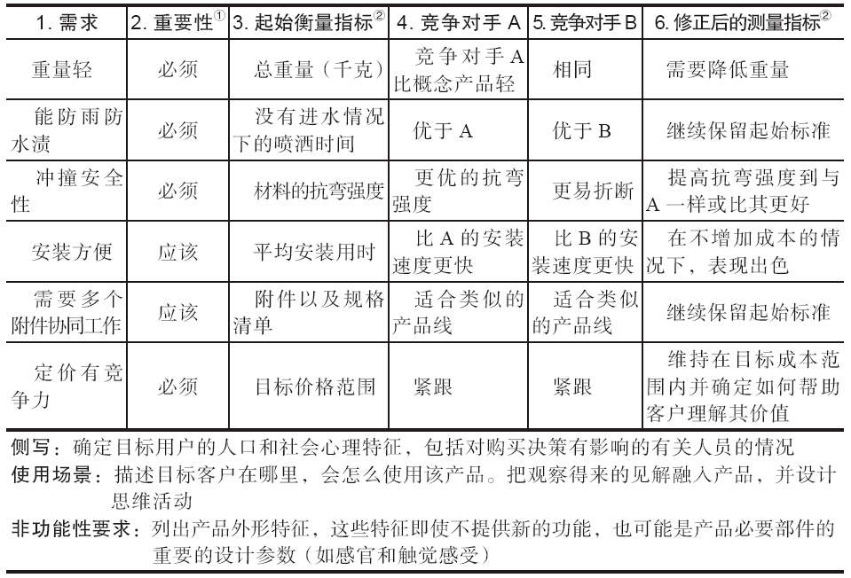
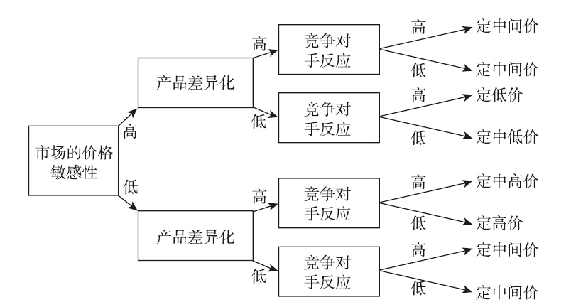
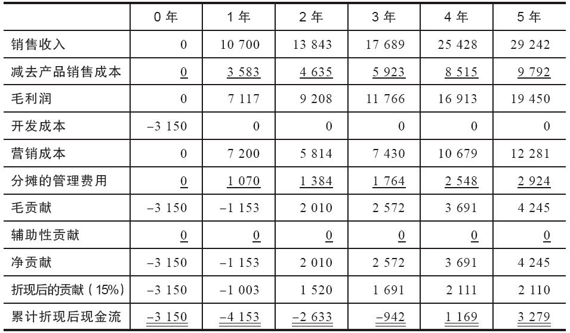

## 第7章 制定企划方案并获得批准

请判断对错：企划方案要求越明确，它就越准确。

这种说法很有意思，却是错误的。企划方案依赖于对未来的主观假设和预测：预期销量、客户意愿和预期成本。小数点后面多增加几个数字可能会给人造成准确的印象，事实上，在任何数字背后都存在很多主观因素。

请判断对错：获得资金资助的企划方案都是成功的。

这种说法也是不对的。成功的企划方案能帮助人们做出正确决定。记住，编制企划方案就是证明或者证伪某个产品概念潜在商业前景的过程。有些产品经理在制定企划方案时，认为成功就是其企划方案获得认可。因此，他们会美化各种预测情况，或对自己的假设极端乐观。尽管这么做并不意味着注定会失败，但它确实会增加失败的概率。

本章一开始，我用了两个判断题，这两个问题代表了很普遍的误解。制定新产品企划方案并为之辩护，这项任务会让很多产品经理生畏。这就是全盘考虑整个企划方案的制定流程，以及因此产生的各种文件如此重要的原因。

深入探讨之前，我们有必要讨论一下术语问题，因为各公司对这些术语的用法都不一致。在这一章中，我把企划方案定义为为新产品争取投资结构固定的建议书。方案中包括市场要求（即需求或收益）、开发满足这些需求的产品的可行性陈述、目标市场和机会探讨以及财务概况。换句话说，它提供方案（即理由）来支持该新产品项目投资的经济性问题。有些公司把这类文件称作市场需求文件（MRD）或商业计划或商业建议书，那么，他们会把企划方案这个术语用来专门指代财务方案。用哪个术语并不重要，关键是每个人都能理解它们在组织中是怎么起作用的。

在第6章中，我们谈到了从产品经理的角度看，新产品开发的三个核心部分是概念化、创造以及商品化。早期概念化过程中，产品经理可能在一个很高的层面构建并评估多个产品创意。多数想法几乎一开始就放弃了，只有少数需要获得更多数据，并进行分析，以便确定哪个创意应该纳入企划方案的概念中去（见图7-1）。因此，概念化是为某个特定产品概念制定企划方案过程的前身，并自然导致企划方案的制定。

图7-1 产品开发3C框架的规划方案阶段

企划方案的重要性

把制定企划方案看成为决策而准备各种证据资料，这一点很重要。首先要收集市场潜力方面的资料，真实评估什么因素会让产品更容易或更不容易被市场接受，并相应地对其做出预测。换句话说，企划方案应预测决定所要实现的结果。要用粗略的、在可接受的回收期内，实现各种现金流的概率，合理预测未来现金流的额度。[在Palisade公司网站[www.palisade.com](http://www.palisade.com)上有一个两分钟长的预测新产品概率的蒙特卡洛模型的教程。]如果管理团队正在审阅各种新产品建议，却无法同时为所有项目提供资金，把预期收益与实现该收益的概率结合起来，就能为公司做出正确决策提供更有说服力的证据。

除了预测收益与成本之外，还要考虑一些软福利，其中有品牌知名度的提升、产品被推荐次数或更高的客户满意度。软福利不能直接转化成真金白银，但可以与各种表述清晰的假设联系起来。假设某个新产品能防止客户抛弃我们，转而购买竞争对手的产品，那么该产品的财务价值就能估算出来。

企划方案是为预测提供财务、竞争情况和市场方面理由的框架性计划。它本质上是一项投资的经济建议书，需要各种数据支撑。因此，不妨把它看成企业家为获得某个风险资本而编制的企划方案。

由于企划方案质量好坏直接影响人们做出接受还是拒绝产品概念的正确决定，因此势必要认真对待。这并不是说只要简单地按照“最佳实践”模板，就可以神奇地做出一个完美的方案。相反，它需要客观评估该概念会给组织带来的各种正面和负面的影响。这还要求解释为什么选择了某一个概念，而抛弃其他概念。

制定企划方案过程中首先要回答的问题是，为什么要在这个时候考虑这个概念。认真考虑它是否符合企业战略、产品战略或产品路线图。它是进取型产品，还是回应型产品？它是填补了空白，还是提供了新的契机？机会和预期财务绩效如何？有没有可能生产该产品，我们是否具备生产该产品的能力？如果没有按照这个概念行事，会产生什么后果？该新产品的开发会有什么样的风险，如何降低风险？不要主观地以为，所有这些问题的答案都显而易见。它们也许并不容易回答。

企划方案的组成部分

根据行业或产品类型以及具体业务的多种需求，各公司需要为其不同的企划方案准备不同的内容（解决方案矩阵网站[www.sohutionmatrix.com](http://www.sohutionmatrix.com)中有关于企业案例分析方面的白皮书和文章）。

图7-2表示了企划方案的主要内容和次要内容。请注意，你需要各种假设，来说明所有这些内容的理由。对于重要假设要表述清楚，并根据其他人的视角进行“压力测试”。如果假设前提出现变化，会产生什么样的后果？一定要认真思考最好的和最糟糕的情形。要像检查企划方案每一部分内容那样，对自己提出各种质疑。

图7-2 企划方案的组成部分

#### 市场部分

能进入企划阶段的创意是经过提炼并能转变成现实产品的概念。在此，产品经理要重点参与：（1）确定最大化客户满意度和接受度的恰当特征和属性；（2）确定目标价格；（3）修改对潜在销量与利润率的预测。重要的是，要把所有这些活动整合到一起。产品属性的改变可能会导致目标价格无法实现，并且最终价格可能改变客户的购买意愿（影响销量的关键因素）。对这些界定产品特征的因素必须有一个综合的看法，尽可能减少未来订单发生变更的可能性。否则，很有可能发生产品经理与项目经理之间的冲突。

从二手资料开始。通过网络搜索，获得更多有关市场特征、趋势和竞争情况的信息。寻找任何可以购买的营销研究报告。如果有必要，进行专利检索，搜出潜在的未来竞争对手。与行业专家和潜在客户沟通，评估其参与产品创意的态度。从“典型”客户那里获取市场意见适合很多产品线扩展的情形，而从领先用户那里获取信息对于创新型产品非常重要。但为了获取客户声音，这两者都很重要（见企业案例7-1“利用客户意见识别市场机会”）。

企业案例7-1

利用客户意见识别市场机会

对产品有极端或严格要求的试用人员、公司或个人是创新产品创意的重要来源。增加代表客户的数量为产品线扩展、概念开发和生命周期消费预测提供更多的信息输入。所有这些都是为了新产品开发项目贡献来自顾客的声音。

东芝美国医疗系统部与美国主要医疗机构建立了非常紧密的关系，以便为其医疗影像产品更好地了解各种市场机会。东芝公司利用它在约翰·霍普金斯大学的医生支持者和盟友，建立了一个由思想领导者和主要医学专家组建的团队。该小组列席东芝咨询委员会会议，审议其实验产品，并推进创新。

相反，宝洁公司对现有产品和营销战略的创新和改进比较感兴趣。2005年4月，它开展了首次年度“消费者至上”活动，来激发新产品创意。一位7岁小姑娘提出想法，希望能让消费者来投票选择新一代佳洁士牙膏的香味。结果，宝洁公司开展了一次网络投票，让消费者在柠檬味、草莓味和热带水果味之间进行选择，对佳洁士酷白体验牙膏进行了品牌扩展。

宝洁公司爱慕思（Iams）品牌经理得知，有些宠物饲养者会在狗粮中添加食物碎屑，来减少年龄大的宠物的食量。后续的定量研究表明，40%的狗主人使用这种方法。因此，该品牌发布了塞弗瑞（Savory）作为比食物碎屑更有营养的狗粮品牌。

尽管有多种方法可供选择，但产品经理应不断问自己，并留意人们做各种事情的原因是什么，了解当时的重要竞争对手，并把这些信息用到新产品开发和营销之中。克莱顿·克里斯腾森（Clayton Christensen）是《创新者的解答》（The Innovator’s Solution）的作者，他指出，很多产品失败是由于经理并不像消费者那样去看待市场。当快餐连锁店经理想提高奶昔的销量和利润时，他首先问客户，奶昔应更浓一些、多一点，还是应增加其他风味。他根据顾客的要求作了改变，市场却没有发生任何变化。另一组研究人员发现，多数客户食用奶昔是因为想让漫长无聊的上下班时间变得更轻松一些。由于用粗的吸管吸食奶昔要花20分钟左右的时间，这减轻了旅途中的无聊感。竞争不仅来自其他奶昔，还来自“无聊、百吉饼、香蕉、油炸饼干、快餐早点饮品，甚至可能是咖啡”。这种新视角改变了新产品的概念。

资料来源：John Zimmer，“How to Win a Marquee Account，”Sales and Marketing Management（February 2004），p.72.Jack Neff，“P&G Kisses Up to the Boss：Consumers，”Advertising Age（May 2，2005），p.18.Clayton M.Christensen and Michael E.Raynor，“Creating a Killer Product，”Forbes（October 13，2003），p.82.

表7-1是电子表格范例，用来确定高清电视市场机会。第二栏列出根据各种关键变量计算出来的每年的市场潜力。第三栏中的内容是总人口，是根据普查数据推算出来的重要人口因素。“技术实现情况”一栏列出了技术当年可用，并达到可接受的质量水平的概率。高清电视的认知度是对有多少百分比的客户了解该产品的主观估计。节目的可获得情况是对用于播放高清电视节目的时间比例的估计。按特定价格购买产品的意愿根据调查数据推算得出。假设该电子表格是在高清电视还是创新事物时编制的，那么按照同类产品（彩色电视）来估计其每年的市场渗透率比较合理。将所有变量相乘后，就能计算出第二列所示的各年度市场潜力。

表7-1 市场机会预测范例

资料来源：Condensed from Robert J.Thomas，New Product Development：Managing and Forecasting for Strategic Success（John Wiley，1993），p.174.

概念提炼与客户心声

要提炼对市场需求的理解，就需要从知识丰富且愿意合作的关键客户那里获取信息。这些客户并不一定具有代表性，但他们必须愿意对初始概念提出改进和修改建议。然后探讨各种可能影响产品潜在销量的具体修改建议。某些特征放大后，会产生什么后果？这些特征最小化了之后，情况又会怎样？如果产品更加坚固，情况会怎么样？如果更加柔软，又会怎样呢？产品尺寸更加标准化，会有什么后果？更加针对具体的客户进行量身定制，会产生什么后果呢？色彩的选择是不是很重要？区位的选择呢？要尽可能地从这些关键资源获得更多的信息。有时候这种小样本定性研究就足以形成一个概念，而有的时候需要更大的样本量才能全面了解市场的需求。

概念明确之后，就需要在大量客户中进行测试。这个客户群体应能更好地代表目标市场。概念测试没有其他更好的办法，多数只能是对定性研究作一些改变，并着重考虑小组讨论的内容。通常，用于满足相同需求（即替代品）的一个概念的多个版本（可能包括竞争对手或安慰剂概念），或多个不同产品的概念会在同一个概念测试中进行探讨。这是因为，通过比较不同的选择，人们往往能提供更好的意见，而这种意见要比他们针对单一产品概念进行的绝对评估更为可靠。虚假广告、卡片上的产品描述、概念草图以及粗糙的原型都可能作为研究分析的目标。有时候，产品技术文件以及用户手册也会成为这种分析的一部分。

在概念测试中需要处理如下问题：客户能否理解这个概念？它是否比当前已有概念更受欢迎？与客户现在能够获得的替代产品相比，改进后的产品有什么价值？产品功能是否与顾客现在用的功能一致，或者它是否需要顾客改变其思维定势？他们是否愿意为此承担更高的费用？产品有些什么缺陷？是否有一些改变能让产品变得（更加）易于生产？该产品要满足的基本需求是什么？品牌名或商标是否应包含在概念测试当中？

购买意愿

概念测试通常包括特定价格下的购买意愿这一指标。“购买意愿”是指，如果产品存在，受试者愿意购买该产品的概率指标，通常用一个数值范围来表示（即从1=“绝对不会购买”，到5=“绝对会购买”）。这是概念测试的一个重要部分，但不能随意理解成真实的销售预测。人们往往会高估自己在诸如典型小组之类刻意设计的情境中的购买意愿。获取定价信息的确十分困难。不过，在产品开发过程中，必须制定一个目标价格，这对于确定产品的目标成本来说极为关键。尽管所有研究方法都存在这样或那样的问题，但仍然有一些方法值得一试。

其中一种方法是请客户列出一个价格范围：什么是你愿意支付的最高价格，超过这个价格你会感觉自己被坑？什么是你愿意支付的最低价格，低于这个价格你会担心产品质量存在问题？另一种方法是把概念测试小组分成试验组和控制组。针对同一个概念，分别给这两个小组制定不同的价格，并确定在价格不同时，客户购买意愿是否存在差异。第三种方法是，询问客户这个新产品在多大程度上优于他们正在使用的产品（用货币来表示，见第3章中的经济预测模型）。最后一种方法是，询问客户他们愿意花多少钱来购买这种产品，而他们又愿意放弃哪些产品特性，以使该产品的价格降低至他们的心理价位。应该针对每种情形都设计一份“购买意愿”问卷。

至此，产品团队应该努力确定一个目标价格。目标价格是为开发过程测算目标成本所必需的。“按照价格进行设计”是技术更新快、产品生命周期短以及价格压力大的各行业内很多公司运用的理念。

目标价格取决于市场认知的产品价值。确定单位价值低、频繁购买的产品（如包装消费品）的价值与确定价值高、购买频率低的产品（如资本设备）的价值的方法是不一样的。包装消费品的购买，在决策过程中有一个习惯和惯性问题。购买高价产品的决策过程可能需要多个团队或专门委员会的参与。因此，在分析中，需要考虑决策过程的差异，以及决策人员的差异。

市场要求文件

至此，开发小组应能在类似于表7-2的“市场要求开发表”中，列出并展示所有潜在的产品特征。该表格中列举了一个自行车车架的例子。第1栏列出了通过对客户和领先用户进行研究所提炼出来的市场需求。注意，这些需求是客户希望从使用该产品中获得的好处，而不是它们应该被设计成的样子。第2栏对每个识别出来的市场需求进行排序或评级。第3栏中，把优势转变成设计人员在设计车架时要参考的设计目标。例如，所希望的产品重量提供了指导，但没有明确要用什么材料或生产技术。同时，目标成本范围是由目标价格和可接受的利润水平来确定的。第4栏和第5栏列出了主要竞争对手产品的衡量指标。根据市场所提供的重要性评级，通过比较起始标准和主要竞争对手产品之间的异同，在第6栏中列出了可能需要做出的调整。最后改进过后的衡量规格，就是概念开发和测试阶段的成果。由于这里表达了新产品开发过程的重要节点，应该经过评审委员会的初步认可，以表明他们接受这个衡量标准，事实上这也就意味着要暂时冻结“产品利益组合”（虽然实际的产品规格在原型开发阶段还不会被完全确定）。

表7-2 市场要求开发表

①请在此栏注明：什么好处（功能）是必须有的，什么有了更好，或什么是一定要避免的。

②注意，此栏中的衡量指标主要是针对功能的，而不是针对特征的。

资料来源：Adapted from Kent Ulrich and Steven Eppinger，Product Design and Development（McGraw-Hill，1995），pp.54-65.

对于突破型的新产品，制作“市场要求开发表”可能比较困难。对客户（不论是消费者还是产业客户）而言，市面上并不存在竞争性的产品可供他们作为比较基准，因此产品分析必须从产品要提供的功能开始。在新产品或服务出现之前，这种功能是怎样实现的？如果改变现状转而使用新产品，会带来什么好处和成本？然后，必须考虑和评估客户改用新产品的感性和理性的动机。

预估目标价格需要考虑几个方面的因素，尤其是竞争对手反击的可能性、市场对价格的敏感度以及竞争差异性的程度。图7-3的树形图呈现了新产品定价时的思考过程。如果目标客户的价格敏感度不高，产品又具有非常高的差异化特征，竞争对手不会有什么反击措施，那么把价格定高一点是可以接受的。相反，如果价格敏感性很高，产品差异化不明显，竞争又非常激烈，就有必要把价格定得低一些。

图7-3 新产品定价决策图

在概念测试阶段，也需要有合适的技术人员参与其中，以便评估客户可能提出的任何建议的技术可行性。具有营销、技术和财务可行性的概念还需要经过更为详细的商业分析。

#### 产品部分

企划方案中关于产品的内容应从样式与功能、产品开发计划，以及产品发布与产品生命周期规划方面对产品进行界定。产品界定需要包含根据“市场要求开发表”（参照任何有关应用的信息）修正后的各项测量指标，并运用来自产业部门的竞争性产品定位信息。尽管在这个阶段要拥有原型不太可能，但可以有各种概念描述或图示。

产品开发计划讨论的是预期资源要求和一般时间安排，如果已经确定核心团队的构成，则也可以包括在内。粗糙的商品化战略要突出产品发布所需要的主要策略，产品生命周期规划要突出产品线扩展和潜在衍生产品开发的路线图。

#### 产业部分

如果在新产业内发布一个新产品（通常面向政府出售产品的公司，对产品进行重新设计后，将其推向商业市场或者相反），有关绩效标准信息、监管限制或渠道预期等方面的信息应包括在内。不管产业是新是旧，都必须考虑竞争定位问题。对于直接竞争产品，应全面进行功能比较（而不是特征比较）。新产品将如何改善其功能，并为目标客户提供新价值？在客户认知上，所推出的产品与竞争产品相比，将如何进行定位？它是不是一个更全面的解决方案？还是使用起来更加方便？其设计是否更能吸引人？

#### 公司部分

企划方案中公司部分的内容，要具体描述产品会如何适应整个公司的战略与目标。如果公司的发展目标是进行全球扩张，该产品将如何推动业务在其他国家的扩张？如果公司目标是通过增加便利性提升客户满意度，那么该产品是如何提升便利性的？同时要解释清楚，产品如何替代、补充或提升现有产品组合。

财务预测分析

产品创意在进入筛选程序之前，应制定粗略的企划方案，并随着概念测试的进展，同步进行优化。随着所能获得的新信息不断增加，要持续对其进行评估，并使其更加明确。至少，应在重要转折出现时，对相应内容进行更新。产品开发早期阶段制定的概要性企划方案，如今应该能补充新的内容了。至此，产品描述应该更加具体，应该包括营销和成本目标。市场分析应根据潜在分区和利基市场、客户对产品的用途和关键客户的识别，以及竞争标准的明确而做得更为深入细致。产品开发计划中应包括项目团队的组成、产品规格、标出重要事件与目标日期的路线图以及执行时间表。营销方案应表明计划的产出、对短期和长期资源的要求、所分离出来的风险因素以及最小化风险的建议。财务分析应有所扩展，包括更多的有关预估损益情况和现金流方面的细节，而不只是停留在早先建议中提出的那些内容。表7-3所展示的是某个假设性工业产品的财务预估分析表。

表7-3 财务预估分析表 （单位：美元）

“销售收入”这一行是基于市场分析得出的预测数据。销售成本来自于产品开发团队中技术和生产人员提出的估算。准确性不仅依赖于对单位成本的预估，而且依赖于产品经理销售预测的准确性。销售收入和销售成本的差额就是毛利润，可用来弥补固定成本支出，也是贡献出来的利润。

开发成本包括任何已经在研发和概念测试中支出的成本，以及原型产品开发、设备与物料、劳动力、产品测试和额外营销研究方面的预期支出。产品首次发布如果需要额外资本支出，那么该项支出也应在此列出。

营销成本开始于产品发布之前的工作，包括广告、分销、销售人员费用、促销和各种各样的销售与传播成本。

分摊的管理费用是指分配给各个产品的行政费用。有些公司会给新产品定一个较低的（甚至没有）行政费用，直到为其建立独立的行政部门。其他公司相信所有产品都应承担相同（或更多）的固定费用支出（即“最低可接受”类）。不论公司对成本摊派的态度如何，重要的是不能为了弥补这些费用支出而人为高估收入（价格或单位数量）。

毛贡献是从毛利润中除去开发成本、营销成本和行政管理费用之后的收入总额。这是产品预期贡献给公司的间接成本、税收以及利润的总和。

辅助性贡献是指新产品对现有产品造成（积极或消极的）影响。所得出的现金流应记在此行内，并加到毛贡献中去或从中扣除，因此得出产品的净贡献。表7-3中，毛贡献和净贡献的额度是一样的，因为新产品不会对现有产品销售造成影响。

“折现后的贡献”这一行表示每个“净贡献”数字的净现值，按每年15%折现。最后一行表示的是全程累计折现后现金流。

设计与推销企划方案

如果你真的相信所提出的产品概念，你所制定的企划方案就应该能说服管理层对其进行投资。换句话说，相关信息的介绍必须清清楚楚，以便能够获得管理层认可。精心确定市场对产品的要求：谁想要、要什么、什么时候要、为什么要，以及在什么地方要。

根据未来新产品的风险或财务要求，产品经理要正式向管理层陈述其对产品的看法。这样，在开会之前就需要了解清楚每一位经理的“敏感问题”，做好准备在会上充分回答相应问题。高管感兴趣的是回报，这可以用净现值或内部回报率和投资的回收等概念来表述。销售主管希望知道，与竞争对手的产品相比，我们的产品拥有哪些优势。运营主管关心的是设计的复杂性以及生产工艺情况。因此，产品经理必须呈现清晰的机会评估、预计的收益与成本、风险（以及控制风险的手段）、各种假设条件、可选方案和执行方案。目的就是提供决策理由，确定是否对该新产品概念进行投资。

在方案制定阶段的各项活动中，与所有相关人员进行良好沟通，就能避免方案在评审时受到过多的批评。消除反对意见最重要的办法是，让对方在最后评审之前就参与进来，并在那时就说服他们。

本章思考

别再以为企划方案只是简单的财务规划而已，并认为只要获得批准，企划就算成功了。要调整视角，把企划方案看成投资建议书，你的职责是充当客观地评估人员以及推荐人员。

凯文·布思访谈：提升制作和推销企划方案的能力

凯文·布思（Kevin Booth）

海因斯集团总裁

凯文，你在多种咨询行业的经历与职位变更，帮你形成了只有少数人才拥有的产品开发视角。你能不能简单谈谈自己的职业背景，以及你的职业背景是如何影响你的思维方式的？

我的实践经验主要在销售、营销、运营、工程设计以及普通的管理方面。我的职业生涯中还有部分时间在咨询行业度过，主要从事销售、产品和营销规划以及战略开发方面的咨询工作。我的咨询工作主要集中在新产品研究、竞争情报分析、企划和企业兼并中的“利润尽职调查”。我的职业变更经历扩展了我的工作领域，提高了我对营销、销售和新产品绩效方面的认识。在很多方面，转变的核心在于资金和价值（即估值）。我所有的这些转变就像它影响我对资金和价值的看法一样，为我在新产品和产品开发方面提供了独特的批判性眼光。

当企业转型时，产品开发是影响企业生存的关键运营（和现金消费）活动。新产品能使收入重新获得增长，但这项投资与其他必要且马上需要使用现金的领域（如支付工资）却存在着竞争关系。弱小的公司通常会面临重大但短期（也许几周或几个月）收入下滑的挑战，而新增收入（通过新产品获得）却需要花费好几个月甚至是好几年时间才能实现。

正因为现金的重要性，所以对新产品开发机会的严格评估对于处于复兴时期的公司非常重要。也就是说，会有两种相互抵触的倾向性意见影响产品机会的评估过程。认为新产品能拯救公司的乐观主义情绪（称为希望），通常会与担心新产品产生正面影响之前现金已经用完的财务上的保守主义（也许是担心）相冲突。

考虑到你的背景，我想专门谈谈企划方案的问题。你个人是如何定义“企划方案”的？

首先，企划方案就是一个建议，是一次投资认证，它包括对潜在利润和风险的严格评估。企划方案应包括衡量投资回报与现金流的简单方法，以及固定的收入与结算表。

企划方案还是一个计划。一份完整的企划方案应包括执行方案，内容涉及人员、分销、许可、工具使用、记账等方面。一个完整全面的方案能确保建议的可信度。

制定和“推销”企划方案的过程很复杂。你能不能解释一下，产品经理在制定企划方案时，需要认真考虑哪些具体因素？

所有好的企划方案都包括某些基本内容，并要求企划团队具备必要的能力。计划方案的基本内容包括：对产品概念的简明定义，目标用户（和渠道）分区的具体特征，尽可能接近真实地预测收入，全面估算产品成本（直接和间接的），支持与合规成本和评估技术可行性。所需的必要能力包括市场规模测算、渠道管理、预测、产品成本预估、合规知识，以及基本掌握生产或服务提供方面的技能。

所有企划方案都存在不确定性，没有人能有足够资金来确保他们的企划方案万无一失。产品经理应随时关注自己每次估算的精确程度，以及这些预测数据（如成本、收入）中哪些值得投入更多的资金（在制定方案阶段），来提高企划方案的可信度。

新任产品经理常犯的一个共同错误是在计划中忽视了时间的重要性。例如，市场机会通常会用全部潜力的百分比来表示。失败的企划方案会主观地以为能够实现这个百分比，而忽视了这个销售量什么时候才能实现。有些产品需要若干年之后才能完全实现其潜在价值。在此期间，任何计划都会受到现实情况的制约，如通货膨胀、竞争对手的反应、替代技术和已生产设备的老化。时间还会导致估计出错，降低了任何预测的可靠性，因此，产品获得回报所需时间越长，它真正获得回报的可能性就越低。

制定企划方案时的一个共同问题是，如何把不可见的因素融入执行之中，例如，新产品方便性带来的好处，或在购买新产品时目标分区决策者的个人风险。我的建议是，努力为这些不可见因素确定一个定量的货币价值。无法货币化的不可见因素应从企划方案中去除。我看到如“我们会让顾客更加轻松地……”这样的说明时，立刻会对该方案的可信度大打折扣。

假设产品经理制定了一份有说服力的企划方案，我们就应关心如何将其推销给管理层。对此，你有什么建议？

与其他任何销售活动一样，产品经理对其沟通对象的了解非常重要。这已经是老生常谈了。尽管如此，我仍然相信，这是推销一个企划方案最有用的方法。在各种实践和案例中，首席财务官希望知道，什么时候投出去的钱（现金）能够获得回报；设计副总裁希望了解，需要准备什么样的资源才能够完成产品开发的任务；生产副总裁希望知道，需要用多少生产资源、能够动用多少资金以及规划的产量是多少等。

一定要了解管理层的价值观。例如，如果管理层看重战略适应性，那么一定要表明，该新产品如何符合产品战略，并说清楚该新产品是如何补充完整现有产品组合的。如果管理层看重现金回报，那么就关注现金流和投入资本的回报，一定要有合适的绩效估算、预测，以及可用的各种假设条件。

了解管理层的决策行为模式。决策过程受多方面因素的影响，而其本身也是一个值得探讨的话题。我建议产品经理留意，是不是提供评估手段、决策树、财务绩效这样的简要标准或者其他对于管理层最为有用的工具。对于依赖“胆识”行事的组织，产品经理更应留意，就企划方案与管理层充分沟通，赢得他们对方案认可的必要性。像其他任何组织一样，也许有那么一两个人能够左右整个管理团队。

对于任何“推销活动”，一定要给决策者指出“下一步”的明确预期，以及如果项目开展下去，他们所要承担的职责是什么。接下来就是提供安慰，告诉他们，方案已经经过深思熟虑，让所有人都理解我们全情投入的事业。

产品经理在制定企划方案时，应该避免什么陷阱？

产品经理应该避免以下五种行为。

1.避免“奇幻思维”。尽管对于某个新产品的潜力保持乐观很有用，但同样重要的是那些“唱反调者”的意见，并考虑新产品失败的多种可能性。通常需要考虑的方面有竞争对手的反应、销售渠道的抵制、生产成本的增加以及市场接受度的降低。

2.避免依赖市场数字来代替对市场的真正理解。很多产品经理依赖于对市场规模的估计数据，似乎每个参与其中的都有相同的机会。这是因图方便而导致的失败。要真正了解市场是需要付出成本的。互联网的运用增加了用可公开获得的数据来代替需深入分析才能获得的数据的风险。

3.不要仅仅依赖绩效来证明或证伪某个新产品或业务线的价值。有些组织依赖单一的测量方法（通常是财务测量方法），如净现值，对机会进行分级排序。好的企划方案会说明产品可能给公司带来价值的多种方法，如狙击竞争对手、充分运用现有渠道、进入新的市场分区，以及运用过剩的生产能力。

4.不要轻视规划。相反，要以主人翁的精神思考问题。做规划是一项艰巨的任务，因为从根本上说，它需要做出一系列的决策。在真正需要了解之前，就要精心设计详细的执行方案，能够充实企划方案的内容。只有当规划人员能像执行人员那么细致地去考虑规划内容时，他才能更好地了解成功的产品设计、开发、发布和管理所需要考虑的方方面面的事情。

5.一定不要认为管理层天生就拥有一整套严格谨慎的方法来制定投资决策。如果产品经理怀疑决定存在任何一丝怪异现象，他就有必要给管理层提供各种工具，帮助他们做出决策。也就是说，帮助团队成员投赞成票。最简单的办法是提供一系列标准，来评价该项目（假设经理们没有自己的标准）。

最后，你能不能给产品经理提一些建议？

每隔一段时间进行一次“嗅觉”测试。优秀产品经理的最大特征是，他能够经常停一下找找感觉，想一想方案中是不是有逻辑不连贯的地方，或者有没有什么项目漏掉了。例如，没有预测销售渠道的支出，却只是单纯地预测收益的巨大增长情况；或者在用户工程师需花费多年时间评估产品价值时，却假设市场会马上接受产品；或者在以往五个新产品还没有满足企划要求时，却预测新产品在一两年内就能完全渗透市场。这些都很简单，却容易出问题。

对企划方案必须永远保持一个客观的认识。如果某个具体的新产品没有获得通过，总有其他产品能够成功，因此没必要为放弃某个创意而心存畏惧。
