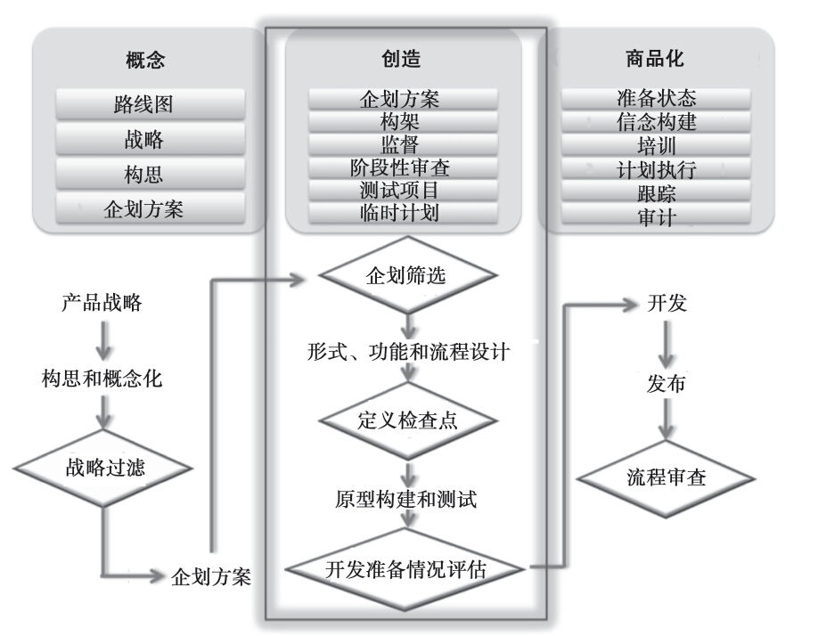
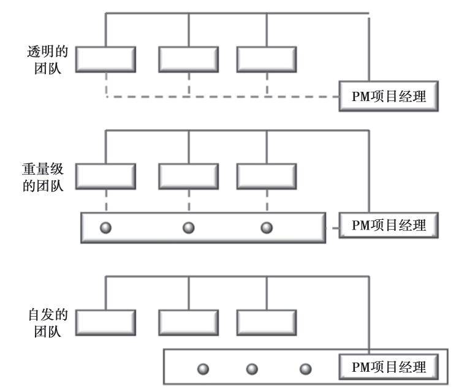
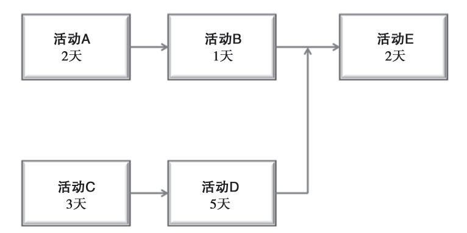
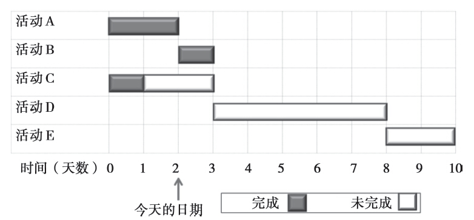

## 第8章 监督新产品计划

请判断对错：范围蔓延是因为前期规划不够扎实。

事实上，这种说法既可以说是对的，也可以说是错的，要看具体情形而定。我们肯定能找到不少实例，因前期对市场需求界定不够明确，从而导致各种不必要的重复工作。当然也存在不少这样的情形，项目进行当中发生了很多意料之外的变化，因而导致在产品发布之前，需要对产品做出调整。产品经理的工作就是要努力消除第一种情形的出现，并降低第二种情形的严重程度。

至此，产品经理的工作已经进展到“概念化—创新—商品化”过程的中间阶段（见图8-1）。在这个阶段的早期，产品团队应该努力把市场的要求确定下来，作为所要设计的产品规格范围。实际上，有些公司（如3M公司）会制定由全体成员签字的小组“契约”，确定目标市场，并冻结最终阶段的产品定义。此后的变化需要所有团队成员，有可能还会要求管理层的签字认可。

到了现在，工作的重点是项目管理。在有些情形（或公司）中，对项目的领导职责属于产品经理，而在其他地方，该职责可能由指定的项目经理来承担，这通常要综合考虑产品的复杂程度，以及产品经理的自身经历。

图8-1 产品开发3C框架的产品创造阶段

作为项目经理的产品经理

在他们合作发表在《哈佛商业评论》的文章“产品完整性的力量”中，金·克拉克（Kim Clark）和藤本隆宏（Takahiro Fujimoto）对“重量级”产品经理与其“轻量级对手”进行了区分。根据他们在汽车行业所做的研究，[[1]](part0015.xhtml#ch1-back)有不少产品经理只属于某一个部门，因此不能承担跨部门的领导职责。他们缺乏在自己部门之外的影响能力，很少甚至从来不和处于实际工作层面的工程师或营销人员接触，并且主要作为辅助人员和协调人员开展工作。因此，他们会花很多时间参加各种会议、阅读各种报告，并撰写各种备忘录。

与此相反，重量级产品经理是作为产品的总经理发挥其作用的。克拉克和藤本隆宏解释说：

除了各种与概念（创意）有关的工作之外，他们的工作职责还包括：协调生产与销售以及工程设计之间的工作；协调从概念到市场的整个项目运作活动；终结有关规格、成本目标、产品设计以及主要部件选择等方面的争论；保持与现有和潜在客户的直接接触。重量级产品经理应该知识面广泛，充分了解整车开发所需要的所有产品以及流程设计方面的知识。在公司工作多年，增加了他们的说话分量，也增加了对他们没有正式控制权限的人员的影响能力。[[2]](part0015.xhtml#ch2-back)

本田公司的“大产品领导”就属于这么一个职位。它负责制定出强大的产品概念，而且要有能力将最终产品开发出来，并提供给终端客户使用。本田雅阁的产品经理在开始第三代产品设计的时候，他所面对的挑战是在整个产品开发的过程中保持“人为本，车为末”的概念，但仍要坚持把雅阁汽车重新定位成符合未来顾客预期的产品。为此，在先期开展的一系列小组头脑风暴会议中，产品领导及其团队决定将其轿车的信息人性化，以便给顾客造成一种“穿西服的英式橄榄球运动员”的形象。接下来的工作是将这个形象相应地体现到轿车的品质上去。为此，他们选择了五组关键词汇：开放心态、友好沟通、坚韧精神、没有压力以及永恒的爱。坚韧精神是指在困难环境中的操控性；永恒的爱是长久的客户满意；没有压力则体现在降低噪声和减震方面的努力。

要全部实现所有这些目标的要求，对于雅阁的设计团队来说一个挑战。为了实现最大的乘用空间和驾乘人员的可视性，他们放低了发动机舱盖，从而使得设计中的前挡风玻璃比以往的更大。可问题是，巨大的窗户意味着夏天车内温度会高得让人难受，因此需要加装更大动力的空调，这就要求轿车装备更多马力的发动机，而大型发动机与低发动机舱盖设计则是相互矛盾的。

它的产品负责人没有让这种情形转变成非此即彼的选择，他提醒设计团队，要以未来用户的眼光来看待自己的工作，从而完整地保持了最初的概念。他们因此开发出一款既紧凑动力又强的新型发动机。

本田公司的这个例子表明，以市场为导向是有才能的产品经理工作的重要内容。但克拉克和藤本隆宏俩人同时指出，要求远不止这些：

确实，设计源于客户的需求，因为最好概念的提出者总是需要对各种信息进行加工整理和补充，而这些信息主要来自营销专家，他们能亲手获得各种原始数据。不过，强大的产品概念还包括对我们成为“市场想象”的合理测量：这包括客户声称他们想要的，以及概念提出者想象的、客户三四年后将会想要的东西。产品经理始终要牢记，客户所知道的只是现有产品和现有技术，这样他们才能避免过于接近顾客和设计出的产品在投入生产之前就已过时的陷阱。[[3]](part0015.xhtml#ch3-back)

产品经理必须对大量细节进行处理，以确保产品概念各细微之处在开发与营销的过程中不会丢失。尽管制订产品和营销计划是这种工作的一部分，但其中最重要的是，就难以触及的理念与他人进行沟通。在设计阶段与专业工程设计团队之间的日常沟通，以及在开发阶段与工厂人员之间的日常沟通，是产品经理的重要职责。同样，产品经理在一定意义上还必须对轿车进行试驾，并持续努力实现更加强大的产品完整性：

产品经理的工作触及新产品开发过程的每个步骤。事实上，重量级产品经理必须能运用多种语言进行沟通：对于顾客、营销人员、工程师以及设计师的沟通语言都必须流畅。这一方面意味着能把像“口袋火箭”这样的煽动性概念转化成“最高时速250公里”以及“风阻系数低于0.3”这样注重细节的工程师容易理解的具体目标值。另一方面，这也意味着能够评估并解释，对于客户来说，“0.3的风阻系数”是什么意思。[[4]](part0015.xhtml#ch4-back)

组织出色的产品管理需要依靠正式和非正式组织架构协同工作。本田公司的例子以非常重要的方式展示了这种协调性。沟通渠道都是开放式的，且直接沟通多于间接沟通。各部门专家都获得了相应的尊重，但却不必对其有过分崇拜的心理。产品理念也被整个产品团队人员充分吸收理解。

其他产品的重量级产品经理也都拥有汽车行业产品经理一样的特征。正如让·勒格朗（Jean LeGrand）在《银行家》杂志上发表的文章“需要管理的产品”[[5]](part0015.xhtml#ch5-back)中所指出的那样，“在银行业，成功的产品经理必须是优秀的专业人员，并在本行业内广受尊敬”。他必须能够理解“复杂的组合管理项目，以及用于成本核算和计算资产回报率（ROE）的计量模型”。并且，与汽车行业一样，这个职位还需要丰富的市场知识，拥有能把技术概念转变成消费者能够理解的语言的能力。

在快速消费品公司，产品经理（通常称“品牌经理”）不太可能有产业方面的经验，而是拥有相当多的管理和营销技能，这通常属于MBA毕业生应具备的能力。他们需要为自己的产品创造强大的品牌识别度，通过自身努力赢得尊敬，在整个产品设计项目中保持冲劲，并为实现共同的目标去激励每一个成员。与其他行业的产品经理一样，快速消费品的品牌经理也必须努力实现并支持其产品的完整性。

团队架构、组成以及项目流程

新产品项目的重要资源是让合适的人做合适的事。具体的工程师、设计师、营销人员以及其他人员要体现某个特定项目最为需要的品质，但他们需要从相关部门“借用”这些品质特征。产品经理必须与不同职能部门的经理协商，有时候还必须与具体个人协商，以便为自己的任务配备合适的人选。

#### 团队架构要与项目的种类相适应

团队可以小到几个人，大到数百人。美国的公司大多数运用跨部门团队，让每个成员在项目中代表最大的利益相关方。不同的团队架构（见图8-2）适用于不同的项目。直线延伸或简单产品可以运用直接透明的矩阵结构，其中，产品经理通过不同职能部门引领项目开发。在这类架构中，职能部门团队成员可能在特定的项目中花费的时间不到25%。产品经理很可能地位较低或处于中层。随着复杂性的增加，组织架构的重量级也会增加，产品/项目经理会与把全部时间（临时）投入新产品工作中的职能部门专家合作共事。对于某些突破性产品，自发团队（偶尔会在同一地点办公）比较合适。在这种架构中，报告关系从单独的职能部门转向项目单元。最后这种架构是最不常见的。（小公司也许无法奢望用不同的矩阵架构，因为每个人可能都会参与到所有项目之中。）不管组织架构如何，产品经理必须构建一个尽可能完善的最佳团队。

图8-2 新产品矩阵结构

不同部门的视角至关重要，但你可能还需要考虑组织期限、文化层次、人员性别与个性的多样性。这可能导致协调起来更加困难，但也可能因为不同视角的互动而产生新的想法和解决问题的思路。更高程度共享心智模式的团队，可能容易受团体迷失的影响。因此，让团队成员在不同项目之间进行轮换很有价值，但这可能导致低效。为了降低这种风险，产品经理应该尽量掌握跨团队的知识体系。有几种工具可以帮助他实现这个目标：（1）在新组建的团队中安排过去在成功团队里工作过的成员；（2）在参与新项目团队工作之前，让新团队成员参加成功团队的会议，向他们学习；（3）指派成功团队的成员作为导师；（4）确保整个团队的所有成员不会同时被更换。[[6]](part0015.xhtml#ch6-back)

#### 建立团队基本准则

产品经理作为产品开发团队的主管，负责指导团队的活动，保持团队的目标协调一致，并且与高级管理团队保持有效沟通。首先就要确立团队的宗旨。尽管团队明显是为开发新产品而存在的，但也必须明确每个人对其职能、时间安排以及产品开发的目标都要有一致的认识。团队宗旨应该高于团队的一切会议日程和会议记录。确立了团队宗旨的承诺之后，为团队会议制定共同接受的基本原则，可包括的条款有“参加会议前必须做好充分的准备”“所有会议都必须按时召开或结束”“开会时不得使用手机或其他干扰会议进程的设备”“团队成员轮流承担做会议记录的责任”。确保所有团队成员认识到自己对每次阶段性检查工作的贡献。

#### 运用工作分解结构和活动图表

项目团队组建的同时，项目的进程也要同步制定。首先搞清楚完成特定新产品项目所需要的主要活动。每项主要活动都应进一步细分成具体的任务和分任务，创建工作分解结构（WBS）。用WBS中的信息来预估项目开展的时间和各种资源要求。工作任务必须细分到足以允许各种可接受的预估为止。如果没有WBS，任何对时间和资源的估计都只能是个大概，可能会与真实要求产生巨大出入。下面是一次产品召回的WBS范例。尽管不是新产品开发项目，但它仍然给我们呈现了一个完整流程的简单案例。

1000开展全面的安全分析

1001根据产业/政府标准进行风险分类

1002参观工厂

1003员工访谈

1004产品与设备测试

1005确定召回的速度

2000通知员工

2001给全体员工发电子邮件

2002在内部网创建相关登录页面

2003对在现场处理本次召回的销售人员开展培训

3000通知中间商和顾客

3001发送第一等级或优先级电子邮件

3002电话直接联系关键客户群体

3003为回答各类问题建立免费热线电话

3004在网站上建立专门的登录页面

3005在相关媒体上发布新闻

4000修复召回产品

4001渠道库存计划

4002为客户返回产品实施通道保障

4003指导客户返回产品

5000确保及时修复或替换部件

5001内部工作流程

5002外部工作流程

特定活动和任务一旦确立下来，就要搞明白彼此之间的顺序和并行关系。什么活动可以同时开展，哪些活动只能按一定顺序开展？这通常可以用流程图表示出来，如图8-3所示。在该例子中，尽管活动A先于B，活动C先于D，并且这些活动都先于E，但活动A和B可以与活动C和D同时完成。

图8-3 关键路径方法图

每次活动的预计时长表明，C-D-E所需时间最长，因此属于关键路径，即没有空闲阶段，如果没有按时完成会耽搁整个项目进程的一系列活动。构建这类网络图的过程称为关键路径方法（CPM）。把概率增加到预计时间上之后，这个过程称为计划评审技术（PERT）。请注意，在图8-3中，虽然各项活动被标示于方框之内（称为“单代号网络图”），但这种网络图也可以使用圆圈来表示“活动完成”，它们之间通过箭头连接，并将活动内容标在箭头线上方（称为“双代号网络图”）。

构建CPM或PERT网络并不是项目管理中最难的部分。确定在该流程中应输入什么信息并对其进行管理，才是真正难题所在。重要的是，参与项目执行的个人或职能领域要为开展各种活动提供所需的时间和资源。通过预备阶段的信息输入而开发出的先期网络，能确定预期的预算和结束时点。如果这两个都不能接受，就有必要回顾所设定的目标，把资源从次要路径活动转移至重要路径活动中去，或者用成本更低的选择来替代，用到这个流程之中。

在执行项目之前就已经准备好的项目计划和时间安排可以作为控制系统的工具。这个时候，控制是指与计划进行对比所体现的进展情况，因此出现偏离就能马上实施纠正行动。直方图（也称“甘特图”）通常被用来表现活动中预期和实际进展情况，如图8-4所示。注意，活动B提前完成了（由于它预计在第3天完成，实际上却在第2天即今天的日期已经完成了），活动C则足足拖延了1天。由于活动C是关键路径的一部分，因此整个项目将会推迟，从而需要采取一定的纠正行动。

图8-4 甘特图

指导性关卡评估和贝塔测试

产品经理（如果两者有共同职责，那么与项目经理一起）应该理解在开发过程中关卡评估的作用。多数决策点分析（也用阶段性退出评估、业务决策点、里程碑、检查点、关卡和各种其他术语来表示）则用来确定是否就此进入产品开发的下一个阶段。

#### 不同评估有不同的要求

产品筛选委员会（很可能由每个部门主管组成）所开展的主要业务评估通常包括：各种业务筛查、确定检查点以及进展准备情况评估。第一种评估涉及第7章中所讨论的企划方案的认可。这一阶段可交付的成果是产品定义（结合市场的要求）、销售收入和成本估计、产品预开发方案。是否进入下一个阶段的决策要视方案能否通过相关的业务筛查标准而定，比如战略上是否匹配，以及可接受的成功风险等。

跨部门小组一旦正式开展新产品研发工作，就必须更加深入地了解目标客户，并设计最好的产品或服务来满足企划方案规定的各种条件。需要开展的活动包括客户拜访、概念优化与测试以及通向最终产品设计的流程。可交付的成果包括最初产品规格、对成本更好的掌控以及更明确的市场规模和定位。接下来的评估是确定检查点。在这一关，新产品委员会要评估市场与财务预测是否仍可接受，各种规格是否已更加合理且能够实现生产，以及是否具备合适的资源以推动项目的进展。如果答案是肯定的，项目则可以进入产品线的延伸阶段或新产品原型制作和测试阶段。我们现在假设下一步工作是制作产品原型。

现在，产品开发进入了研发或工程设计阶段，真正开始制作实体产品。此前的产品都只是停留在语言描述或粗略的实物模型阶段。现在它必须转化成技术上可行的产品。这并不是说不再需要营销（或产品管理）了。相反，产品经理的工作是确保在整个开发过程中，产品概念中的核心优势不会丢失，并且在营销方案、商品名检索，以及其他新产品成功所需重要因素方面都按计划推进。这就是项目小组方法如此重要的原因所在。

#### 原型测试与认可

原型开发出来之后，必须经过严格的功能和客户测试。功能测试在实验室和实际运用场所进行，以确定产品是安全可靠的（能如其所预设的那样持续运行）。客户测试用来确定产品是否适宜。市场测试、家庭测试和贝塔测试（客户原型测试）就是各种在该阶段需要开展的测试的变体。

有些生产商会建造巨大的机械，模仿产品可能会经历的任何形式的滥用。例如，驾驶汽车的机器人把汽车开进克莱斯勒的大型气候实验室，让汽车接受各种炎热和冰雹天气的考验。嘉宝公司（Gerber）在热心父母的帮助下招募大量新生儿作为其未来客户，并持续追踪这个由2500位婴幼儿组成的测试人群的产品使用情况，直到3岁。

为了让“强力笔记本电脑”（PowerBooks）更能够经受消费者的折腾，苹果计算机公司要求所有新型号的计算机必须经受共同的严格考验。这包括将其浸入百事可乐和其他苏打水中，给它们涂上蛋黄酱，以及为了模拟轿车后备箱的情形，而把它们放到60度或以上高温的烤箱中进行测试。[[7]](part0015.xhtml#ch7-back)

测试场地的选择对产品发布的成功有重大影响，其原因如下：（1）所选的公司或个人应具有足够知识，全面测试产品，并搞清楚任何潜在问题或需要改进的地方；（2）他们（选择作为测试场的公司或个人）应该具有在产品发布时用来证明产品成功的“参考价值”；（3）他们应与该区域的销售人员和公司保持良好的关系，以便能忍受产品失败的风险，同时不会造成长期损害。

在该阶段，需要回答如下问题：

·原型是否如预期的那么有用？

·各种规格是否都符合预期？

·它是否满足客户的需要？

·是否存在任何预期到的生产难题？

·这些难题是否能够在合理时间内、用合理的成本加以解决？

·产品生产安排最终确定下来没有？

·一切是否都按计划进行了？

·各种成本是否都得到了确认？

·有没有订购生产原料？

·是不是需要作细微的改进，以改善产品或增加其价值，同时又不会给该项目造成负面影响？

·是不是需要作重大改变，从而导致项目的必要延期？

总之，项目经理应该确认各种可交付的结果、预算、时间表、风险、资源以及对新产品项目的资助情况。

所有这些问题是开发准备评估的一部分。如果全部问题都得到了肯定的回答，产品规格就应该冻结下来，管理评审委员会（即部门高级职位人员）应签字表明，接受产品规格并支持继续资助该项目。

注意，在每次评审中，产品经理都要提供越来越多的具体“证据”，来证明产品可行性。尽管最初的筛选是基于高水平的预测和企划方案的“骨骼”，但产品经理需要在获得新信息时，把“肌肉添加到骨骼上去”。要实现最好的效果，一定牢记，要从不同利益相关方的视角去审视这个项目。项目小组成员很关心自己的工作活动和希望他们交付的成果。而执行团队却不怎么关心各种活动，相反，他们更加关注可交付的产品以及这些产品带来的后果和结果。换句话说，管理层想要知道新产品能获得的市场份额、利润率、收回投资以及企划方案中列出的各种“承诺”的可能性。因此，产品经理来参加评审会议时，应做好准备，告知对方项目正如期按企划方案执行，如果还没有照此执行，也应该提出一些合适的建议。

至此，我们讨论了具体新产品项目的传统的（硬性的）业务门径审查。还有两个门径审查变体值得提一下：具体新产品项目的软性审查和成批新产品项目的组合审查。软性审查通常是指针对选定利益相关方，而不是全部高管或新产品筛选团队进行的审查。这种审查的时机和频率由产品经理或项目经理确定，通常由时间安排而不是业务决策推动。例如，如果产品经理担心某个附件不能及时完工，或者如果市场信息要求再次审查产品功能，就有必要针对这些具体问题开展审查，以获得可能影响整个项目的潜在方向变化方面的意见。

#### 组合评审

组合评审更可能由上级管理层推动，而不是由产品经理发起。尽管有时候评审委员会与具体的项目评审同步进行，但评审却超出了单个产品的范围。这些评审是用来确定各种资源是不是在当前正在开发的全部产品中进行了最有效率的配置，以便为公司实现最好的结果。有时候，可能会决定把资源从产品A转移至产品B，但这并不一定是因为产品A的表现不好，而是因为资源可能实现更快的回收，也可能是要挫败竞争对手的某一次行动，或具有相似的战略影响。

#### 范围蔓延管理与准备

新产品开发过程中，除了管理团队和门径审查之外，产品经理还需要警觉产品的范围蔓延问题。范围蔓延是指在某个项目范围内无法控制的变化，如增加功能、增强特征（未来特征）、更贵的部件，或对最初企划方案的其他改变。导致这些结果的原因很多：在开发过程的早期没有明确的产品界定，坚持完成最初界定时没有明确纪律以及意料之外的市场变化等。

要管理范围蔓延就必须考虑到每一个原因。首先，我们要确保企划方案所设定的范围非常明确。具体规定必须满足的市场要求，仔细核实，设计师和工程师理解这些要求，并很好地将它们体现到产品规格之中。工程师一致抱怨，产品经理提供客户要求信息时不够具体。尽管不该因此而鼓励产品经理过多参与产品设计，但是他们与产品开发人员合作，实现最好的平衡非常重要。

下一步是处理各式各样的“契约”，项目小组和执行审查委员会签字确认了第一份市场要求和此后的各种产品规格之后，便会有效地冻结了这些部分。如果所有的改变都会要求每个人再次签字确认，那么这些变化就需要认真考虑了。如果因为质量问题要求改变，签字认可就比较简单；如果改变是因为一时兴起，签字确认就会比较困难。对于某些“锦上添花”的特征，则要考虑是不是能把它们融入未来的产品线扩展或产品升级版中去，以避免对该具体项目改变顺序。

项目开始时往往存在一些不可避免的不确定性事件。例如，行业标准或监管要求可能处于不断改变之中，这就要求具备根据新信息随时做出调整的能力。即使企划方案是根据当时已有信息做出的最佳决策，产品经理仍要明白，未来产品发布之前，零部件的规格都有可能需要做出调整。对此，最好的做法是设计时要考虑到各种不确定性。确定哪个选择需要做出改变，并尽可能晚地冻结产品的各种规格要求。有时候，这要求“建设要围绕着”各种不确定性（如子部件）展开，这样，如果子部件有什么变化，就不需要对整个产品做出改变。这还可能意味着，需要尽早开发出更多的原型（快速成型）来提高学习速度。这些方法虽然确保了灵活性，却导致了较高的初始成本，但如果需要做出改变，从长期看，是可以节省时间和资本的。这一点和买保险差不多。[[8]](part0015.xhtml#ch8-back)

最后，如果范围蔓延是因为未曾预料到的市场变化所导致，如新的竞争产品、经济衰退或者消费者行为的游离不定等，就需要做出业务决策了。市场变化是否足以要求对产品做出改变？能不能只对产品做最小的改变？推迟到对未来产品再作变动，行不行？如果市场变化要求改变产品，越快做出变化，对整个新产品开发工作就越有利。

本章思考

即使你并不拥有所开发项目的所有权，也应该像重量级产品经理那样思考问题。不断努力，实现并保持产品的完整性。

劳拉·法纳姆访谈：对于项目监管，高管期待的是什么

劳拉·法纳姆（Laura Farnham）

江森自控副总裁

电子邮箱：Laura.Farnham@jci.com

劳拉，你的履历非常精彩，从数字设备公司（DEC）产品经理，一直做到目前所在的江森自控的控制线业务部副总裁的位置。你能不能简单地介绍一下自己的职业经历？

我的第一份产品管理的工作是在数字设备公司。当时这是一家年产值120亿美元的计算机产品与服务公司，后来被康柏公司（Compaq）兼并，此后又被惠普公司（Hewlett-Packard）兼并。他们对于产品管理具有一套非常完整的流程，并有一套经过时间考验的训练方法。因为各流程都是标准化的，所以公司内部的流动相对简单。刚开始，我在半导体部门工作，后来转到了软件部门、系统部门，最后到了服务部门工作。惠普兼并康柏的时候，我已经担任了康柏全球服务的营销副总裁职务。有了IT行业的这些经历之后，我转行至霍尼韦尔公司（Honeywell）、特灵公司（Trane）以及江森数控，从事建筑管理系统（BMS）和暖通空调（HVAC）系统方面的工作。

产品经理职责的重要特点就是它实际上触及业务的方方面面。它对企业的成功起着非常根本的作用，因此可以轻松地在各企业或行业之间转换。它还提供了重要的跨部门工作经验，也使得职业道路的选择变得非常丰富。

请你和我们谈谈，这些公司中的产品管理有什么异同？

数字设备公司到目前为止在整个流程和跨部门调度方面是做得最成熟的。其中部分原因是产业发展的结果（这种部门广为接受），另有部分原因是公司的工程设计文化（对于标准、重复性流程非常合适）。

产品管理职能在建筑管理系统和暖通空调系统行业也逐步走向成熟，其基本原则都同样适用。成熟产品流程的价值在于整个企业都参与并理解强大产品管理部门的重要性及其影响。它除了确保合适的产品在合适的时间以合适的成本投放市场之外，还要确保与各部门（销售、营销和工程设计）保持战略一致性。

我们具体谈谈新产品开发。作为整个过程的看门人，你负责的是推荐应该推进的项目。你希望从产品经理那边获得什么信息，来帮你做出这些决策？

这听起来涉及面大了点，但答案是，我几乎想从产品经理那边了解一切。不论是不是完全理解竞争环境，特征、成本与时间的平衡，生产地点与生产流程对成本与发货方面的影响，产品定价和边际收益与市场份额之间的平衡，只要你能想到的，他们都得考虑。对于产品的每个方面，产品经理是唯一一个可以信赖的节点。

对于门径审查过程的具体方面，产品经理在产品开发的不同的阶段需要提供不同的信息。例如，在产品构想或概念阶段，市场信息和客户要求相对较多。随着概念的成熟，逐渐发展到第二阶段末，就需要完整的企划方案来支持是否继续下去的决策。这包括明确的市场规模和成长率、市场份额预测、竞争对手地位、定价和市场目标、工程设计和生产投资，以及销售、管理及行政费用（SG&A）投资等。另外，还需要进行情景模拟，来表明项目对于价格、成本或市场份额之类变量变化的敏感性。

产品开发结束，团队准备发布新产品时，我希望产品经理对企划方案和市场假设开展验证工作。如果产品开发耗时太长，市场条件可能发生变化，从而可能影响价值定位或竞争定位。在整个开发过程中，产品经理需要监控这些因素，还可能需要调整营销计划，来确保项目能在第二阶段结束时实现所承诺的财务回报。

你能不能给我们讲一两个具体的产品管理的成功故事？

我喜欢的多数成功故事涉及新的或相邻的空间安排问题。这些都是最难解决的问题，因为组织要被迫考虑组织以外的情况，并要求在很多前沿方面实施变革。但这些都是能带来最高回报的，就像俗语“没有付出就没有收获”所说的一样。

有这么一个例子，是一款新软件。有些概念直接来自研发实验室，会让开发过程变得更复杂，但最终能让我们的产品领先潮流。我们面对的最大挑战就是如何预测销量，因为这是一种全新的产品。好消息是，它只能在我们的操作系统上运行，因此企划方案假设的客户基础就可以直接针对预装我们系统的客户。下一个挑战是怎么销售这款软件，它还不属于我们的传统产品，因此需要扩大对销售团队和技术支持团队的培训。尽管发布产品耗费了相当大的人力物力，但它很快就成了公司最畅销的产品，不仅财务回报丰厚，而且在团队参与水平和整体职业满意度方面，都有极高的回报。

另一个例子是决策的另一极，知道在什么时候撤销一个项目，以及在什么时候推进一个项目同样重要。考虑到个人已经花了不少时间和精力，想要让产品经理建议取消某个产品是很困难的。我想起有这么一个例子，当时组织考虑开发一个新的高端产品。竞争相对有限，市场界定明确，但进入成本很高，部分原因是产品开发周期很长。从情感上讲，领导层希望在该行业最大系统中创建一个品牌，但从公司财务上看，这么大的投入并不合理。即使产品经理已经制定了多个方案，努力满足各种财务要求，但最终他不得不建议取消该项目。这听起来很简单，但对于公司来说，做出这么一个决定是非常困难的。

对于帮助产品经理更有效地履行职责，你有什么建议？

产品经理这个角色非常复杂，也很难明确给他们什么样的具体建议。我只能给大家提三点思考：

1.周密规划，表达决心并让大家知道。

2.全局考虑，积极思考。

3.建立强大的跨部门和跨组织团队。

最重要的是，享受你正从事的工作。

[[1]](part0015.xhtml#ch1) The section on heavyweight product managers was adapted fromKim B.Clark and Takahiro Fujimoto，“The Power of ProductIntegrity，”Harvard Business Review（November–December 1990），pp.107–118；Christopher Power et al.，“Flops，”BusinessWeek，（August 16，1993），pp.76–82；and Jean E.LeGrand，“A Product inNeed of Management，”Bankers Magazine（November–December1992），pp.73–76.While the product managers in the automotiveindustry described in this section were generally part of engineering，most product managers in other industries are in marketing，marketing/sales，or product management departments.

[[2]](part0015.xhtml#ch2) Clark and Fujimoto，p.108.

[[3]](part0015.xhtml#ch3) Clark and Fujimoto，p.109.

[[4]](part0015.xhtml#ch4) Clark and Fujimoto，p.110.

[[5]](part0015.xhtml#ch5) LeGrand（1992），p.73.

[[6]](part0015.xhtml#ch6) R.Madhavan，“From Embedded Knowledge to EmbodiedKnowledge：New Product Development as Knowledge Management，”Journal of Marketing（October 1998），pp.1–12.

[[7]](part0015.xhtml#ch7) Faye Rice，“Secret of Product Testing，”Fortune（November 28，1994），pp.88–95.

[[8]](part0015.xhtml#ch8) Preston G.Smith and John S.Farnbach，“Avoid Costly 11thhourProject Dilemmas by Preparing for Change，”PDMA Visions（December 2010），pp.24–26.
