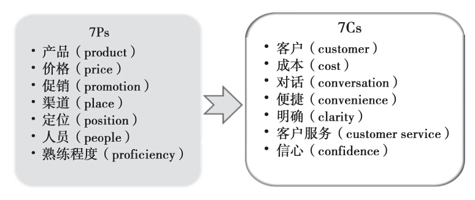
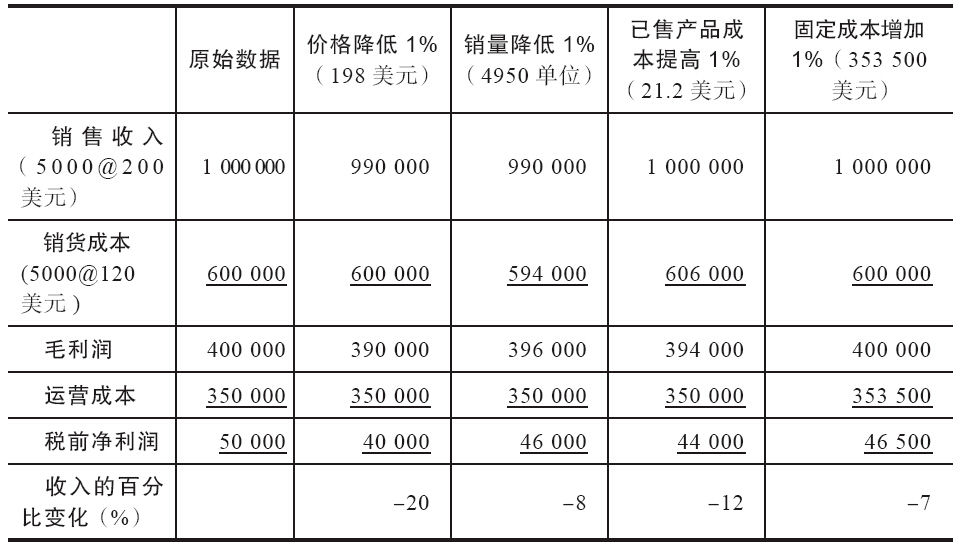
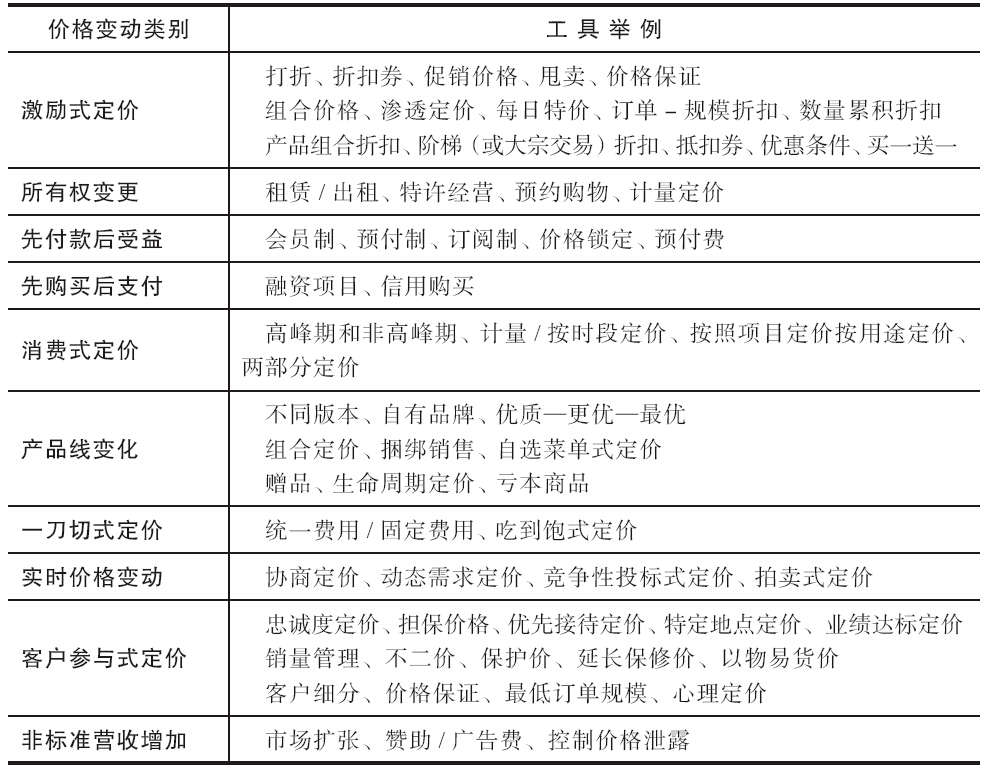
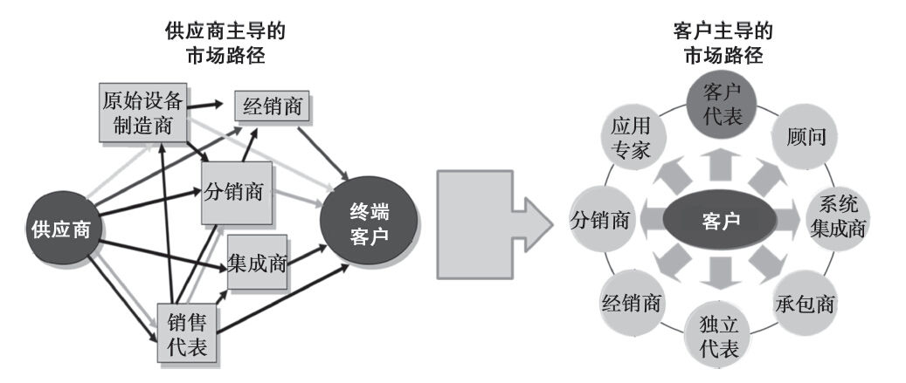

## 第12章 营销策略与产品上市

请判断对错：广告、销售和营销是一回事。

这种说法是绝对错误的。营销是前期活动，着重了解客户以及他们的需求或目标与当前或未来产品的匹配程度（因此营销属于规划阶段的工作）。广告和销售是后期活动，是执行营销战略阶段的工作。但它们彼此之间联系密切，产品经理在实现预期产品目标的过程中，必须评估它们各自的作用。

请判断对错：优秀的销售人员能把任何东西卖给任何人。

这是一种普遍存在的误解，有时候甚至产品经理和销售人员自己都这么认为！如果产品经理给销售人员提供好的产品、强大的价值主张、必要的配套或演示、精心确定的目标市场，那么销售能力的增强便会水到渠成，双方必须通力合作才能实现所期望的销售目标。

我们用这两个判断题作为本章开篇，接下来我们将重点讨论两个问题：营销策略组成部分中的客户信息收集问题和产品定价问题。此外，我们还讨论围绕产品上市而开展的各种支持工作。

营销策略

根据美国营销协会的在线词典解释：“营销既是一种组织职能，也是为了组织自身及利益相关方的利益而创造、传播、传递客户价值，并管理客户关系的一系列过程。”这是对历史悠久的4Ps营销模型的演进。4Ps模型就是指产品（product）、价格（price）、促销（promotion）和渠道（place）。由于这些概念只关注内部问题，现在有不少专家（美国营销协会的定义所示）已经把研究视角转移到了组织以外的客户身上。将产品视为针对各种客户需求的应对之策而不是一系列特征，是这种观点的重要内容。图12-1所显示的不仅是在4Ps理论中增加几个要素，而且也把视角从传统的P视角转变为从外部来审视的C视角。

图12-1 营销从内部视角转变为外部视角

从外部角度看，产品是满足客户需求的一系列要素的具体体现。价格是产品为客户带来的利益及相应成本的货币化体现。促销是从个人的独白转变成为双向的对话，随着社交媒体的发展，这一点尤其重要（在本章结尾处的专家访谈中有相关讨论）。对渠道的理解，现在增加了对客户获取产品的便捷性（或缺少便捷性）方面的认识。如果产品定位得当，客户就可以对该产品获得较为明确的认识。那么，他们是否真的知晓并了解该产品定位的特别之处？员工给客户提供的服务将会成为品牌承诺一部分。最后，创造独特、高品质产品的熟练程度和能力就是证据，是“相信的理由”，会转变成客户的信心。如此一来，P视角的每个部分都需要规划、管理并得到控制，以便能按照C视角模型履行各种承诺，并“为组织和其利益相关方带来好处”。因此，我们在本章将深入讨论P视角模型和C视角模型中的各个要素。

#### 目标客户

关于客户、分区和市场方面的知识，本书通篇都有讨论，这里只是稍微增加一点细节。产品经理做决策时，既需要硬的市场数据，也需要软的市场数据。硬数据是指市场规模和增长速度等方面的信息，这对评估金融市场的潜力是十分必要；软数据是关于客户感受和态度等相对无形的因素，这对品牌价值和客户信息收集来说是十分重要的。

产品经理应重新确定自己的视角，从以创造并销售产品为出发点转变为帮助客户做出购买决策，这意味着要深入分析客户的购买决策过程。其购买行为是经过“深思熟虑的”的还是比较简单的？是首次购买产品还是重复购买产品？购买产品的是新客户还是老客户？

深思熟虑后的购买是相对复杂的购买过程。例如，资本设备的购买通常要事先进行深入的研究，这需要众多影响人员的参与，并由某个专门委员会做出决定。为了提高成功的概率，你应该预测参与决策人员的个性和某些“敏感问题”，并尽量提供必要的“理由”来帮助他们做出对你有利的购买决策。这就是说，要为财务人员准备好财务方面“可以相信的理由”，为用户准备好“特征-好处”方面的证据。一方面，即使人们在感性基础上做出此类决策，他们依然需要理性数据来“证明其所作决定的合理性”。因此，理性与感性的购买驱动因素都是需要考虑的。另一方面，“简单购买”则更多的是个人行为，并更倾向于决策时感性的一面。具体要销售的产品有可能属于“深思熟虑后的购买”和“简单购买”之间的任何一种，因此需要相应地调整你所提供的信息。

如果多数目标客户是新客户，你就要确定需要运用多少信息来介绍公司并根据产品类别对客户进行教育引导。重复购买者则可能只需要更多提醒性质的沟通。

#### 定价战略及策略

产品经理必须负责制定上游和下游的定价决策。我们在第3章已经讨论过经济价值预测建模以及理解产品真实成本的重要性，新产品定价决策树理论则在第7章中讨论，所以这里不再重复。具体地说，接下来本书将从营销的角度来探讨产品定价问题。

最初的定价往往着重考虑产品组合中最重要的产品，这些产品可以是给公司带来重要现金流的核心产品，也可以是受益于更强势价值定位的升级产品。定价时要根据历史销售记录和销售力量的投入情况，来确定客户的价格敏感程度。提高价格能否留住足够数量的客户，并至少能维持目前的盈利水平？降低价格能否获得更多业务，并抵消因此而减少的利润？尽管这些问题都比较主观，但你可以仿效第3章中的例子设计一个电子表格，分析价格变化所引起的收支平衡情况，以便对价格进行估算。

要更加积极地对高周转率产品进行管理。这类产品要么更受欢迎，要么拥有更大的市场，因而需要更具竞争力的价格。假如你是二级市场汽车零部件产品经理，专门化的零部件往往通过经销商销售，因为购买频率不高，长期的价格竞争也较少，因此会有更高的利润空间。易损零部件则面临来自沃尔玛和其他大型零售商的竞争，需要根据具体情形进行评估并重新定价。

要尽量控制价格泄露（发票价格和落袋价格之间的差距），这与第3章讨论落袋价格问题时的情况一致。有时候销售人员或其他人会要求产品经理授权其以额外折扣或特殊价格销售产品。如果价格上的例外能提高产品的单位销量，或能防止客户转投到竞争对手那边，这样做倒是物有所值。但如表12-1所示，如果产品单位销量保持不变，我们就需要认真思考一下价格变化对盈亏的影响了。

表12-1 1%的变动情况比较 （单位：美元）

表12-1中第一列数据是比较基准：5000单位的产品以单价200美元出售，获得收入100万美元，税前净利润为5万美元。如果产品价格降低1%，调整为198美元，其他不变，盈利则从5万美元降至4万美元，即降幅为20%。再来看比较基准，比较如下调整带来的影响：销量降低1%、销货成本提高1%，或固定成本增加1%。很显然，只有预期单位销量增长的情况下，才能授权价格降低1%（要预测销量可以增加多少，见第3章的内容）。

要为产品线中的替代品和互补品确定定价战略。两个产品如果是互为替代品，当它们互相竞争时，重点在于要同时对其价格进行评估。这些产品是否具有不同的价值主张，因而要销售人员给不同的目标客户？如果是，就依此定价。如果一种产品代替另一种产品有相应的过渡策略，就要力求做好这个过渡的时间安排，把对差异化定价的要求降至最低。如果多个产品存在协同作用，作为一个整体解决方案（如设备及其替换零部件），则要确定降低设备价格是否有意义，是否能赢得初次销售，并从未来耗材上赢得更高的利润。企业案例12-1探讨的就是产品线定价方面的问题。

企业案例12-1

产品线定价

斑马科技公司（Zebra Technologies Corp.）是一家条码打印机制造商，其产品品质卓越、领先同业，在顾客中享有良好声誉。不过，该公司在低端产品市场也发现了许多潜在的商机。制造低价、低附加值的打印机对公司来说是轻而易举的事情，但推出这类产品会带来两个风险：它可能有损于斑马公司在客户心中已经塑造起来的高品质形象；更糟糕的是，这样做有可能对现有产品线造成冲击。

斑马公司的解决方案是推出一款简化功能的机型，用客户喜欢的塑料材质作为保护外壳。这种简化机型不能升级，从而确保了它不会与能快速将条码打印在任何材质上的高端产品产生竞争。但它也没有放弃目前在售的产品，其最终结果是：新型打印机使得斑马公司的销售额在一年之内就提高了47%，新机型的利润完全可以和原有产品线相媲美。

苹果公司在向下游发展时也采取了类似做法。它试图针对两个核心市场推出低端产品：Mac Mini和iPod Shuffle。Mac Mini是Mac电脑的简化版，是该公司推出的最便宜的电脑，它希望这种低价产品能让微软视窗操作系统的用户转而使用苹果的Mac电脑。苹果公司认为，自己的产品售价不高，再加上微软系统容易感染病毒，这会促使一些客户重新考虑自己的选择。

相对于标准的iPod音乐播放器，iPod Shuffle是苹果公司推出的一款功能简单、价格较低的机型，它的功能更少，存储歌曲的容量也更小。它的目标市场是那些对价格更加敏感、更加年轻的客户群体。在推出新产品后，iPod和Mac的业务量都获得了快速增长。

资料来源：David Greising，“Quality：How to Make It Pay，”BusinessWeek（August 8，1994），p.58.Nick Wingfield，“Apple Scores with Cheaper Lines，”Wall Street Journal（April 14，2005），p.A3.Peter Burrows and Andrew Park，“Apple’s Bold Swim Downstream，BusinessWeek（January：24，2005），pp.33-35.Nick Wingfield，“Apple Tries a New Tack：Lower Prices，”Wall Street Journal（January 12，2005），pp.D1-D5.

不论基础定价战略如何，一定要构建自己的创意工具箱并将其用来测试。你可以把表12-2作为工作的起点。并不是所有创意都是对你有用的，但它们在适当的情形中都会表现不错。多数定价方式是显而易见的，因此，该表是这些主要类别的概览。

表12-2 定价工具箱

资料来源：Linda Gorchels 2010.Reprinted with permission.

激励式定价应设计出来“激励”某些类型的行为。例如，订单-规模折扣的意图是在可接受的货运成本下保持发货规模；数量累积折扣则尽力鼓励客户长期保持忠诚。诸如特许经营之类的所有权变更，会让客户享受产品或服务带来的好处，即使他们的预算费用可能很有限。先付款后受益（或相反情形）式定价可以在客户特定的预算要求下，达成交易。消费式定价允许客户按自己用掉的产品数量付款。产品线变化（也称为“不同版本的产品”）是指允许产品按具体客户分区所认知的价值进行定价。产品创新可用来限制价格的敏感性，正如企业案例12-2“运用创新，减少价格竞争”中所讨论的那样。一刀切式定价可以用来简化购买和配送流程；实时价格变动能让我们根据竞争对手的价格变动迅速做出反应。客户参与式定价可用来实现产品价格组成部分与不同客户的价值驱动因素的匹配。非标准营收增加则是寻求产生新收入或利润的方法，但不直接调整产品价格。

企业案例12-2

运用创新，减少价格竞争

退出价格战的办法之一就是创新。我们用BD公司（Becton Dickinson）的皮下注射针来举例说明这一策略。该公司每年生产的针头数以十亿计，其价格也一直保持稳定。该公司也经历过一段十分痛苦的时期，那时一家日本竞争对手开始以每个单位7美分的价格（明显低于同类产品）销售其产品。换句话说，你基本就不会再想继续这个针头的生意了。后来，BD公司与百特国际（Baxter International）携手合作，当时百特国际已经成功开发了InterLink（分隔膜接头），一种无针接头产品。

要记住一点，医师插入病人手臂的针头占了整个市场约50%的份额。另外一半则用于把静脉注射导管接到其他静脉注射器上，正是这点让百特-BD团队取得了成功。InterLink看起来和常规注射器差不多，只是针头被一种坚硬的锥形塑料管所取代，管头部分做了钝化处理。百特发明了一种用塑料和橡胶做成的新型封口，这种封口在被刺穿后，塑料针头周围会重新封上。百特公司请BD公司生产这种针头。

医院很愿意为InterLink针头支付更多的费用，因为无针接头降低了意外针扎事故的风险。在产品上市之际，医疗保健业员工报道过的针扎事故大约100万起，对于每次事故，医院花费在时间和文案工作的支出达400美元以上，这还不包括任何法律费用或长期保健支出。BD公司营销副总裁加里·科恩（Gary Cohen）说：“这正是产品的吸引力所在，即使每个InterLink针头花费25美分，医院依然能省钱。”

这种创新趋势也蔓延到了消费品领域，很多公司想方设法希望成功提价。宝洁公司就下定决心，为自己单调的品牌注入活力。它仿效吉列（Gillette）公司有名的剃须刀和更换刀片战略，并想给自己的产品增加机械或电动的特色。售价为14美元的速易洁（Swiffer）拖把（搭配5.75美元的替换拖把头）就是一种利润可观的新产品，初次销售和后续销售都不错。汰渍去污刷（Tide StainBrush，一款电池驱动的刷子）、清洁先生自动干燥器（Mr.Clean AutoDry，水压洗车系统）以及其他配件产品，为宝洁公司贡献了540亿美元销售额中的8%左右的份额。

资料来源：Andrew E.Serwer，“How to Escape a Price War，”Fortune（June 13，1994），p.90.Robert Berner and William Symonds，“Welcome to Procter&Gadget，”BusinessWeek（February 7，2005）.p.76.

#### 客户信息沟通

现在我们来谈谈如何与客户谈话，这不是做广告，不是沟通，而是交谈。从对话而不是个人独白的角度来思考问题，你说什么、你怎么才能以让客户产生共鸣的方式说出来？这就是客户消息管理。这不只是发出一份字斟句酌的宣言，也不仅仅是用一番动听的说服话语来销售产品，而是转移到“对方”那边（购买方），并帮助客户做出购买决定（希望是对他有利）。

对于同一种产品，其受众却往往并不一样，这就要求产品所传递的信息也要有细微的差别。如承建商对车库的门只有一个要求（如为了完成工作），房主可能会有其他的要求（如安装简便），建筑师可能又有另外的要求（如美学与建筑设计的完美结合）。另外，我们此前也曾说过，对于很多产品，使用者可能并不是购买者，也不是他影响购买决策的人员，每个人需要该特定产品的理由可能都不尽相同。产品经理的困难在于要确定谁是首要受众，谁是次要受众，以便信息沟通战略有明确的针对性。

用尽可能多的细节清楚地描绘出你的首要目标客户，这样你可以想象出与他们进行对话的场景。有些人把这些细节看做产品原型或品牌原型。如果你的主要购买者是工厂经理，描述出这类人的心理和人口学特征，以便给信息战略提供协助。例如，“山姆”是一位45岁的工厂经理，在同一家公司工作十多年。他很想升职，但又担心自己缺乏其他领域的从业经验会成为他的障碍。他喜欢垂钓，偶尔也去打打高尔夫。他已经结婚，并育有两个孩子，开一辆运动型多功能车。

在描绘出目标客户之后，你要尽量设身处地从他们的角度考虑问题。为什么他们会在这个时候想要这个产品？他们购买这个产品的感受如何？他们可能会有什么反对意见，你的产品会不会给他们带来风险？他们可能正在考虑哪些替代产品？你的产品完全符合他们的需求或用途吗？你的客户在购买产品时会从哪儿获得建议？为什么你的客户应该相信你的产品比竞争对手的产品更能满足他们的需求？客户现在是如何购买产品（或满足自己的需求的）？一定要记住你的客户想要知道的是以下几点：

·你的产品（服务）会为我做什么？

·它会怎么做？

·为什么它比竞争对手的产品更好？

·是谁说的？我为什么要相信你？

·如果我不满意怎么办？

一旦你清楚了自己所界定的目标客户的想法，这些信息就可以用作构建产品或服务的创造性平台。该创造性平台有助于营销沟通部门的同事接受你的观点，并将其转化为客户信息。该创新性纲要至少应包含如下内容：

·具体说明你想接触的人是谁（描述市场情况及与你交谈的“人”）？

·主要价值主张是什么（如果用一个词来概括，你希望客户通过对话产生什么样的想法）？

·产品的定位是什么（你的定位如何优于竞争对手）？

·你希望传达的信息对受众有什么影响（人们的感受如何？如激动、释然、精力充沛）？

·客户为什么要相信你（能否从β测试、客户评价、第三方背书或其他“信任构建因素”中获得相信的理由）？

·客户接下来会采取哪些行动（试用产品、联系销售人员等）？

多数产品经理都要主动参与确定客户信息沟通的主题，但实际的执行则可能要由营销或营销服务部门实施。这就意味着你必须与他们通力协作，确定接触受众的最佳方式，而不一定总是通过传统途径。有时候，你必须独具匠心才能突出重围，要主动接触客户，尤其是像房屋抵押贷款这样的产品。艾柏全国抵押贷款公司（Arbor National Mortgage，以下简称“艾柏公司”）是一家位于纽约州尤宁代尔地区的中型企业，它开发了一种有用的数据库建设和定位方法。该公司把标准抵押贷款产品重新包装成新娘购物单形式的产品，成功地赋予了产品独特的身份。

艾柏公司选择了一款标准的房利美（Fannie Mae）抵押贷款产品，并将其重新包装成“艾柏新婚注册之家”（Arbor Home Bridal Registry）。新婚夫妇在艾柏公司登记，而不是在百货公司登记，这样亲友就可以为这对新婚服务购买首套住房出力了。“办理登记有大量工作要做，以至于我们在意的不是如何让新人前来登记，而是接受购置首套住房的询问。”艾柏公司高级营销副总裁博伊尔斯（Boyles）说，“虽然只有36对夫妇真正进行了登记，但有5000多对新人打来了电话，他们想要了解这项服务。他们的名字如今在我们的数据库里。我们希望将来有一天，他们会成为公司的客户。”艾柏公司还为地产经纪人、会计师和消费者举办了房地产抵押贷款讨论会。只要客户需要，艾柏公司还可以在他们自家庭院里或在公共森林中为他们种下一棵树作为纪念。[[1]](part0019.xhtml#ch1-back)

产品经理还可以运用各种各样的促销技巧，如样品赠送、销售竞赛，以及各种激励计划。这些技巧被称为“激励计划”，因为它们能够提供诱因，刺激短期产品销售的逐渐增长，而不是建立长期的品牌忠诚度。促销活动常被用来引入新产品、干扰竞争对手策略的有效性，或对某个新市场时行试探。

样品赠送可能是鼓励客户尝试新产品的有效方法。需要潜在客户改变自身行为才能被接受的新产品，通常要靠客户获得低价或免费试用产品的可能性。例如，3M公司的便利贴要求免费赠送样品，这样客户就能获得使用该产品的体验；试驾是汽车业中让客户试用产品的方式；有购买权的租赁方式也是免费试用样品的一种方式，它降低了双方的成本（和风险）。

渠道选择及销售支持

在本书中，我一直在强调掌握终端客户知识的重要性。现在转而来谈渠道似乎有点矛盾。其实不然，将产品有效地初次“销售”给销售人员、分销商、经销商及零售买家往往是实施营销战略、接触终端客户所必需的。除非公司的产品上市战略完全是通过互联网或无线环境来实施的，否则多数产品经理都需要在自己的方案及其执行当中考虑直接或间接的销售渠道。

#### 渠道知识

对于很多产品经理来说，销售渠道是既定的。但对于面临新发展挑战的那些产品经理来说，选择合适的上市途径可能至为重要。除非有某位产品经理负责的产品与公司内所有其他产品的分销方式不同，否则他很有可能无法完全掌控分销战略方法。多数分销活动都需要与现有分销商、经销商或代理商合作，必要时还要加快发货。但是有些新产品需要改变分销渠道，否则市场和竞争者会要求改变现有产品。如果产品经理正致力于把产品推向新的区域或向全球推广，销售渠道可能会是计划的关键要素，因此产品经理在制订产品计划时绝对不应忽视分销战略。

每当产品经理引入低价或高价产品时，或者有不同形象的产品被引入时，可能有必要引入新的销售渠道。一个极有可能成功的产品可能会因为错误的销售渠道决策而遭受挫折，虎飞公司（Huffy）在推出新款越界运动自行车时，就对此深有感触。

虎飞公司是一家成功的自行车生产商，年营业额高达7亿美元。该公司在发布一款越界运动自行车的新产品时，做了认真的市场研究。这款车综合了在青少年中流行的结实的山地自行车和车架轻巧、运转灵活的竞赛自行车的特点。虎飞公司在全国大型购物中心选择了两个独立系列的市场关注小组，随机选择儿童和成年人观看自行车，并给它们排序。新款自行车获得了购物者普遍认可。到此为止，一切顺利。1991年夏天，这款越界运动自行车被运往各大零售超市，如凯马特、玩具反斗城连锁店等，虎飞公司的生意多数是和它们合作的。错误就在这里发生了。虎飞公司总裁兼首席执行官理查德L.莫伦（Richard L.Molen）这样解释：市场研究人员忽视了一个关键信息。这款混合型自行车的目标人群是成年人，售价高达159美元，比公司其他自行车的价格高出15%，并因此需要那些专业知识丰富的自行车专卖店的销售人员专门向客户推荐。相反，虎飞公司却把这款车放在如凯马特这类大型零售商场里，由那些原本就很繁忙的一般销售人员来负责销售。结果正如莫伦所说：“这个错误的代价是500万美元。”到1992年，该公司减少了这款自行车7%的产量，其收入下滑了30%。[[2]](part0019.xhtml#ch2-back)

随着市场的不断分化，不同的目标客户即使对于相同的产品，也可能会寻求不同的分销渠道。一方面，对于关键客户，直接为其服务可能是最好的做法，而对于其他客户，通过分销商进行服务则可能更加高效；另一方面，针对小客户，可以通过电话销售为其提供服务，即便当时在该地区公司有业务代表正在拜访大客户。专业化的分销商或代理商在某些市场分区可能会比现有中间商更加成功，因此应定期发掘这种可能性。技术的发展改变了很多公司和产品的上市战略，如图12-2所示。

图12-2 渠道设计中客户影响力的增加

有效地激励中间商会对实现盈亏起到积极作用。首先，要认真记录产品分销商和销售代表的活动，并评估其总体能力。产品经理应陪同地区经理或销售经理定期拜访分销商或销售代表，并可能还要协助准备联合营销方案。如果设有咨询委员会，产品经理应认真参阅会议记录（至少参阅与自己的产品线有关的部分内容），并采取相应措施。

制造商和分销商的目标并非总是一致。一方面，产品经理有时候会把转销商当成自己产品的终点；另一方面，转销商则把接手产品那一刻看成销售循环的开始。这会造成不必要的冲突，但如果大家能更加有效地共享信息，这种冲突就能有效减少。

产品经理需要付出大量的金钱和努力去了解终端用户的需求，以及自己的产品是如何满足这些需求的。分销商也应掌握此类信息，与分销商共享信息不仅能帮助他们更好地工作，还使他们能够把与产品性能有关的、有价值的反馈信息提供给制造商。

销售渠道通常需要产品支持服务。产品支持包括以下几项内容：产品安装、持续的产品保修、产品升级、维修以及客户培训等。产品经理可能不会直接参与这些活动，但他应该关心是否有相关政策和程序来应对这些情况的发生。客户满意度往往依赖于这些因素，其重要性并不亚于产品本身。此外，产品经理还可能参与开发一些服务，使各个市场分区的盈利潜力达到最佳状态。

安装费用可以包括在产品价格当中，也可以被当作“可选”项目或非捆绑的项目，这个决定应由产品经理与合适的人员（如服务部门经理）共同做出。如果需要做出重大改变，它们应在营销计划中有所体现，营销计划还应包括对其他营销活动和盈亏平衡产生的影响。

质量保证或服务合同可能会影响产品的畅销程度，并应该与其他产品特征一起加以认真分析。在此，需要考虑的问题如下：

·客户期待的是什么？

·是否提供全面或有限的保证？

·竞争对手能不能做出相同的保证？他们会这么做吗？

·产品保证应由制造商、经销商还是其他独立组织来负责？

·签订服务合约和延长保证期有什么优势和劣势？

#### 销售支持

产品经理也应与内部销售人员开展广泛的互动。拥有销售经验的产品经理会觉得，自己能更容易理解销售人员的“世界”，并能更容易地为其提供他们真正看重的那类支持。产品经理通常提供的支持和培训包括技术产品细节和营销计划中晦涩难懂的部分。有些时候，这种支持欠缺的是要为销售人员提供具体工具和建议来帮助他们瞄准最有可能购买的客户群体并有效地进行销售。与销售部门的人员合作十分关键，见企业案例12-3。

企业案例12-3

营销与销售部门合作的重要性

对于包括医药公司在内的多数组织而言，管理要传递给客户的信息都非常困难。产品经理付出极大的努力，对关键要点进行微调，希望让销售人员传递单一、经过审慎定义的信息。但信息在经由产品经理到销售人员，再到医生的过程中会大量流失。通常，销售人员并不认为这些信息是可靠的，因为产品经理作为一个整体被认可的程度也相对较低。

有时候，产品经理发出的信息也不应是单一的，而应采用不同的视角来迎合不同受众的需要。医生往往会批评医药公司，说医药公司向他们提供的信息中含有以下过多的营销诉求：

参与调查的医生希望获得不带偏见、有证据支撑并且科学的产品信息，包括与竞争产品的直接比较情况、各种风险和副作用等。医生可能更希望了解该产品与同类竞争产品相比的优点，以及各种副作用和风险等详细信息。对于其他人来说，成本信息则是关键，而还有一部分人最关心的是产品能为患者恢复健康带来的整体好处。

如果产品经理要帮助销售人员培养他们与客户之间更有价值的关系，他们就需要为适合的细分受众创建合适的差异化信息。他们还必须向销售人员提供适当的辅助资料和销售工具用来帮助销售团队实现目标。为了实现这些目标，双方需要开展以下密切的合作：

极为关键的是，销售人员和营销团队能否通力合作，共同开发产品信息。在理想情况下，公司应想方设法构建一个由产品经理领导的跨职能团队。这不仅能让相关流程更有效率，也能确保所有的必备知识都被包含在销售材料之中。这种跨职能部门之间的合作可以确保销售组织能够全身心投入。

把客户输入意见纳入信息开发流程也是最佳实践做法，其最好的方法是建立由医生组成的典型小组。这些小组可用来研究并测试各种新信息选择，并帮助公司更加深入地理解医生想听到的是什么。

资料来源：Alasdair Mackintosh，“Getting the Message Across，”International Journal of Medical Marketing（April 2004），pp.102-105.

产品经理常犯的一个错误就是他们会尽力让目标受众的数量看上去尽可能多，从而引起销售团队的“兴奋”。他们不但没有把重点放在精心界定的目标客户群上，反而试图把重点扩张到第二级和第三级市场。很不幸，这种做法分散了销售力量，并降低了产品先期盈利的概率。因此，销售人员也变得对产品失去了信心。

销售人员其实是你的第一批“客户”，他们提出的问题与我们前面列出的客户问题有以下相似之处：

·你的产品（服务）能为我做什么（换言之，该产品如何帮助销售人员赚取佣金）？

·它是如何做到的（你是否会提供特殊奖励，以诱使客户试用产品）？

·为什么说该产品比竞争对手的更好（在哪些方面更具竞争优势说服客户会不会比较容易）？

·是谁这么说的，我为什么要相信你（你有没有来自客户或其他销售人员的任何证据，该产品与失败产品的差距在哪里）？

搭建一个由你能够信任且也愿意帮助你的销售人员组成的网络，向他们寻求帮助和建议，并获得其他销售团队成员的支持，一定要履行你自己对他们做出的承诺。

本章思考

不要只从向客户促销和推销的单一角度出发去思考营销问题。相反，要换个视角，把营销看成帮助客户做出对你有利的购买决定的过程。

加布里埃拉·萨尔达尼亚·布林克访谈：在科学界构建社交网络

加布里埃拉·萨尔达尼亚·布林克（Gabriela Saldanha Brink）

美国普洛麦格公司脂解激活脂蛋白受体（LSR）

全球产品经理

加布里埃拉，请你谈谈你自己和你的职业生涯，说说你是如何从一名来自巴西的生物专业毕业生起步，成长为美国普洛麦格公司总部从事全球产品管理职位的。

好的。我的名字是加布里埃拉·萨尔达尼亚·布林克。名字这么长，你应该能猜出来我是葡萄牙人后裔。不过你说的也对，我是巴西人。当我还在家乡弗洛里亚诺波利斯上高中时，就了解到有关DNA和人类基因组项目的信息。那时候我就觉得，这就是我要从事的事业了。我很幸运，能够追求自己的梦想，并且今天仍在这个领域工作。尽管我已经不在实验室工作，但我的科学知识和对客户痛苦和需要的理解为我提供了必要的工具，成就了我在普洛麦格公司担任全球产品经理的一番事业。在过去11年里，我一直在这家公司工作，负责几个不同的产品线，从用于法医学DNA分析的短串联重复技术和亲子鉴定技术，到通过多聚酶链式反应（全世界的研究型科学家使用最广泛的技术）来研究核酸的酶类产品和整套设备，都包括在内。普洛麦格公司为生命科学产业提供了创新型解决方案和技术支持，它是业内的领军企业。我们拥有2000种产品，能够帮助世界各地的科学家在基因组学、蛋白质组学、细胞分析、分子诊断学、身份鉴定等方面推进他们的相关研究。我在位于美国威斯康星州麦迪逊市的公司总部工作。不过，我们在15个国家设有分公司，还有50多个全球分销商。

在努力接触科学家的过程中，你已经真正用好了社交网络和互联网技术。你所采用的工具、技术和策略包括什么？

我一直是敢于尝试的人，对于社交媒体我也持同样的态度。当我看到了社交媒体的潜力后，就立刻开始对其尝试。不过，起初进行得很慢。我开始阅读文章和白皮书，从其他用户那里听取建议，并且参与了网络社区和论坛。一定要虚心向别人学习，这一点很重要。这个领域当时处于发展的初期阶段，这意味着需要尝试新的事物，并观察随之而来的结果。在对社交媒体的本质有了一点了解之后，我就能拟订计划，设定整体方向和具体目标，我还制定了可供参考的衡量标准。社交媒体的优势就在这里，它改变了我们的交换信息方式、我们和家人朋友交谈的方式，以及我们和客户的沟通方式。的确，我们是在和他们交谈。我们不仅散布信息，我们也在交换信息。这就提供了持续的反馈信息，这个过程变化不断、运转不停。这就是为什么要关注客户在网络上对你的公司和产品说了些什么的重要原因。信息就摆在那里，人人都能看得到。你必须做好充分准备。否则，你一定会发现竞争对手早已虎视眈眈。

什么东西对你来说特别有用？什么东西却没有任何用处？

当某些事物刚刚起步时，你必须首先进行尝试，看看什么东西有用，什么东西没用，或者看看在下次尝试的时候，应该做出哪些调整。一方面，对于社交媒体，我们尝试上传过一些针对特别产品的YouTube视频，我们希望这些内容有趣的，但并不必然要求过分地以推销为目的，然而这些视频并没有达到预期效果，也没有获得病毒式的传播。另一方面，谈到有效的做法，我们公司开设了一个叫做“Promega Connections”的博客。虽然我没有直接参与这个项目，也不了解相关细节，但在社交媒体上的这次尝试十分成功。这个博客的内容被许多研发机构、技术服务类科学家、科普作家、IT人士和营销人员转载。这些内容不以产品为核心，可能是个人故事、科学发现之类的内容。这个博客内容也不涉及我们的公司，而是关于社区、关于人的。这就是我们的新世界，它是关于人的：他们是谁？他们做什么？他们想要什么？但这些信息都与公司无关。

你可以举几个具体的成功例子吗？其原因是什么？

好吧。“Promega Connections”这个博客就是个很好的例子。我们知道科学家经常上网，他们已经在网络上，我们希望可以与他们在网上进行交流。当时公司在脸谱网上有一个页面，不过那似乎算不上是一个接触科学家们的最佳地点。但网络社区在不断成长，我们也在继续尝试。我们更愿意建立一个科学家客户群体能互相交流想法的社区。在这里，我们可以间接地脱离公司品牌，将这个社区作为信息载体来提供服务。

晋升到目前这个职位，你积累的最重要的经验有哪些？

你必须思想开阔，并能关注本领域发生的变化。你要知道并了解自己的客户，以及他们的习惯、好恶、痛苦、需求，并能提出解决方案。社交媒体不见得对每个人都有用，它取决于你对客户群的了解程度。不过尝试新鲜的、各种不同的事物很重要。如果你不尝试一下，你就不会知道什么东西有用、结果会怎样以及会产生什么影响。有些客户群可能更加保守，不愿意接受新鲜事物。我相信科学家都是天性好奇、乐于创新并且勇于冒险的。他们所做的许多研究都是试验性质的，可能失败，也可能成功。基于我对公司客户群的了解，他们应该会使用社交媒体。毕竟我们都是极客（geeks）。

[[1]](part0019.xhtml#ch1) Andrew Serwer，“How to Escape a Price War，”Fortune（June 1994），p.84.

[[2]](part0019.xhtml#ch2) Christopher Power et al.，“Flops，”BusinessWeek（August 16，1993），p.79.
