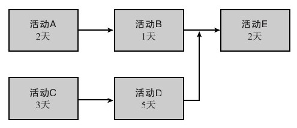

### 产品召回工作分解结构示例

1000 进行全面的安全分析

1001 根据行业/政府标准将风险分级

1002 参观工厂

1003 约见员工

1004 测试产品及设备

1005 决定召回速度

2000 通知员工

2001 给全体员工发邮件

2002 在内部网设置有关产品召回的链接

2003 为销售人员举办研讨会，学习讨论如何在现场处理召回

3000 通知代理商及客户

3001 第一时间或优先向客户发送邮件

3002 电话联系关键客户

3003 开通免费咨询热线

3004 在网站上开设常见问题回答专栏

3005 向相关媒体发布新闻

4000 召回产品

4001 制定存货处理方案

4002 建立帮助客户退回产品的渠道

4003 指导客户退货

5000 确保及时修理或更换产品

5001 内部程序

5002 外部程序

一旦确定了具体的活动和任务，就应确定其先后顺序或并列关系。哪些活动可以同时进行，哪些活动只能以特定的顺序进行？这常常需要用流程图来表示，如图2-1所示。在此例中，虽然活动A需要在B之前完成，活动C需要在D之前完成，活动A、B、C、D均需要在E之前完成，但是活动A、B可以和活动C、D同时进行。

对每一活动的时间进行估计后发现，C—D—E花费的时间最多，因此这是关键路径，即这一路径所表示的系列活动没有富裕时间，若不按照进度计划进行，就会延迟整个项目的完成。类似这种构建网络图的过程，称为关键路径法（CPM）。在时间估计上再加入可能发生的概率，则称为计划评审技术（PERT）。请注意，虽然在图2-1中用方框来表示活动（称为单代号网络图，activity-on-node network），但我们也可在箭头上标注项目活动，箭头之间用圆圈连接，圆圈表示活动的完成，用这种方法所画的网络图称为双代号网络图（activity-on-arrow network）。

图 2-1 关键路径图 
