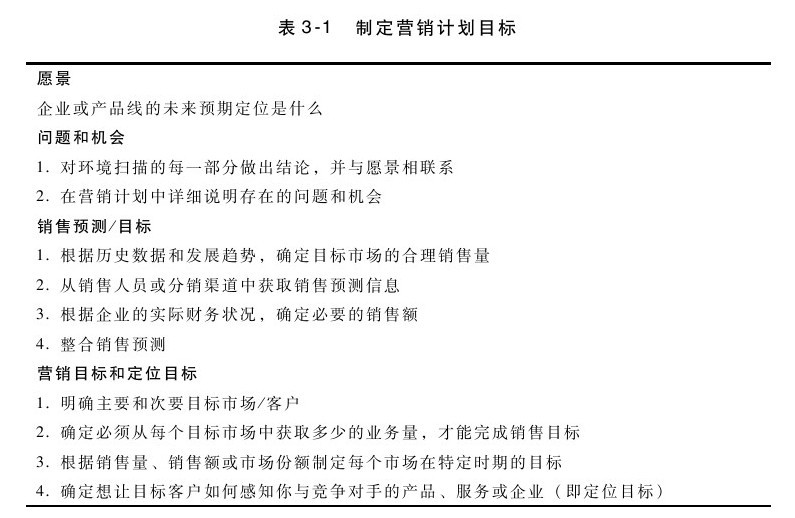

## 目标与目的

数据搜集是环境扫描的部分内容，接下来就要决定你想实现的长期目标和短期目的，也就是回答你想去哪里的问题。虽然目标与目的这两个术语可以互换使用，但目标（goal）一词通常指长期的基本方向，而目的（objective）则是指将长远的目标分解成短期的目的。长远目标可能是产品或企业的战略愿景（strategic vision），而目的则是今年产品对长期目标有什么贡献。无论如何，两者都要为计划提供明确的方向，同时也要为最后的结果评估提供方法。换句话说，目标的制定要遵循"SMART"原则，即：

·S（specific）——明确

·M（measurable）——可计量

·A（achievable）——可实现

·R（results-oriented）——结果导向

·T（time-based）——时效性

假设你的目标是“尽量多卖产品”，虽然这可能是个值得努力的目标，但你怎么知道自己什么时候已经达到目标了呢？你如何评价绩效？明确的目标都是具体的（而非空泛的），要尽可能回答谁、什么、何时或何地等问题（例如，你可能为产品线制定在特定市场提高捆绑产品销量的目标）。可计量的目标是可量化的或可描述的，可用销售单位、收入或增长率来表达。（你想将捆绑产品的销售量提高多少？）可实现的目标是现实可行的，在产品经理的职权范围内。（根据环境扫描中搜集的信息，客户购买捆绑产品是否显得合理？）结果导向的目标关注产出和结果，而非活动。（关注的是捆绑产品的销售额，而不是如何将捆绑产品组合起来的这一过程或活动？）时效性的目标需要为达成特定结果而确定目标日期。（捆绑产品的销售额能在什么时候达到预期的增长率？）

产品经理需要对产品线的产品战略计划和年度销售计划负责。SMART目标必须考虑计划的特定类型。表3-1强调了建立年度销售计划目标的思维过程，同时还要确保该计划符合产品或企业的整体战略方向。

步骤二：制定目标

·是否制定了"SMART"目标？是否明确、可计量、可实现、结果导向和时效性？

·这些目标有没有为计划明确方向？

·在计划周期（例如在会计年度）结束时，你是否能够用这些目标来评价成果？
