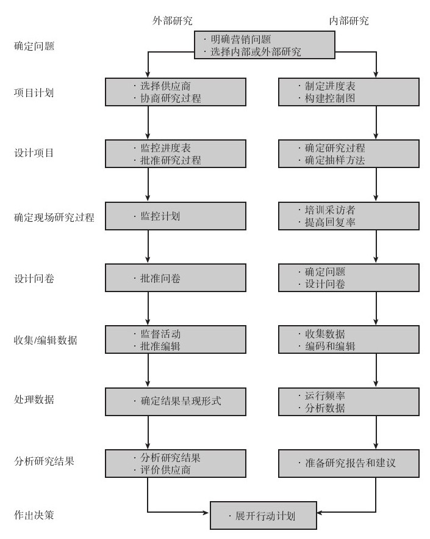
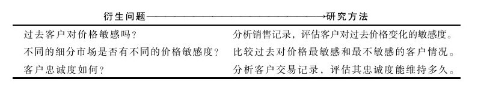
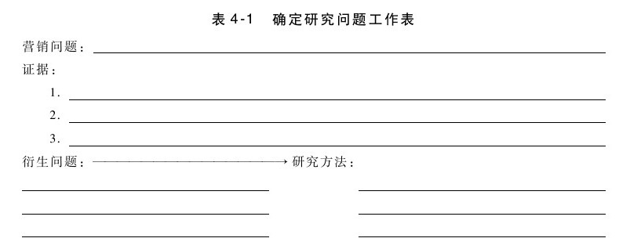
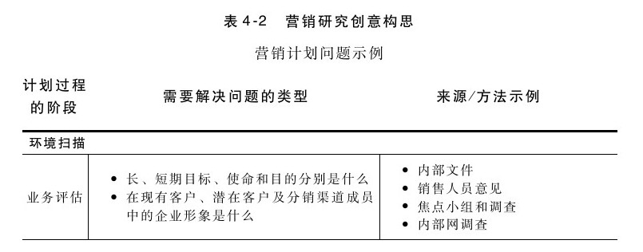
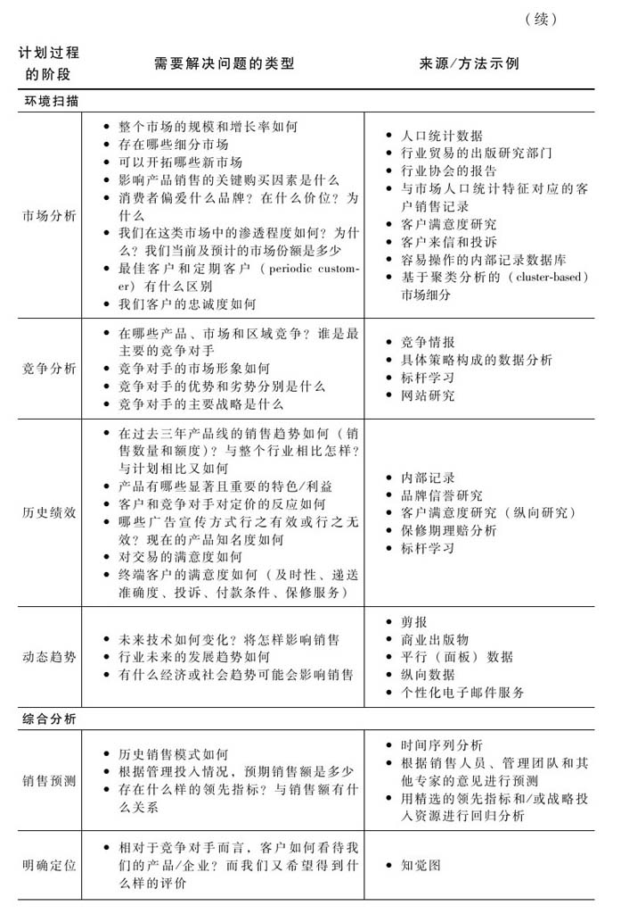
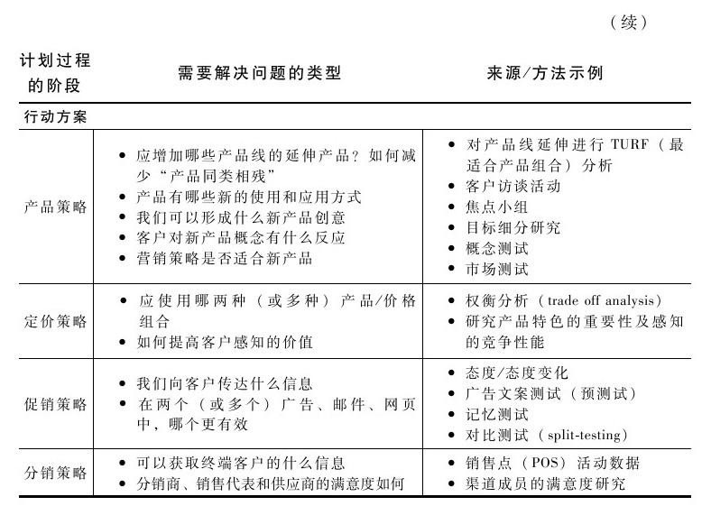
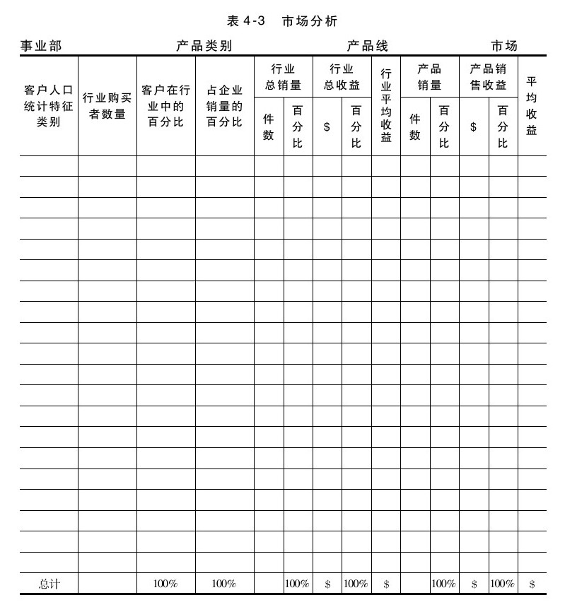

## 确定研究问题

除了非正式的网络，产品经理还需要基本了解正式研究（formal research）。正式研究可分为一手数据研究或二手数据研究、定性研究或定量研究等类型。一手数据研究（primary research）是指为某一特定问题收集信息而设计研究方案的过程。二手数据研究（secondary research）是指收集并非专门为本研究收集的信息的过程。例如，上网或图书馆搜索资料都属于二手数据研究。定量研究（quantitative research）是指通过从相当大的概率样本中获取量化的数据（百分比、平均值等），来推断样本的总体特性。定性研究（qualitative research）是指从小样本中收集更深入也更主观的信息。案例研究和焦点小组通常可以用来进行定性研究。研究过程的步骤见图4-1。

图 4-1 营销研究过程 

研究过程首先应尽量简明扼要地陈述营销或管理问题，遵循行动导向的原则。研究的真正价值在于帮助你做了什么（do），而不只是让你知道了（know）什么，因此，问题的陈述应能反映这一点。例如，与其简单地说你想研究定价策略，还不如这样阐述研究问题：“我们是否应该提高价格？如果我们需要提高价格，应该提高多少？”然后，提供足够的证据以证明这是一个值得研究的问题。而证据有多种来源途径。竞争对手降价时，你的销售量开始下跌；销售人员的订单流失报告也指出了潜在的定价问题。最后，应该指出还有哪些衍生的具体问题，以及解决这些问题的可行的研究方法。

表4-1所提供的工作表可以帮助你在营销研究过程中全面深入地思考营销问题。表4-2（营销研究创意构思）则列示了明确研究问题的其他方法。

要确定研究问题，在很大程度上需要评估整个项目的要求。对于需要确定的研究问题，最迟可以在什么时候回答？你可以从最后的报告日期开始往前推算，以此来决定具体的时间安排。什么时候应该完成数据收集工作？什么时候聘用和培训访谈人员？什么时候完成问卷设计？然后，还要决定企业内部是否有时间、能力和资源来完成研究工作，或是否需要外包研究工作。如果需要外包，就应发布书面招标书（RFP），列明研究课题、所需技能、截止时间以及其他如报酬、保密条款、对原始资料的所有权等商业事项。

确定研究问题的定义也需要进行二手数据研究。哪些行业协会的资料可以帮助你更好地了解问题？企业以前的研究文献是否能够帮助该阶段的评估？是否有何政府统计数据能够预测未来趋势，或有何合适的领先指标（leading indicator）？二手数据研究的重要性体现在许多方面：可以帮助你更好地明确问题、改进研究方法及提供比较数据等。然而，你也应十分谨慎地使用这些数据。尤其重要的是，你需要评估一般性数据是否符合研究问题的要求。如果该二手数据研究原本是为不同的行业或细分市场所做的，那么就可能需要对其进行适当调整以适应你的要求。再者，你还应考虑当初发布这些资料的目的，评估是否可能存在偏见。无论是政党、民间团体、宗教或商业组织，都有可能会有意无意地扭曲最初的研究结果。最后，你还应该了解这些研究信息的质量。问题措辞（词）是否合适？研究方法是否适当？在书面报告或文章中是否有概念性错误？表4-3列出了可从二手数据研究中获得的信息类型。

步骤一：明确研究问题

你是否明确阐述了营销问题、衍生问题及相关的研究方法？除了你想知道的之外，研究的重点是否放在了将要做什么上？在进行一手数据研究之前，是否仔细分析了二手数据？你已经知道了什么？能否在不需要再进行研究的情况下，就进行决策？需要对目前的环境进行横断面研究，还是需要做长期的纵向研究？错误决策的风险是什么？计划的研究是否用来验证已做出的决策？（若是，请别做这一研究！）企业内部是否具备了开展研究的专业知识和资源？有哪些研究和分析可以在内部进行？又有哪些可以外包？
