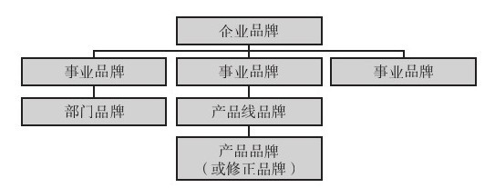
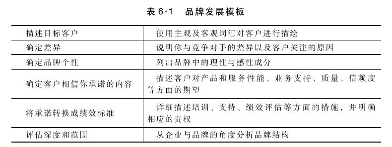

## 品牌资产管理

产品线规划的部分内容是确保产品线的所有产品（包括前面提到的不同版本）的品牌资产之间及与企业品牌之间都能相互匹配协调。产品经理必须决定是把品牌形象延伸到整个产品线，还是采用不同的品牌名称。对于大多数服务和工业产品来说，产品品牌识别（product brand identity）与企业品牌识别是直接相关的。例如，波音、电子数据系统（EDS）、施乐、IBM和通用电气之类的企业都非常注重企业品牌，旗下所有的产品品牌都笼罩在企业品牌的“光环”之下。

我们来看一看图6-5所示的品牌结构。企业品牌可能是个“背书”品牌（"endorser" brand）——有时对客户来说甚至是唯一有价值的品牌。在客户心目中的企业形象如何？品牌的理性成分是什么？感性成分又是什么？这些对客户来说重要吗？这些是否能使企业与竞争对手区别开来？虽然产品经理可能无法控制企业品牌识别，但他必须意识到企业品牌识别对产品销售的影响。

图 6-5 品牌结构 

除了企业品牌，事业单位和部门、产品线（或系列）或单个产品可能还各有其品牌。基于不同的目的，可能需要在不同的层面上运用不同的品牌。[[1]](part0068.xhtml#ch1-back)使用不同品牌的一个原因，可能是想在不改变现有品牌形象的前提下开拓新的市场。例如，为了进入正在成长的有机食品市场，美国通用磨坊食品公司（General Mills）就使用了“瀑布农场”（Cascadian Farm）这一谷类品牌。[[2]](part0068.xhtml#ch2-back)使用新品牌的另一个原因，是向市场提供低端进入产品（a low-end entry product）。例如，英特尔将其低端芯片平台产品命名为赛扬TM（CeleronTM），而不是奔腾TM（Pentium TM），这样做就不会降低其旗舰品牌的价位，又能打入对价格敏感的市场。另一方面，企业可能也会为信誉好的高端产品选择不同的品牌名称。美国百得公司（Black＆Decker）为其专业产品选择了“得伟”（DeWalt）这一产品线品牌名称。在汽车行业，经常会为更高档产品线选择使用不同的品牌。例如，丰田选择雷克萨斯，本田选择讴歌。

产品经理必须能对品牌定位进行有效沟通（我们将在第11章进行讨论）。表6-1所示的品牌发展模板列示了未来品牌沟通的框架，可帮助你确定哪些绩效考核和培训对长期兑现品牌承诺是必要的。

思考要点

产品线中的产品的品牌形象如何？

▶客户会用哪些属性来描述我的企业的每一产品？

▶我的产品形象与竞争对手有何不同？客户是否在意？

▶我的所有产品有哪些共同属性？

[[1]](part0068.xhtml#ch1)参见凯文·莱恩·凯勒（Kevin Lane Keller）的《战略品牌管理》一书，书中对品牌管理技巧进行了详细的介绍。

[[2]](part0068.xhtml#ch2)参见凯文·海利克（Kevin Helliker）2002年6月7日发表在《华尔街日报》的《天然食品这行，大厂的头衔并无大用》一文，第B1页。
